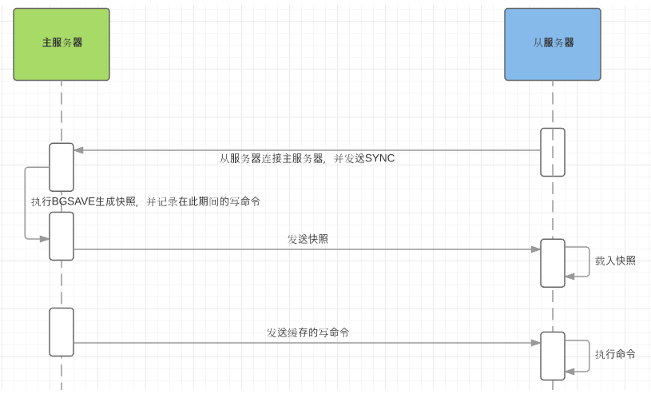

# redis 主从

主从复制，是指将一台Redis服务器的数据，复制到其他的Redis服务器。数据的复制是单向的，只能由主节点到从节点。

==Redis 主从复制过程==



1. 从服务器连接主服务器，发送SYNC命令；
2. 主服务器接收到SYNC命名后，开始执行BGSAVE命令生成RDB文件并使用缓冲区记录此后执行的所有写命令；
3. 主服务器BGSAVE执行完后，向所有从服务器发送快照文件，并在发送期间继续记录被执行的写命令；
4. 从服务器收到快照文件后丢弃所有旧数据，载入收到的快照；
5. 主服务器快照发送完毕后开始向从服务器发送缓冲区中的写命令；
6. 从服务器完成对快照的载入，开始接收命令请求，并执行来自主服务器缓冲区的写命令；
7. 完成上面几个步骤后就完成了从服务器数据初始化的所有操作，从服务器此时可以接收来自用户的读请求。

==Redis主从复制的作用==

- 数据冗余：主从复制实现了数据的热备份，是持久化之外的一种数据冗余方式。
- 故障恢复：当主节点出现问题时，可以由从节点提供服务，实现快速的故障恢复；实际上是一种服务的冗余。
- 负载均衡：在主从复制的基础上，配合读写分离，可以由主节点提供写服务，由从节点提供读服务（即写Redis数据时应用连接主节点，读Redis数据时应用连接从节点），分担服务器负载；尤其是在写少读多的场景下，通过多个从节点分担读负载，可以大大提高Redis服务器的并发量。
- 高可用基石：除了上述作用以外，主从复制还是哨兵和集群能够实施的基础，因此说主从复制是Redis高可用的基础

### 1. 主服务器配置

```bash
# 必须设置密码
vim /data/redis/etc/redis.conf
------------------------------------------------
bind 192.168.0.200                      
requirepass Ninestar123                # 密码
daemonize yes                          # 开启守护进程
logfile /data/redis/redis.log          # 指定日志文件目录
dir /data/redis                        # 指定工作目录
# masterauth Ninestar123               # 当主节点挂掉后，从新启动会变成从节点，这里就需要配置新主节点密码

# 启动redis
/data/redis/bin/redis-server  /data/redis/etc/redis.conf

# 查看状态,两个从节点部署完查看
reids-cli > info replication
```

### 2. 从服务器配置

两个从节点都配置

```bash
vim /data/redis/etc/redis.conf
------------------------------------------------
replicaof 192.168.10.1 6379      # 主服务器的 IP 和端口
masterauth Ninestar123           # 主服务器redis密码
bind 192.168.0.xx                # 修改bind 项，集群模式不用用0.0.0.0
requirepass Ninestar123          # 密码
daemonize yes                    # 开启守护进程
logfile /data/redis/redis.log    # 指定日志文件目录
dir /data/redis                  # 指定工作目录


# 启动redis
/data/redis/bin/redis-server  /data/redis/etc/redis.conf
```

### 3. 主从手动切换

系统运行时，如果 master 挂掉了，可以在一个从库（如 slave1）上手动执行命令`slaveof no one`​，将 slave1 变成新的 master；在 slave2 和 slave3 上分别执行`slaveof 192.168.1.11 6379`​ 将这两个机器的主节点指向的这个新的 master；同时，挂掉的原 master 启动后作为新的 slave 也指向新的 master 上。  
执行命令`slaveof no one`​命令，可以关闭从服务器的复制功能。同时原来同步的所得的数据集都不会被丢弃。
