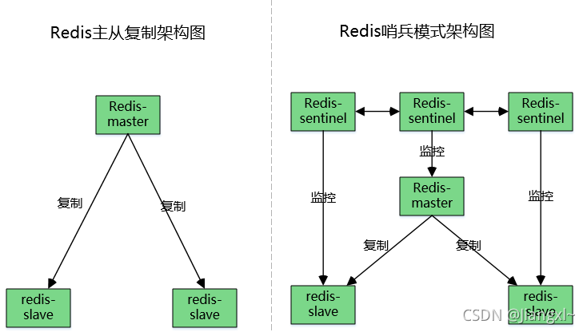

# redis 集群部署

* **主从模式**：主从复制是高可用redis的基础，主从复制主要实现了数据的多机备份，以及对于读操作的负载均衡和简单的故障恢复。哨兵和集群都是在主从复制基础上实现高可用的。缺点：故障恢复无法自动化，写操作无法负载均衡，存储能力受到单机的限制。
* **哨兵**：在主从复制的基础上，哨兵实现了自动化的故障恢复。缺点：写操作无法负载均衡，存储能力受到单机的限制，哨兵无法对从节点进行自动故障转移，在读写分离的场景下，从节点故障会导致读服务不可用，需要对从节点做额外的监控切换操作。
* **集群**：通过集群，redis解决了写操作无法负载均衡，以及存储能力受到单机限制的问题，实现了较为完善的高可用方案。

具体参考 redis 架构演化

## Redis 主从模式

主从复制，是指将一台Redis服务器的数据，复制到其他的Redis服务器。数据的复制是单向的，只能由主节点到从节点。

==Redis 主从复制过程==

​​

1. 从服务器连接主服务器，发送SYNC命令；
2. 主服务器接收到SYNC命名后，开始执行BGSAVE命令生成RDB文件并使用缓冲区记录此后执行的所有写命令；
3. 主服务器BGSAVE执行完后，向所有从服务器发送快照文件，并在发送期间继续记录被执行的写命令；
4. 从服务器收到快照文件后丢弃所有旧数据，载入收到的快照；
5. 主服务器快照发送完毕后开始向从服务器发送缓冲区中的写命令；
6. 从服务器完成对快照的载入，开始接收命令请求，并执行来自主服务器缓冲区的写命令；
7. 完成上面几个步骤后就完成了从服务器数据初始化的所有操作，从服务器此时可以接收来自用户的读请求。

==Redis主从复制的作用==

* 数据冗余：主从复制实现了数据的热备份，是持久化之外的一种数据冗余方式。
* 故障恢复：当主节点出现问题时，可以由从节点提供服务，实现快速的故障恢复；实际上是一种服务的冗余。
* 负载均衡：在主从复制的基础上，配合读写分离，可以由主节点提供写服务，由从节点提供读服务（即写Redis数据时应用连接主节点，读Redis数据时应用连接从节点），分担服务器负载；尤其是在写少读多的场景下，通过多个从节点分担读负载，可以大大提高Redis服务器的并发量。
* 高可用基石：除了上述作用以外，主从复制还是哨兵和集群能够实施的基础，因此说主从复制是Redis高可用的基础

### 1. 主服务器配置

```bash
# 必须设置密码
vim /data/redis/etc/redis.conf
------------------------------------------------
bind 192.168.0.200                        
requirepass Ninestar123                # 密码
daemonize yes                          # 开启守护进程
logfile /data/redis/redis.log          # 指定日志文件目录
dir /data/redis                        # 指定工作目录
# masterauth Ninestar123               # 当主节点挂掉后，从新启动会变成从节点，这里就需要配置新主节点密码

# 启动redis
/data/redis/bin/redis-server  /data/redis/etc/redis.conf

# 查看状态,两个从节点部署完查看
reids-cli > info replication
```

### 2. 从服务器配置

两个从节点都配置

```bash
vim /data/redis/etc/redis.conf
------------------------------------------------
replicaof 192.168.10.1 6379      # 主服务器的 IP 和端口
masterauth Ninestar123           # 主服务器redis密码
bind 192.168.0.xx                # 修改bind 项，集群模式不用用0.0.0.0
requirepass Ninestar123          # 密码
daemonize yes                    # 开启守护进程
logfile /data/redis/redis.log    # 指定日志文件目录
dir /data/redis                  # 指定工作目录


# 启动redis
/data/redis/bin/redis-server  /data/redis/etc/redis.conf
```

### 3. 主从手动切换

系统运行时，如果 master 挂掉了，可以在一个从库（如 slave1）上手动执行命令`slaveof no one`​，将 slave1 变成新的 master；在 slave2 和 slave3 上分别执行`slaveof 192.168.1.11 6379`​ 将这两个机器的主节点指向的这个新的 master；同时，挂掉的原 master 启动后作为新的 slave 也指向新的 master 上。  
执行命令`slaveof no one`​命令，可以关闭从服务器的复制功能。同时原来同步的所得的数据集都不会被丢弃。

‍

‍

## Redis 哨兵模式

哨兵结构由两部分组成，哨兵节点和数据节点：

* 哨兵节点：哨兵系统由一个或多个哨兵节点组成，哨兵节点是特殊的redis节点，不存储数据。
* 数据节点：主节点和从节点都是数据节点。

哨兵的启动依赖于主从模式，所以须把主从模式安装好的情况下再去做哨兵模式，所有节点上都需要部署哨兵模式，哨兵模式会监控所有的 Redis 工作节点是否正常，当 Master 出现问题的时候，因为其他节点与主节点失去联系，因此会投票，投票过半就认为这个 Master 的确出现问题，然后会通知哨兵间，然后从 Slaves 中选取一个作为新的 Master。

需要特别注意的是，客观下线是主节点才有的概念；如果从节点和哨兵节点发生故障，被哨兵主观下线后，不会再有后续的客观下线和故障转移操作。

==哨兵模式的作用==

**监控**：哨兵会不断地检查主节点和从节点是否运作正常。  
**自动故障转移**：当主节点不能正常工作时，哨兵会开始自动故障转移操作，它会将其中一个从节点升级为新的主节点，并让其他从节点改为复制新的主节点。  
**通知（提醒**）：哨兵可以将故障转移的结果发送给客户端。

​​

### 1. 部署主从

参考 [一、主从模式](#一、主从模式) 部署一主两从架构

### 2. 配置哨兵

修改所有节点(包括主从节点) redis 上的 sentinel.conf

```bash
# 修改 Redis 配置文件（所有服务节点）sentinel.conf
vim /data/redis/sentinel.conf 
---------------------------------------------
protected -mode no                   # 关闭保护模式
port 26379                           # Redis哨兵默认的监听端口
daemonize yes                        # 指定sentinel为后台启动
logfile "/data/redis/sentinel.log"   # 指定日志存放路径
dir "/data/redis"                    # 指定数据库存放路径

sentinel monitor mymaster 192.168.0.200 6379 2  # 指定该哨兵节点监控20.0.0.20:6379这个主节点，该主节点的名称是mymaster，最后的2的含义与主节点的故障判定有关：至少需要2个哨兵节点同意，才能判定主节点故障并进行故障转移
sentinel auth-pass mymaster Ninestar123         # 如果redis-master有密码
sentinel down-after-milliseconds mymaster 30000 # 判定服务器down掉的时间周期，默认30000毫秒（30秒）
sentinel failover-timeout mymaster 180000       # 故障节点的最大超时时间为180000（180秒）
sentinel parallel-syncs mymaster 1              # 指在故障转移时，最多有多少个从节点对新的主节点进行同步。
```

### 3. 启动哨兵进程

```bash
# 启动顺序：master > slave1 > slave2 > sentinel 1 > sentinel 3 > sentinel 3
/data/redis/bin/redis-server /data/redis/redis.conf
/data/redis/bin/redis-sentinel /data/redis/sentinel.conf
```

### 4. 模拟验证

```bash
# 关闭master redis
./bin/redis-cli -a Ninestar123 shutdown
# 关闭master上面的 sentinel
 pkill redis


[root@192 redis]# ./bin/redis-cli -a Ninestar123 info replication
Warning: Using a password with '-a' or '-u' option on the command line interface may not be safe.
# Replication
role:slave
master_host:192.168.0.204
master_port:6379
master_link_status:up
master_last_io_seconds_ago:0
master_sync_in_progress:0
slave_repl_offset:368818
slave_priority:100
slave_read_only:1
replica_announced:1
connected_slaves:0
master_failover_state:no-failover
master_replid:2f6fa97f7311dee6325b92a22b0de392db5ddd47
master_replid2:0000000000000000000000000000000000000000
master_repl_offset:368818
second_repl_offset:-1
repl_backlog_active:1
repl_backlog_size:1048576
repl_backlog_first_byte_offset:367245
repl_backlog_histlen:1574
[root@192 redis]# 
```

## Redis 分片集群

Redis 的哨兵模式基本已经可以实现高可用，读写分离 ，但是在这种模式下每台 Redis 服务器都存储相同的数据，很浪费内存，所以在 redis3.0 上加入了 Cluster 集群模式，实现了 Redis 的分布式存储，对数据进行分片，也就是说每台 Redis 节点上存储不同的内容；

​​

根据官方推荐，集群部署至少要 3 台以上的 master 节点，最好使用 3 主 3 从六个节点的模式。测试时，也可以在一台机器上部署这六个实例，通过端口区分出来。

|机器名称|IP|端口|
| ----------| ---------------| ------|
|master 1|192.168.0.200|6379|
|master 2|192.168.0.201|6379|
|master 3|192.168.0.202|6379|
|slave 1|192.168.0.203|6379|
|slave 2|192.168.0.204|6379|
|slave 3|192.168.0.205|6379|

### 1. 配置集群

6台服务器都进行以下配置，修改redis.conf

```bash
vim redis.conf
-------------------------------------------
 # bind配置成2个IP地址，一般默认配置为127.0.0.1
bind 20.200.34.145 127.0.0.1 
requirepass Ninestar123
# 从服务器需要配置masterauth 
masterauth Ninestar123
# 后台进程启动
daemonize yes
# redis工作目录
dir /data/redis
# redis日志
logfile "/data/redis/redis.log"
# 定义redis服务启用pid输出文件位置
pidfile "/data/redis/redis.pid" 
# 持久化方式
# appendonly yes
# 保护模式
protected-mode yes
# 启用集群模式
cluster-enabled yes 
# 集群中实例配置文件,根据你启用的节点来命名，最好和端口保持一致，这个是用来保存其他节点的名称，状态等信息的
cluster-config-file nodes-6379.conf
# 超时时间
cluster-node-timeout 5000
```

挨个启动所有 redis 节点

```bash
/data/redis/bin/redis-server /data/redis/redis.conf &
```

### 2. 启动集群

自动分配主从节点

```bash
# --cluster-replicas 1 创建master的时候同时创建一个slave
redis-cli -a Ninestar123 --cluster create 192.168.0.200:6379  192.168.0.202:6379 192.168.0.203:6379 192.168.0.204:6379 192.168.0.205:6379 192.168.0.206:6379  --cluster-replicas 1
```

手动分配主从节点

```bash
# --cluster-replicas 0 所有节点都是master，使用以下命令创建3个主节点：
redis-cli -a Ninestar123 --cluster create 192.168.0.200:6379  192.168.0.202:6379 192.168.0.203:6379 --cluster-replicas 0
# 增加从节点：
redis-cli -a Ninestar123 --cluster add-node 192.168.0.204:6379 192.168.0.200:6379 --cluster-slave --cluster-master-id ***************
# slave 表示要添加从节点
# cluster-master-id 要添加到哪一个主节点，id是*****
# 192.168.0.204:6379 要添加的从节点
# 192.168.0.200:6379 作为谁的的从主节点，即主节点
```

‍

### 3. 数据验证

```bash
# 注意 集群模式下要带参数 -c，表示集群，否则不能正常存取数据！！！
redis-cli -a Ninestar123 -p 6379 -c

# 设置 k1 v1
127.0.0.1:6379> 
127.0.0.1:6379> set k1 v1
# # 这可以看到集群的特点:把数据存到计算得出的 slot，这里还自动跳到了192.168.0.203
-> Redirected to slot [12706] located at 192.168.0.203:6379
OK
192.168.0.203:6379> 

# 我们还回到 192.168.0.200  获取 k1 试试
redis-cli -a Ninestar123 -p 6379 -c
127.0.0.1:6379> get k1
-> Redirected to slot [12706] located at 192.168.0.203:6379
"v1"
192.168.0.203:6379> 
# 我们可以看到重定向的过程
```

### 4. 集群操作

‍

#### 4.1 查看集群状态

```bash
./redis-cli -c -h 20.200.34.145 -p 6379 -a Ninestar123 cluster info
./redis-cli -c -h 20.200.34.145 -p 6379 -a Ninestar123 cluster nodes
```

#### 4.2 单独查看某个节点状态

```bash
./redis-cli --cluster check 20.200.34.146:6379 -a Ninestar123
```

#### 4.3 删除集群中从节点

```bash
./redis-cli -a password --cluster del-node  host:port  node_id
# host:port:表示的是要删除的那个节点的IP和端口
# node_id:表示的是删除的那个节点的节点ID
```

#### 4.4 添加集群从节点

```bash
./redis-cli -a password --cluster add-node new_host:new_port existing_host:existing_port --cluster-slave --cluster-master-id node_id
# password:客户端配置认证端口，配置文件对应requirepass配置
# new_host:new_port:表示的是要添加的那个从节点的ip和端口
# existing_host:existing_port:表示的是要給哪个主节点添加的从节点
# cluster-slave:表示的是要添加的从节点
# cluster-master-id:表示要给哪个主节点添加从节点，该主节点的节点ID
```

#### 4.5 动态**添加集群主节点**

集群中新加的主节点默认是没有分solt(hash槽)，需要在添加后手动添加

```bash
./redis-cli -a 123456 --cluster add-node new_host:new_port last_existing_host:last_existing_port --cluster-master-id  node_id
# new_host:new_port:为新添加的主节地址和端口
# last_existing_host:last_existing_port:为集群中最后一个主节点地址和端口（根据slots槽做判断共16383槽）
# node_id:主节点的ID值
```

新加的主节点分配hash槽

```bash
./redis-cli  -a 123456 --cluster reshard 20.200.35.202:6479 --cluster-from  7ee28a15eba6daeeb5e6c297faa0d31ff1e883e5 --cluster-to 9be83b00dd145d46c523750654ac7929fdd8db91 --cluster-slots 1365 --cluster-yes
# master_host:master_port:为集群中任何一个主节点信息和主节点端口
# cluster-from  node_id: 表示从哪个节点取出槽，node_id为集群master_host的ID值
# cluster-to  node _id:表示取出的槽分配给哪个节点，node_id为集群新加主节点的ID值
# cluster-slots:表示取出多少槽分配给新主节点
# cluster-yes:不回显槽分配信息，直接移动
```

#### 4.6 **删除集群主节点**

由于主节点的槽中保留key-value数据信息，所以在删除主节点之前需要把数据信息移动到其他主节点上（把节点中hash槽移动到其他节点）

```bash
./redis-cli  -a 123456 --cluster reshard 20.200.35.200:6482 --cluster-from  9be83b00dd145d46c523750654ac7929fdd8db91 --cluster-to 7ee28a15eba6daeeb5e6c297faa0d31ff1e883e5 --cluster-slots 1365 --cluster-yes
```

查看hash槽移动后的节点信息

```bash
./redis-cli -c -h 20.200.35.200 -p 6479 -a 123456 cluster nodes
```

删除主节点

```bash
./redis-cli -a 123456 --cluster del-node 20.200.35.200:6482 9be83b00dd145d46c523750654ac7929fdd8db91
```

‍

### 5. redis集群手动主备切换

Redis 集群中主备切换原则：是使用要升备节点为主节点的地址进行操作。

```bash
./redis-cli -c -h slave_ip -p slave_port -a password cluster failover
# slave_ip:为将要升级主节的备节点地址
# slave_port:为将要升级主节的备节点端口
# password:登陆密码
# cluster failover:为当前节点升为主节，原来主节点降为备节点

# 1.查看原来集群主备关系
./redis-cli -c -h 20.200.35.200 -p 6479 -a 123456 cluster nodes

# 2.进行主备切换操作
./redis-cli -c -h 20.200.35.201 -p 6480 -a 123456
Warning: Using a password with '-a' or '-u' option on the command line interface may not be safe.
20.200.35.201:6480> cluster failover
OK
# 3.查看切换后的主备节点关系
20.200.35.201:6480> cluster nodes
```

### redis cluster启停脚本

```bash
#!/bin/bash
REDIS_PATH="/data/redis"

check(){
$REDIS_PATH/bin/redis-cli -c -h 192.168.2.132 -p 6379  -a 123456 cluster info | grep cluster_state:ok | grep -v grep
if [[ $? == 0 ]];then
	return 0
	else
	return 1
fi
}


stop(){
check 
if [[ $? == 0 ]];then
$REDIS_PATH/bin/redis-cli -c -h 192.168.2.132 -p 6379  -a 123456 shutdown
$REDIS_PATH/bin/redis-cli -c -h 192.168.2.132 -p 6380  -a 123456 shutdown
$REDIS_PATH/bin/redis-cli -c -h 192.168.2.132 -p 6381  -a 123456 shutdown
$REDIS_PATH/bin/redis-cli -c -h 192.168.2.132 -p 6382  -a 123456 shutdown
$REDIS_PATH/bin/redis-cli -c -h 192.168.2.132 -p 6383  -a 123456 shutdown
$REDIS_PATH/bin/redis-cli -c -h 192.168.2.132 -p 6384  -a 123456 shutdown
echo "redis cluster is down"
else 
echo "The redis cluster is abnormal or closed"
fi
}

start(){
check
if [[ $? == 1 ]];then
$REDIS_PATH/bin/redis-server $REDIS_PATH/redis_6379.conf
$REDIS_PATH/bin/redis-server $REDIS_PATH/redis_6380.conf
$REDIS_PATH/bin/redis-server $REDIS_PATH/redis_6381.conf
$REDIS_PATH/bin/redis-server $REDIS_PATH/redis_6382.conf
$REDIS_PATH/bin/redis-server $REDIS_PATH/redis_6383.conf
$REDIS_PATH/bin/redis-server $REDIS_PATH/redis_6384.conf
echo "The redis cluster started successfully"
else
echo "redis cluster is running"
fi
}


restart(){
stop
sleep 5
start
}

case $1 in 
	start)
		start
		;;
	stop)
		stop
		;;
	restart)
		restart
		;;
	*)
		echo "usage sh redisCluster (start|stop|restart)"
		;;
esac

```

‍
