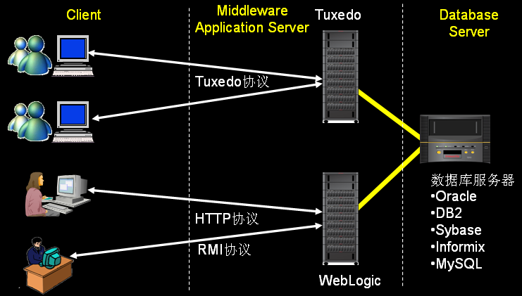
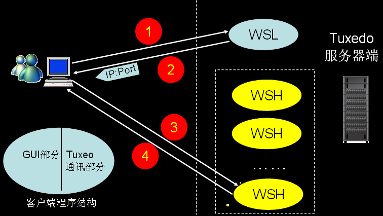

# tuxedo介绍

## **Tuxedo** **是什么**

Tuxedo是BEA公司（现已被Oracle公司收购）的一个客户机/服务器的“中间件”产品，它在客户机和服务器之间进行调节，以保证正确地处理事务。它用C语言技术开发的并且有很高性能。

TUXEDO是在、Internet 这样的分布式运算环境中开发和管理三层结构的客户/服务器型关键任务应用系统的强有力工具。它具备分布式事务处理和应用通信功能，并提供完善的各种服务来建立、运行和管理关键任务应用系统。开发人员能够用它建立跨多个[硬件](http://syue.com/Digital/)平台、数据库和操作系统的可互操作的应用系统。

## **Tuxedo 的主要作用**

屏蔽分布式环境中各种通信协议、硬件体系结构、操作系统、数据库和其它应用服务等方面的差异，使分布于网络节点上的应用程序的各个单元部件之间能够进行互操作，并协调操作的一致性和完整性，最大限度地节省系统资源，提高系统性能。

**Tuxedo 已经广泛地应用于金融、电信、制造业等各行各业的核心业务系统。**

**三层架构**

​​

从左边往右依次为：客户端层（表现层），中间件服务层（业务逻辑层），数据库服务器层（数据层）。这种典型的三层架构应用非常广泛。

对于应用weblogic中间件的系统一般采用的B/S架构，绝大部分采用HTTP协议，少量的系统用java编写的客户端，使用的是RMI 协议，或J2EE里的其它协议。

对于tuxedo中间件使用的是tuxedo协议，前端开发工具可以是各式各样，VC++ 、java 、Delphi 、VB 等。

**Tuxedo 的通讯过程**

​​

Tuxedo 服务器处理请求的方式与apache有本质的区别。

Apache服务器处理请求，由客户端发出请求到服务器，由服务器对请求进行处理后将数据返回给客户端。

Tuxedo 服务器一次请求需要两次进行两次交互，Tuxedo有两个负责通讯的进程，一个为WSL，WSL的数量可以进行配置，典型的配置一般两、三个；WSH可以有N多个。客户端通过IP地址和端口号与WSL建立连接，由WSL认证请求是否合法，在WSL的响应中包含了另外一个IP地址和端口号；然后，客户端通过拿到的新的IP地址和端口号去请求WSH 。

客户端程序由GUI 与 Tuxeo通讯两部分组成，GUI部分主要由开发人员关心如何设计，通讯部分可能设计成几个函数供开发人员调用。对于性能测试人员可能更关心客户端与服务器之间的通讯过程。
