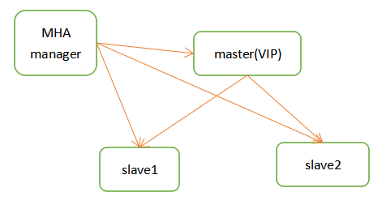
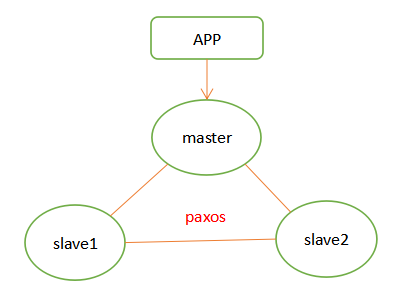

# mysql MHA架构

　　MHA（MasterHigh Availability）是一套优秀的MySQL高可用环境下故障切换和主从复制的软件。  
MHA 的出现就是解决MySQL 单点的问题。 MySQL故障切换过程中，MHA能做到0-30秒内自动完成故障切换操作。  
MHA 能在故障切换的过程中最大程度上保证数据的一致性，以达到真正意义上的高可用。

　　优点：  
1:MHA除了支持日志点的复制还支持GTID的方式  
2:同MMM相比，MHA会尝试从旧的Master中恢复旧的二进制日志，只是未必每 次都能成功。如果希望更少的数据丢失场景，建议使用MHA架构。

　　缺点：  
1:MHA需要自行开发VIP转移脚本。  
2:MHA只监控Master的状态，未监控Slave的状态  

## MHA 的组成

- MHA Node（数据节点） MHA Node 运行在每台 MySQL 服务器上。
- MHA Manager（管理节点） MHA Manager 可以单独部署在一台独立的机器上，管理多个 master-slave 集群；也可以部署在一台 slave 节点上。MHA Manager 会定时探测集群中的 master 节点。当 master 出现故障时，它可以自动将最新数据的 slave 提升为新的 master，然后将所有其他的 slave 重新指向新的 master。整个故障转移过程对应用程序完全透明。

## 搭建MySQL + MHA



　　环境准备：3台服务器部署mysql（一主两从，MHA Manager部署在slave上）参考mysql 单机部署  
操作系统：`Linux CentOS 7.6`​
数据库：`MySQL 8.0.26`​   [https://dev.mysql.com/downloads/mysql/](https://dev.mysql.com/downloads/mysql/)  
MHA：`mha4mysql-0.58`​ https://github.com/yoshinorim/mha4mysql-node https://github.com/yoshinorim/mha4mysql-manager

### 1. 在所有服务器上配置无密码认证

```bash
ssh-keygen -t rsa
ssh-copy-id 192.168.0.105
ssh-copy-id 192.168.0.106
...
...

```

### 2. 搭建基础的主从架构

　　参考：[基于GTID主从复制](mysql%20主从架构.md#基于GTID主从复制)

　　mha架构在配置上略有不同

```bash
# 1.所有数据库节点都需要创建用于同步的用户和监控用户
create user replication@'%' identified with mysql_native_password by 'Ninestar@2022';
create user mha@'%' identified with mysql_native_password by 'Ninestar@2022';
grant replication slave on *.* to replication@'%';
grant all privileges on *.* to mha@'%';
flush privileges;

# 所有数据库节点my.cnf配置文件
log-slave-updates = 1
relay_log_purge = 0
read_only=1
```

### 3. 安装MHA node组件

　　在所有服务器上都安装 MHA node 组件

```bash
# 安装epel源
yum install epel-release --nogpgcheck -y
# 安装 MHA 依赖
yum install -y perl-DBD-MySQL perl-Config-Tiny perl-Log-Dispatch \
perl-Parallel-ForkManager perl-ExtUtils-CBuilder perl-ExtUtils-MakeMaker perl-CPAN

# 安装 MHA 软件包，先在所有服务器上必须先安装 node 组件,然后在其中一台上安装manager组件
tar -zxf /opt/mha4mysql-node-0.58.tar.gz
cd /opt/mha4mysql-node-0.58
perl Makefile.PL
make && make install

#node 组件安装后也会在/usr/local/bin 下面会生成几个脚本（这些工具通常由 MHAManager 的脚本触发，无需人为操作）主要如下：
save_binary_logs       # 保存和复制 master 的二进制日志
apply_diff_relay_logs  # 识别差异的中继日志事件并将其差异的事件应用于其他的 slave
filter_mysqlbinlog     # 去除不必要的 ROLLBACK 事件（MHA 已不再使用这个工具）
purge_relay_logs       # 清除中继日志（不会阻塞 SQL 线程）

```

### 4. 安装MHA manager组件

```bash
tar -zxf /opt/mha4mysql-manager-0.58.tar.gz
cd /opt/mha4mysql-manager-0.58
perl Makefile.PL
make && make install

#manager 组件安装后在/usr/local/bin 下面会生成几个工具，主要包括以下几个：
masterha_check_ssh       # 检查 MHA 的 SSH 配置状况
masterha_check_repl      # 检查 MySQL 复制状况
masterha_manger          # 启动 manager的脚本
masterha_check_status    # 检测当前 MHA 运行状态
masterha_master_monitor  # 检测 master 是否宕机
masterha_master_switch   # 控制故障转移（自动或者手动）
masterha_conf_host       # 添加或删除配置的 server 信息
masterha_stop            # 关闭manager

```

### 5. 在 manager 节点上配置 MHA

```bash
# 在 manager 节点上复制相关脚本到/usr/local/bin 目录
cd /opt/mha4mysql-manager-0.58/samples/scripts
cp ./* /usr/local/bin/
---------------------------------------------------------
master_ip_failover          # 自动切换时 VIP 管理的脚本
master_ip_online_change     # 在线切换时 vip 的管理
power_manager               # 故障发生后关闭主机的脚本
send_report                 # 因故障切换后发送报警的脚本
---------------------------------------------------------
```

　　**修改master_ip_failover脚本,建议删除，直接用下面的配置**

```bash
#!/usr/bin/env perl

use strict;
use warnings FATAL => 'all';

use Getopt::Long;
use MHA::DBHelper;

my (
  $command,        $ssh_user,         $orig_master_host,
  $orig_master_ip, $orig_master_port, $new_master_host,
  $new_master_ip,  $new_master_port,  $new_master_user,
  $new_master_password
);
my $vip = '192.168.0.111/24';
my $key = "1";
my $ssh_start_vip = "/sbin/ifconfig ens33:$key $vip";
my $ssh_stop_vip = "/sbin/ifconfig ens33:$key down";

GetOptions(
  'command=s'             => \$command,
  'ssh_user=s'            => \$ssh_user,
  'orig_master_host=s'    => \$orig_master_host,
  'orig_master_ip=s'      => \$orig_master_ip,
  'orig_master_port=i'    => \$orig_master_port,
  'new_master_host=s'     => \$new_master_host,
  'new_master_ip=s'       => \$new_master_ip,
  'new_master_port=i'     => \$new_master_port,
  'new_master_user=s'     => \$new_master_user,
  'new_master_password=s' => \$new_master_password,
);

exit &main();

sub main {
  if ( $command eq "stop" || $command eq "stopssh" ) {

    # $orig_master_host, $orig_master_ip, $orig_master_port are passed.
    # If you manage master ip address at global catalog database,
    # invalidate orig_master_ip here.
    my $exit_code = 1;
    eval {

      # updating global catalog, etc
      $exit_code = 0;
    };
    if ($@) {
      warn "Got Error: $@\n";
      exit $exit_code;
    }
    exit $exit_code;
  }
    elsif ( $command eq "start" ) {

        # all arguments are passed.
        # If you manage master ip address at global catalog database,
        # activate new_master_ip here.
        # You can also grant write access (create user, set read_only=0, etc) here.
        my $exit_code = 10;
        eval {
            print "Enabling the VIP - $vip on the new master - $new_master_host \n";
            &start_vip();
            &stop_vip();
            $exit_code = 0;
        };
        if ($@) {
            warn $@;
            exit $exit_code;
        }
        exit $exit_code;
    }
    elsif ( $command eq "status" ) {
        print "Checking the Status of the script.. OK \n";
        `ssh $ssh_user\@$orig_master_host \" $ssh_start_vip \"`;
        exit 0;
    }
    else {
        &usage();
        exit 1;
    }
}


sub start_vip() {
    `ssh $ssh_user\@$new_master_host \" $ssh_start_vip \"`;
}
# A simple system call that disable the VIP on the old_master 
sub stop_vip() {
   `ssh $ssh_user\@$orig_master_host \" $ssh_stop_vip \"`;
}


sub usage {
  print
"Usage: master_ip_failover --command=start|stop|stopssh|status --orig_master_host=host --orig_master_ip=ip --orig_master_port=port --new_master_host=host --new_master_ip=ip --new_master_port=port\n";
}
```

　　**创建 MHA 软件目录并拷贝配置文件，这里使用app1.cnf配置文件来管理 mysql 节点服务器**

```bash
mkdir /etc/masterha
cp /opt/mha4mysql-manager-0.58/samples/conf/app1.cnf /etc/masterha
```

　　`vim /etc/masterha/app1.cnf #删除原有内容，直接复制并修改节点服务器的IP地址`

```bash
[server default]
#manager日志
manager_log=/var/log/masterha/app1/manager.log
#manager工作目录
manager_workdir=/var/log/masterha/app1.log
#master保存binlog的位置，这里的路径要与master里配置的binlog的路径一致，以便MHA能找到
master_binlog_dir=/data/mysql/data/
#设置自动failover时候的切换脚本，也就是上面的那个脚本
master_ip_failover_script=/usr/local/bin/master_ip_failover
#设置手动切换时候的切换脚本
master_ip_online_change_script=/usr/local/bin/master_ip_online_change
#设置监控用户(需要在在主控中创建)和密码
user=mha
password=Ninestar@2022
#设置复制的用户和密码
repl_user=replication
repl_password=Ninestar@2022
#设置监控主库，发送ping包的时间间隔，默认是3秒，尝试三次没有回应的时候自动进行failover
ping_interval=1
#设置远端mysql在发生切换时binlog的保存位置
remote_workdir=/tmp
#设置发生切换后发送的报警的脚本
report_script=/usr/local/send_report
#指定检查的从服务器IP地址
secondary_check_script=/usr/local/bin/masterha_secondary_check -s 192.168.0.105 -s 192.168.0.106
#设置故障发生后关闭故障主机脚本（该脚本的主要作用是关闭主机防止发生脑裂,这里没有使用）
shutdown_script="" 
#设置ssh的登录用户名
ssh_user=root
[server1]
hostname=192.168.0.104
port=3306
[server2]
hostname=192.168.0.105
port=3306
#设置为候选master，设置该参数以后，发生主从切换以后将会将此从库提升为主库，即使这个从库不是集群中最新的slave
candidate_master=1
check_repl_delay=0
#默认情况下如果一个slave落后master 超过100M的relay logs的话，MHA将不会选择该slave作为一个新的master， 因为对于这个slave的恢复需要花费很长时间；通过设置check_repl_delay=0，MHA触发切换在选择一个新的master的时候将会忽略复制延时，这个参数对于设置了candidate_master=1的主机非常有用，因为这个候选主在切换的过程中一定是新的master
[server3]
hostname=192.168.0.106
port=3306
```

　　**第一次配置需要在 Master 节点上手动开启虚拟IP**

```bash
/sbin/ifconfig ens33:1 192.168.0.111/24
# ip addr add 192.168.0.111/24 dev ens33
```

### 6. 在 manager 节点上测试MHA

　　**在 manager 节点上测试 ssh 无密码认证，如果正常最后会输出 successfully，如下所示。**

```bash
masterha_check_ssh -conf=/etc/masterha/app1.cnf
-----------------------------------------------------
Thu Feb 16 09:20:35 2023 - [debug]   ok.
Thu Feb 16 09:20:36 2023 - [info] All SSH connection tests passed successfully.
```

　　**在 manager 节点上测试 mysql 主从连接情况，最后出现 MySQL Replication Health is OK 字样说明正常。如下所示。**

```bash
masterha_check_repl -conf=/etc/masterha/app1.cnf
------------------------------------------------------
Thu Feb 16 10:01:50 2023 - [info]  OK.
Thu Feb 16 10:01:50 2023 - [warning] shutdown_script is not defined.
Thu Feb 16 10:01:50 2023 - [info] Got exit code 0 (Not master dead).

MySQL Replication Health is OK.
```

### 7. 在 manager 节点上启动 MHA

```bash
nohup masterha_manager --conf=/etc/masterha/app1.cnf --remove_dead_master_conf --ignore_last_failover < /dev/null > /var/log/masterha/app1/manager.log 2>&1 &
----------------------------------------------------------
--remove_dead_master_conf # 该参数代表当发生主从切换后，老的主库的 ip 将会从配置文件中移除。
--manger_log              # 日志存放位置。
--ignore_last_failover    # 在缺省情况下，如果 MHA 检测到连续发生宕机，且两次宕机间隔不足 8 小时的话，则不会进行 Failover， 之所以这样限制是为了避免 ping-pong 效应。该参数代表忽略上次 MHA 触发切换产生的文件，默认情况下，MHA 发生切换后会在日志记目录，也就是上面设置的日志app1.failover.complete文件，下次再次切换的时候如果发现该目录下存在该文件将不允许触发切换，除非在第一次切换后收到删除该文件，为了方便，这里设置为--ignore_last_failover。


# 若要关闭 manager 服务，可以使用如下命令。
masterha_stop --conf=/etc/masterha/app1.cnf # 或者可以直接采用 kill 进程 ID 的方式关闭。
```

　　**状态检查**

```bash
# 查看 MHA 状态，可以看到当前的 master 是 Mysql1 节点
masterha_check_status --conf=/etc/masterha/app1.cnf

```

## 故障模拟

```bash
#在 manager 节点上监控观察日志记录
tail -f /var/log/masterha/app1/manager.log
​
#在 Master 节点 Mysql1 上停止mysql服务
systemctl stop mysqld #  /data/mysql/support-files/mysql.server stop

#正常自动切换一次后，MHA 进程会退出。HMA 会自动修改 app1.cnf 文件内容，将宕机的 mysql1 节点删除。查看 mysql2 是否接管 VIP
ifconfig

```

　　​
**故障切换备选主库的算法：**

　　1．一般判断从库的是从（position/GTID）判断优劣，数据有差异，最接近于master的slave，成为备选主。
2．数据一致的情况下，按照配置文件顺序，选择备选主库。
3．设定有权重（candidate_master=1），按照权重强制指定备选主。
（1）默认情况下如果一个slave落后master 100M的relay logs的话，即使有权重，也会失效。
（2）如果check_repl_delay=0的话，即使落后很多日志，也强制选择其为备选主。

　　**故障修复步骤**

```bash
#1．修复mysql
systemctl restart mysqld
​
#2．修复主从
#在现主库服务器 Mysql2 查看二进制文件和同步点
show master status;
​
#在原主库服务器 mysql1 执行同步操作
change master to master_host='192.168.80.11',master_user='myslave',master_password='123',master_log_file='master-bin.000001',master_log_pos=1745;
​
start slave;
​
​
#3．在 manager 节点上修改配置文件app1.cnf（再把这个记录添加进去，因为它检测掉失效时候会自动消失）
vi /etc/masterha/app1.cnf
......
secondary_check_script=/usr/local/bin/masterha_secondary_check -s 192.168.80.10 -s 192.168.80.12
......
[server1]
hostname=192.168.80.11
port=3306
​
[server2]
candidate_master=1
check_repl_delay=0
hostname=192.168.80.10
port=3306
​
[server3]
hostname=192.168.80.12
port=3306
​
#4．在 manager 节点上启动 MHA
nohup masterha_manager --conf=/etc/masterha/app1.cnf --remove_dead_master_conf --ignore_last_failover < /dev/null > /var/log/masterha/app1/manager.log 2>&1 &
​
​
#解决中英字不兼容报错的问题
dos2unix /usr/local/bin/master_ip_failover 
```

# MHA 和 MGR 浅谈

　　我们知道mha是外部的基于mysql主从半同步开发的一套高可用切换方案，它并不属于mysql内核，独立于mysql存在于外围，mha重点在切换，可以理解为一套切换工具。而mgr存在于mysql内核层面，是内核层面数据强一致方案，它的重点在高可用强一致，如果将mgr用在生产环境中，那么针对mgr，还需要开发一套监控及切换方案，而mha将这一整套切换方案vip之类的都考虑进去了。

　　mha会在集群中某台机器一般是slave节点安装mha manager，当master出现故障时，可以自动将最新数据的slave提升为master同时将所有其他的slave指向新的master，整个过程是透明的，对应用无感知，切换时间一般在30s以内，非常高效。mha适用于一主一从，一主多从，一般配合半同步使用，预防数据丢失。


　　mha大致原理是manager进程会定期（一般是1s一次）探测主库节点，当主库出现故障时，mha会找到应用了最新日志的slave的binlog位置，并且拉取主库和最新从库的差异日志并应用到该从库上。，然后将该从库提升为master，并且将其他从库指向新主库，切换过程配合vip的漂移。

　　mgr全称是mysql group replication，它其实是对mysql半同步的一个创新，它至少要求三个节点，三个节点间基于paxos协议做同步，paxos协议是多主节点的强一致协议。



　　mgr有两种模式，单主模式和多主模式，区别就是是否提供多个节点同时写入的能力。由于mgr采用乐观锁，在高并发的情况下很容易在提交那一刻造成冲突，所以在生产环境中一般采用单主模式居多。

　　Paxos协议能容忍少数节点宕机，因为paxos协议要求一半以上的节点收到日志主库才可以提交。在单主模式下，当主库宕机，集群会根据group_replication_member_weight设置的权重值进行备机升主，因为是强一致协议，所以不存在日志是否是最新的问题，如果权重相同，那么会根据server的uuid进行排序。

　　mgr本身还有一些限制，比如写集合冲突问题，必须要求有主键，只支持innodb，不支持外键、save point等，还有集群的强一致导致对网络的要求较高，如果遇到网络波动，对集群的影响较大。

　　mgr本身能够实现故障自动选举，但是生产环境需要做到对应用的透明，所以一般是基于vip的，应用连接的是vip，如果发生切换，需要将vip也漂移到新主库，这里其实还涉及到很多判断和切换逻辑，所以mgr并不是切换方案，他只是提供了一种新的强一致高可用技术，要想把它用于生产环境中其实还有很多工具和脚本要进行开发。

　　个人觉得，mha在mysql的高可用方面还是最经典成熟和无可撼动的。至于mgr新技术大家也可以抱着研究的心态玩一玩，但是说用mgr来替换mha不管从成本还是可靠性考虑我觉得都不可取，仅代表个人观点哈。
