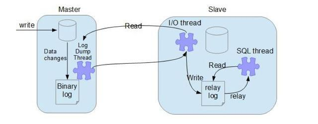

# mysql 主从架构

　　‍

　　主从复制的作用

* 数据备份：确保数据安全，做数据的热备，slave作为后备数据库，主数据库服务器故障后，可以切换到从数据库继续工作，避免数据的丢失；
* 提升性能：提高I/O性能，随着业务量增大，数据库I/O访问频率增大，单机无法满足；
* 读写分离：即写请求分发到master，读请求分发到slave，能在一定程度上减轻数据库服务器的访问压力；

　　‍

　　‍

## <span data-type="text" style="color: var(--b3-font-color11);">基于binlog日志点的主从复制</span>

　　MySQL主从复制涉及到三个线程，一个运行在主节点（log dump thread），其余两个(I/O thread, SQL thread)运行在从节点，如下图所示:



　　复制的原理其实很简单，仅分为以下三步：

* master 服务器将数据的改变记录二进制 binlog 日志，当 master 上的数据发生改变时，则将其改变写入二进制日志中；
* slave 服务器会在一定时间间隔内对 master 二进制日志进行探测其是否发生改变，如果发生改变，则开始一个 I/OThread 请求 master 二进制事件；
* 从库给主库发起读数据请求后, 主库会通过 `dump`​ 线程 把 `binlog`​ 日志文件 推送 给从库, 从库的 `I/O`​ 线程把接收到数据更新到 `relay log`​, 之后从库的 `SQL`​ 线程把 `relay log`​ 应用为 `binlog`​ 日志, 直到主库与从库的 `binlog`​ 日志文件完全数据一致, 达到主从同步。

　　**mysql基于binlog的主从复制的步骤:**

- 1) 在主库与从库都安装mysql数据库;mysql 单机部署
- 2) 在主库的my.cnf配置文件中配置server-id 和log-bin;
- 3) 在主库创建认证用户并做授权，查看binlog偏移量;
- 4) 在从库的my.cnf配置文件中配置server-id;
- 5) 登陆从库后，执行change master语句开启同步。

1. 主库配置

```bash
# 配置数据库master
## 修改my.cnf配置文件添加
[mysqld]
server-id=1
log-bin=mysql-bin
max_binlog_size=500M
expire_logs_days=15
# MHA架构下必须启用，负责主服务器宕机后无法成为从服务器
log-slave-updates = 1
-----------------------------------
# 重启数据库
systemctl restart mysqld  #/data/mysql/support-files/mysql.server 

# 创建用于同步的数据库用户
# 用户名：replication 密码：Ninestar@2022 slave服务器ip：10.0.0.10
create user replication@'%' identified by 'Ninestar@2022';
create user replication@'%' identified with mysql_native_password by 'Ninestar@2022';
grant replication slave on *.* to replication@'%';
flush privileges;

# 查看主服务器当前二进制日志名和偏移量
mysql> show master status;
+------------------+----------+--------------+------------------+-------------------+
| File             | Position | Binlog_Do_DB | Binlog_Ignore_DB | Executed_Gtid_Set |
+------------------+----------+--------------+------------------+-------------------+
| mysql-bin.000001 |      156 |              |                  |                   |
+------------------+----------+--------------+------------------+-------------------+
1 row in set (0.00 sec)
# 
```

2. 从库配置

```properties
# 配置数据库slave
## 修改my.cnf配置文件添加
[mysqld]
server-id=2
relay_log=mysql-relay-bin
relay-log-index = slave-relay-bin.index
max_relay_log_size=500M
# 自动删除relay_log ,MHA架构下不生效
relay_log_purge=1
slave-net-timeout=120

log-bin=mysql-bin
max_binlog_size=500M
expire_logs_days=15
-----------------------------------
## 重启数据库
systemctl restart mysqld  #/data/mysql/support-files/mysql.server restart

```

3. 从库执行同步命令

```sql
-- 用于同步的主服务器上的用户和密码
change master to master_user='replication',
master_password='Ninestar@2022',
-- 主服务器ip
master_host='192.168.0.104',
-- 主服务器二进制日志名
master_log_file='mysql-bin.000002',
-- 主服务器bin-log日志偏移量
master_log_pos=1924,
-- 当重新建立主从连接时，如果连接建立失败，间隔多久后重试。
master_connect_retry=30,
-- slave最大尝试的次数。超过这个值后就不尝试重连了，并将Slave_IO_Running设置为No，默认为86400次
master_retry_count=10;

flush privileges;
-- 启动slave进程
start slave;
-- 查看是否启动
show slave status\G;
--Slave_IO_Running: Yes
--Slave_SQL_Running: Yes

-- 停止slave
stop  slave;
```

## <span data-type="text" style="color: var(--b3-font-color11);">基于binlog-GTID的主从复制</span>

　　从 MySQL 5.6.5 版本新增了一种主从复制方式：`GTID`，其全称是`Global Transaction Identifier`，即全局事务标识。通过`GTID`保证每个主库提交的事务在集群中都有唯一的一个`事务ID`。**强化了数据库主从的一致性和故障恢复数据的容错能力**。在主库宕机发生主从切换的情况下。`GTID`方式可以让其他从库自动找到新主库复制的位置，而且`GTID`可以忽略已经执行过的事务，减少了数据发生错误的概率。

　　**在传统的主从复制slave端，binlog是不用开启的，但是在GTID中slave端的binlog是必须开启的**

　　**基于GTID的主从复制原理**

- 主服务器更新数据时，会在事务前产生GTID，一同记录到binlog日志中。
- binlog传送到从服务器后，被写入到本地的relay log中。从服务器读取GTID，并将其设定为自己的GTID（GTID_NEXT系统）。
- sql线程从relay log中获取GTID，然后对比从服务器端的binlog是否有记录。
- 如果有记录，说明该GTID的事务已经执行，从服务器会忽略。
- 如果没有记录，从服务器就会从relay log中执行该GTID的事务，并记录到binlog。

　　==优势==

- 更简单的实现failover，不用以前那样再需要找log_file和log_pos
- 更简单的搭建主从复制
- 比传统的复制更加安全
- GTID是连续的没有空洞的，保证数据的一致性，零丢失

　　**基于GTID+并行复制+半同步模式的主从架构搭建步骤:**

- 1) 在主库与从库都安装mysql数据库[[mysql 单机部署]];
- 2) 在主库的my.cnf配置文件中配置server-id 、log-bin、gtid-mode、log-slave-updates、enforce-gtid-consistency;
- 3) 在主库创建认证用户并做授权;
- 4) 在从库的my.cnf配置文件中配置server-id，其他的和主库的配置基本一样;
- 5) 登陆从库后，指定master并开启同步开关。

1. 修改（主）mysql配置文件，然后重启下服务

```bash
################  gitd  基础配置
server-id = 100
gtid-mode = on
enforce-gtid-consistency = 1
# binlog
log-bin = master-bin
log-bin-index = master-bin.index
binlog-format = row
# 控制是否在中继日志执行之后，将同步过来的数据添加到自己的binlog中去，1代表是
log-slave-updates=1
# 它控制是否可以信任存储函数创建者，不会创建写入二进制日志引起不安全事件的存储函数。
log_bin_trust_function_creators=1
# 这个参数控制binlog写入磁盘的方式。设置为1时，表示每次commit;都写入磁盘
sync_binlog=1
# 这个刷新的是redo log 这样每次提交事务都会立即将事务刷盘保证持久性和一致性。
innodb_flush_log_at_trx_commit =1

#################### 并行复制，加快从服务器同步时间
# 这个参数控制着日志在刷盘前日志提交要等待的时间，默认是0也就是说提交后立即刷盘，但是并不代表是关闭了组提交，当设置为0以上的时候，就允许多个事物的日志同时间一起提交刷盘，也就是我们说的组提交。组提交是并行复制的基础，我们设置这个值的大于0就代表打开了组提交的延迟功能，而组提交是默认开启的。最大值只能设置为1000000微妙。 
binlog_group_commit_sync_delay = 100 

# 这个参数表示我们在binlog_group_commit_sync_delay等待时间内，如果事物数达到这个参数的设定值，就会触动一次组提交，如果这个值设为0的话就不会有任何的影响。如果到达时间但是事物数并没有达到的话，也是会进行一次组提交操作的。
binlog_group_commit_sync_no_delay_count = 10

####################### 半同步模式
plugin_dir = /data/mysql/lib/plugin
plugin_load = "rpl_semi_sync_master=semisync_master.so"
rpl-semi-sync-master-enabled = 1
rpl_semi_sync_master_timeout = 1000

# 不同步的数据库
binlog-ignore-db=mysql,sys,performance_schema,information_schema
·······

-----------------------------------
## 重启数据库
systemctl restart mysqld  #/data/mysql/support-files/mysql.server restart
```

2. 修改（从）mysql配置文件,只有server-id不一样，然后重启下服务

```bash
###############  gitd 基本配置
server-id = 200
gtid-mode = on
enforce-gtid-consistency = 1
# binlog
log-bin = slave-bin
log-bin-index = slave-bin.index
binlog_format = row
# 中继日志文件名称主体
relay-log  =  slave-relay-bin
#　中继日志文件索引文件
relay-log-index  =  slave-relay-bin.index
log-slave-updates = 1
log_bin_trust_function_creators = 1
# 限制备库为只读，可选
read_only = 1
# 这个参数控制binlog写入磁盘的方式。设置为1时，表示每次commit;都写入磁盘
sync_binlog=1
# 这个刷新的是redo log 这样每次提交事务都会立即将事务刷盘保证持久性和一致性。
innodb_flush_log_at_trx_commit =1
# 该选项能够阻止备库在崩溃后自动启动复制，建议开启
skip_slave_start
sync_master_info     = 1
sync_relay_log       = 1
sync_relay_log_info  = 1

################# 并行复制，加快从服务器同步时间
sync-master-info=1
slave-parallel-type=LOGICAL_CLOCK
# 设定从服务器的SQL线程数；0表示关闭多线程复制功能；
slave-parallel-workers=2
master_info_repository=TABLE
relay_log_info_repository=TABLE
relay_log_recovery=ON

####################### 半同步模式
plugin_dir = /data/mysql/lib/plugin
plugin_load = "rpl_semi_sync_slave=semisync_slave.so"
rpl-semi-sync-slave-enabled = 1

-----------------------------------
## 重启数据库
systemctl restart mysqld  #/data/mysql/support-files/mysql.server restart
```

3. 登录（主）mysql，创建用于同步的用户

```bash
##master
mysql> grant replication slave on *.* to 'master'@'%' identified by "1q2w3e4r";
```

4. 登录（从）mysql，配置用户连接到主mysql

```bash
##slave

mysql> stop slave;
mysql> change master to master_host='192.168.0.104' ,master_user='master',master_password='1q2w3e4r',master_auto_position=1;
mysql> start slave;
```

　　‍
