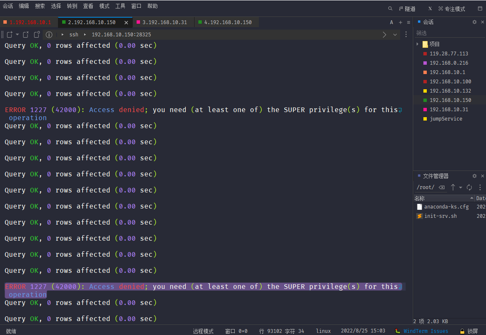

# err-mysqldump解决 DEFINER 问题

项目上 MySQL 还原 SQL 备份 经常会碰到一个错误如下，且通常出现在导入视图、函数、存储过程事件等对象时，其根本原因就是因为 *导入时所用账号* 并不具有 SUPER 权限，所以无法创建 *其他账号* 的所属对象。



### ==常见场景==

1. 还原 RDS 时经常出现，因为 RDS 的root不提供 SUPER 权限；
2. 由开发库还原到项目现场，账号权限等有所不同。

### ==问题原因==

我们先来看下为啥会出现这个报错，那就得说下 MySQL 中一个很特别的权限控制机制，像视图、函数、存储过程、触发器等这些数据对象会存在一个 `DEFINER`​ 和一个 `SQL SECURITY`​ 的属性，如下所示：

```sql
--视图定义
CREATE ALGORITHM = UNDEFINED DEFINER = `root`@`%` SQL SECURITY DEFINER VIEW v_test
--函数定义
CREATE DEFINER=`root`@`%` FUNCTION `f_test()` RETURNS varchar(100) SQL SECURITY DEFINER
--存储过程定义
CREATE DEFINER=`root`@`%` PROCEDURE `p_test`() SQL SECURITY DEFINER
--触发器定义
CREATE DEFINER=`root`@`%` trigger t_test 
--事件定义
CREATE DEFINER=`root`@`%` EVENT `e_test`
--   DEFINER：对象定义者，在创建对象时可以手动指定用户，不指定的话默认为当前连接用户；
--   SQL SECURITY：指明以谁的权限来执行该对象，有两个选项，一个为 `DEFINER`，一个为 `INVOKER`，默认情况下系统指定为DEFINER；
 --   DEFINER：表示按 **定义者** 的权限来执行；
 --   INVOKER：表示按 **调用者** 的权限来执行。
```

‍

### ==场景==

1. 如果用没有super权限的用户（jy2gm）导入其他账号（jy2web）导出的sql，导入，会出现`ERROR 1227 (42000): Access denied; you need (at least one of) the SUPER privilege(s) for this operation`​的报错，无法导入视图。
2. 如果导入账号（root）具有 SUPER 权限，即使对象的所有者账号不存在，也可以导入成功，但是在查询对象时，如果对象的 `SQL SECURITY`​ 为 `DEFINER`​，则会报账号不存在的报错`ERROR 1449 (HY000): The user specified as a definer (‘jy2web’@’%’) does not exist`​

### ==解决方法==

1. 修改导出后的sql文件

```bash
cp exp_jy2web.sql exp_jy2gm.sql ; sed -i 's/jy2web/jy2gm/g' exp_jy2gm.sql
```

2. 若通过super权限导入

```sql
-- 查看所有视图的定义者 
select TABLE_SCHEMA,TABLE_NAME,DEFINER from information_schema.VIEWS;
select TABLE_SCHEMA,TABLE_NAME,DEFINER from information_schema.VIEWS where table_schema="jy2gm";

-- 生成修改视图定义者的sql语句
--select concat("alter DEFINER=`更改后的用户名`@`更改后的ip` SQL SECURITY DEFINER VIEW `",TABLE_SCHEMA,"`.",TABLE_NAME," as ",VIEW_DEFINITION,";") from information_schema.VIEWS where DEFINER = '修改前的用户名@修改前的ip';

select concat("alter DEFINER=`jy2gm`@`%` SQL SECURITY DEFINER VIEW `",TABLE_SCHEMA,"`.",TABLE_NAME," as ",VIEW_DEFINITION,";") from information_schema.VIEWS where DEFINER = '@%';

-- 复制并运行 ALTER 语句

-- 使用tee 记录查询结果，通过sed修改语句，然后执行
```
