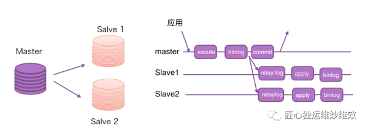
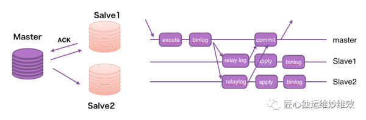
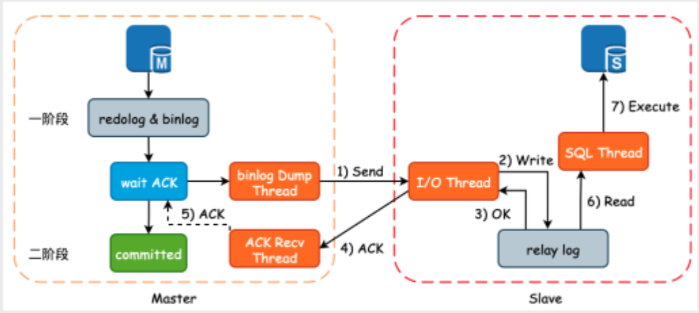
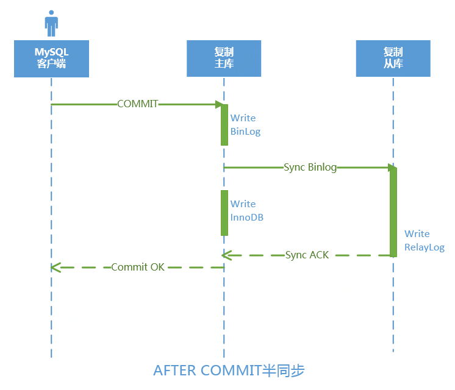
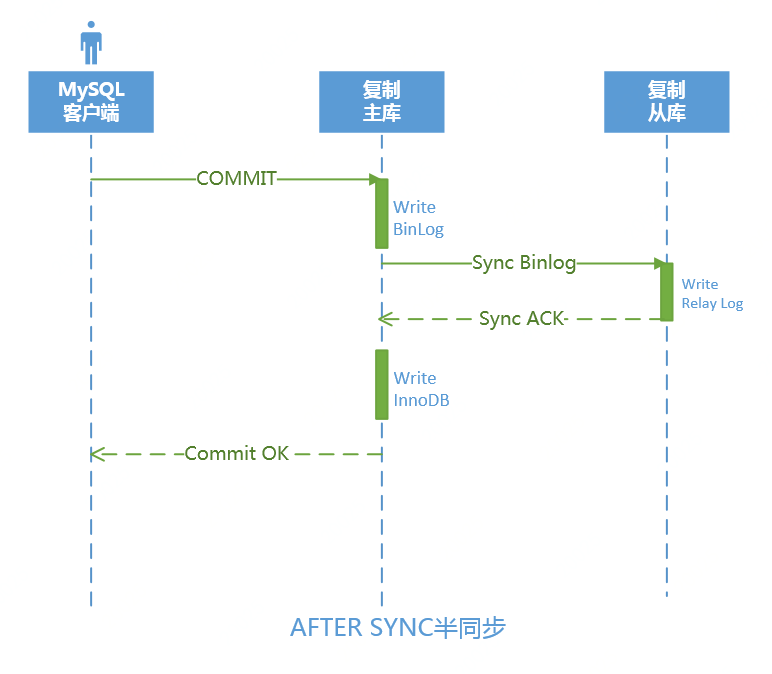

# mysql 同步复制

‍

## **异步复制**

默认配置下，MYSQL主从库通过binlog来保持一致，主库事务提交后，将binlog日志写入磁盘，然后返回给用户，备库通过拉取主库的binlog来同步主库的操作，无法保证主备节点数据实时一致，只能保证最终一致，因此属于异步复制。

MySQL默认的复制即是异步的，master在执行完客户端提交的事务后会立即将结果返给给客户端，并不关心从库是否已经接收并处理，这样就会有一个问题，如果master crash掉了，此时master已经提交的事务可能并没有传到slave上，如果此时，强行将slave提升为master，可能导致新master上的数据不完整。



## **半同步复制**

为保证在主备切换时，主备节点数据完全一致，MYSQL提供了半同步复制，其实现原理为：事务在主库上执行完成，生成BINLOG并推送给备库，等待备库的响应消息，备库将接受到的binlog(file,pos)信息返回给主库，主库接收到背库的确认消息后，在返回给用户，事务提交完成。

半同步复制只保证主库和备库的binlog同步，但主库无需等待备库应用这些binglog就会返回提交结果，从库异步地应用这些binlog，因此主库和从库的数据不是实时同步的，因此称为“半同步”。





‍

‍

半同步复制部署步骤：（在搭建好主从同步的基础上）

#### **1.配置主服务器**

```bash
# 查看安装包是否存在半同步插件
[root@test mysql-8.0.33-linux-glibc2.28-x86_64]# find ./ -name semisync*
./lib/plugin/debug/semisync_master.so
./lib/plugin/debug/semisync_replica.so
./lib/plugin/debug/semisync_slave.so
./lib/plugin/debug/semisync_source.so
./lib/plugin/semisync_master.so
./lib/plugin/semisync_replica.so
./lib/plugin/semisync_slave.so
./lib/plugin/semisync_source.so
[root@test mysql-8.0.33-linux-glibc2.28-x86_64]# 

# 修改my.cnf配置文件
[mysqld]
------------------------------------------------------------
plugin_dir = /data/mysql/lib/plugin
plugin_load = "rpl_semi_sync_master=semisync_master.so"
rpl_semi_sync_master_enabled = ON
rpl_semi_sync_master_wait_no_slave = ON
rpl_semi_sync_master_timeout = 1000
------------------------------------------------------------
# 重启数据库

# 查看主库半同步复制的相关参数设置
mysql> show global variables like '%semi%';
# 查看主库半同步复制的状态参数
mysql> show global status like '%semi%';  
```

#### **2.配置从服务器**

```bash
# 修改my.cnf配置文件
------------------------------------------------------------
[mysqld]
plugin_dir = /data/mysql/lib/plugin
plugin_load = "rpl_semi_sync_slave=semisync_slave.so"
rpl_semi_sync_slave_enabled = ON
------------------------------------------------------------
# 重启数据库

# 查看主库半同步复制的相关参数设置
mysql> show global variables like '%semi%';
# 查看主库半同步复制的状态参数
mysql> show global status like '%semi%';  
```

#### **3.检查半同步状态**

```bash
#如果在一个正在运行的Slave上开启半同步复制的功能，那么在配置半同步以后，需要重启停止Slave的I/O线程：
#从库上执行
mysql> stop slave io_thread;    ---停止IO线程
mysql> start slave io_thread;    ---启动IO线程
mysql> show slave status\G
*************************** 1. row ***************************
               Slave_IO_State: Waiting for master to send event
---省略若干---
             Slave_IO_Running: Yes
            Slave_SQL_Running: Yes
---省略若干---
1 row in set (0.00 sec)

#查看主库上面的半同步插件是否开启，输出如下，注意第一个参数clients的值变为1了（之前是0），表示主从半同步复制连接成功。
#从库start slave前
show global status like '%Rpl_semi_sync_master_clients%';
+------------------------------+-------+
| Variable_name                | Value |
+------------------------------+-------+
| Rpl_semi_sync_master_clients | 0     |
+------------------------------+-------+
1 row in set (0.00 sec)

#从库start slave 后。
 show global status like '%Rpl_semi_sync_master_clients%';
+------------------------------+-------+
| Variable_name                | Value |
+------------------------------+-------+
| Rpl_semi_sync_master_clients | 1     |
+------------------------------+-------+
1 row in set (0.00 sec)
```

#### 4.MySQL 半同步测试

##### 4.1  测试半同步复制

**1)检查主从库半同步设置**

```
#主库
192.110.103.41 : test > show global status like '%semi%'; 
+--------------------------------------------+-------+
| Variable_name                              | Value |
+--------------------------------------------+-------+
| Rpl_semi_sync_master_clients               | 1     |
| Rpl_semi_sync_master_net_avg_wait_time     | 0     |
| Rpl_semi_sync_master_net_wait_time         | 0     |
| Rpl_semi_sync_master_net_waits             | 0     |
| Rpl_semi_sync_master_no_times              | 0     |
| Rpl_semi_sync_master_no_tx                 | 0     |
| Rpl_semi_sync_master_status                | ON    |
| Rpl_semi_sync_master_timefunc_failures     | 0     |
| Rpl_semi_sync_master_tx_avg_wait_time      | 0     |
| Rpl_semi_sync_master_tx_wait_time          | 0     |
| Rpl_semi_sync_master_tx_waits              | 0     |
| Rpl_semi_sync_master_wait_pos_backtraverse | 0     |
| Rpl_semi_sync_master_wait_sessions         | 0     |
| Rpl_semi_sync_master_yes_tx                | 0     |
+--------------------------------------------+-------+
14 rows in set (0.00 sec)
#从库
192.110.103.43 : (none) > show global status like '%semi%';   
+----------------------------+-------+
| Variable_name              | Value |
+----------------------------+-------+
| Rpl_semi_sync_slave_status | ON    |
+----------------------------+-------+
1 row in set (0.00 sec)
```

在Master上如下是半同步复制是正常的。  
​

**2)Master写入数据**

```
#master 192.110.103.41
create table if not exists test.tt (id int(10) PRIMARY KEY AUTO_INCREMENT,name varchar(50) NOT NULL);  
insert into test.tt values(1,'zhang3');
```

**3)主库半同步复制状态**

```
#master上查看
192.110.103.41 : test > show global status like '%semi%'; 
+--------------------------------------------+-------+
| Variable_name                              | Value |
+--------------------------------------------+-------+
| Rpl_semi_sync_master_clients               | 1     |
| Rpl_semi_sync_master_net_avg_wait_time     | 281   |    ---平均网络等待时间为281毫秒
| Rpl_semi_sync_master_net_wait_time         | 563   |    ---总网络等待时间为563毫秒
| Rpl_semi_sync_master_net_waits             | 2     |    ---总网络等待次数为2
| Rpl_semi_sync_master_no_times              | 0     |
| Rpl_semi_sync_master_no_tx                 | 0     |
| Rpl_semi_sync_master_status                | ON    |
| Rpl_semi_sync_master_timefunc_failures     | 0     |
| Rpl_semi_sync_master_tx_avg_wait_time      | 349   |    ---平均事务等待时间为434毫秒
| Rpl_semi_sync_master_tx_wait_time          | 698   |    ---总事务等待时间为868毫秒
| Rpl_semi_sync_master_tx_waits              | 2     |    ---总事务等待次数为2
| Rpl_semi_sync_master_wait_pos_backtraverse | 0     |
| Rpl_semi_sync_master_wait_sessions         | 0     |
| Rpl_semi_sync_master_yes_tx                | 2     |    ---收到了2次接受的确认
+--------------------------------------------+-------+
14 rows in set (0.00 sec)

#slave:查看
192.110.103.43 : test > select * from test.tt;
+----+--------+
| id | name   |
+----+--------+
|  1 | zhang3 |
+----+--------+
```

##### 4.2 测试半同步复制超时

**1)停止从库的IO线程复制**

```
---测试从库IO线程是否停止，半同步复制更新
192.110.103.43 : test > stop slave io_thread; 
Query OK, 0 rows affected (0.00 sec)
```

**2）在主库中更新数据**

```
#---此时执行该命令等待了很久（设置了10秒），因为从库已经停止了
192.110.103.41 : test > insert into test.tt values(2,'li4');
Query OK, 1 row affected (10.00 sec)

#半同步失败退化了异步
192.110.103.41 : test > show global status like '%semi%';
+--------------------------------------------+-------+
| Variable_name                              | Value |
+--------------------------------------------+-------+
| Rpl_semi_sync_master_clients               | 1     |
| Rpl_semi_sync_master_net_avg_wait_time     | 193   |
| Rpl_semi_sync_master_net_wait_time         | 579   |
| Rpl_semi_sync_master_net_waits             | 3     |
| Rpl_semi_sync_master_no_times              | 1     |  ---失败次数
| Rpl_semi_sync_master_no_tx                 | 1     |
| Rpl_semi_sync_master_status                | OFF   |  ---半同步状态OFF了
| Rpl_semi_sync_master_timefunc_failures     | 0     |
| Rpl_semi_sync_master_tx_avg_wait_time      | 349   |
| Rpl_semi_sync_master_tx_wait_time          | 698   |
| Rpl_semi_sync_master_tx_waits              | 2     |
| Rpl_semi_sync_master_wait_pos_backtraverse | 0     |
| Rpl_semi_sync_master_wait_sessions         | 0     |
| Rpl_semi_sync_master_yes_tx                | 2     |
+--------------------------------------------+-------+
14 rows in set (0.00 sec)

#insert 速度又很快了
192.110.103.41 : test > insert into tt values(3,'wang5');
Query OK, 1 row affected (0.01 sec)

```

测试可知,从库停止IO线程复制之后，第一次执行insert操作时等待了10秒之后才提交完事务，但是第二次insert的操作就很快了。因为第一次等待从库超时之后，半同步复制状态自动转换为异步了，所以第二次及以后都会很快了。

**3）开启从库的IO线程复制状态**

```
192.110.103.43 : test > start  slave io_thread; 
Query OK, 0 rows affected (0.00 sec)
```

**4）再次查看主库的半同步状态**

```
192.110.103.41 : test > show global status like '%semi%';
+--------------------------------------------+-------+
| Variable_name                              | Value |
+--------------------------------------------+-------+
| Rpl_semi_sync_master_clients               | 1     |
| Rpl_semi_sync_master_net_avg_wait_time     | 460   |
| Rpl_semi_sync_master_net_wait_time         | 1842  |
| Rpl_semi_sync_master_net_waits             | 4     |
| Rpl_semi_sync_master_no_times              | 1     |
| Rpl_semi_sync_master_no_tx                 | 2     |
| Rpl_semi_sync_master_status                | ON    |   ---半同步状态ON了
| Rpl_semi_sync_master_timefunc_failures     | 0     |
| Rpl_semi_sync_master_tx_avg_wait_time      | 349   |
| Rpl_semi_sync_master_tx_wait_time          | 698   |
| Rpl_semi_sync_master_tx_waits              | 2     |
| Rpl_semi_sync_master_wait_pos_backtraverse | 0     |
| Rpl_semi_sync_master_wait_sessions         | 0     |
| Rpl_semi_sync_master_yes_tx                | 2     |
+--------------------------------------------+-------+
14 rows in set (0.00 sec)
```

##### 4.3 测试半同步slave同步失败

**1）模拟复制故障：**   
 从库和主库数据不一致，导致同步异常。在从库insert一记录，然后在主库insert相同的记录，此时同步将出错。

```
#slave
192.110.103.43 : test > insert into tt values(4,'ma6');
#master
192.110.103.41 : test >  insert into tt values(4,'ma6');
```

从库出错:

```
192.110.103.43 : test > show slave status\G
*************************** 1. row ***************************
               Slave_IO_State: Waiting for master to send event
                  Master_Host: 192.110.103.41
                  Master_User: repl
                  Master_Port: 3106
              Master_Log_File: mysql-bin.000007
             Slave_IO_Running: Yes
            Slave_SQL_Running: No
                   Last_Errno: 1062
                   Last_Error: Could not execute Write_rows event on table test.tt; Duplicate entry '4' for key 'PRIMARY', Error_code: 1062; handler error HA_ERR_FOUND_DUPP_KEY; the event's master log mysql-bin.000007, end_log_pos 891
                 Skip_Counter: 0
        Seconds_Behind_Master: NULL
Master_SSL_Verify_Server_Cert: No
               Last_SQL_Errno: 1062
               Last_SQL_Error: Could not execute Write_rows event on table test.tt; Duplicate entry '4' for key 'PRIMARY', Error_code: 1062; handler error HA_ERR_FOUND_DUPP_KEY; the event's master log mysql-bin.000007, end_log_pos 891

           Retrieved_Gtid_Set: a01f3a3f-1eee-11ea-b1e4-a0369fac2de4:31-35
            Executed_Gtid_Set: a01f3a3f-1eee-11ea-b1e4-a0369fac2de4:1-34,
bb35a83e-1fb2-11ea-b6e3-a0369fa6cd30:1
                Auto_Position: 1
```

**2）检查状态：**   
 此时查看主库的半同步复制状态，发现其仍然为ON，如下所示，可见半同步复制和SQL线程没有关系：

```
#master
192.110.103.41 : test > show global status like '%Rpl_semi_sync_master_status%';
+-----------------------------+-------+
| Variable_name               | Value |
+-----------------------------+-------+
| Rpl_semi_sync_master_status | ON    |
+-----------------------------+-------+
1 row in set (0.00 sec)
#slave
192.110.103.43 : test > show global status like '%semi%';
+----------------------------+-------+
| Variable_name              | Value |
+----------------------------+-------+
| Rpl_semi_sync_slave_status | ON    |
+----------------------------+-------+
```

**3）处理从库复制故障**  
 登录slave进行复制故障处理。

```
#普通复制
stop slave;
set global sql_slave_skip_counter = 1;
start slave;
```

若是GTID复制,set global sql_slave_skip_counter会出错,要如下处理:

```
#若是GTID复制时将会出错
set global sql_slave_skip_counter = 1;
ERROR 1858 (HY000): sql_slave_skip_counter can not be set when the server is running with @@GLOBAL.GTID_MODE = ON. Instead, for each transaction that you want to skip, generate an empty transaction with the same GTID as the transaction
##
stop slave;

#slave
由于在这个GTID必须是连续的，正常情况同一个服务器产生的GTID是不会存在空缺的。所以不能简单的skip掉一个事务，只能通过注入空事物的方法替换掉一个实际操作事务。
 show master status;
show global variables like '%gtid%';
192.110.103.43 : test >show slave status\G
当前Executed_Gtid_Set的值a01f3a3f-1eee-11ea-b1e4-a0369fac2de4:1-34
           Retrieved_Gtid_Set: a01f3a3f-1eee-11ea-b1e4-a0369fac2de4:31-35
            Executed_Gtid_Set: a01f3a3f-1eee-11ea-b1e4-a0369fac2de4:1-34,
bb35a83e-1fb2-11ea-b6e3-a0369fa6cd30:1

#处理:
set gtid_next='a01f3a3f-1eee-11ea-b1e4-a0369fac2de4:35'; --(last_executed_slave_gtid_on_master + 1)
begin;commit;
set gtid_next='AUTOMATIC';
start slave;
show slave status\G;

```

#### 5.半同步复制配置参数说明

```bash
rpl_semi_sync_master_enabled       # 表示主上是否开启半同步复制功能，可以动态修改。可选值：ON\OFF
rpl_semi_sync_slave_enabled           # 表示从上是否开启半同步复制功能，可以动态修改。可选值：ON\OFF
rpl_semi_sync_master_timeout=10000 # 用于控制主库等待备库响应的消息时间(单位ms)，如果超过该阀值，则认为备库存在问题，将半同步复制修改为异步复制，避免主库的执行事务长时间等待。默认值为50ms。
rpl_semi_sync_master_wait_for_slave_count=1 # 默认Master发送事务默认至少需要一个Slave的响应才能继续下一个事务，在MySQL5.7版本中引入参数rpl_semi_sync_master_wait_for_slave_count来设置需要应答的Slave的数量，默认值为1。
rpl_semi_sync_master_wait_no_slave=ON         # 当开启时，当备库起来并跟上主库时，自动切换到同步模式；如果关闭，即使备库跟上主库，也不会启用半同步；
rpl_semi_sync_master_trace_level=32                # 输出监控信息的级别，不同的级别输出信息不同，用于调试；
rpl_semi_sync_master_wait_point=AFTER_SYNC  # 主库在返回给客户端事务成功的时间点。该参数有两个值：AFTER_SYNC(默认值)、AFTER_COMMIT 。
#   **after commit**：这也是最初版本的同步方式，主库将每事务写入 binlog，发送给备库并刷新到磁盘 (relaylog)，然后在主库提交事务，并等待备库的响应；一旦接到备库的反馈，主库将结果反馈给客户端。由于主库是在三段提交的最后 commit 阶段完成后才等待，所以主库的其它会话是可以看到这个事务的，所以这时候可能会导致主备库数据不一致。
#  **after sync**：主库将事务写入 binlog，发送给备库并刷新到磁盘，主库等待备库的响应；一旦接到备库的反馈，主库会提交事务并且返回结果给客户端。在该模式下，所有的客户端在同一时刻查看已经提交的数据。假如发生主库 crash，所有在主库上已经提交的事务已经同步到备库并记录到 relay log，切到从库可以减小数据损失。
```

​​

## <span id="20231110105237-7kj772t" style="display: none;"></span>**全同步复制**

全同步复制（full sync replication）是指当主库执行完一个事务后，需要确保所有的从库都执行了该事务才返回给客户端。因为需要等待所有的从库都执行完该事务才能返回，所以全同步复制的性能较差。  
MySQL自身不支持同步复制，需要用到第三方工具如 [DRDB ](012%20企业建设/高可用方案/DRDB/DRDB%20概念.md)|参考文章：[CentOS 7.6+NFS+Heartbeat+DRBD](012%20企业建设/高可用方案/heartbeat/CentOS%207.6+NFS+Heartbeat+DRBD.md)（sync模式）等实现同步复制。还可以参考[mysql MGR模式](mysql%20MGR模式.md)[当主库提交事务之后，所有的从库节点必须收到、APPLY并且提交这些事务，然后主库线程才能继续做后续操作。但缺点是，主库完成一个事务的时间会被拉长，性能降低。]

‍
