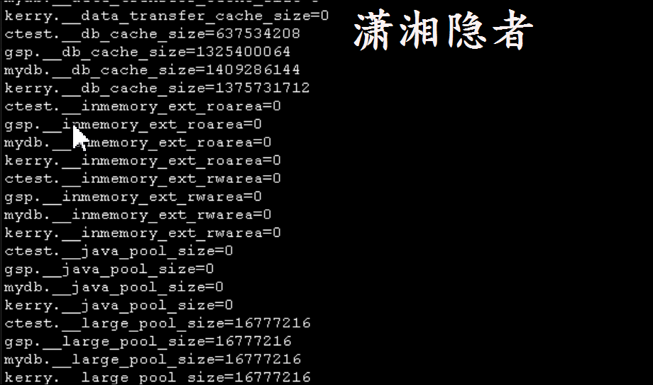

# other-ORACLE修改ORACLE_SID总结

在某些特殊情况下，需要修改当前Oracle数据库实例中的ORACLE\_SID。下面简单的总结一下如何修改$ORACLE\_SID的步骤。默认情况下，INSTANCE\_NAME参数和ORACLE\_SID的值是相同的，但是它们也可以不同。另外，如果参数文件（pfile或spfile）中没有指定instance\_name的值，那么它的值跟ORACLE\_SID的值一致。我们这里只修改ORACLE\_SID的值。另外，关于DB\_NAME与ORACLE\_SID的关系，我们这里暂且不表，本文只讨论如何修改ORACLE\_SID的值。

### 1查看数据库的信息

查看环境变量

```
$ echo $ORACLE_SID
```

SQL查询:

```
select instance_name, status from v$instance;

select instance from v$thread;
```

#注意，系统视图v$instance中的instance\_name的值为ORACLE\_SID的值，不是参数文件中instance\_name的值。

```
SQL> select instance_name, status from v$instance;

INSTANCE_NAME    STATUS
---------------- ------------
gsp                  OPEN

1 row selected.

SQL> select instance from v$thread;

INSTANCE
-------------------------------------
gsp

1 row selected.
```

#查看参数文件中参数instance\_name

```
SQL> show parameter instance_name

NAME                         TYPE        VALUE
------------------------ ----------- ------------------------------
instance_name               string      gsp
SQL>
```

检查判断数据库实例从pfile还是spfile启动。

```
SQL> show parameter spfile;
SQL> show parameter pfile;
```

### 2：关闭数据库监听

```
$ps -ef | grep lsnr | grep -v grep
```

#根据上面脚本获取具体的监听名称（默认可能为LISTENER），关闭监听

```
$lsnrctl stop xxx 
```

### 3：关闭数据库实例

```
SQL> shutdown immediate;
```

\--注意，这里只能用SHUTDOWN NORMAL或者SHUTDOWN IMMEDIATE关闭数据库实例. 不要使用SHUTDOWN ABORT命令关闭实例。

### 4: 修改环境变量设置。

4.1 修改/etc/oratab文件

```
gsp:/opt/oracle19c/product:N

修改为

kerry:/opt/oracle19c/product:N
```

4.2 修改一些环境变量设置

不同平台的操作系统，可能需要修改的文件可能不一样。例如Unix平台，可能需要修改参数文件.profile,而Linux平台可能是.bash\_profile文件，根据具体情况调整。

这里测试环境为Linux平台，当前环境中，在.bash\_profile配置ORACLE的变量，我只需修改.bash\_profile等参数文件

```
$ more ~/.bash_profile
# Get the aliases and functions
if [ -f ~/.bashrc ]; then
        . ~/.bashrc
fi

# User specific environment and startup programs

export ORACLE_HOME=/opt/oracle19c/product
export PATH=$HOME/.local/bin:$HOME/bin:$ORACLE_HOME/bin:$PATH
export ORACLE_BASE=/opt/oracle19c
export ORACLE_SID=gsp
#export TMOUT=7200
export TNS_ADMIN=$ORACLE_HOME/network/admin
export LD_LIBRARY_PATH=$ORACLE_HOME/lib:$ORACLE_HOME/network/lib:/lib:/usr/lib:/usr/local/lib
export LIBPATH=$ORACLE_HOME/lib:$ORACLE_HOME/network/lib:/lib:/usr/lib:/usr/local/lib
```

如上所示，将export ORACLE\_SID=gsp 改为export ORACLE\_SID=kerry

```
$ source ~/.bash_profile
$ echo $ORACLE_SID
kerry
```

```
$ env |grep ORACLE
ORACLE_SID=kerry
ORACLE_BASE=/opt/oracle19c
ORACLE_HOME=/opt/oracle19c/product
```

### 5 重命名参数文件

如果数据库实例从PFILE启动，那么可以直接修改参数文件init< sid>.ora的sid名字，如果数据库实例从SPFILE启动，可以直接修改参数文件spfile< sid>.ora名字，但是建议先生成PFILE然后从PFILE启动。因为如果时直接修改spfile< sid>.ora中< sid>的名字，启动数据库后，你生成SPFILE对应的PFILE就会发现，里面有许多原来ORACLE\_SID的内容，如果是pfile就可以手工清理，如果是spfile，需要先生成pfile，手工清理旧ORACLE\_SID的值，然后反向生成spfile，当然这些值不清理也没有关系，数据库实例启动时，根据$ORACLE\_SID来读取。



```
$ cd $ORACLE_HOME/dbs
$ ls -lrt *gsp*
-rw-r----- 1 oracle oinstall     2048 Feb  6 15:57 orapwdgsp
-rw-r----- 1 oracle oinstall 18759680 Mar 15 08:38 snapcf_gsp.f
-rw-rw---- 1 oracle oinstall     1544 Mar 30 11:07 hc_gsp.data
-rw-r--r-- 1 oracle oinstall     1569 Mar 30 11:30 initgsp.ora
-rw-r----- 1 oracle oinstall     4608 Apr  4 14:00 spfilegsp.ora
```

snapcf\_gsp.f是控制文件的快照，直接忽略。可以不用处理。 hc\_gsp.dat（hc\_<ORACLE\_SID>.dat）文件用于实例的健康检查, 它包含了用于监视实例健康状态的信息,当实例关闭时可以用该文件确定实例因为什么原因而关闭。每次实例启动时重建该文件。如果用一个空白文件替换该文件,会得到ORA-7445错误。因为每次实例启动的时候会重建，所以不用管之前的hc\_gsp.data文件，甚至可以删除。

**重命名参数文件**

```
$ cp spfilegsp.ora spfilekerry.ora
$ mv spfilegsp.ora spfilegsp.ora.20230418
$ cp initgsp.ora initkerry.ora
$ mv initgsp.ora initgsp.ora.20230418
```

**重新生成密码文件/或者重命名密码文件**

检查是否存在密码文件，重命名密码文件或者使用orapwd重建密码文件

重命名密码文件

```
$mv orapwgsp  orapwkerry
```

重建密码文件

```
$ orapwd file=orapwdkerry password=KerrY#qw1245  entries=5 force=y;

$ orapwd file=./orapwkerry
KerrY#qw1245
```

### 6 修改监听文件

$ORACLE\_HOME/network/admin/listener.ora 修改监听中的SID\_NAME等参数的值。

修改监听配置文件后启动监听。

### 7 启动Oracle实例

### 8 其他修改

数据库的其它参数，例如db\_name,service\_name，这些可修改亦可以不修改。根据你的需求视情况而定。这里不做展开。修改db\_name打算在下一篇文章展开介绍。

另外，有些目录可以不改名，也可以改名。例如$ORACLE\_BASE/diag/rdbms/< sid>/< sid>. 不修改名称，会根据$ORACLE\_SID自动生成一个新的目录名称。
