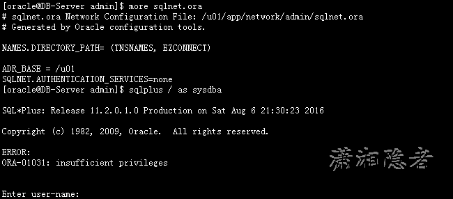

# other-口令文件介绍

**口令文件介绍**

     在ORALCE数据库系统中，用户如果要以特权用户身份(SYS/SYSDBA/SYSOPER)登录ORALCE数据库可以有两种身份验证的方法：即使用与操作系统集成的身份验证或使用ORALCE数据库的密码文件进行身份验证。因此，管理好密码文件，对于控制授权用户从服务器本机或远端登录Oracle数据库系统，执行数据库管理工作，具有重要的意义.

     ORALCE口令文件用于存储拥有部分特权用户（sys等用户）的口令(注意：普通账号密码是不会存储在口令文件的)。允许用户通过口令文件验证，在数据库未启动之前登陆，从而启动数据库。如果没有口令文件，在数据库未启动之前就只能通过操作系统认证.口令文件存放在$ORACLE_HOME/dbs目录下（linux,window放在database），默认名称是orapw$ORACLE_SID。即密码文件位置：

    Linux下的存放位置：$ORACLE_HOME/dbs/orapw<sid>.ora

    Windows下的存放位置:$ORACLE_HOME/database/PW%ORACLE_SID%.ora

## **口令文件管理**

### 1.口令文件成员查看

```
SQL> SELECT * FROM V$PWFILE_USERS;

USERNAME                       SYSDBA SYSOPER
------------------------------ ------ -------

SYS                            TRUE   TRUE
```

如果查询该视图没有的记录的话，那么这是什么情况呢？出现这种情况，一般是口令文件被删除或移走。 例如如下操作所示：

```
oracle@DB-Server ~]$ 
[oracle@DB-Server ~]$ cd $ORACLE_HOME/dbs
[oracle@DB-Server dbs]$ mv orapwgsp  /tmp
[oracle@DB-Server dbs]$ sqlplus / as sysdba

SQL*Plus: Release 11.2.0.1.0 Production on Thu Aug 4 17:43:39 2016

Copyright (c) 1982, 2009, Oracle.  All rights reserved.
Connected to:
Oracle Database 11g Enterprise Edition Release 11.2.0.1.0 - 64bit Production
With the Partitioning, OLAP, Data Mining and Real Application Testing options

SQL> SELECT * FROM V$PWFILE_USERS;
no rows selected
SQL> 
```

‍

ORACLE使用操作系统集成的身份验证或使用密码验证，这个类似SQL SERVER中的Windows身份验证和SQL Server验证方式，那么使用哪种方式登录数据库是由两个参数控制的。

1:ORACLE提供的一个参数remote_login_passwordfile，remote_login_passwordfile有none，shared，exclusive3个值：

- none表示不使用口令文件；
- exclusive表示实例独占使用口令文件，也就是各自实例使用单独的口令文件，
- shared表示多个实例共享一个口令文件

‍

2:sqlnet.ora里面的参数SQLNET.AUTHENTICATION_SERVICES

SQLNET.AUTHENTICATION_SERVICES = none | all | ntf(windows)

- none : 表示关闭操作系统认证，只能密码认证
- all : 用于linux或unix平台，关闭本机密码文件认证，采用操作系统认证，但远程<异机>可以使用密码文件认证
- nts : 用于windows平台

‍

### 2.使用操作系统集成的身份验证登录数据库

```
[oracle@DB-Server ~]$ 
[oracle@DB-Server ~]$ cd /u01/app/network/admin/
[oracle@DB-Server admin]$ more sqlnet.ora 
# sqlnet.ora Network Configuration File: /u01/app/network/admin/sqlnet.ora
# Generated by Oracle configuration tools.
NAMES.DIRECTORY_PATH= (TNSNAMES, EZCONNECT)
ADR_BASE = /u01

[oracle@DB-Server admin]$ vi sqlnet.ora 
# sqlnet.ora Network Configuration File: /u01/app/network/admin/sqlnet.ora
# Generated by Oracle configuration tools.
NAMES.DIRECTORY_PATH= (TNSNAMES, EZCONNECT)

ADR_BASE = /u01
SQLNET.AUTHENTICATION_SERVICES=all
```

其实默认情况，参数文件sqlnet.ora里面并没有配置SQLNET.AUTHENTICATION_SERVICES这个参数，默认表示操作系统认证，如果配置文件sqlnet.ora 里面有SQLNET.AUTHENTICATION_SERVICES=none，  那么设置为SQLNET.AUTHENTICATION_SERVICES=all 即可启用操作系统集成的身份验证登录数据库

```sql
[oracle@DB-Server admin]$ more sqlnet.ora 
# sqlnet.ora Network Configuration File: /u01/app/network/admin/sqlnet.ora
# Generated by Oracle configuration tools.
NAMES.DIRECTORY_PATH= (TNSNAMES, EZCONNECT)

ADR_BASE = /u01
SQLNET.AUTHENTICATION_SERVICES=none

[oracle@DB-Server admin]$ sqlplus / as sysdba
SQL*Plus: Release 11.2.0.1.0 Production on Sat Aug 6 21:30:23 2016
Copyright (c) 1982, 2009, Oracle.  All rights reserved.

ERROR:
ORA-01031: insufficient privileges

Enter user-name: 
```



### 3.改变OS认证为口令认证

SQLNET.AUTHENTICATION_SERVICES = none | all | ntf(windows)

none : 表示关闭操作系统认证，只能密码认证

all : 用于linux或unix平台，关闭本机密码文件认证，采用操作系统认证，但远程<异机>可以使用密码文件认证

nts : 用于windows平台

在sqlnet.ora文件里面，增加SQLNET.AUTHENTICATION_SERVICES= (none)

```sql
[oracle@DB-Server admin]$ vi sqlnet.ora 
# sqlnet.ora Network Configuration File: /database/product/dbhome_1/network/admin/sqlnet.ora
# Generated by Oracle configuration tools.

NAMES.DIRECTORY_PATH= (TNSNAMES, EZCONNECT)
SQLNET.AUTHENTICATION_SERVICES= none
```

参数remote_login_passwordfile仅仅表示远程登录数据库时，是否使用密码验证。当remote_login_passwordfile=none并且SQLNET.AUTHENTICATION_SERVICES= (none)时，远程和本机都无法登录数据库。

```sql
SQL> alter system set remote_login_passwordfile=none scope=spfile;
System altered.
SQL> shutdown immediate;
Database closed.
Database dismounted.
ORACLE instance shut down.

SQL> startup
ORACLE instance started.
Total System Global Area 1090519040 bytes
Fixed Size                  1218920 bytes
Variable Size             234882712 bytes
Database Buffers          838860800 bytes
Redo Buffers               15556608 bytes
Database mounted.
Database opened.
SQL> 
```

此时从远程客户端登录：此处实际上是无法通过口令文件验证

```sql
sqlplus "sys/kkk123456@mydb as sysdba"
SQL*Plus: Release 11.2.0.1.0 Production on 星期五 1月 11 15:37:45 2013
Copyright (c) 1982, 2010, Oracle.  All rights reserved.
ERROR:
ORA-01017: invalid username/password; logon denied


SQL> alter system set remote_login_passwordfile=exclusive scope=spfile;                            
System altered.

SQL> shutdown immediate;
Database closed.
Database dismounted.
ORACLE instance shut down.


SQL> startup
ORACLE instance started.
Total System Global Area 1090519040 bytes
Fixed Size                  1218920 bytes
Variable Size             234882712 bytes
Database Buffers          838860800 bytes
Redo Buffers               15556608 bytes
Database mounted.
Database opened.

SQL> show parameter remote_login_password
NAME                                 TYPE        VALUE
------------------------------------ ----------- ------------------------------
remote_login_passwordfile            string      EXCLUSIVE

SQL> 
```

远程客户端以SYSDBA登录数据库时，此时远程登录OK了

### 4.查看口令文件内容

```
[oracle@DB-Server dbs]$ strings orapwgsp
]\[Z

ORACLE Remote Password file
INTERNAL
6813407607142FD5
2F2B362C23566AE4
E20879077A63EBEE
```

如果你用more命令查看，就会发现查看不到具体内容，如下所示：

```sql
[oracle@DB-Server dbs]$ more orapwgsp
ORACLE Remote Password file 
```

## **口令文件创建**

现在人为删除口令文件后，从远程客户端以SYSDBA登录数据库

```
sqlplus "sys/kkk123456@mydb as sysdba"

SQL*Plus: Release 11.2.0.1.0 Production on 星期五 1月 11 15:53:06 2013
Copyright (c) 1982, 2010, Oracle.  All rights reserved.

ERROR:
ORA-01031: insufficient privileges
```

ORACLE 10g 下orapwd命令

```sql
[oracle@wgods dbs]$ orapwd

Usage: orapwd file=<fname> password=<password> entries=<users> force=<y/n> 
  where
    file - name of password file (mand),
    password - password for SYS (mand),
    entries - maximum number of distinct DBA and     force - whether to overwrite existing file (opt),

OPERs (opt), 
  There are no spaces around the equal-to (=) character.
```

ORACLE 11g 下orapwd命令

```sql
[oracle@DB-Server ~]$ orapwd

Usage: orapwd file=<fname> entries=<users> force=<y/n> ignorecase=<y/n> nosysdba=<y/n>
 
 where
    file - name of password file (required),
    password - password for SYS will be prompted if not specified at command line,
    entries - maximum number of distinct DBA (optional),
    force - whether to overwrite existing file (optional),
    ignorecase - passwords are case-insensitive (optional),
    nosysdba - whether to shut out the SYSDBA logon (optional Database Vault only).

  There must be no spaces around the equal-to (=) character.
```

参数描述

```sql
file               # 创建的密码文件
password           # 创建的口令（sys用户）
entries=MAX_USER   #  口令文件中可以存放的最大用户数。即拥有sysdba和sysoper身份登陆的用户数
force=(Y/N)        # 强制覆盖已存在的密码文件
ignorecase         # 密码大小写敏感
nosysdba=<y/n>     # sysdba用户不可以登陆
```

‍

### 密码文件的创建：

    1：确定实例的名称、密码文件的路径和名称。

    2：停止数据库，删除老的密码文件

    3: 用orapwd工具创建

```bash
[oracle@DB-Server ~]$ cd /u01/app/dbs/
[oracle@DB-Server dbs]$ orapwd file=orapwgsp password=kkk123456 force=y
[oracle@DB-Server dbs]$ ls orapwgsp 

orapwgsp

[oracle@DB-Server dbs]$
```
