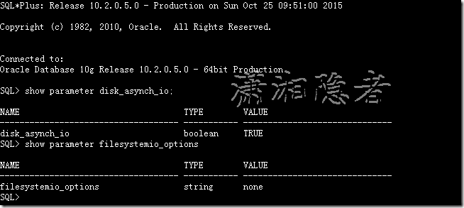

# other-异步IO概念

## 异步IO概念

Linux 异步 I/O （AIO)是 Linux 内核中提供的一个增强的功能。它是Linux 2.6 版本内核的一个标准特性，当然我们在2.4 版本内核的补丁中也可以找到它。AIO 背后的基本思想是允许进程发起很多 I/O 操作，而不用阻塞或等待任何操作完成。稍后或在接收到 I/O 操作完成的通知时，进程就可以检索 I/O 操作的结果。

Linux IO模型（I/O models）分同步IO模型（synchronous models）和异步IO模型（asynchronous models）。 在同步IO中，线程启动一个IO操作然后就立即进入等待状态，直到IO操作完成后才醒来继续执行。而异步IO方式中，线程发送一个IO请求到内核，然后继续处理其他的事情，内核完成IO请求后，将会通知线程IO操作完成了

如果IO请求需要大量时间执行的话，异步文件IO方式可以显著提高效率，因为在线程等待的这段时间内，CPU将会调度其他线程进行执行，如果没有其他线程需要执行的话，这段时间将会浪费掉（可能会调度操作系统的零页线程）。如果IO请求操作很快，用异步IO方式反而还低效，还不如用同步IO方式。

其它关于异步IO与同步IO的细节，可以参考[Boost application performance using asynchronous I/O](http://www.ibm.com/developerworks/linux/library/l-async/index.html)这篇文章，网上很多"Linux异步IO"的文章其实是翻译自这篇文章。如果了解更多关于异步IO的细节，可以细读这篇文章。

## 异步IO好处

异步I/O的优点：异步I/O是和同步I/O相比较来说的，如果是同步I/O，当一个I/O操作执行时，应用程序必须等待，直到此I/O执行完。相反，异步I/O操作在后台运行，I/O操作和应用程序可以同时运行，提高了系统性能；使用异步I/O会提高I/O流量，如果应用是对裸设备进行操作，这种优势更加明显， 因此像数据库，文件服务器等应用往往会利用异步I/O，使得多个I/O操作同时执行. 而且从官方文档来看，ORACLE也是推荐ORACLE数据库启用异步IO的这个功能的。

With synchronous  I/O, when an I/O request is submitted to the operating system, the  writing process blocks until the write is confirmed as complete. It can  then continue processing. With asynchronous I/O, processing continues  while the I/O request is submitted and processed. Use asynchronous I/O  when possible to avoid bottlenecks.

Some platforms support asynchronous I/O by default, others need special  configuration, and some only support asynchronous I/O for certain  underlying file system types.

**Q: 2. What are the benefits of Asynchronous I/O?**

A: The implementation of Asynchronous I/O on Red Hat Advanced Server  allows Oracle processes to issue multiple I/O requests to disk with a  single system call, rather than a large number of single I/O requests.  This improves performance in two ways:

1. First, because a process can queue multiple requests for the kernel to handle, so the kernel can optimize disk activity by recording requests or  combining individual requests that are adjacent on disk into fewer and  larger requests.
2. Secondary, because the system does not put the process in sleep state while the  hardware processes the request. So, the process is able to perform other tasks until the I/O complete.

This involves making use of I/O capabilities such as:

* Asynchronous I/O: Asynchronous I/O does not reduce traffic but allows processes to  do other things while waiting for IO to complete.
* Direct I/O (bypassing the Operating System's File Caches) : Direct IO does not reduce traffic but may use a shorter code path / fewer CPU cycles to  perform the IO.

‍

## 启用异步IO

ORACLE数据库是从ORACLE 9i Release 2开始支持异步IO特性的。之前的版本是不支持异步IO特征的。另外在ORACLE 9i R2和 ORACLE 10g R1中默认是禁用异步特性的，直到ORACLE 10g R2才默认启用异步IO特性。

**Q: 4. Can I use Asynchronous I/O with Oracle 8i or Oracle 9i release 1?**

A: No. Asynchronous I/O feature is only available with Oracle RDBMS 9i release 2 (Oracle9iR2).

**Q: 5. Is Asynchronous I/O active with Oracle RDBMS by default?**

A: No. By default, Oracle9iR2 and Oracle10gR1 are shipped with  asynchronous I/O support disabled.In 10gR2 asyncIO is enabled by  default.

那么如何启用ORACLE数据库的异步IO特性呢？ 我们可以按照下面步骤操作：

**1：首先要确认ORACLE数据库所在的系统平台（操作系统）是否支持异步IO**

   目前流行的Linux/Unix平台基本上都支持异步IO，但是一些老旧的版本就不一定了。可以搜索一下相关文档了解清楚。

‍

**2: 检查是否安装libaio、libaio-devel相关包（似乎libaio-devel包不是必须的，测试环境没有libaio-devel似乎也OK，当然最好也一起安装）**

```bash
[root@DB-Server ~]# rpm -qa | grep aio 
libaio-0.3.106-5
libaio-0.3.106-5

[root@DB-Server Server]# rpm -ivh libaio-devel-0.3.106-5.i386.rpm
warning: libaio-devel-0.3.106-5.i386.rpm: Header V3 DSA signature: NOKEY, key ID 1e5e0159
Preparing...                ########################################### [100%]
   1:libaio-devel           ########################################### [100%]

[root@DB-Server Server]# rpm -ivh  libaio-devel-0.3.106-5.x86_64.rpm
warning: libaio-devel-0.3.106-5.x86_64.rpm: Header V3 DSA signature: NOKEY, key ID 1e5e0159
Preparing...                ########################################### [100%]
   1:libaio-devel           ########################################### [100%]
```

‍

**3：检查系统是否支持异步I/O**

根据文档\[Note 370579.1\] ，可以通过查看slabinfo统计信息查看操作系统中AIO是否运行，slab是Linux的内存分配器，AIO相关的内存结构已经分配，kiocb值的第二列和第三列非0即是已使用

```
[root@DB-Server ~]# cat /proc/slabinfo | grep kio 
kioctx                62    110    384   10    1 : tunables   54   27    8 : slabdata     11     11      0
kiocb                  0      0    256   15    1 : tunables  120   60    8 : slabdata      0      0      0
```

kiocb值的第二列和第三列非0表示系统已经启用异步IO。如上所示，表示异步I/O没有在使用。

The kioctx and kiocb are  Async I/O data structures that are defined in aio.h. If it shows a non  zero value that means async io is enabled. source code loaded  /usr/src/linux-<version>/include/linux/aio.h

‍

**4：修改、优化系统内核参数**

Linux从2.6 kernel开始，已经取消了对IO size的限制,Oracle建议将aio-max-nr的值设置为1048576或更高。

```bash
[root@DB-Server ~]# cat /proc/sys/fs/aio-max-nr
65536 
```

命令`echo 1048576> /proc/sys/fs/aio-max-nr`​修改参数，只对当前环境有效，如果系统重启过后，则会使用默认值，所以最好修改参数文件`/etc/sysctl.conf`​。编辑`/etc/sysctl.conf`​添加或修改参数`fs.aio-max-nr = 1048576`​，保存后。运行`sysctl -p`​使之生效。


```bash
[root@DB-Serveruat ~]# cat /proc/sys/fs/aio-max-nr

1048576 
```

注意aio-max-size参数从RHEL4开始已经不存在了，详情见文档Kernel Parameter "aio-max-size" does not exist in RHEL4 / EL4 / RHEL5 /EL5 (文档 ID 549075.1)。

‍

**5：检查ORACLE软件是否支持开启AIO**

如下所示有输出值，表示ORACLE软件支持开启AIO，其实从ORACLE 9i R2开始，ORACLE就已经支持开启异步IO（AIO）了。不过10GR1以前版本需要手动开启AIO，相对而言要麻烦一些。

```bash
[oracle@DB-Server ~]$ /usr/bin/ldd $ORACLE_HOME/bin/oracle | grep libaio
        libaio.so.1 => /usr/lib64/libaio.so.1 (0x00007f5a247f4000)

[oracle@DB-Server ~]$  /usr/bin/nm $ORACLE_HOME/bin/oracle | grep io_getevent 
                 w io_getevents@@LIBAIO_0.4
```

**6：数据库级别启用异步I/O**

将参数disk_asynch_io设置为true，其实ORACLE 10g R2中参数disk_asynch_io默认是为true的。



```bash
SQL> alter system set filesystemio_options = setall scope=spfile; 
System altered.

SQL> alter system set disk_asynch_io = true scope=spfile; 
System altered.
```

关于参数filesystemio_options有四个值： asynch、directio, setall,none. 一般建议设置为setall比较合适。

You can use the FILESYSTEMIO_OPTIONS initialization parameter to enable or disable asynchronous I/O or  direct I/O on file system files. This parameter is platform-specific and has a default value that is best for a particular platform. It can be  dynamically changed to update the default setting.

FILESYTEMIO_OPTIONS can be set to one of the following values:

   · ASYNCH: enable asynchronous I/O on file system files, which has no timing requirement for transmission.

            在文件系统文件上启用异步I/O，在数据传送上没有计时要求。

· DIRECTIO: enable direct I/O on file system files, which bypasses the buffer cache.

            在文件系统文件上启用直接I/O，绕过buffer cache。

· SETALL: enable both asynchronous and direct I/O on file system files.

            在文件系统文件上启用异步和直接I/O。

· NONE: disable both asynchronous and direct I/O on file system files.

           在文件系统文件上禁用异步和直接I/O。

设置完成后重启数据库，验证异步IO特性是否启用。如下所示， kiocb的第二、三列都不为0，表示ORACLE的异步IO特性已经启用。

```bash
[oracle@DB-Server ~]$ cat /proc/slabinfo | grep kio 
kioctx                60     80    384   10    1 : tunables   54   27    8 : slabdata      8      8      0
kiocb                  6     30    256   15    1 : tunables  120   60    8 : slabdata      2      2      0
[oracle@DB-Server ~]$ 
```
