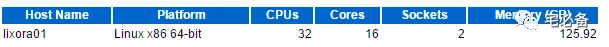
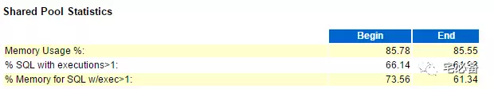
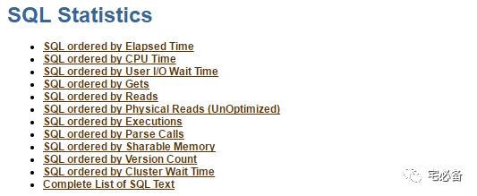
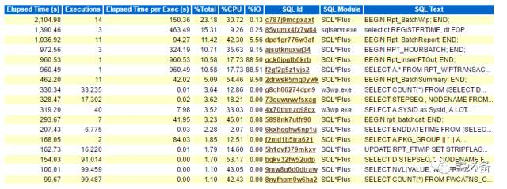

# other-解析awr报告

‍

‍

‍

## 1. 数据库细节

这部分可以看到

- 数据库的版本
- 数据库 DBID
- 数据库实例名称及实例号
- 数据库最近一次启动时间
- 数据库版本
- 数据库是否为rac

## 2. 主机配置信息

这部分可以看到

- 数据库主机名
- 数据库主机平台
- 服务器CPU及核数
- 服务器CPU个数
- 服务器内存大小

## 3. SnapShot信息

这部分可以看到

- awr报告的起止时间以及当时的session数量等
- awr报告持续时间
- DB 时间

DB Time\= session time spent in database.

DB Time\= CPU Time + Non IDLE wait time.

可以看到DB Time比 Elapsed大，如果大很多并且有性能问题，需再进一步分析，后面章节再说

## 4. Shared Pool Statistics

该视图显示的是Shared pool的状态

% SQL with executions\>1指的是执行次数大于1的SQL比例，越大越好，如过小则可能是为使用绑定变量导致

## 5. Load Profile

这里我们可以了解系统负载的情况

首先是 **DB CPU(s) per second**，它说明的是每秒钟同时工作的CPU数量

从主机配置可以看到共24个虚拟cpu，而DB CPU(s) per second只有0.4 则说明cpu没有瓶颈

其次我们关注hard parses和 parses的比例，如硬解析率非常高则需要查看cursor\_sharing参数和应用程序的绑定变量问题，一般都是由于绑定变量引起的

- Redo Size ：用来显示平均每秒的日志大小和平均每个事务的日志大小，有时候可以结合 Transactions 每秒事务数，**分析当前事务的繁忙程度**。
- Logical Read：逻辑读耗CPU，主频和CPU核数都很重要，逻辑读高则DB CPU往往高，也往往可以看到 `latch: cache buffer chains`​ 等待。
- Physical Read：物理读消耗IO读，体现在IOPS和吞吐量等不同纬度上。但减少物理读可能意味着消耗更多CPU。
- Parses：解析次数，包括软解析 + 硬解析，软解析优化得不好几乎等于每秒SQL执行次数， 即执行解析比1:1。理想状态是解析一次到处运行。
- Hard Parses：硬解析次数，最好少于没秒20次。

> 注意 Load Profile 中的指标提供了 Per second 和 Per transaction 两个维度。Per second  主要是把快照抓到的值除以两个快照之间的秒数。这是我们用来判断性能的主要维度。Per transaction  是基于事务的维度，主要是把快照抓到的值除以两个快照之间的事务数。

‍

## 6. Instance Efficiency Percentages

上面的百分比越高越好，后面会针对每个做介绍

Instance Efficiency Percentages 是一些命中率指标。Buffer Hit、Library Hit  等表示SGA ( System global area )的命中率。Soft Parse  指标表示共享池的软解析率，如果小于90%，就说明存在未绑定变量的情况。这些指标应当尽可能接近100%，如果过低一定是发生了性能问题。

- **Buffer Nowait**  ******  **表示在内存获得数据的未等待比例。在缓冲区中获取Buffer的未等待比率。** Buffer Nowait的这个值一般需要大于99%\*\*。否则可能存在争用，可以在后面的等待事件中进一步确认。
- **Buffer Hit** 表示进程从内存中找到数据块的比率，监视这个值是否发生重大变化比这个值本身更重要。对于一般的OLTP系统，如果此值低于80%，应该给数据库分配更多的内存。数据块在数据缓冲区中的命中率，通常应在95%以上。
- **Redo NoWait** 表示在Log 缓冲区获得Buffer的未等待比例。如果太低可考虑增加Log  Buffer。当redo buffer达到1M时就需要写到redo log文件，所以一般当redo  buffer设置超过1M，不太可能存在等待buffer空间分配的情况。当前，一般设置为2M的redo  buffer，对于内存总量来说，应该不是一个太大的值。
- **Library Hit** 表示Oracle从Library  Cache中检索到一个解析过的SQL或PL/SQL语句的比率，当应用程序调用SQL或存储过程时，Oracle检查Library  Cache确定是否存在解析过的版本，如果存在Oracle立即执行语句；如果不存在Oracle解析此语句，并在Library  Cache中为它分配共享SQL区。低的Library Hit Ratio会导致过多的解析，增加CPU消耗，降低性能。如果Library Hit  Ratio低于90%，可能需要调大Shared pool区。
- **Latch Hit：** Latch是一种保护内存结构的锁，可以认为是Server进程获取访问内存数据结构的许可。要确保Latch Hit\>99%，否则意味着Shared Pool latch争用，可能由于未共享的SQL，或者Library  Cache太小，可使用绑定变更或调大Shared  Pool解决。要确保\>99%，否则存在严重的性能问题。当该值出现问题的时候，我们可以借助后面的等待时间和latch分析来查找解决问题。
- **Parse CPU to Parse Elapsd：** 解析实际运行时间/(解析实际运行时间+解析中等待资源时间)，越高越好。如果该比率为100%，意味着CPU等待时间为0，没有任何等待。
- **Non-Parse CPU ：** SQL实际运行时间/(SQL实际运行时间+SQL解析时间)，太低表示解析消耗时间过多。如果这个值比较小，表示解析消耗的CPU时间过多。
- **Execute to Parse：** 是语句执行与分析的比例，如果要SQL重用率高，则这个比例会很高。该值越高表示一次解析后被重复执行的次数越多。
- **In-memory Sort：** 在内存中排序的比率，如果过低说明有大量的排序在临时表空间中进行。考虑调大PGA(10g)。如果低于95%，可以通过适当调大初始化参数PGA\_AGGREGATE\_TARGET或者SORT\_AREA\_SIZE来解决，注意这两个参数设置作用的范围时不同的，SORT\_AREA\_SIZE是针对每个session设置的，PGA\_AGGREGATE\_TARGET则时针对所有的sesion的。
- **Soft Parse：** 软解析的百分比(Softs/Softs+Hards)，近似当作sql在共享区的命中率，太低则需要调整应用使用绑定变量。sql在共享区的命中率，小于\<95%,需要考虑绑定，如果低于80%，那么就可以认为sql基本没有被重用。

## 7. Top 10 Foreground Events by Total Wait Time

这里是排名前十的前台等待事件

1. 首先看wait class栏位，如果是 User I/O , System I/O, Others这种的可以不用太担心，如发现Concurrency这类等待需要特别关心
2. 其次看等待时间，wait avg\=total wait time(总等待时间)/waits(等待次数),最主要看平均等待时间是否正常

后面章节会详细说明每个等待时间

## 8. Time Model Statistics

该视图说明的是各过程所占的资源比例

我们注意到所有 % of DB Time总和大于100%，因为这是一个累计的比例，下面DB CPU相关的过程包含在DB CPU中

我们需要注意的是一些异常的高占用情况，如hard parse elapsed time (硬解析时间)占用时间过长等

## 9. Operating System Statistics

该视图是操作系统层面的性能指标

这里需要注意%iowait，他代表CPU在等待io操作完成，这个可能是io过慢或者io操作过多导致。

## 10. SQL Statistics

SQL Statistics 从 `11`​ 个维度对SQL进行排序并给出了Top SQL的详细内容，可以点击查看具体的SQL内容，进一步分析调优方案。* SQL ordered by Elapsed Time。记录了执行总和时间的 TOP SQL(请注意是监控范围内该SQL的执行时间总和，而不是单次SQL执行时间 Elapsed Time \= CPU Time + Wait Time)。

- SQL ordered by CPU Time。记录了执行占CPU时间总和时间最长的TOP SQL(请注意是监控范围内该SQL的执行占CPU时间总和，而不是单次SQL执行时间)。
- SQL ordered by Gets。记录了执行占总 buffer gets (逻辑IO)的TOP SQL(请注意是监控范围内该SQL的执行占Gets总和，而不是单次SQL执行所占的Gets)。
- SQL ordered by Reads。记录了执行占总磁盘物理读(物理IO)的TOP SQL。
- SQL ordered by Executions。记录了按照SQL的执行次数排序的TOP SQL。该排序可以看出监控范围内的SQL执行次数。
- SQL ordered by Parse Calls。记录了SQL的软解析次数的TOP SQL。
- SQL ordered by Sharable Memory。记录了SQL占用library cache的大小的TOP SQL。Sharable Mem (b)：占用library cache的大小，单位是byte。
- SQL ordered by Version Count。记录了SQL的打开子游标的TOP SQL。
- SQL ordered by Cluster Wait Time。记录了集群的等待时间的TOP SQL。

‍

**SQL ordered by Elapsed Time**

上图为根据持续时间排序的SQL语句

所有栏位可根据字面上意思得出意义

- 如executions过多可能会引起CPU占用率高
- 如executions低，而elapsed time很高，则需要优化该SQL，降低执行时间

需要注意的是execution如果为0不代表未执行，代表在awr报告的持续范围内该语句未执行完成

这里只举持续时间这个例子，其他后面章节详细说明

‍
