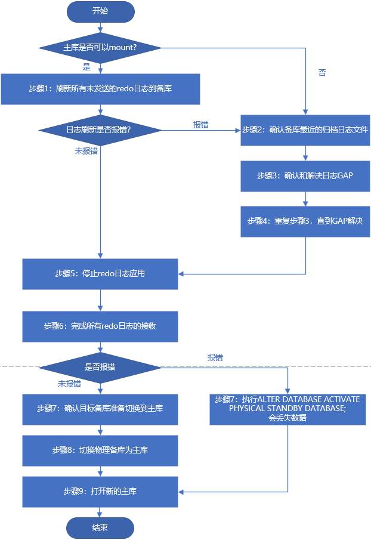

# 2. Oracle-19c 单机DG搭建

## 一、环境准备

### 1.1 环境规划

　　实验基于单机DB+单实例DG。

　　注：备库中的实例名SID是参数设置的，SID可以和主库相同。

||主库(主机1)|备库(主机2)|
| ----------------| -----------------------------------------| -----------------------------------------|
|DB 类型|单机|单机|
|OS|Centos 7.9|Centos 7.9|
|Hostname|test_01|test_02|
|IP|10.10.0.11|10.10.0.12|
|DB_Version|19.3.0|19.3.0.|
|ORACLE_BASE|/u01/app/oracle|/u01/app/oracle|
|ORACLE_HOME|/u01/app/oracle/product/19.3.0/dbhome_1|/u01/app/oracle/product/19.3.0/dbhome_1|
|DB_NAME|orcl|orcl|
|ORACLE_SID|orcl|orcldg|
|DB_Unique_Name|orcl|orcldg|
|Instance_Name|orcl|orcldg|
|service_names|orcl|orcldg|
|TNS_Name|ORCL|ORCLDG|
|闪回区|开启|开启|
|归档|开启|开启|

### 1.2 数据库安装(略)

　　Oracle19c 静默安装

* 在主库上安装数据库软件，并建监听和实例。
* 在备库上安装数据库软件，但不创建实例，安装时选择只安装软件即可。

## 二、主库配置

* 如果实例处于多租户架构中，设置操作和Non-CDB方法相同，都在CDB下完成；
* 实验中有两个PDB1和PDB2，在创建备库后，默认两个PDB都会同步到备库，也可以通过参数指定只同步某个PDB；
* 也可以设置完同步的备库后，主库中再添加的PDB3也会同步到备库中。

### 2.1 主库启动force logging和日志归档

　　Oracle之重做日志（Redo Log）管理

　　Oracle之重做日志（Redo Log）归档

```sql
sqlplus / as sysdba

-- 打开强制写入日志
> alter database force logging;
> select force_logging from v$database;

-- 设置归档
-- 查看数据库是否运行在归档模式
> archive log list;
> alter system set log_archive_config='DG_CONFIG=(orcl,orcldg)' scope=both sid='*';
> alter system set log_archive_dest_1='LOCATION=/data/arch VALID_FOR=(ALL_LOGFILES,ALL_ROLES) DB_UNIQUE_NAME=orcl' scope=spfile;
-- SERVICE=orcldg tns中设置的网络名
> alter system set log_archive_dest_2='SERVICE=orcldg LGWR SYNC AFFIRM VALID_FOR=(ONLINE_LOGFILES,PRIMARY_ROLE) DB_UNIQUE_NAME=orcldg' scope=both sid='*';
> shutdown immediate;
> startup mount;
> alter database archivelog;
-- 开启数据库
>alter database open;
```

### 2.2 主库添加 STANDBY 日志文件

```sql
# 查看当前redo日志
select group#,type,member from v$logfile;
# 这里添加4组redo日志
alter database add standby logfile group 4 ('/data/oradata/ORCL/redo04.log') size 200M;
alter database add standby logfile group 5 ('/data/oradata/ORCL/redo05.log') size 200M;
alter database add standby logfile group 6 ('/data/oradata/ORCL/redo06.log') size 200M;
alter database add standby logfile group 7 ('/data/oradata/ORCL/redo07.log') size 200M;
```

### 2.3 分别在主备库配置监听文件并启动

```txt
SID_LIST_LISTENER =
  (SID_LIST =
    (SID_DESC =
      (GLOBAL_DBNAME = orcl)
      (ORACLE_HOME = /u01/app/oracle/product/11.9.0/db_1)
      (SID_NAME = orcl)
    )
  )
LISTENER =
  (DESCRIPTION_LIST =
    (DESCRIPTION =
      (ADDRESS = (PROTOCOL = IPC)(KEY = EXTPROC1521))
      (ADDRESS = (PROTOCOL = TCP)(HOST = 10.0.0.23)(PORT = 1521))
    )
  )
ADR_BASE_LISTENER = /u01/app/oracle
```

　　重启监听

```bash
[oracle@primary admin]$ lsnrctl reload
LSNRCTL for Linux: Version 11.2.0.4.0 - Production on 11-JAN-2019 23:53:24
Copyright (c) 1991, 2013, Oracle.  All rights reserved.
Connecting to (DESCRIPTION=(ADDRESS=(PROTOCOL=IPC)(KEY=EXTPROC1521)))
The command completed successfully
```

### 2.4分别在主备库上配置tnsname.ora

```txt
primary =
  (DESCRIPTION =
    (ADDRESS = (PROTOCOL = TCP)(HOST = 10.0.0.23)(PORT = 1521))
    (CONNECT_DATA =
      (SERVER = DEDICATED)
      (SERVICE_NAME = orcl)
    )
 )
standby =
  (DESCRIPTION =
    (ADDRESS = (PROTOCOL = TCP)(HOST = 10.0.0.24)(PORT = 1521))
    (CONNECT_DATA =
      (SERVER = DEDICATED)
      (SERVICE_NAME = orcl)
      (UR = A)
    )
  )
```

### 2.5 验证监听和TNS配置

　　在主库上验证：

```bash
tnsping orcl
tnsping orcldg
sqlplus sys/Ninestar2022@orcl as sysdba
sqlplus sys/Ninestar2022@orcldg as sysdba

```

　　在备库上验证：

```bash
tnsping orcl
tnsping orcldg
sqlplus sys/Ninestar2022@orcl as sysdba
sqlplus sys/Ninestar2022@orcldg as sysdba
```

### 2.6 在主库上创建pfile文件并修改pfile内容

```bash
SQL> create pfile from spfile;
# pfile文件添加内容
vim initorcl.ora 
--------------------------------------------------------------
*.db_unique_name='primary'
*.log_archive_config='dg_config=(primary,standby)'
*.log_archive_dest_1='location=/data/arch valid_for=(all_logfiles,all_roles) db_unique_name=primary'
*.log_archive_dest_2='service=standby lgwr affirm sync valid_for=(online_logfiles,primary_role) db_unique_name=standby'
*.log_archive_dest_state_1=enable
*.log_archive_dest_state_2=enable
*.standby_file_management='auto'
*.fal_server='standby'
*.log_file_name_convert='data/oradata/ORCL/','/data/oradata/ORCL/'
*.db_file_name_convert='data/oradata/ORCL/','/data/oradata/ORCL/'
--------------------------------------------------------------
# 使用新的参数重启数据库
SQL> create spfile from pfile;
File created.
SQL> startup
ORACLE instance started.
Total System Global Area  972898304 bytes
Fixed Size                  2259160 bytes
Variable Size             616564520 bytes
Database Buffers          348127232 bytes
Redo Buffers                5947392 bytes
Database mounted.
Database opened.
```

> ==**参数解析**==

```txt
log_archive_config：
	用于控制发送归档日志到远程位置、接收远程归档日志， 并指定Data Guard配置的惟一数据库名
	当主库与备库的db_unique_name相同时,log_archive_config就不需要配置了，直接将其置空。

LOG_ARCHIVE_DEST_1：
	设置一个从归档路径。所有的路径必须是本地的。VALID_FOR属性用来控制日志传输
	-  online_logfile: 表示归档联机重做日志
    -  standby_logfile:表示归档备用数据库的重做日志/接受来自主库的重做日志
    -  all_logfiles: online_logfile && standby_logfile
    -  primary_role: 仅当数据库角色为主库时候生效
    -  standby_role: 仅当数据库角色为备库时候生效
    -  all_role: 任意角色均生效

LOG_ARCHIVE_DEST_2：
	设置远程归档到standby端，同时设置Rode归档进程LGWR、网络传输模式SYNC、控制日志传输服务是异步还是同步AFFIRM

FAL_CLIENT & FAL_SERVER：
	解决归档间隙（GAP），当备库不能接受到一个或多个主库的归档日志文件时候，就发生了GAP
	fal_client会自动向fal_server传输间隙的存档日志，自动解决归档GAP


STANDBY_FILE_MANAGEMENT：
	-  AUTO：在主数据库上创建的任何新数据文件都会自动在物理备用数据库上创建。
	-  MANUAL：在将新数据文件添加到主数据库后，必须手动将其从主数据库复制到物理备用数据库。

db_file_name_convert & log_file_name_convert：
	当用主库的备份来恢复从库时，来完成转换dataguard的主库和从库数据文件和联机日志保存路径不同的问题

```

### 2.7 将主库的口令文件和参数文件复制到备库中

```bash
scp orapworcl oracle@standby:$ORACLE_HOME/dbs
scp initorcl.ora oracle@standby:$ORACLE_HOME/dbs
```

## 三、从库配置

### 3.1 修改备库参数文件

```sql
*.db_unique_name='standby'
*.log_archive_config='dg_config=(primary,standby)'
*.log_archive_dest_1='location=/data/archive/ valid_for=(all_logfiles,all_roles) db_unique_name=standby'
*.log_archive_dest_2='service=standby lgwr affirm sync valid_for=(online_logfiles,primary_role)
db_unique_name=primary'
*.log_archive_dest_state_1=enable
*.log_archive_dest_state_2=enable
*.standby_file_management='auto'
*.fal_server='primary'
*.log_file_name_convert='/data/oradata/ORCL/','/data/oradata/ORCL/'
*.db_file_name_convert='/data/oradata/ORCL/','/data/oradata/ORCL/'
```

### 3.2 创建所需目录

　　​`mkdir -p /data/u01/app/oracle/admin/orcl/adump /data/arch /data/oradata/ORCL`​  
​`chown -R oracle:oinstall /data/u01/app/oracle/admin/orcl/adump /data/arch/ /data/oradata/ORCL`​

　　‍

### 3.3 备库创建spfile

```bash
SQL> create spfile from pfile;
File created.
```

　　重启监听  
​`lsnrctl restart`​

　　连接standby常见错误：

```
ERROR:
ORA-12528: TNS:listener: all appropriate instances are blocking new connections
```

　　举个粟子，使用duplicate 复制数据库时，目标实例只启动到nomount状态。此时，监听 中对应实例的状态就是“BLOCKED”. 解决方法是在TSN配置添加特殊标记(UR = A),示例 如下：

```bash
primary =
  (DESCRIPTION =
    (ADDRESS = (PROTOCOL = TCP)(HOST = 10.0.0.23)(PORT = 1521))
    (CONNECT_DATA =
      (SERVER = DEDICATED)
      (SERVICE_NAME = orcl)
    )
 )
standby =
  (DESCRIPTION =
    (ADDRESS = (PROTOCOL = TCP)(HOST = 10.0.0.24)(PORT = 1521))
    (CONNECT_DATA =
      (SERVER = DEDICATED)
      (SERVICE_NAME = orcl)
      (UR = A)
    )
  )

```

　　‍

## 四、方式一：物理备库之RMAN Duplicate

　　Duplicate 方式创建物理备库；通过这种方式直接在线从主库搭建物理备库。

### 4.1 备库启动到nomount状态

```sql
# 使用pfile启动到nomount
[oracle@klausdg ~]$ sqlplus /  as sysdba
SQL> startup nomount pfile='/data/u01/app/oracle/product/19.0.0.0/db_1/dbs/initorcldg.ora';
ORACLE instance started.
Total System Global Area 2466250752 bytes
Fixed Size                  2927384 bytes
Variable Size             671089896 bytes
Database Buffers         1778384896 bytes
Redo Buffers               13848576 bytes
# 创建Spfile
SQL> create spfile from pfile;
SQL> shutdown immediate;
# 启动到nomount
SQL> startup nomount
```

　　‍

### 4.2 登陆RMAN连接主备库

```sql
-- 主库target/orcl 备库auxiliary/orcldg
-- 主备库DB_NAME必须一致，主库是open状态，备库是nomount状态
[oracle@klausdg ~]$ rman target sys/Oracle#2020@orcl auxiliary sys/Oracle#2020@orcldg
Recovery Manager: Release 12.1.0.2.0 - Production on Mon Aug 16 16:54:46 2021
Copyright (c) 1982, 2014, Oracle and/or its affiliates.  All rights reserved.
connected to target database: ORCL (DBID=1576583420)
connected to auxiliary database: ORCL (not mounted)
RMAN>
```

　　‍

### 4.3 在主库上开始进行duplicate achive

```bash
[oracle@primary ~]$ rman target / auxiliary sys/oracle@standby
Recovery Manager: Release 11.2.0.4.0 - Production on Sun Jan 13 00:01:44 2019
Copyright (c) 1982, 2011, Oracle and/or its affiliates.  All rights reserved.
connected to target database: ORCL (DBID=1524649093)
connected to auxiliary database: ORCL (not mounted)

RMAN> duplicate target database for standby from active database nofilenamecheck dorecover;
# 如果⽬录结构⼀致需要nofilenamecheck参数 
```

## 五、方式二：物理备库之RMAN备份还原

　　使用 RMAN 备份恢复方法，将备份的文件和控制文件传到备库恢复。

　　步骤参考：基于RMAN实现异机恢复

　　‍

## 六、方式三：物理备库之CDB下的DBCA

### 6.1 DBCA备库说明

　　前两个物理备库方式都是基于Non-CDB创建DG的，也可以在CDB下通过Duplicate或RMAN备份还原的方法创建DG，配置主备库的条件相同，处于CDB状态下设置主库的配置即可；
到 12cR2 (12.2.0.1)后，新增 DBCA 方式直接建立物理备库的方法。但是对版本和实例环境有一定限制条件：

　　**12cR2中:**

```
# 1、12cR2 主库必须是单机环境，非 RAC 数据库；
# 若主库是 RAC 数据库，错误如下：
[FATAL] [DBT-16056] Specified primary database is not a Single Instance (SI) database.
CAUSE: Duplicate database operation is supported only for SI databases.
```

```
# 2、12cR2 主库必须是非 CDB 环境；
# 若主库是 CDB 环境，错误如下：
[FATAL] [DBT-16057] Specified primary database is a container database (CDB).
CAUSE: Duplicate database operation is supported only for non container databases.
```

　　**18c 及以后:** 
18c(12.2.0.2)开始，这些限制条件已经取消，即主库是 CDB 或 RAC环境都可以通过 dbca 来创建物理备库。
本节DBCA备库环境：19c的CDB环境，主/备库的环境和前面的配置方法相同。

### 6.2 配置Hosts

　　在没有DNS的配置下，需要配置Hosts，否则DBCA过程通讯报错：

```
ORA-17627：TNS：could not resolve connect identifier specified   
```

```
# cat /etc/hosts  
192.168.2.2klaus  
192.168.2.3klausdg
```

### 6.3 DBCA过程

#### 6\.3.1 主库开启

```
# 如果是CDB环境，先开启数据库也要开启PDB
SQL> startup
SQL> alter pluggable database all open;
Pluggable database altered.
```

#### 6.3.2 DBCA命令

　　不需要备库数据库处于`nomount`​状态，监听开启后备库上直接DBCA即可。
如果是CDB环境，完成后CDB会直接开启，再开启PDB即可。

```
# 19c 官网展示的模板
dbca -createDuplicateDB 
    -gdbName global_database_name 
    -primaryDBConnectionString easy_connect_string_to_primary
    -sid database_system_identifier
    [-createAsStandby 
        [-dbUniqueName db_unique_name_for_standby]]
    [-customScripts scripts_list]
# 19c 官网DBCA案例  
#Database DB_UNIQUE_NAME Oracle Net Service Name
#Primarychicagochicago
#Physical standbybostonboston
# dbca –silent -createDuplicateDB -primaryDBConnectionString  myprimary.domain:1523/chicago.domain -gdbName chicago.domain -sid boston -initParams instance_name=boston –createAsStandby

# 本实验如下设置
dbca -silent -createDuplicateDB \
-gdbName orcl \
-sid orcldg \
-sysPassword Oracle#2020 \
-primaryDBConnectionString 192.168.2.2:1521/ORCL \
-nodelist klausdg \
-databaseConfigType SINGLE \
-createAsStandby -dbUniqueName orcldg
```

```
# 执行过程
[oracle@klausdg ~]$ dbca -silent -createDuplicateDB \
> -gdbName orcl \
> -sid orcldg \
> -sysPassword Oracle#2020 \
> -primaryDBConnectionString 192.168.2.2:1521/ORCL \
> -nodelist klausdg \
> -databaseConfigType SINGLE \
> -createAsStandby -dbUniqueName orcldg
Prepare for db operation
22% complete
Listener config step
44% complete
Auxiliary instance creation
67% complete
RMAN duplicate
89% complete
Post duplicate database operations
100% complete
Look at the log file "/u01/app/oracle/cfgtoollogs/dbca/orcldg/orcldg.log" for further details.
```

　　‍

## 七、开启并验证DG同步

### 7.1 开启实时同步

```sql
-- 打开备库
alter database open;
-- 如果是CDB环境，需要开启pdb
alter pluggable database all open;

-- 从12C开始，RECOVER语句，不需要再指定using current logfile，Oracle会自动判断日志应用是否是实时的。
--方式一：开启实时同步 
alter database recover managed standby database using current logfile disconnect from session; 
--方式二：开启同步（日志切换时才同步） 
alter database recover managed standby database disconnect from session;
-- 取消同步
alter database recover managed standby database cancel;
```

　　‍

### 7.2 备库开启闪回

```sql
-- 查看闪回
SQL> select flashback_on from v$database;
FLASHBACK_ON
------------
NO
-- 取消实时同步
SQL> alter database recover managed standby database cancel;
-- 关闭数据库
SQL> shutdown immediate
SQL> startup mount
SQL> alter database flashback on;
-- 开启数据库
SQL> alter database open;
-- 再次开启同步
SQL> alter database recover managed standby database using current logfile disconnect from session;
-- 查看
SQL> select open_mode from v$database;
OPEN_MODE 
--------------------
READ ONLY WITH APPLY
-- 查看主库 PRIMARY
SQL> select log_mode,open_mode ,database_role from v$database;
LOG_MODE     OPEN_MODE            DATABASE_ROLE
------------ -------------------- ----------------
ARCHIVELOG   READ WRITE           PRIMARY
-- 查看备库 PHYSICAL STANDBY
SQL> select log_mode,open_mode ,database_role from v$database;
LOG_MODE     OPEN_MODE            DATABASE_ROLE
------------ -------------------- ----------------
ARCHIVELOG   READ ONLY            PHYSICAL STANDBY
```

　　‍

### 7.3 归档同步验证

```sql
-- 主库切换归档, 查询主库备库最大归档序号，一致即归档同步成功
SQL> alter system archive log current;
SQL> select max(sequence#) from v$archived_log;
MAX(SEQUENCE#)
--------------
            72
-- 查看主备归档日志是否能正常传输（APPLIED=yes）
SQL> select SEQUENCE#, FIRST_TIME, NEXT_TIME, APPLIED, ARCHIVED from V$ARCHIVED_LOG;
```

### 7.4 查看主备库状态

```sql
-- 状态查看（主备都可查看）
select open_mode,           --数据库打开模式，如果实时同步，则为：read only with apply，异步同步则为：read only
       database_role,       --数据库角色，是主库还是备库
       protection_mode,     --保护模式
       protection_level     --保护级别
from   v$database;
--------------------------------------------------------------------------
OPEN_MODE            DATABASE_ROLE    PROTECTION_MODE      PROTECTION_LEVEL
-------------------- ---------------- -------------------- --------------------
-- 主库：READ WRITE           PRIMARY          MAXIMUM PERFORMANCE  MAXIMUM PERFORMANCE
-- 备库：READ ONLY WITH APPLY PHYSICAL STANDBY MAXIMUM PERFORMANCE  MAXIMUM PERFORMANCE
```

　　主库查看备库归档路径报错

```sql
-- 主库 查看archive_log_dest_2列是否有error
SQL> select status,error from v$archive_dest where dest_id=2;
STATUS    ERROR
--------- --------------------
VALID
```

　　主库Dataguard的状态信息

```sql
-- 查看Dataguard的状态信息
col message format a150
select message_num,message from v$dataguard_status;
-- 查看GAP信息
SELECT STATUS,GAP_STATUS FROM v$ARCHIVE_DEST_STATUS WHERE DEST_ID=2;
```

　　建表测试

```sql
-- 主库
create table test(id number);
insert into test values(1);
commit;
select * from test;
-- 备库
select * from test;
```

　　‍

## 八、DG切换和恢复

　　配置DG的目的就是为了在主库出现故障时，备库能够提供服务，保证业务的正常运行。
DG的故障切换分为`switchover`​和`failover`​两种。

### 8.1 Switchover

#### 8.1.1 主库上操作

```sql
-- 1、主库查询状态
-- 注意：下面查询结果为TO STANDBY 或 SESSIONS ACTIVE表明可以进行切换
SQL> select switchover_status,database_role from v$database;
SWITCHOVER_STATUS    DATABASE_ROLE
-------------------- ----------------
TO STANDBY           PRIMARY
-- 2、主库开始切换
SQL> alter database commit to switchover to physical standby;
Database altered.
-- 主库有会话连接的时候使用如下命令
-- alter database commit to switchover to physical standby with session shutdown;
-- 3、主库变备库，开启到mount状态
SQL> startup mount
ORACLE instance started.
Total System Global Area 2466250752 bytes
Fixed Size                  2927384 bytes
Variable Size             671089896 bytes
Database Buffers         1778384896 bytes
Redo Buffers               13848576 bytes
Database mounted.
SQL> select database_role from v$database;
DATABASE_ROLE
----------------
PHYSICAL STANDBY
```

#### 8.1.2 备库上操作

```sql
-- 1、备库查询状态
-- 注意：下面查询结果为TO PRIMARY 或 SESSIONS ACTIVE表明可以进行切换
SQL> select switchover_status,database_role from v$database;
SWITCHOVER_STATUS    DATABASE_ROLE
-------------------- ----------------
TO PRIMARY           PHYSICAL STANDBY

-- 2、备库开始切换
SQL> alter database commit to switchover to primary with session shutdown;
Database altered.

-- 3、开启数据库
SQL>  alter database open;
Database altered.

-- 4、查询状态，已经变成主库
SQL> select switchover_status,database_role,open_mode from v$database;
SWITCHOVER_STATUS    DATABASE_ROLE    OPEN_MODE
-------------------- ---------------- --------------------
TO STANDBY           PRIMARY          READ WRITE
```

　　‍

#### 8.1.3 新备库(原主库)上的操作

```sql
-- 1、开机数据库open
SQL> alter database open;
Database altered.
-- 2、开启同步
SQL> alter database recover managed standby database using current logfile disconnect from session;
Database altered.
-- 3、主备检查切换状态
SQL> select open_mode,database_role,db_unique_name from v$database;
```

　　‍

#### 8.1.4 验证

```sql
-- 新主库切换归档，主备查询
alter system archive log current;
SQL> select max(sequence#) from v$archived_log;
-- 新主库表插入数据测试
insert into test values(2); 
commit;
select * from test;
```

　　‍

### 8.2 Failover

#### 8.2.1 故障转移操作流程图

​​

　　Failover是当主库真正出现严重系统故障，如数据库宕机，软硬件故障导致主库不能支持服务，从而进行的切换动作。

　　注意：

　　为了能够在failover后能够恢复DG,需要在主库上开启flashback，否则DG就可能需要重新搭建。

　　先把主库关机，模拟Failover 。

##### Step1.刷新所有未发送的日志到备库

　　如果主库还可以启动到mount状态，则刷新所有未发送的归档日志和在线redo日志到备库。如果这一步成功了，则可以保证数据零丢失。 如果主库不能mount，则执行第2步。

```
# 主库
SQL> ALTER SYSTEM FLUSH REDO TO 'target_db_name';
# target_db_name为备库的db_unique_name。
# 如果上面的语句执行成功，则直接跳到步骤5；如果执行报错，则执行步骤2。
```

##### Step2.确认备库接收到最新归档日志文件

　　在备库上使用`V\$ARCHIVED_LOG`​视图，查询每个实例的最大日志序列号的日志，通过查询出的日志序列号与主库的最大日志序列号比较（主库的直接到服务器上去查看归档日志文件），可以直到缺失了哪些归档日志文件。

```
SQL> SELECT UNIQUE THREAD# AS THREAD, MAX(SEQUENCE#) OVER (PARTITION BY thread#) AS LAST from V$ARCHIVED_LOG;
```

　　如果可能，对于还未传输到备库的日志文件，直接从主数据库上拷贝过去，然后注册日志，注册日志放入如下：

```
SQL> ALTER DATABASE REGISTER PHYSICAL LOGFILE 'filespec1';
```

##### Step3.确认和解决日志GAP

　　在备库上查询`V$ARCHIVE_GAP`​视图，确认是否存在日志GAP，如：

```
SQL> SELECT THREAD#, LOW_SEQUENCE#, HIGH_SEQUENCE# FROM V$ARCHIVE_GAP;
THREAD#    LOW_SEQUENCE# HIGH_SEQUENCE#
---------- ------------- --------------
1            90             92
```

　　在这个例子中，GAP存在于线程1的90，91，92号归档日志上，如果可能，拷贝这些日志到备库服务器上，然后注册日志。

```
SQL> ALTER DATABASE REGISTER PHYSICAL LOGFILE 'filespec1';
```

##### Step4.重复步骤3直到把所有GAP解决

　　继续在备库上查询`V$ARCHIVE_GAP`​视图，直到没有数据返回，说明没有GAP。 如果在执行了步骤2到步骤4后，依然无法解决日志GAP（例如，主服务器宕机，我们无法访问主数据库，导致日志无法同步到备库），则执行failover切换后会存在数据丢失。

##### Step5.备库停止日志应用

```
SQL> ALTER DATABASE RECOVER MANAGED STANDBY DATABASE CANCEL;
```

##### Step6.完成所有已经接收日志的应用

```
SQL> ALTER DATABASE RECOVER MANAGED STANDBY DATABASE FINISH;
# SQL> alter database recover managed standby database finish force;
```

　　如果这个操作未报错，则执行步骤7。 如果发生报错，尝试解决错误，再次执行以上SQL语句，如果报错无法解决，可以在目标备库执行以下语句来进行故障转移（会丢失数据）

```
# 会丢失数据
# SQL> ALTER DATABASE ACTIVATE PHYSICAL STANDBY DATABASE;
```

　　这个语句完成后跳到第9步执行。

##### Step7.确认目标备库准备切换为主库

```
SQL> SELECT SWITCHOVER_STATUS FROM V$DATABASE;
SWITCHOVER_STATUS
-----------------
TO PRIMARY
```

　　如果`SWITCHOVER_STATUS`​的值为“`TO PRIMARY`​”或者“`SESSIONS ACTIVE`​”，则说明备库已经准备切换为主库。如果不是这2个值，确认Redo日志应用是否还是活跃的，继续查询，直到变为这2个值中的一个为止。

##### Step8.切换物理备库为主库

　　使用下面的SQL语句进行切换：

```
SQL> ALTER DATABASE COMMIT TO SWITCHOVER TO PRIMARY WITH SESSION SHUTDOWN;
```

##### STEP9.打开新的主库

```
SQL> ALTER DATABASE OPEN;
Database altered.
# 查看状态
SQL> select switchover_status,database_role,open_mode from v$database;
SWITCHOVER_STATUS    DATABASE_ROLE    OPEN_MODE
-------------------- ---------------- --------------------
FAILED DESTINATION   PRIMARY          READ WRITE
# 当新主库的SWITCHOVER_STATUS状态为FAILED DESTINATION时，是因为备库不在mount状态下,这里已经没有备库
```

#### 8.2.2 简易操作

　　当备库和主库(主库无法打开)最终同步的情况下，以下简易步骤直接操作：

```
#1、停止日志应用
SQL> alter database recover managed standby database cancel;
Database altered.
#2、完成所有已经接收日志的应用
SQL> alter database recover managed standby database finish force;
Database altered.
#3、切换物理备库为主库
SQL> select database_role from v$database;
DATABASE_ROLE
----------------
PHYSICAL STANDBY
SQL> alter database commit to switchover to primary;
#SQL> alter database commit to switchover to primary with session shutdown;
Database altered.
SQL> select database_role from v$database;
DATABASE_ROLE
----------------
PRIMARY
#4、开启数据库open
SQL> alter database open;
Database altered.
#5、查看状态
SQL> select switchover_status,database_role,open_mode from v$database;
SWITCHOVER_STATUS    DATABASE_ROLE    OPEN_MODE
-------------------- ---------------- --------------------
FAILED DESTINATION   PRIMARY          READ WRITE
# 当主库的SWITCHOVER_STATUS状态为FAILED DESTINATION时，是因为备库不在mount状态下,这里已经没有备库
```

### 8.3 Failover恢复

　　上面提到了`failover`​，这种情形是当主库真正出现异常之后，才会执行的操作，那么执行过`failover`​ 之后，如何在重新构建DG，这里利用`flashback database`​来重构，具体方法如下：

#### 8.3.1 在新主库上执行

```
# 查询变成新主库的scn
SQL> select to_char(standby_became_primary_scn) from v$database;
TO_CHAR(STANDBY_BECAME_PRIMARY_SCN)
----------------------------------------
12514234
```

#### 8.3.2 在老主库上执行

```
# 要将之前出问题的老主库变成备库
# 1、启动 mount 状态下
SQL> startup mount
ORACLE instance started.
Total System Global Area 2466250752 bytes
Fixed Size                  2927384 bytes
Variable Size             671089896 bytes
Database Buffers         1778384896 bytes
Redo Buffers               13848576 bytes
Database mounted.
# 2、闪回到新的主库查询的scn
SQL> flashback database to scn 12514234;
Flashback complete.
# 3、转为备库
SQL> alter database convert to physical standby;
Database altered.
# 4、关闭
SQL> shutdown immediate
ORA-01109: database not open
Database dismounted.
ORACLE instance shut down.
# 5、开启
SQL> startup
ORACLE instance started.
Total System Global Area 2466250752 bytes
Fixed Size                  2927384 bytes
Variable Size             671089896 bytes
Database Buffers         1778384896 bytes
Redo Buffers               13848576 bytes
Database mounted.
Database opened.
# 6、开启同步
SQL> alter database recover managed standby database using current logfile disconnect from session;
Database altered.
# 7、同步验证(略)
```

　　‍

## 九、方式四：逻辑备库Logical Standby

　　‍

### 9.1 说明

* Oracle Data Guard逻辑备库是利用主库的一个备份首先建立一个物理备库，然后再将其转换为逻辑备库。
* 这之后主库将日志传递到备库，备库利用`logminer`​从主库的日志中解析出主库所执行过的SQL，在备库上重新执行一遍，从而保证与主库的数据在逻辑上保持一致。
* 与物理备库相对应的是，物理备库使用的是`redo apply`​，逻辑备库使用的是`sql apply`​。
* 因此逻辑备库仅仅保证数据与主库是在逻辑上是一致的，从而逻辑备库可以处于open状态下并进行相应的DML操作。

### 9.2 备库停止MGR(Redo apply应用)

```
# 对于将物理备库切换到逻辑备库，需要在主库构建LogMiner字典及启用补充日志
# 因此应先停用备库的MRP进程，避免产生额外的Redo Apply
SQL> alter database recover managed standby database cancel;
```

### 9.3 主库构建LogMiner字典

```
# 1、创建字典表空间
SQL> create tablespace logmnrtbs datafile '/u01/app/oracle/oradata/orcl/logmnrtbs.dbf' size 100m autoextend on next 5m maxsize 2000m;
# 2、关联字典表空间
SQL> execute dbms_logmnr_d.set_tablespace('logmnrtbs');
PL/SQL procedure successfully completed.
# 3、构建LogMiner字典
SQL> exec dbms_logstdby.build;
PL/SQL procedure successfully completed.
```

### 9.4 物理备库恢复为逻辑备库

```
SQL> select name,open_mode,database_role,protection_mode from v$database; 
NAME      OPEN_MODE            DATABASE_ROLE    PROTECTION_MODE
--------- -------------------- ---------------- --------------------
ORCL      MOUNTED              PHYSICAL STANDBY MAXIMUM PERFORMANCE
========================================================================
# 1、关闭,必须一致性性关闭数据库
SQL> shutdown immediate
# 2、以exclusive方式启动到mount
SQL> startup mount exclusive
# 3、转换为逻辑备库并设置新的db_name
SQL> ALTER DATABASE RECOVER TO LOGICAL STANDBY ORCLLG; 
# 4、关闭,必须一致性性关闭数据库
SQL> shutdown immediate
# 5、正常启动到mount
SQL> startup mount
========================================================================
##可以看到name自动改变，为读写模式，日志序列也从1开始
SQL> select name,open_mode,database_role,protection_mode from v$database; 
NAME      OPEN_MODE            DATABASE_ROLE    PROTECTION_MODE
--------- -------------------- ---------------- --------------------
ORCLLG    MOUNTED              LOGICAL STANDBY  MAXIMUM PERFORMANCE
SQL> archive log list;
Database log mode              Archive Mode
Automatic archival             Enabled
Archive destination            USE_DB_RECOVERY_FILE_DEST
Oldest online log sequence     1
Next log sequence to archive   1
Current log sequence           1
```

### 9.5 开启逻辑备库并同步

```
# 由于逻辑Standby与Primary数据库事务并不一致，因此第一次打开时必须指定RESETLOGS子句
SQL> ALTER DATABASE OPEN RESETLOGS;
# 执行启动REDO应用的命令，附加APPLY IMMEDIATE子句，以打开实时应用
SQL> ALTER DATABASE START LOGICAL STANDBY APPLY IMMEDIATE; 
```

### 9.6 测试

```
+++++++++++++++++++++++++++++++++++++++++++++++++++++++++++++++
# 测试逻辑DG部分
+++++++++++++++++++++++++++++++++++++++++++++++++++++++++++++++
# 在测试数据是否正常同步时，不要使用数据库的内部账号，逻辑dg在默认情况下不传输系统用户下，用户自行创建的数据
# 比如在sys用户下创建一个test表，这个表不会同步到逻辑备库
# 可以使用下列语句查看哪些用户作为内部用户
SQL> SELECT OWNER FROM DBA_LOGSTDBY_SKIP WHERE STATEMENT_OPT = 'INTERNAL SCHEMA';
+++++++++++++++++++++++++++++++++++++++++++++++++++++++++++++++
# 以下在方式四的逻辑DG环境中，主库解锁scott，备库已也会同步经解锁该用户，并创建表等操作
+++++++++++++++++++++++++++++++++++++++++++++++++++++++++++++++
SQL> alter user scott account unlock;
User altered.
SQL> conn scott/tiger
ERROR:
ORA-28002: the password will expire within 7 days
create table test(id number);
insert into test values(1);
commit;
# 主备查询一致，至此逻辑Standby创建完成.
select * from test;
```

### 9.7 Swichover

#### 9.7.1 状态检查

```
# 1、查看当前Primary数据库状态：
#如果该查询返回TO STANDBY 或SESSIONS ACTIVE则表示状态正常，可以执行转换操作
# 主库
SQL> SELECT SWITCHOVER_STATUS,DATABASE_ROLE FROM V$DATABASE;
SWITCHOVER_STATUS    DATABASE_ROLE
-------------------- ----------------
TO STANDBY           PRIMARY
# 备库
SQL> SELECT SWITCHOVER_STATUS,DATABASE_ROLE FROM V$DATABASE;
SWITCHOVER_STATUS    DATABASE_ROLE
-------------------- ----------------
NOT ALLOWED          LOGICAL STANDBY
```

#### 9.7.2 [准备]转换Primary为逻辑Standby

```
# 2、执行下列语句，将Primary置为准备转换的状态：
SQL> ALTER DATABASE PREPARE TO SWITCHOVER TO LOGICAL STANDBY;
Database altered.
# 执行完上述操作后，Primary数据库就开始为角色的转换打好基础，时刻准备着接收来自逻辑Standby数据库，也就是未来的新Primary数据库发来的REDO数据。
# 查看一下SWITCHOVER_STATUS的状态：
SQL> SELECT SWITCHOVER_STATUS,DATABASE_ROLE FROM V$DATABASE;
SWITCHOVER_STATUS    DATABASE_ROLE
-------------------- ----------------
PREPARING SWITCHOVER PRIMARY
```

#### 9.7.3 [准备]转换逻辑Standby为Primary

```
# 转换为Primary的PREPARE状态
# 语句执行时响应会稍微有点慢
SQL> ALTER DATABASE PREPARE TO SWITCHOVER TO PRIMARY;
Database altered.
# 执行完后查看当前逻辑Standby数据库的转换状态：
SQL> SELECT SWITCHOVER_STATUS,DATABASE_ROLE FROM V$DATABASE;
SWITCHOVER_STATUS    DATABASE_ROLE
-------------------- ----------------
PREPARING SWITCHOVER LOGICAL STANDBY 
```

#### 9.7.4 再次检查Primary状态

```
SQL> SELECT SWITCHOVER_STATUS,DATABASE_ROLE FROM V$DATABASE;
SWITCHOVER_STATUS    DATABASE_ROLE
-------------------- ----------------
TO LOGICAL STANDBY   PRIMARY
# 检查结果却非常重要，它直接关系到switchover转换是否能够成功。
# 逻辑Standby执行完PREPARE命令之后，就会生成相应的LogMiner字典数据（就像我们前面创建逻辑Standby时，Primary数据库会生成LogMiner字典数据一样）。
# 只有它正常生成并发送至当前的Primary数据库，转换操作才能够继续下去。
# 不然当前的Primary数据库在转换完之后，可能就失去了从新的Primary数据库接收REDO数据的能力了。
# 因此，如果上述查询的返回结果不是TO LOGICAL STANDBY的话，DBA就需要考虑是否取消此次转换，检查原因，然后再重新操作了

# ++取消转换可以通过下列语句进行++++++++++++++++++++++++++++++++++++++++++++++++
ALTER DATABASE PREPARE TO SWITCHOVER CANCEL; 
# ++需要分别在Primary端和逻辑Standby端执行+++++++++++++++++++++++++++++++++++++
```

　　‍

#### 9.7.5 正式转换Primary为逻辑Standby

```
SQL> ALTER DATABASE COMMIT TO SWITCHOVER TO LOGICAL STANDBY;
Database altered.
# 该语句需要等待当前Primary数据库所有事务全部结束才开始执行
# 该语句执行过程中会自动拒绝用户提交新事务或修改需求，为了确保该操作尽可能快的执行，最好自开始切换操作起就禁止所有用户的操作
# 该命令执行完之后，这个Primary数据库就已经成为新的逻辑Standby了。不过在新Primary执行完转换之前，不要关闭当前这个数据库
```

　　‍

#### 9.7.6 再次检查逻辑Standby状态

```
# SWITCHOVER_STATUS的状态，应该为TO PRIMARY：
SQL> SELECT SWITCHOVER_STATUS,DATABASE_ROLE FROM V$DATABASE;
SWITCHOVER_STATUS    DATABASE_ROLE
-------------------- ----------------
TO PRIMARY           LOGICAL STANDBY
# 或者
SQL> SELECT SWITCHOVER_STATUS,DATABASE_ROLE FROM V$DATABASE;
SWITCHOVER_STATUS    DATABASE_ROLE
-------------------- ----------------
NOT ALLOWED          LOGICAL STANDBY
```

#### 9.7.7 正式转换逻辑Standby为新Primary

```
SQL> ALTER DATABASE COMMIT TO SWITCHOVER TO PRIMARY;
Database altered.
```

#### 9.7.8 开始新的主备同步

```
# 新逻辑备库（即原主库上）
SQL> ALTER DATABASE START LOGICAL STANDBY APPLY IMMEDIATE;
Database altered.
```

#### 9.7.9 测试

```
# 主库添加数据
insert into scott.test values(10);
commit;
# 主备查询
select * from scott.test;
# ==发现并没有同步=============================
# 查看新主库状态,存在GAP
SQL> SELECT SWITCHOVER_STATUS,DATABASE_ROLE FROM V$DATABASE;
SWITCHOVER_STATUS    DATABASE_ROLE
-------------------- ----------------
LOG SWITCH GAP       PRIMARY
# ==解决=====================================
# 新主库关闭启动到mount
shutdown immediate
startup mount
# 把新主库REDO FLUSH到新备库，
# 此处是orcldg是新主库，在新主库上将日志flush到新备库上
# ALTER SYSTEM FLUSH REDO TO target_db_name;其中target_db_name使用DB_UNIQUE_NAME
ALTER SYSTEM FLUSH REDO TO orcl;
# 再次查看新主库状态，再测试数据已经同步
SQL> SELECT SWITCHOVER_STATUS,DATABASE_ROLE FROM V$DATABASE;
SWITCHOVER_STATUS    DATABASE_ROLE
-------------------- ----------------
NOT ALLOWED          PRIMARY
# 开启数据库
alter database open;
# 测试查询结果
SQL> select * from scott.test;
        ID
----------
         2
        10
         1
```

### 9.8 Failover

#### 9.8.1 检查丢失的归档

```
# 如果此时Primary数据库仍可被访问，首先应当检查当前的归档日志序号与逻辑Standby是否相同
# 主库
SQL> SELECT MAX(SEQUENCE#) FROM V$ARCHIVED_LOG;
MAX(SEQUENCE#)
--------------
            11
# 备库
SQL> SELECT SEQUENCE#,APPLIED FROM DBA_LOGSTDBY_LOG;
 SEQUENCE# APPLIED
---------- --------
         8 YES
         9 YES
        10 YES
        11 CURRENT
```

　　‍

#### 9.8.2 模拟Failover

> 将Primary关机或关闭数据库，模拟`Failover`​。

　　Failover三种情况：(上面查询的是正常运行的还没有Failover的情况)

* 第一种：如果逻辑Standby与Primary的归档序号相同，但某些序号的`APPLIED`​状态为`NO`​，建议检查当前逻辑Standby数据库是否启动了SQL应用。
* 第二种：如果逻辑Standby归档序号小于Primary的归档序号，说明Primary存在尚未发送至逻辑Standby数据库的归档文件，手工复制这些文件到待转换角色的逻辑Standby端，然后在该逻辑Standby数据库的SQL*Plus命令窗口，通过执行`ALTER DATABASE REGISTER LOGICAL LOGFILE 'filepath';`​命令，将复制过来的归档文件手工注册。
* 第三种：如果Primary数据库已经无法打开，就只好直接到磁盘上查看归档目录中的序号，来与逻辑Standby数据库做比较。如果Primary数据库已经完全无法访问，那直接按照后面步骤进行操作。

#### 9.8.3 检查Standby日志情况

```
# 通过V$LOGSTDBY_PROGRESS视图，查询重做日志的应用情况
SQL> SELECT APPLIED_SCN,LATEST_SCN FROM V$LOGSTDBY_PROGRESS;
APPLIED_SCN LATEST_SCN
----------- ----------
   12778829   12778829
# 如果返回的结果中显示，两列的列值一致，则表示所有接收到的重做日志都已经应用。如果不一致的话，启动逻辑Standby端的SQL应用。
```

#### 9.8.4 激活前检查

```
# 确认待转换的逻辑Standby配置了正确的归档路径和远端服务器的归档配置(前面设置部分都配置过)
SQL> SHOW PARAMETER LOG_ARCHIVE_DEST
# 查看当前操作的角色：
SQL> SELECT SWITCHOVER_STATUS,DATABASE_ROLE,FORCE_LOGGING FROM V$DATABASE;
SWITCHOVER_STATUS    DATABASE_ROLE    FORCE_LOGGING
-------------------- ---------------- ---------------------------------------
NOT ALLOWED          LOGICAL STANDBY  YES
# 如果当前FORCE_LOGGING为NO，务必执行ALTER DATABASE FORCE LOGGING;命令。
```

#### 9.8.5 激活新的Primary数据库

```
# 转换Standby数据库角色为Primary
SQL> ALTER DATABASE ACTIVATE LOGICAL STANDBY DATABASE FINISH APPLY; 
Database altered.
# 该语句主要是停止待转换的逻辑Standby中RFS进程，并应用完当前所有已接收但并未应用的REDO数据，然后停止SQL应用，将数据库转换成Primary角色
# 再次查看当前数据库的角色
SQL> SELECT DATABASE_ROLE,FORCE_LOGGING FROM V$DATABASE; 
DATABASE_ROLE    FORCE_LOGGING
---------------- ---------------------------------------
PRIMARY          YES
# 至此完成Failover后角色的转换了
```

### 9.9 Failover恢复

　　上面这种情形是当主库真正出现异常之后，才会执行的`Failover`​操作；执行过`failover`​之后，如何在重新构建之前老的逻辑主库DG。

#### 9.9.1 DB_LINK连接主备

```
# 在需要重构的库中执行
# ALTER SESSION ENABLE|DISABLE GUARD的作用
# 该语句用于允许或禁止用户修改逻辑Standby中的结构
# 直接修改会报错：
SQL> ALTER SESSION DISABLE GUARD;
# 创建DB_LINK
SQL> CREATE DATABASE LINK link_orcllg CONNECT TO system IDENTIFIED BY Oracle#2020 USING '192.168.2.2:1521/orcl'; 
SQL> ALTER SESSION ENABLE GUARD;
```

#### 9.9.2 启动同步

```
# 使用link同步新主库
SQL> ALTER DATABASE START LOGICAL STANDBY APPLY NEW PRIMARY link_orcllg;
Database altered.
# 后面开关机可以正常使用下面SQL应用redo
# SQL> ALTER DATABASE START LOGICAL STANDBY APPLY IMMEDIATE;
```

#### 9.9.3 查看状态并验证

```
# 主库
# 主库存在GAP
SQL> SELECT SWITCHOVER_STATUS,DATABASE_ROLE FROM V$DATABASE;
SWITCHOVER_STATUS    DATABASE_ROLE
-------------------- ----------------
RESOLVABLE GAP       PRIMARY
# 备库
SQL> SELECT SWITCHOVER_STATUS,DATABASE_ROLE FROM V$DATABASE;
SWITCHOVER_STATUS    DATABASE_ROLE
-------------------- ----------------
NOT ALLOWED          LOGICAL STANDBY
# ==解决=====================================
# 新主库关闭启动到mount
shutdown immediate
startup mount
# 把新主库REDO FLUSH到新备库
# 此处是orcl是新主库，在新主库上将日志flush到新备库orcldg上
# ALTER SYSTEM FLUSH REDO TO target_db_name;其中target_db_name使用DB_UNIQUE_NAME
ALTER SYSTEM FLUSH REDO TO orcldg;
# 再次查看新主库状态，再测试数据已经同步
SQL> SELECT SWITCHOVER_STATUS,DATABASE_ROLE FROM V$DATABASE;
SWITCHOVER_STATUS    DATABASE_ROLE
-------------------- ----------------
NOT ALLOWED          PRIMARY
# 开启数据库
alter database open;
# 数据验证
insert into scott.test values(900);
commit;
select * from scott.test;
```

　　‍

## 十、方式五：快照备库Snapshot

> 继 方式一：物理备库之RMAN Duplicate 后的操作，快照备库是11g开始有的特性
>
> 在Dataguard中，可以将standby备库切换为snapshot快照数据库，在切换为snapshot数据库后，备库将置于可读写的模式。
> 运用的场景：可用于模拟业务功能测试，备库处于快照备库模式后，可将备库置于可读写的状态，用于不方便在生产环境主库的测试内容,比如模拟线上测试等内容。快照模式的备库可以反复测试，在使用完成之后，可以将快照数据库切换为物理备库，则之前所有在快照备库上的操作都丢失，一般快照备库操作的数据越大，恢复回物理备库时间越长。 在快照备库期间，备库可以接受主库传输过来的日志，但是不能应用日志，需要处于物理备库的时候才可以应用。
> 当快照备库转回为物理备库时，所有在快照备库的操作被丢弃后，物理快照才会应用主库的redo数据。

### 10.1 备库停止Redo apply应用

```
# 确保备库指定闪回区域
SQL> show parameter db_recov
NAME                                 TYPE        VALUE
------------------------------------ ----------- ----------------------------------
db_recovery_file_dest                string      /u01/app/oracle/fast_recovery_area
db_recovery_file_dest_size           big integer 4560M
# 停止Redo应用
SQL> alter database recover managed standby database cancel;
Database altered.
```

### 10.2 备库到mount状态

```
# 确保数据库是否处于mount状态
SQL> select open_mode,database_role,protection_mode,protection_level from v$database;
OPEN_MODE            DATABASE_ROLE    PROTECTION_MODE      PROTECTION_LEVEL
-------------------- ---------------- -------------------- --------------------
MOUNTED              PHYSICAL STANDBY MAXIMUM PERFORMANCE  MAXIMUM PERFORMANCE
```

### 10.3 转换为快照备库

```
SQL> ALTER DATABASE CONVERT TO SNAPSHOT STANDBY;
Database altered.
# 查看
SQL> select open_mode,database_role,protection_mode,protection_level from v$database;
OPEN_MODE            DATABASE_ROLE    PROTECTION_MODE      PROTECTION_LEVEL
-------------------- ---------------- -------------------- --------------------
MOUNTED              SNAPSHOT STANDBY MAXIMUM PERFORMANCE  UNPROTECTED
```

### 10.4 快照备库到open状态

```
# 备库到open可读可写状态
SQL> alter database open;
# 查看 OPEN_MODE
SQL> select open_mode,database_role,protection_mode,protection_level from v$database;
OPEN_MODE            DATABASE_ROLE    PROTECTION_MODE      PROTECTION_LEVEL
-------------------- ---------------- -------------------- --------------------
READ WRITE           SNAPSHOT STANDBY MAXIMUM PERFORMANCE  MAXIMUM PERFORMANCE
```

### 10.5 快照备库对主库的日志接收

> 当主库切换日志时，备库依然可以接受日志，只是不应用

```
# 主库切换日志
SQL> alter system archive log current;
# 主备都是相同的序号
SQL> select max(sequence#) from v$archived_log;
MAX(SEQUENCE#)
--------------
            88
```

```
# 查看日志alert日志位置
SQL> select name,value from V$diag_info where name in('Diag Trace','Diag Alert'); 
# 主库alert信息
[oracle@klaus trace]$ cat /u01/app/oracle/diag/rdbms/orcl/orcl/trace/alert_orcl.log 
Wed Aug 25 21:52:16 2021
ALTER SYSTEM ARCHIVE LOG
Wed Aug 25 21:52:16 2021
Thread 1 advanced to log sequence 89 (LGWR switch)
  Current log# 2 seq# 89 mem# 0: /u01/app/oracle/oradata/orcl/redo02.log
Wed Aug 25 21:52:16 2021
Archived Log entry 67 added for thread 1 sequence 88 ID 0x5df896fc dest 1:
Wed Aug 25 21:52:16 2021
TT00: Standby redo logfile selected for thread 1 sequence 89 for destination LOG_ARCHIVE_DEST_2
# 备库alert信息
RFS[3]: Selected log 5 for thread 1 sequence 89 dbid 1576583420 branch 1048802686
Wed Aug 25 21:52:15 2021
Archived Log entry 16 added for thread 1 sequence 88 ID 0x5df896fc dest 1:
```

### 10.6 快照备库可读写

　　此时快照备库是可读写的 READ WRITE 状态

```
SQL> select open_mode,database_role,protection_mode,protection_level from v$database;
OPEN_MODE            DATABASE_ROLE    PROTECTION_MODE      PROTECTION_LEVEL
-------------------- ---------------- -------------------- --------------------
READ WRITE           SNAPSHOT STANDBY MAXIMUM PERFORMANCE  MAXIMUM PERFORMANCE
```

### 10.7 恢复为物理备库

```
# 备库到mount状态
shutdown immediate
startup mount
# 恢复到物理备库
SQL> ALTER DATABASE CONVERT TO PHYSICAL STANDBY;
Database altered.
# 重新开启数据库
shutdown immediate
startup
# 开启同步
SQL> alter database recover managed standby database using current logfile disconnect from session;

# 验证
SQL> select open_mode,database_role,protection_mode,protection_level from v$database;
OPEN_MODE            DATABASE_ROLE    PROTECTION_MODE      PROTECTION_LEVEL
-------------------- ---------------- -------------------- --------------------
READ ONLY WITH APPLY PHYSICAL STANDBY MAXIMUM PERFORMANCE  MAXIMUM PERFORMANCE
# 切换日志
SQL> alter system archive log current;
SQL> select max(sequence#) from v$archived_log;
```

　　‍

## 十一、DG维护相关

### 11.1 开关机

```
---------------------------------------------------------------------------------
# 启动顺序：先启动备库，后启动主库
# 关闭顺序：先关闭主库，后关闭备库
---------------------------------------------------------------------------------
# 1、正确开启顺序
# 备库:
SQL> STARTUP MOUNT
SQL> ALTER DATABASE RECOVER MANAGED STANDBY DATABASE  DISCONNECT FROM SESSION;
+++++++++++++++++++++++++++++++++++++++++++++++++++++++++++++++++++++++++
# 逻辑备库:
SQL> STARTUP
SQL> ALTER DATABASE START LOGICAL STANDBY APPLY IMMEDIATE; 
+++++++++++++++++++++++++++++++++++++++++++++++++++++++++++++++++++++++++
# 主库:
SQL> STARTUP
---------------------------------------------------------------------------------
# 2、正确关闭顺序
# 主库:
SQL> SHUTDOWN IMMEDIATE
# 备库:
SQL> ALTER DATABASE RECOVER MANAGED STANDBY DATABASE CANCEL;
+++++++++++++++++++++++++++++++++++++++++++++++++++++++++++++++++++++++++
# 逻辑备库:
SQL> ALTER DATABASE STOP LOGICAL STANDBY APPLY;
+++++++++++++++++++++++++++++++++++++++++++++++++++++++++++++++++++++++++
SQL> SHUTDOWN IMMEDIATE
```

### 11.2 保护模式切换

```sql
-- 查询保护模式，默认最⼤性能模式（主库执行）
select protection_mode,protection_level from v$database;
-- 1.先切换最⼤可⽤模式（主库执行）
alter database set standby to maximize availability;
-- 若从最大性能模式直接切换到最大保护模式，需要先把备库重启到到mount，再把主库重启到到mount
shutdown immediate;
alter database mount;
-- 但是可⽤先切换到最⼤可⽤模式，再切换 到最⼤保护模式。
-- 如果直接从最⼤性能模式切换会报错。切换最⼤保护模式需要LGWR，SYNC⽀持。
-- 如果已配置lgwr sync就不需要执⾏这个命令
-- alter system set log_archive_dest_2='service=orcldg LGWR SYNC AFFIRM valid_for= (all_logfiles,primary_role) db_unique_name=orcldg;
-- 2.在切换⾄最⼤保护模式（主库执行）
alter database set standby database to maximize protection;
alter database open;
-- 注意：切换最⼤保护模式后，备库不让关闭的。如果你shutdown abort 强制关闭，则主库⽆法做操作 （DML,DDL）
```

### 11.3 密码修改

　　在Oracle11g通过alter user sys identified by xxx 修改sys用户密码时，不会自动更新备库的密码文件。Oracle Dataguard环境的日志传输安全机制依靠Oracle生产库的密码文件，

```sql
-- 在主库执行
alter system archive log current ;

-- 关闭备库
shutdown immediate;

-- 在主库执行
alter user sys identified by newpasswd;

-- 将主库密码文件修改后复制到备库相应目录

-- 启动备库
startup mount
alter database open; 
alter database recover managed standby database using current logfile disconnect from session;

```

　　‍

### 11.4 主备日志清理

* 主库

  ```bash
  # 主库RMAN 配置

  CONFIGURE RETENTION POLICY TO RECOVERY WINDOW OF 7 DAYS;
  # 归档日志只有在备库应用后才可以删除！
  CONFIGURE ARCHIVELOG DELETION POLICY TO APPLIED ON STANDBY;
  ```
* 备库

  ```bash
  #!/bin/bash
  source /home/oracle/.bash_profile
  rman target / <<ORMF
  run {
  crosscheck archivelog all;
  delete noprompt archivelog until time 'sysdate-7';
  }
  ORMF
  ```

　　‍

### 11.5 ORA-19573\ORA-19573

　　Standby DG重建时遇到的小问题。

```
# restore database报错
ORA-19573 : cannot obtain exclusive enqueue for datafile 4
# 数据文件离线
SQL> alter database datafile 4 offline drop;
# 确保处于mount状态再执行restore database
RMAN> startup mount
# restore database报新的错误
ORA-01156: recovery or flashback in progress may need access to files
# 解决方法：
# 关闭备库日志应用进程
SQL> alter database recover managed standby database cancel;
RMAN> restore database
```

### 11.6 ORA-10456

　　ORA-10456:cannot open standby database; media recovery session may be in progress

```
SQL> select * from test;
select * from test;
                 *
ERROR at line 1:
ORA-01219: database not open: queries allowed on fixed tables/views only

SQL> select name,open_mode from v$database;
NAME           OPEN_MODE
---------      --------------------
NOIDA          MOUNTED
-- 报错
SQL> alter database open;
alter database open
*
ERROR at line 1:
ORA-10456: cannot open standby database; media recovery session may be in progress
-- solution
SQL> alter database recover managed standby database cancel;
Database altered.

SQL> alter database open;
Database altered.

SQL> alter database recover managed standby database using current logfile disconnect ; 
Database altered.
```
