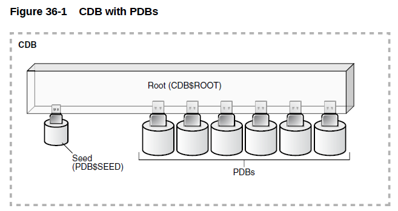

# CDB 概念

> **数据库**（DATABASE）是一个数据集合，Oracle数据库都将其数据存放在数据文件中。在物理结构上，Oracle数据库必须的3类文件分别是数据文件、控制文件和联机Redo日志文件。在逻辑结构上，Oracle数据库由表空间、段、区和块组成。数据库名称由DB_NAME来标识。

> **实例**（INSTANCE）是操作Oracle数据库的一种手段。它是由OS分配的一块内存（包括SGA和PGA）和一些后台进程（PMON、SMON、LGWR、CKPT、DBWn等）组成的。实例在启动时会读取初始化参数文件（SPFILE或PFILE），获取数据库运行时的参数的值。实例名称由INSTANCE_NAME来标识。

在Oracle 12c之前，一个数据库可以被1个实例（Single Instance，单实例）或多个实例访问或挂载（RAC，集群），也就是说*一个实例只能对应一个数据库，一个数据库可以被多个实例挂载（RAC）*

## **插接式数据库简介**

插接式数据库由一个使用 CDB（Container Database）选项创建的**容器**数据库和一个或多个 PDB（Pluggable Database）组成，CDB 作为容器容纳 PDB，而 PDB 彼此隔离，就像一个独立的数据库般在 CDB 中存在。

<span data-type="text" style="background-color: var(--b3-font-background8);">当进入ORACLE 12C后，</span>**实例与数据库可以是一对多的关系**<span data-type="text" style="background-color: var(--b3-font-background8);">。下面是官方文档关于CDB与PDB的关系图。</span>

## **CDB 的组成**

​

- ROOT组件
  ROOT又叫CDB$ROOT,存储着ORACLE提供的元数据和Common User,元数据的一个例子是ORACLE提供的PL/SQL包的源代码，Common User 是指在每个容器中都存在的用户。
- SEED组件
  Seed又叫PDB$SEED,这个是你创建PDBS数据库的模板，你不能在Seed中添加或修改一个对象。一个CDB中有且只能有一个Seed.这个感念，个人感觉非常类似SQL SERVER中的model数据库。
- PDBS
  CDB中可以有一个或多个PDBS，PDBS向后兼容，可以像以前在数据库中那样操作PDBS，这里指大多数常规操作。
  这些组件中的每一个都可以被称为一个容器。因此，ROOT(根)是一个容器，Seed(种子)是一个容器，每个PDB是一个容器。每个容器在CDB中都有一个独一无二的的ID和名称

‍

## CDB 与 非CDB 环境区别

在物理级别，CDB与非CDB一样有一个数据库实例和多个数据库文件。

- **SYSTEM/SYSAUX**：  
  在CDB的数据库环境中，SYSTEM/SYSAUX表空间并不是公用，CDB$ROOT以及每个PDB都拥有自己的SYSTEM和SYSAUX表空间。每个容器都将自己的数据字典存储在相应的SYSTEM表空间（其中包含自己的元数据）中，还有一个SYSAUX表空间。
- **重做日志文件**：  
  是整个CDB共有的，其中包含的信息注释有发生更改的PDB的标识。Oracle GoldenGate已进行了增强，以识别CDB的重做日志的格式。在CDB环境中所有的PDB共用CDB$ROOT中的REDO文件，REDO中的条目标识REDO来自那个PDB。在PDB中无法执行ALTER SYSTEM SWITCH LOGFILE命令，只有公用用户在ROOT容器中才可以执行该命令。另外ALTER SYSTEM CHECKPOINT命令是可以在PDB中执行的。
- **归档**：  
  CDB中的所有PDB都共享CDB的ARCHIVELOG模式，以及归档文件，不可以单独为PDB设置自己的归档模式，只有特权用户连接根容器之后才可以启动归档模式。**所以，如果想开启或关闭数据库的归档模式，那么只能在CDB级别进行操作。在12.1中，只支持在CDB级别闪回数据库，而在12.2中支持在PDB级别闪回数据库，但是开启和关闭数据库的闪回功能，则只能在CDB级别操作。**
- **控制文件**  
  是整个CDB共有的。CDB环境中只有一组控制文件，所有的PDB共用这组公共的控制文件，从任何PDB中添加数据文件都会记录到公共控制文件当中，公用用户连接根容器时，可对控制文件进行管理。
- **Undo Mode**：  
  在12.2之前，每个CDB实例仅有一个UNDO表空间，所有的PDB共用CDB$ROOT中的UNDO文件。在12.1中，所有的在一个实例中的PDB只能共享同一个UNDO表空间。在12.2中它们都有各自的undo表空间了。这种新的管理机制就叫做**本地undo模式**。在12.2之后的版本中UNDO的使用模式有两种：SHARED UNDO MODE和LOCAL UNDO MODE，顾名思义，LOCAL UNDO MODE就是每个PDB使用自己的UNDO表空间，但当PDB中没有自己的UNDO表空间时，会使用CDB$ROOT中的公共UNDO表空间。本地undo模式为新建数据库的默认模式。
- **临时文件：**   
  每个PDB都有自己的临时表空间，如果PDB没有自己的临时表空间文件，那么，PDB可以使用CDB$ROOT中的临时表空间。根或PDB只能有一个默认临时表空间或表空间组。每个PDB可以具有供该PDB中本地用户或公用用户使用的临时表空间。
- **参数文件：**   
  参数文件中只记录了根容器的参数信息，没有记录PDB级别的参数信息，在根容器中修改初始化参数，会被继承到所有的PDB中，在PDB中修改参数后，PDB的参数会覆盖CDB级别的参数，PDB级别的参数记录在根容器的pdb_spfile$视图中，但并不是所有的参数都可以在PDB中修改，可以通过v$system_parameter视图的ispdb_modifiable列查看PDB中可修改的参数。

```sql
SELECT name FROM v$system_parameter WHERE ispdb_modifiable = 'TRUE' ORDER BY name;
```

- **告警日志以及跟踪文件：**   
  在CDB中所有的PDB共用一个告警日志和一组跟踪文件，所有的PDB告警信息都会写入同一个告警日志中。
- **时区：**   
  在CDB环境中可以为CDB以及所有的PDB设置相同的时区，也可以为每个PDB设置单独的时区。

```sql
select dbtimezone from dual;
```

- **字符集：**   
  在CDB中定义字符集也可以应用于它所含有的PDB中，每个PDB也可以有自己的字符集设置。在12.1中，CDB和PDB的字符集必须一样，但是在12.2中，CDB和PDB的字符集可以不一样。
