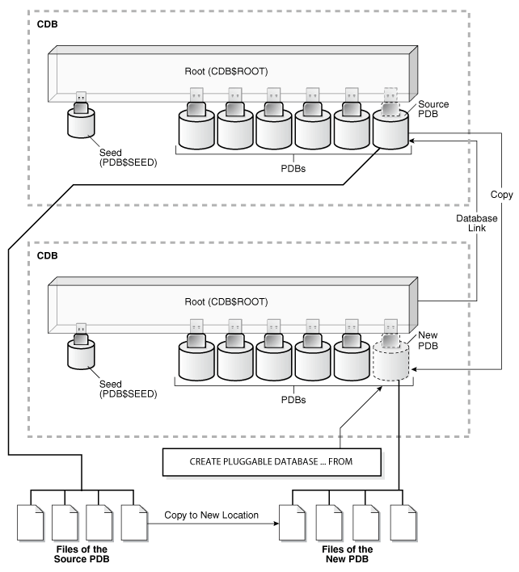
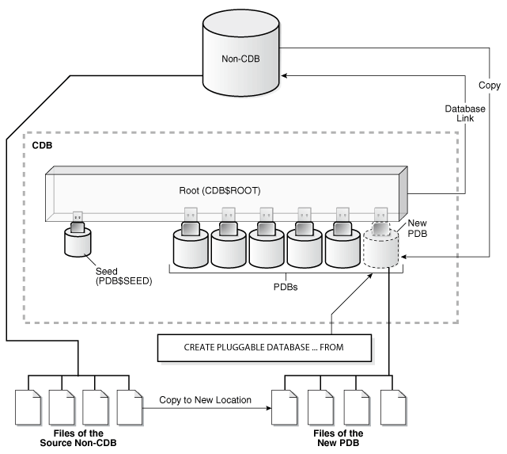

# 远程克隆PDB

## 远程克隆PDB

　　在12.2版本以前，如果要克隆pdb或non-CDB，需要先将源pdb或者non-CDB关闭或者置于read-only模式，不过12.2开始及不需要了，可以在不影响源端使用的情况下进行在线clone。

　　当源pdb是属于一个远端cdb时，需要通过数据链来克隆到本地。数据链必须建在本地CDB中，当在本地CDB中执行`CREATE PLUGGABLE DATABASE`​语句时，必须要指定指向远端CDB的数据链。这个数据链要么连接到远端的CDB，要么指向远端的PDB。

　　下面这张图展示了如何从远端pdb克隆到本地

　　​[*](https://www.xbdba.com/img/remote-pdb.png)

　　这里准备了三个环境：

* ora12c 本地cdb
* noncdb 远端non-cdb
* cdb1 远端cdb

```sqlplus
# 本地cdb
sys@ORA12C> show pdbs;

    CON_ID CON_NAME                       OPEN MODE  RESTRICTED
---------- ------------------------------ ---------- ----------
         2 PDB$SEED                       READ ONLY  NO
         3 PDB12C                         READ WRITE NO
         4 PDB4                           READ WRITE NO

# 远端cdb
sys@CDB1> show pdbs;

    CON_ID CON_NAME                       OPEN MODE  RESTRICTED
---------- ------------------------------ ---------- ----------
         2 PDB$SEED                       READ ONLY  NO
         4 PDB3                           READ WRITE NO
```

　　现在测试将cdb1上的pdb3克隆到本地，先在远端cdb环境上创建用户，赋予创建pdb等权限

```sqlplus
create user c#xb identified by xb container=all;

User created.

sys@CDB1> grant create session, create pluggable database to c#xb container=all;

Grant succeeded.
```

　　检查cdb1是否启用了归档和本地undo，因为只有这样源库就不需要关闭或置于read-only

```sqlplus
col property_name format a20
col property_value format a20

select property_name, property_value
from   database_properties
where  property_name = 'LOCAL_UNDO_ENABLED';

PROPERTY_NAME        PROPERTY_VALUE
-------------------- --------------------
LOCAL_UNDO_ENABLED   TRUE

sys@CDB1> archive log list;
Database log mode              Archive Mode
Automatic archival             Enabled
Archive destination            USE_DB_RECOVERY_FILE_DEST
Oldest online log sequence     128
Next log sequence to archive   130
Current log sequence           130
```

　　在本地cdb上创建一个指向远端cdb的数据链

```sqlplus
drop public database link to_remote;

create public database link to_remote connect to c#xb identified by xb using '(DESCRIPTION =
    (ADDRESS_LIST =
      (ADDRESS = (PROTOCOL = TCP)(HOST = stbyum)(PORT = 1521))
    )
    (CONNECT_DATA =
      (SERVICE_NAME = cdb1)
    )
  )';

# 测试数据链
sys@ORA12C> @desc user_tables@to_remote;
           Name                            Null?    Type
           ------------------------------- -------- ----------------------------
    1      TABLE_NAME                      NOT NULL VARCHAR2(128)
    2      TABLESPACE_NAME                          VARCHAR2(30)
```

　　测试可以正常访问，则通过这个数据链克隆一个新pdb

```sqlplus
sys@ORA12C> create pluggable database pdb3new from pdb3@to_remote;

Pluggable database created.

# alert.log
create pluggable database pdb3new from pdb3@to_remote
2019-06-12T15:35:17.673517+08:00
Opatch validation is skipped for PDB PDB3NEW (con_id=5)
2019-06-12T15:35:33.731948+08:00
PDB3NEW(5):Endian type of dictionary set to little
2019-06-12T15:35:38.879320+08:00
****************************************************************
Pluggable Database PDB3NEW with pdb id - 5 is created as UNUSABLE.
If any errors are encountered before the pdb is marked as NEW,
then the pdb must be dropped
local undo-1, localundoscn-0x00000000000000e1
****************************************************************
2019-06-12T15:35:41.415426+08:00
Applying media recovery for pdb-4099 from SCN 17603364 to SCN 17603401
Remote log information: count-1
thr-1, seq-130, logfile-/u01/arch/cdb1/parlog_1_130_edf48e09_1006353729.arc, los-11406334, nxs-18446744073709551615
PDB3NEW(5):Media Recovery Start
2019-06-12T15:35:41.422985+08:00
PDB3NEW(5):Serial Media Recovery started
2019-06-12T15:35:42.538588+08:00
PDB3NEW(5):Media Recovery Log /u01/arch/cdb1/parlog_1_130_edf48e09_1006353729.arc
2019-06-12T15:35:42.915318+08:00
PDB3NEW(5):Incomplete Recovery applied until change 17603401 time 06/12/2019 15:35:39
2019-06-12T15:35:43.041389+08:00
PDB3NEW(5):Media Recovery Complete (ora12c)
2019-06-12T15:35:43.711336+08:00
PDB3NEW(5):Autotune of undo retention is turned on. 
2019-06-12T15:35:45.886107+08:00
PDB3NEW(5):[95653] Successfully onlined Undo Tablespace 2.
PDB3NEW(5):Undo initialization finished serial:0 start:4013286781 end:4013286842 diff:61 ms (0.1 seconds)
PDB3NEW(5):Database Characterset for PDB3NEW is AL32UTF8
PDB3NEW(5):JIT: pid 95653 requesting stop
2019-06-12T15:35:48.606380+08:00
Completed: create pluggable database pdb3new from pdb3@to_remote
```

　　将克隆完毕的新pdb打开

```sqlplus
sys@ORA12C> set linesize 300
sys@ORA12C> select name,open_mode from v$pdbs;

NAME                                                                                                                             OPEN_MODE
-------------------------------------------------------------------------------------------------------------------------------- ----------
PDB$SEED                                                                                                                         READ ONLY
PDB12C                                                                                                                           READ WRITE
PDB4                                                                                                                             READ WRITE
PDB3NEW                                                                                                                          MOUNTED

sys@ORA12C> alter pluggable database pdb3new open;

Pluggable database altered.

sys@ORA12C> select name,open_mode from v$pdbs;

NAME                                                                                                                             OPEN_MODE
-------------------------------------------------------------------------------------------------------------------------------- ----------
PDB$SEED                                                                                                                         READ ONLY
PDB12C                                                                                                                           READ WRITE
PDB4                                                                                                                             READ WRITE
PDB3NEW  
```

## 远程克隆non-CDB

​​

　　过程基本类似，创建用户和数据链

```sqlplus
sys@NONCDB> create user xb identified by xb ;

User created.

sys@NONCDB> grant create session, create pluggable database to xb;

Grant succeeded.

# 确认归档模式
sys@NONCDB> archive log list;
Database log mode              Archive Mode
Automatic archival             Enabled
Archive destination            /u01/app/oracle/product/12.2.0/dbhome_1/dbs/arch
Oldest online log sequence     5
Next log sequence to archive   7
Current log sequence           7

drop public database link to_remote;

create public database link to_remote connect to xb identified by xb using '(DESCRIPTION =
    (ADDRESS_LIST =
      (ADDRESS = (PROTOCOL = TCP)(HOST = stbyum)(PORT = 1521))
    )
    (CONNECT_DATA =
      (SERVICE_NAME = noncdb)
    )
  )';
```

　　克隆远程noncdb

```sqlplus
sys@ORA12C> create pluggable database noncdbnew from noncdb@to_remote;

Pluggable database created.

sys@ORA12C> set linesize 300
sys@ORA12C> select name,open_mode from v$pdbs;

NAME                                                                                                                             OPEN_MODE
-------------------------------------------------------------------------------------------------------------------------------- ----------
PDB$SEED                                                                                                                         READ ONLY
PDB12C                                                                                                                           READ WRITE
PDB4                                                                                                                             READ WRITE
PDB3NEW                                                                                                                          READ WRITE
NONCDBNEW  
```

　　因为是从non-CDB克隆过来的，所以需要执行转换sql

```sqlplus
alter session set container=noncdbnew;

@$ORACLE_HOME/rdbms/admin/noncdb_to_pdb.sql;
```

　　打开新克隆的pdb

```sqlplus
alter pluggable database noncdbnew open;

sys@ORA12C> select name, open_mode FROM v$pdbs where name='NONCDBNEW';

NAME                 OPEN_MODE
-------------------- ----------
NONCDBNEW            READ WRITE
```

## 构建测试环境语句

```sqlplus
# ora12c
dbca -silent -createDatabase \
 -templateName General_Purpose.dbc \
 -gdbname ora12c -sid ora12c -responseFile NO_VALUE \
 -characterSet AL32UTF8 \
 -sysPassword oracle \
 -systemPassword oracle \
 -createAsContainerDatabase true \
 -numberOfPDBs 1 \
 -pdbName pdb1 \
 -pdbAdminPassword oracle \
 -databaseType MULTIPURPOSE \
 -automaticMemoryManagement false \
 -totalMemory 2048 \
 -storageType FS \
 -datafileDestination "/u01/app/oracle/oradata/" \
 -redoLogFileSize 50 \
 -initParams encrypt_new_tablespaces=DDL \
 -emConfiguration NONE \
 -ignorePreReqs

# cdb1
dbca -silent -createDatabase \
 -templateName General_Purpose.dbc \
 -gdbname cdb1 -sid cdb1 -responseFile NO_VALUE \
 -characterSet AL32UTF8 \
 -sysPassword oracle \
 -systemPassword oracle \
 -createAsContainerDatabase true \
 -numberOfPDBs 1 \
 -pdbName pdb3 \
 -pdbAdminPassword oracle \
 -databaseType MULTIPURPOSE \
 -automaticMemoryManagement false \
 -totalMemory 2048 \
 -storageType FS \
 -datafileDestination "/u01/app/oracle/oradata/" \
 -redoLogFileSize 50 \
 -initParams encrypt_new_tablespaces=DDL \
 -emConfiguration NONE \
 -ignorePreReqs

# noncdb
dbca -silent -createDatabase \
 -templateName General_Purpose.dbc \
 -gdbname noncdb -sid noncdb -responseFile NO_VALUE \
 -characterSet AL32UTF8 \
 -sysPassword oracle \
 -systemPassword oracle \
 -createAsContainerDatabase false \
 -databaseType MULTIPURPOSE \
 -automaticMemoryManagement false \
 -totalMemory 2048 \
 -storageType FS \
 -datafileDestination "/u01/app/oracle/oradata/" \
 -redoLogFileSize 50 \
 -initParams encrypt_new_tablespaces=DDL \
 -emConfiguration NONE \
 -ignorePreReqs


# 删除实例
dbca -silent -deleteDatabase -sourceDB ora12c -sysDBAUserName sys -sysDBAPassword oracle
dbca -silent -deleteDatabase -sourceDB cdb1 -sysDBAUserName sys -sysDBAPassword oracle
dbca -silent -deleteDatabase -sourceDB noncdb -sysDBAUserName sys -sysDBAPassword oracle
```
