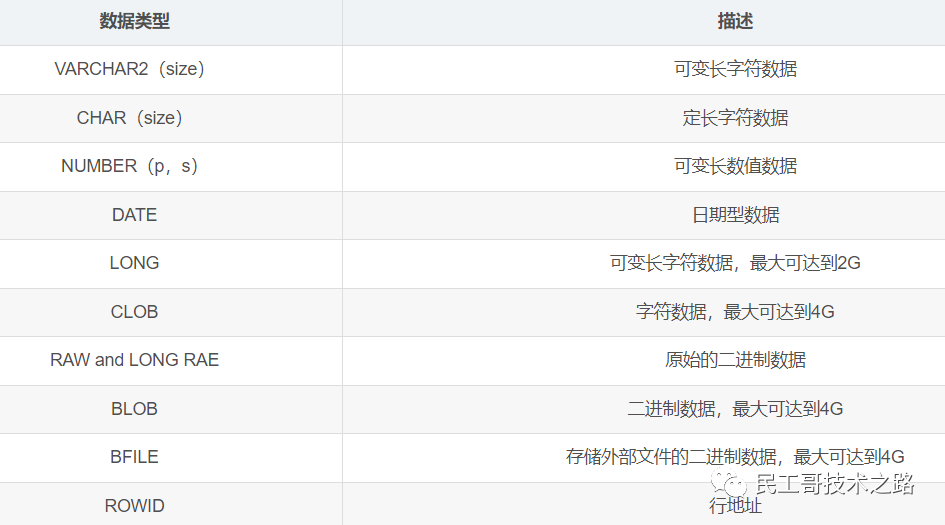

# Oralce 基础概念

* 📄 [Oracle基本概念和结构](siyuan://blocks/20241022143840-0bcatya)
* 📄 [Oracle检查点](siyuan://blocks/20241012095903-ikqlh19)

　　‍

　　‍

```
create table [schema.] table
 (column datatype [default expr][, ...]);
```

　　数据类型：​

　　java代码调用游标类型的out参数:

```
 @Test
 public void testFunction01() {
  Connection conn = null;
  CallableStatement callSt = null;
  ResultSet rs = null;
  
  try {
   conn = JDBCUtils.getConnection();
   callSt = conn.prepareCall("{call proc_cursor_ref(?,?)}");
   
   callSt.setInt(1, 20);
   callSt.registerOutParameter(2, OracleTypes.CURSOR);
   
   callSt.execute();
   
   rs = ((OracleCallableStatement)callSt).getCursor(2);
   while(rs.next()) {
    System.out.println(rs.getObject(1) + "," + rs.getObject(2));
   }
   
  }catch(Exception e) {
   e.printStackTrace();
  }
 }
```

　　运行JUnit测试输出：

```
7369,SMITH
7566,JONES
7788,SCOTT
7876,ADAMS
7902,FORD
```
