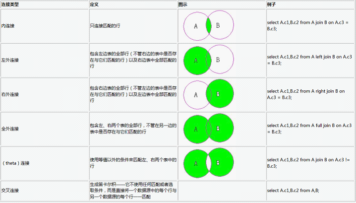

# ORACLE表连接

## 一、前言

在工作过程中，经常会查看SQL语句，有些SQL语句写的异常复杂，当涉及到多表操作时，表连接语句当属最常见。例如内连接、外连接、自连接。

Oracle 表之间的连接分为三种：

- 内连接(自然连接)
- 外连接
  （1）左外连接 (左边的表不加限制)
  （2）右外连接(右边的表不加限制)
  （3）全外连接(左右两表都不加限制)
- 自连接（同一张表内的连接）

SQL的标准语法：

```sql
select table1.column,table2.column from table1 [inner | left | right | full ] join table2 on table1.column1 = table2.column2;
```

其中，

- ​`inner join`​ 表示内连接；
- ​`left join`​表示左外连接；
- ​`right join`​表示右外连接；
- ​`full join`​表示完全外连接；
- ​`on`​子句用于指定连接条件。

注意：

- **如果使用`from`​子句指定内、外连接，则必须要使用`on`​子句指定连接条件；**
- **如果使用（`+`​）操作符指定外连接，则必须使用`where`​子句指定连接条件。**

## 二、内连接（Inner Join/Join）

### 2.1 Inner Join

​`Inner join`​逻辑运算符返回满足第一个（顶端）输入与第二个（底端）输入联接的每一行。这个和用select查询多表是一样的效果，所以内连接用的很少。

还有一点要说明的就是Join 默认就是inner join。 所以我们在写内连接的时候可以省略inner 这个关键字。

### 2.2 举例说明

1.2.1 先创建2张测试表并插入数据：

```sql
SQL> select * from dave;
ID  NAME
1  dave
2  bl
1  bl
2  dave
SQL> select * from bl;
ID  NAME
1  dave
2  bl
```

1.2.3 用内链接进行查询：

```sql
SQL> Select a.id,a.name,b.name from dave a inner join bl b on a.id=b.id;   -- 标准写法
ID   NAME       NAME
1    dave       dave
2    bl         bl
1    bl         dave
2    dave       bl
SQL> Select a.id,a.name,b.name from dave a join bl b on a.id=b.id;  -- 这里省略了inner 关键字
ID NAME       NAME
1 dave       dave
2 bl         bl
1 bl         dave
2 dave       bl
SQL> Select a.id,a.name,b.name from dave a,bl b where a.id=b.id;  -- select 多表查询
ID NAME       NAME
1 dave       dave
2 bl         bl
1 bl         dave
2 dave       bl
```

从这三个SQL 的结果我们也可以看出，他们的作用是一样的。

### 2.3 自然连接(Natural join)

自然连接是在两张表中寻找那些数据类型和列名都相同的字段，然后自动地将他们连接起来，并返回所有符合条件的结果。

先看一下自然连接的例子:

```sql
SQL> Select id,name from dave a natural join bl b;  
ID NAME
1 dave
2 bl
```

这里我们并没有指定连接的条件，实际上oracle为我们自作主张的将，dave表中的id和name字段与bl表中的id和name字段进行了连接。也就是实际上相当于

```sql
SQL> Select dave.id,bl.name From dave join bl on dave.id = bl.id and dave.name=bl.name;
ID NAME
1 dave
2 bl
```

因此，我们也可以将自然连接理解为内连接的一种。
有关自然连接的一些注意事项：

- 如果做自然连接的两个表的有多个字段都满足有相同名称和类型，那么他们会被作为自然连接的条件。
- 如果自然连接的两个表仅是字段名称相同，但数据类型不同，那么将会返回一个错误。

## 三、外连接(Outer Join)

outer join则会返回每个满足第一个（顶端）输入与第二个（底端）输入的联接的行。它还返回任何在第二个输入中没有匹配行的第一个输入中的行。外连接分为三种： 左外连接，右外连接，全外连接。 对应SQL：LEFT/RIGHT/FULL OUTER JOIN。 通常我们省略outer 这个关键字。 写成：LEFT/RIGHT/FULL JOIN。

在左外连接和右外连接时都会以一张表为基表，该表的内容会全部显示，然后加上两张表匹配的内容。 如果基表的数据在另一张表没有记录。 那么在相关联的结果集行中列显示为空值（NULL）。

对于外连接， 也可以使用“(+) ”来表示。 关于使用（+）的一些注意事项：

- （+）操作符只能出现在where子句中，并且不能与outer join语法同时使用。
- 当使用（+）操作符执行外连接时，如果在where子句中包含有多个条件，则必须在所有条件中都包含（+）操作符
- （+）操作符只适用于列，而不能用在表达式上。
- （+）操作符不能与or和in操作符一起使用。
- （+）操作符只能用于实现左外连接和右外连接，而不能用于实现完全外连接。

（+）操作符只适用于列，而不能用在表达式上。在做实验之前，我们先将dave表和bl里加一些不同的数据。 以方便测试。

```sql
SQL> select * from bl;
        ID NAME
         1 dave
         2 bl
         3 big bird
         4 exc
         9 怀宁
SQL> select * from dave;
        ID NAME
         8 安庆
         1 dave
         2 bl
         1 bl
         2 dave
         3 dba
         4 sf-express
         5 dmm
```

### 3.1 左外连接（Left outer join/ left join）

​`left join`​是以左表记录为基础,示例中Dave可以看成左表,BL可以看成右表,它的结果集是Dave表中的数据，再加上Dave表和BL表匹配的数据。换句话说,左表(Dave)的记录将会全部表示出来,而右表(BL)只会显示符合搜索条件的记录。BL表记录不足的地方均为NULL。

示例：

```sql
SQL> select * from dave a left join bl b on a.id = b.id;
       ID NAME               ID NAME
        1 bl                  1 dave
        1 dave                1 dave
        2 dave                2 bl
        2 bl                  2 bl
        3 dba                 3 big bird
        4 sf-express          4 exc
        5 dmm        -- 此处B表为null，因为没有匹配到
        8 安庆       -- 此处B表为null，因为没有匹配到

SQL> select * from dave a left outer join bl b on a.id = b.id;
        ID NAME               ID NAME
         1 bl                  1 dave
         1 dave                1 dave
         2 dave                2 bl
         2 bl                  2 bl
         3 dba                 3 big bird
         4 sf-express          4 exc
         5 dmm
         8 安庆
```

用（`+`​）来实现，这个`+`​号可以这样来理解： `+`​ 表示补充，即哪个表有加号，这个表就是匹配表。所以加号写在右表，左表就是全部显示，故是左连接。

```sql
SQL> Select * from dave a,bl b where a.id=b.id(+);    -- 注意： 用（+） 就要用关键字where
        ID NAME               ID NAME
         1 bl                  1 dave
         1 dave                1 dave
         2 dave                2 bl
         2 bl                  2 bl
         3 dba                 3 big bird
         4 sf-express          4 exc
         5 dmm
         8 安庆

```

### 3.2 右外连接（right outer join/ right join）

和`left join`​的结果刚好相反,是以右表(BL)为基础的, 显示BL表的所以记录，在加上Dave和BL 匹配的结果。 Dave表不足的地方用NULL填充.
示例：

```sql
SQL> select * from dave a right join bl b on a.id = b.id;
         ID NAME               ID NAME
         1 dave                1 dave
         2 bl                  2 bl
         1 bl                  1 dave
         2 dave                2 bl
         3 dba                 3 big bird
         4 sf-express          4 exc
                             9 怀宁    --此处左表不足用Null 填充

--已选择7行。
SQL> select * from dave a right outer join bl b on a.id = b.id;
         ID NAME               ID NAME
         1 dave                1 dave
         2 bl                  2 bl
         1 bl                  1 dave
         2 dave                2 bl
         3 dba                 3 big bird
         4 sf-express          4 exc
         9 怀宁  --此处左表不足用Null 填充
--已选择7行。

```

用（`+`​）来实现， 这个+号可以这样来理解： `+`​ 表示补充，即哪个表有加号，这个表就是匹配表。所以加号写在左表，右表就是全部显示，故是右连接。

```sql
SQL> Select * from dave a,bl b where a.id(+)=b.id;
         ID NAME               ID NAME
         1 dave                1 dave
         2 bl                  2 bl
         1 bl                  1 dave
         2 dave                2 bl
         3 dba                 3 big bird
         4 sf-express          4 exc
                                      9 怀宁
```

### 3.3 全外连接（full outer join/ full join）

左表和右表都不做限制，所有的记录都显示，两表不足的地方用`null`​ 填充。 全外连接不支持（`+`​）这种写法。
示例：

```sql
SQL> select * from dave a full join bl b on a.id = b.id;
        ID NAME               ID NAME
        8 安庆
        1 dave                1 dave
        2 bl                  2 bl
        1 bl                  1 dave
        2 dave                2 bl
        3 dba                 3 big bird
        4 sf-express          4 exc
        5 dmm
                              9 怀宁

--已选择9行。
SQL> select * from dave a full outer join bl b on a.id = b.id;
       ID NAME               ID NAME
        8 安庆
        1 dave                1 dave
        2 bl                  2 bl
        1 bl                  1 dave
        2 dave                2 bl
        3 dba                 3 big bird
        4 sf-express          4 exc
        5 dmm
                              9 怀宁
```

已选择9行。

### 四、自连接

自连接(`self join`​)是SQL语句中经常要用的连接方式，使用自连接可以将自身表的一个镜像当作另一个表来对待，从而能够得到一些特殊的数据。

示例：
在`oracle`​的scott的schema中有一个表是emp。在emp中的每一个员工都有自己的mgr(经理)，并且每一个经理自身也是公司的员工，自身也有自己的经理。

下面我们需要将每一个员工自己的名字和经理的名字都找出来。这时候我们该怎么做呢？

如果我们有两张这样的表分别教worker和mgr，那么我们就很好写SQL语句。

```sql
Select worker.name,Mgr.name From worker,mgr Where worker.id = mgr.id;
```

但现在只有一张emp表。所以可以采用自连接。自连接的本意就是将一张表看成多张表来做连接。可以这样来写SQL语句:

```sql
select work.ename worker,mgr.ename manager from scott.emp work, scott.emp mgr where work.mgr = mgr.empno order by work.ename;

```

```sql
WORKER     MANAGER
ADAMS      SCOTT
ALLEN      BLAKE
BLAKE      KING
CLARK      KING
FORD       JONES
JAMES      BLAKE
JONES      KING
MARTIN     BLAKE
MILLER     CLARK
SCOTT      JONES
SMITH      FORD
WORKER     MANAGER
TURNER     BLAKE
WARD       BLAKE
```

## 五、连接图示



‍
