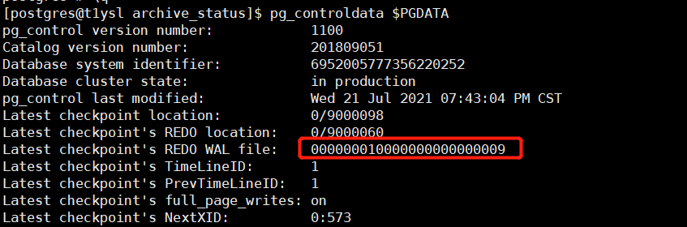

# PostgreSQL wal预写日志

## wal日志介绍

wal日志即write ahead log预写式日志，简称wal日志。wal日志可以说是PostgreSQL中十分重要的部分，相当于oracle中的redo日志。
当数据库中数据发生变更时：
（1）change发生时：先要将变更后内容计入wal buffer中，再将变更后的数据写入data buffer；
（2）commit发生时：wal buffer中数据刷新到磁盘；
（3）checkpoint发生时：将所有data buffer刷新的磁盘。

‍

## 开启归档

​`vim /data/pgsql/data/postgresql.conf`​

```bash
wal_level = replica    # 该参数控制WAL日志信息的输出级别，有minimal， replica， logical三种模式，修改该参数需要重启。
                       # minimal记录的日志最少，只记录数据库异常关闭需要恢复时的WAL信息。
                       # replica记录的WAL信息比minimal信息多些，会记录支持WAL归档、复制和备库中启用只读查询等操作所需的WAL信息。
                       # logical记录的日志最多，包含了支持逻辑解析所需的WAL，
                       # 开启流复制至少需要设置为replica级别。

archive_mode = on      # 该参数控制是否启用归档。On表示启用归档并使用archive_command参数的配置命令将WAL日志归档，修改该参数需要重启数据库。
archive_command = 'test ! -f /data/pgsql/archive/%f && cp %p /data/pgsql/archive/%f'  # Unix 归档日志保存路径
#archive_command = 'copy "%p" "C:\\server\\archivedir\\%f"'  # Windows
```

### **归档目录**

如果开启了归档，则在归档路径下的archive_status目录里，会有类似000000010000000000000002.ready和000000010000000000000003.done的文件。

.ready表示XLOG文件已写满，可以调用归档命令了，.done表示已归档完成。开启了归档后，只有归档成功的pg_xlog文件才会被清除。在每次归档命令被执行后，会触发清除标签的动作，在执行检查点时，也会触发清除归档标签文件的动作。

### **影响wal保存的最大个数的参数**

checkpoint_segments和wal_keep_segments,checkpoint_completion_target

​`通常地说，WAL最大个数不超过：( 2 + checkpoint_completion_target ) * checkpoint_segments + 1`​

​`在流复制环境下，WAL最大数不超过：wal_keep_segments + checkpoint_segments + 1`​

超过的话会自动清理。

默认的WAL segments为16M，这个参数在PG编译执行 ./configure 时，指定“–with-wal-segsize=target_value”参数设置。

### **手动清理wal（通常情况下尽量让数据库自动清理，避免错误操作）**

如果配置了archive_mode=on，但是没有配置archive_command，那么xlog文件会一直堆积（xlog写完后，会写.ready，但是由于没有配置archive_command，也就是说不会触发归档命令，所以一直都不会写  .done），所以xlog会一直不清理。

* 读取控制文件，找到能清理的xlog范围

  ​​

  表示000000010000000000000009之前的文件可以删除
* 通过pg_archivecleanup清理

  ```sql
  [postgres@t1ysl bin]$ pg_archivecleanup -d $PGDATA/pg_wal 000000010000000000000009
  ```

‍

## 触发归档

### 手动切换WAL日志

在日志切换这块pg的wal日志和Oracle的redo有些不一样，oracle中redo是固定几个redo日志文件，然后轮着切换去写入，因此在io高的数据库中可以看到redo切换相关的等待事件。而在pg中wal日志是动态切换，从pg9.6开始采用这种模式。和oracle不同的是，pg中这种动态wal切换步骤是这样的：单个wal日志写满(默认大小16MB，编译数据库时指定)继续写下一个wal日志，直到磁盘剩余空间不足min_wal_size时才会将旧的  WAL文件回收以便继续使用。

那么，PG怎么去手动切换WAL日志呢？

```sql
--Oracle切换redo log
alter system switch logfile;
--PG10之前切换WAL log
select pg_switch_xlog();
--PG10之后切换WAL log
select pg_switch_wal();
```

### wal日志写满后会自动归档

wal日志文件默认为 16MB，这个值可以在编译 PostgreSQL 时通过参数 "--with-wal-segsize" 更改，编译则后不能修改。

### 参数archive_timeout

在postgresql.conf 文件中的参数archive_timeout，

如果设置archive_timeout=60s，意思是，wal日志60s切换一次，同时会触发日志归档。

注：尽量不要把archive_timeout设置的很小，如果设置的很小，会很消耗归档存储，因为强制归档的日志，即使没有写满，也会是默认的16M（假设wal日志写满的大小为16M）

## 查看 online wal日志

```bash
[postgres@localhost pg_wal]$ psql -c "select * from pg_ls_waldir() order by modification asc;"
                   name                   |   size   |      modification  
------------------------------------------+----------+------------------------
 00000001000000000000000B.00000028.backup |      337 | 2024-05-15 10:01:21+08
 000000020000000000000010                 | 16777216 | 2024-05-15 10:24:53+08
 000000020000000000000011                 | 16777216 | 2024-05-15 10:58:18+08
 000000020000000000000012                 | 16777216 | 2024-05-15 13:59:20+08
 00000001000000000000000F                 | 16777216 | 2024-05-15 14:33:34+08
 00000002.history                         |       41 | 2024-05-15 14:33:34+08
 00000002000000000000000F                 | 16777216 | 2024-05-15 14:35:02+08
(7 行记录)


wal命名格式文件名称为16进制的24个字符组成，每8个字符一组，每组的意义如下：
00000001 00000000 00000011-------- -------- --------时间线     逻辑id    物理id
```

‍
