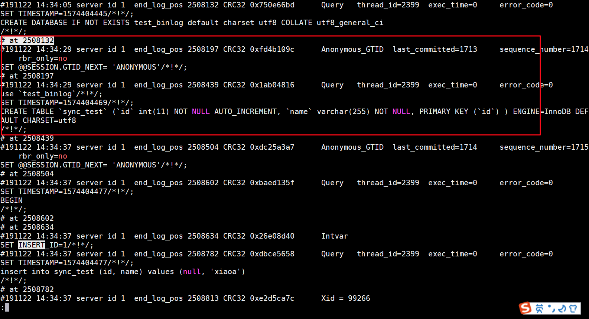
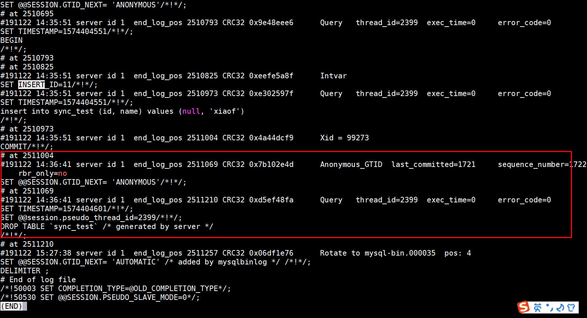
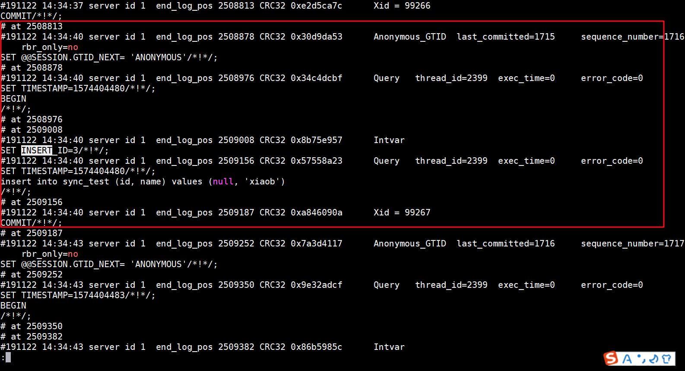

# 3. mysqlbinlog实现全量恢复

‍

日常开发，运维中，经常会出现误删数据的情况。误删数据的类型大致可分为以下几类：

* 使用 delete 误删行
* 使用 drop table 或 truncate table 误删表
* 使用 drop database 语句误删数据库
* 使用 rm 命令误删整个 MySQL 实例。

不同的情况，都会有其优先的解决方案：

* 针对误删行，可以通过 Flashback 工具将数据恢复
* 针对误删表或库，一般采用通过 BINLOG 将数据恢复。
* 而对于误删 MySQL 实例，则需要我们搭建 HA 的 MySQL 集群，并保证我们的数据跨机房，跨城市保存。

本篇主要讨论的内容是误删表或者库，会先介绍有关 BINLOG 的操作命令，然后会对误删表的这种情况进行实际的模拟。

# 一、BINLOG 常见操作命令

BINLOG 的查询方式一般分为两种，一种是进入 MySQL 控制台进行查询，另一种是通过 MySQL 提供的工具 mysqlbinlog 进行查询，两者的不同会在下面介绍。

## 通过 MySQL Cli 查询 BINLOG 信息

在 cli 中，常见的命令如下：

```
# 查询 BINLOG 格式
show VARIABLES like 'binlog_format';

# 查询 BINLOG 位置
show VARIABLES like 'datadir';

# 查询当前数据库中 BINLOG 名称及大小
show binary logs;

# 查看 master 正在写入的 BINLOG 信息
show master status\G;

# 通过 offset 查看 BINLOG 信息
show BINLOG events in 'mysql-bin.000034' limit 9000,  10;

# 通过 position 查看 binlog 信息
show BINLOG events in 'mysql-bin.000034' from 1742635 limit 10;
```

使用 `show BINLOG events`​ 的问题：

* 使用该命令时，如果当前 binlog 文件很大，而且没有指定 `limit`​，会引发对资源的过度消耗。因为 MySQL 客户端需要将 binlog 的全部内容处理，返回并显示出来。为了防止这种情况，mysqlbinlog 工具是一个很好的选择。

## 通过 mysqlbinlog 查询 BINLOG 信息

在介绍 mysqlbinlog 工具使用前，先来看下 BINLOG 文件的内容：

```
# 查询 BINLOG 的信息
mysqlbinlog  --no-defaults mysql-bin.000034 | less
```

```
# at 141
#100309  9:28:36 server id 123  end_log_pos 245
  Query thread_id=3350  exec_time=11  error_code=0
```

* ​`at`​ 表示 offset 或者说事件开始的起始位置
* ​`100309 9:28:36 server id 123`​ 表示 server 123 开始执行事件的日期
* ​`end_log_pos 245`​ 表示事件的结束位置 + 1，或者说是下一个事件的起始位置。
* ​`exec_time`​ 表示在 master 上花费的时间，在 salve 上，记录的时间是从 Master 记录开始，一直到 Slave 结束完成所花费的时间。
* ​`rror_code=0`​ 表示没有错误发生。

在大致了解 binlog 的内容后，mysqlbinlog 的用途有哪些？：

* mysqlbinlog 可以作为代替 cli 读取 binlog 的工具。
* mysqlbinlog 可以将执行过的 SQL 语句输出，用于数据的恢复或备份。

查询 BINLOG 日志：

```
# 查询规定时候后发生的 BINLOG 日志
mysqlbinlog --no-defaults --base64-output=decode-rows -v \
 --start-datetime  "2019-11-22 14:00:00" \
 --database sync_test  mysql-bin.000034 | less
```

导出 BINLOG 日志，用于分析和排查 sql 语句：

```
mysqlbinlog --no-defaults --base64-output=decode-rows -v \
 --start-datetime  "2019-11-22 14:00:00" \
 --database sync_test \
 mysql-bin.000034 > /home/mysql_backup/binlog_raw.sql
```

导入 BINLOG 日志

```
# 通过 BINLOG 进行恢复。
mysqlbinlog --start-position=1038 --stop-position=1164 \
 --database=db_name  mysql-bin.000034 | \
 mysql  -u cisco -p db_name

# 通过 BINLOG 导出的 sql 进行恢复。
mysql -u cisco -p db_name < binlog_raw.sql
```

mysqlbinlog 的常用参数：

* ​`--database`​ 仅仅列出配置的数据库信息
* ​`--no-defaults`​ 读取没有选项的文件, 指定的原因是由于 mysqlbinlog 无法识别 BINLOG 中的 `default-character-set=utf8`​ 指令
* ​`--offset`​ 跳过 log 中 N 个条目
* ​`--verbose`​ 将日志信息重建为原始的 SQL 陈述。

  * ​`-v`​ 仅仅解释行信息
  * ​`-vv`​ 不但解释行信息，还将 SQL 列类型的注释信息也解析出来
* ​`--start-datetime`​ 显示从指定的时间或之后的时间的事件。

  * 接收 `DATETIME`​ 或者 `TIMESTRAMP`​ 格式。
* ​`--base64-output=decode-rows`​ 将 BINLOG 语句中事件以 base-64 的编码显示，对一些二进制的内容进行屏蔽。

  * ​`AUTO`​ 默认参数，自动显示 BINLOG 中的必要的语句
  * ​`NEVER`​ 不会显示任何的 BINLOG 语句，如果遇到必须显示的 BINLOG 语言，则会报错退出。
  * ​`DECODE-ROWS`​ 显示通过 `-v`​ 显示出来的 SQL 信息，过滤到一些 BINLOG 二进制数据。

## MySQL Cli 和 mysqlbinlog 工具之间的比较

如果想知道当前 MySQL 中正在写入的 BINLOG 的名称，大小等基本信息时，可以通过 Cli 相关的命令来查询。

但想查询，定位，恢复 BINLOG 中具体的数据时，要通过 mysqlbinlog 工具，因为相较于 Cli 来说，mysqlbinlog 提供了 `--start-datetime`​​，`--stop-position`​​ 等这样更为丰富的参数供我们选择。这时 Cli 中 `SHOW BINLOG EVENTS`​​ 的简要语法就变得相形见绌了。

# 二、使用mysqlbinlog**备份功能**

mysqlbinlog可以读取二进制日志文件并写入包含相同内容的新文件——即以二进制格式而不是文本格式。此功能使您能够轻松地以原始格式备份二进制日志。 mysqlbinlog可以进行静态备份，备份一组日志文件并在到达最后一个文件末尾时停止。它还可以进行连续（“实时”）备份，在到达最后一个日志文件的末尾时保持与服务器的连接，并在生成新事件时继续复制它们。在持续备份操作中， mysqlbinlog运行直到连接结束（例如，当服务器退出时）或 mysqlbinlog被强制终止。当连接结束时，mysqlbinlog不会等待并重试连接，这与副本服务器不同。要在服务器重新启动后继续实时备份，您还必须重新启动mysqlbinlog。

**重要的**

mysqlbinlog可以备份加密和未加密的二进制日志文件。[但是，使用mysqlbinlog](https://dev.mysql.com/doc/refman/8.0/en/mysqlbinlog.html "但是，使用mysqlbinlog")生成的加密二进制日志文件的副本 以未加密的格式存储。

记录二进制日志文件最主要的使用场景：

* Mysql Replication时，在Master端开启binlog，Master将其记录了数据操作的二进制文件传递给Slave，Slave通过此日志文件进行数据复制，从而实现主从一致。
* 通过mysqlbinlog工具进行数据恢复

备份命令

```bash
mysqlbinlog --read-from-remote-server --raw --host=192.168.244.145 --port=3306 --user=repl --password=repl --stop-never mysql-bin.000001

参数解释如下：
--read-from-remote-server 用于备份远程服务器的binlog。如果不指定该选项，则会查找本地的binlog。
--raw                     binlog日志会以二进制格式存储在磁盘中，如果不指定该选项，则会以文本形式保存。
--user                    复制的MySQL用户，只需要授予REPLICATION SLAVE权限。
--stop-never              mysqlbinlog可以只从远程服务器获取指定的几个binlog，也可将不断生成的binlog保存到本地。指定此选项，代表只要远程服务器不关闭或者连接未断开，mysqlbinlog就会不断的复制远程服务器上的binlog。
mysql-bin.000001          代表从哪个binlog开始复制。

除了以上选项外，还有以下几个选项需要注意：
--stop-never-slave-server-id 在备份远程服务器的binlog时，mysqlbinlog本质上就相当于一个从服务器，该选项就是用来指定从服务器的server-id的。默认为-1。
--to-last-log                代表mysqlbinlog不仅能够获取指定的binlog，还能获取其后生成的binlog，获取完了，才终止。如果指定了--stop-never选项则会隐式打开--to-last-log选项。
--result-file                用于设置远程服务器的binlog，保存到本地的前缀。譬如对于mysql-bin.000001，如果指定--result-file=/test/backup-，则保存到本地后的文件名为/test/backup-mysql-bin.000001。注意：如果将--result-file设置为目录，则一定要带上目录分隔符“/”。譬如--result-file=/test/，而不是--result-file=/test，不然保存到本地的文件名为/testmysql-bin.000001。
```

不足：这个方式有个问题，对于常规的主从复制来说，如果主从直接的连接断开了，则从会自动再次连接，而对于mysqlbinlog，如果断开了，并不会自动连接。  
解决方案：可通过脚本来弥补上述不足。

```bash
[root@db-node1 ~]# cat /data/scirpts/binlogbackup/binlog_backup.sh
#!/bin/bash
######### 设置变量 #########
# 连接MySQL数据库常用变量
MYSQLHOST='192.168.56.31'
MYSQLPORT='3306'
MYSQLUSER='repl'
MYSQLPASS='123456'
CMDDIR="/usr/local/mysql/bin"
FIRST_BINLOG="mysql-bin.000001"
# 数据库备份存放目录
BACKUPDIR="/data/backup/mysql"
# Binlog日志存放目录
BINLOGDIR="${BACKUPDIR}/${MYSQLHOST}/binlogs"
[ -d ${BINLOGDIR} ] || mkdir -p ${BINLOGDIR}
# MYSQLBINLOG命令
MYSQLBINLOG="${CMDDIR}/mysqlbinlog"
# 备份日志
BACKUPLOG="/var/log/backup_binlog.log"

# 停止时间
SLEEP_SECONDS=10
######### 开始备份binglog日志 #########
# 运行while循环，连接断开后等待指定时间，重新连接
while true;do
    if [ $(ls -A ${BINLOGDIR} |wc -l) -eq 0 ];then
        LAST_FILE=${FIRST_BINLOG}
    else
        LAST_FILE=$(ls ${LOCAL_BACKUP_DIR}|tail -1 |awk '{print $NF}')
    fi
    cd ${BINLOGDIR} && \
    ${MYSQLBINLOG}  --raw --read-from-remote-server --stop-never --host=${MYSQLHOST} --port=${MYSQLPORT} --user=${MYSQLUSER} --password=${MYSQLPASS} ${LAST_FILE}
    echo "$(date +"%F %T") ${MYSQLHOST}:${MYSQLPORT}备份binlog日志停止，返回代码：$?" | tee -a ${BACKUPLOG}
    echo "$(date +"%F %T") ${MYSQLHOST}:${MYSQLPORT} ${SLEEP_SECONDS}秒后再次连接并继续备份" | tee -a ${BACKUPLOG}
    sleep ${SLEEP_SECONDS}
done
```

### binlog备份总结

* 如果指定了–raw，mysqlbinlog获取事件后，并不会实时落盘，而是先保存在本地服务器的内存中，每4K刷盘一次。这也就减少了频繁的日志写操作。如果此时mysqlbinlog和主服务器之间的连接断开了，则内存中的binlog会马上刷新到磁盘中。
* 尽管mysqlbinlog类似于从服务器，但从服务器上的relaylog却是实时存盘的，即从服务器获取主服务器产生的事件后，会实时写入到relaylog中。
* 如果不指定–raw，这个时候会以文本格式存盘，此时，–result-file=/test/不能指定为目录，必须明确写上文件名，譬如–result-file=/test/1.sql，此时，mysqlbinlog获取事件后，是实时落盘的，不会每4K刷盘一次。  
  以上所述是小编给大家介绍的MySQL binlog 远程备份教程详解的相关知识，希望对大家有所帮助，如果大家有任何疑问请给我留言，小编会及时回复大家的。在此也非常感谢大家对脚本之家网站的支持！

‍

# 三、使用 mysqlbinlog恢复数据

恢复的大致流程如下：

1. 会创建数据库和表，并插入数据。备份
2. 误删一条数据。
3. 继续插入数据。
4. 误删表。
5. 最后将原来以及之后插入的数据进行恢复。

### 准备数据

[jy2web_create.sql](assets/jy2web_create-20230809093058-iqjqokw.sql)

### 备份数据

数据库恢复的先决条件是,定时备份数据库,缩小binlog恢复范围.首先我们备份测试数据库数据:

```bash
mysqldump --single-transaction --events --routines --triggers --no-tablespaces -ujy2web -pNinestar@123 jy2web> /tmp/jy2web_bak.sql
mysql -uroot -pNinestar123 -e "flush logs;"
```

### 删除表或者数据

误删操作：

```
INSERT INTO `employees` VALUES (014,'1959-08-07','sss','ddd','F','1985-10-22');
INSERT INTO `employees` VALUES (015,'1959-08-07','sss1','ddd1','F','1985-10-22');
INSERT INTO `employees` VALUES (016,'1959-08-07','sss2','ddd2','F','1985-10-22');
INSERT INTO `employees` VALUES (017,'1959-08-07','sss3','ddd3','F','1985-10-22');
INSERT INTO `employees` VALUES (018,'1959-08-07','sss4','ddd4','F','1985-10-22');
delete from employees  where emp_no=013;
```

### 数据的恢复

在执行数据恢复前，如果操作的是生产环境，会有如下的建议：

* 使用 `flush logs`​ 命令，替换当前主库中正在使用的 binlog 文件，好处如下：

  * 可将误删操作，定位在一个 BINLOG 文件中，便于之后的数据分析和恢复。
  * 避免操作正在被使用的 BINLOG 文件，防止发生意外情况。
* 数据的恢复不要在生产库中执行，先在临时库恢复，确认无误后，再倒回生产库。防止对数据的二次伤害。

通常来说，恢复主要有两个步骤：

1. 在临时库中，恢复定期执行的全量备份数据。
2. 然后基于全量备份的数据点，通过 BINLOG 来恢复误操作和正常的数据。

**使用 BINLOG 做数据恢复前：**

```
# 查看正在使用的 Binlog 文件
mysql -uroot -pNinestar123 -e "show binary logs;"

# 执行 flush logs 操作，生成新的 BINLOG
mysql -uroot -pNinestar123 -e "flush logs;"

# 查看正在使用的 Binlog 文件
mysql -uroot -pNinestar123 -e "show binary logs;"
```

**首先停止mysql对外的服务，利用备份数据恢复到上次数据；**

‍

**查询创建表的事件位置和删除表的事件位置**

```
#  根据时间确定位置信息
cd /data/mysql/data
mysqlbinlog --no-defaults --base64-output=decode-rows -v \
 --start-datetime  "2023-18-22 14:00:00" \
 --database jy2web bin-log.000004 | less
```

**创建表的开始位置：**

​​

**删除表的结束位置：**

​​

**插入 name='xiaob' 的位置：**

​​

```
# 根据位置导出 SQL 文件
cd /data/mysql/data
mysqlbinlog --no-defaults --base64-output=decode-rows -v \
 --start-position "2508132" --stop-position "2511004" \
 --database jy2web bin-log.000003 \
 > /tmp/jy2web_binlog_step1.sql
 
 
mysqlbinlog --no-defaults --base64-output=decode-rows -v \
 --start-position "4" --stop-position "2509187" \
 --database jy2web bin-log.000003 \
 > /tmp/jy2web_binlog_step2.sql
 

# 使用 mysql 进行恢复
mysql -ujy2web -pNinestar@123 jy2web <  /tmp/jy2web_binlog_step1.sql
mysql -ujy2web -pNinestar@123 jy2web <  /tmp/jy2web_binlog_step2.sql
```

> MySQL 5.7 中无论是否打开 GTID 的配置，在每次事务开启时，都首先会出 GTID 的一个事务，用于并行复制。所以在确定导出开始事务位置时，要算上这个事件。
>
> 在使用 --stop-position 导出时，会导出在指定位置的前一个事件，所以这里要推后一个事务。
>
> 对于 DML 的语句，主要结束位置要算上 COMMIT 的位置。

## 总结

在文章开始时，我们熟悉了操作 BINLOG 的两种方式 CLI 和 mysqlbinlog 工具，接着介绍了其间的区别和使用场景，对于一些大型的 BINLOG 文件，使用 mysqlbinlog 会更加的方便和效率。并对 mysqlbinlog 的一些常见参数进行了介绍。

接着通过使用 mysqlbinlog 实际模拟了数据恢复的过程，并在恢复数据时，提出了一些需要注意的事项，比如 `flush logs`​ 等。

最后在恢复数据时，要注意 `start-position`​ 和 `end-position`​ 的一些小细节，来保证找到合适的位置。

‍
