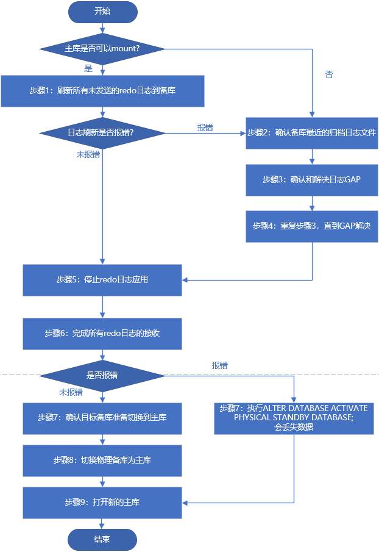

# 3. 19c单机DB+单实例DG--2

参考：[https://l080l.com/oracle/deploy/singledg12c.html](https://l080l.com/oracle/deploy/singledg12c.html)

# 1. 环境准备

## 1.1 环境规划

实验基于单机DB+单实例DG。

注：备库中的实例名SID是参数设置的，SID可以和主库相同。

||主库(主机1)|备库(主机2)|
| ----------------| -----------------------------------------| -----------------------------------------|
|DB 类型|单机|单机|
|OS|Centos 7.8|Centos 7.8|
|Hostname|Klaus|Klausdg|
|IP|192.168.2.2|192.168.2.3|
|DB_Version|12.1.0.2|12.1.0.2|
|ORACLE_BASE|/u01/app/oracle|/u01/app/oracle|
|ORACLE_HOME|/u01/app/oracle/product/12.1.0/dbhome_1|/u01/app/oracle/product/12.1.0/dbhome_1|
|DB_NAME|orcl|orcl|
|ORACLE_SID|orcl|orcldg|
|DB_Unique_Name|orcl|orcldg|
|Instance_Name|orcl|orcldg|
|service_names|orcl|orcldg|
|TNS_Name|ORCL|ORCLDG|
|闪回区|开启|开启|
|归档|开启|开启|

## 1.2 数据库安装(略)

* 在主库上安装数据库软件，并建监听和实例。
* 在备库上安装数据库软件，并建监听，但不创建实例，安装时选择只安装软件即可。

# 2. 主库配置

## 2.1 CDB和Non CDB环境下

* 如果实例处于多租户架构中，设置操作和Non-CDB方法相同，都在CDB下完成；
* 实验中有两个PDB1和PDB2，在创建备库后，默认两个PDB都会同步到备库，也可以通过参数指定只同步某个PDB；
* 也可以设置完同步的备库后，主库中再添加的PDB3也会同步到备库中。

```
# CDB环境下的实验配置中的主库实例也是orcl,备库是orcldg，需要设置主备不同的 DB_UNIQUE_NAME
# 同样可以通过name参数查看
SQL> show parameter name
NAME                                 TYPE        VALUE
------------------------------------ ----------- --------
cdb_cluster_name                     string
cell_offloadgroup_name               string
db_file_name_convert                 string
db_name                              string      orcl
db_unique_name                       string      orcl
global_names                         boolean     FALSE
instance_name                        string      orcl
lock_name_space                      string
log_file_name_convert                string
pdb_file_name_convert                string
processor_group_name                 string
service_names                        string      orcl
```

涉及的CDB简单操作

```
# 查看当前处于的那个容器
SQL> show con_name
CON_NAME
------------------
CDB$ROOT
# 如果处于CDB，可以查看所有PDB
SQL> show pdbs
CON_IDCON_NAME                 OPEN MODE  RESTRICTED
------ ------------------------ ---------- ----------
   2 PDB$SEED                 READ ONLY  NO
   3 PDB1                     READ WRITE NO
   4 PDB2                     READ WRITE NO
# 切换到PDB1
SQL> alter session set container=PDB1;
Session altered.
# 再次查看处于PDB1
SQL> show pdbs
CON_IDCON_NAME                 OPEN MODE  RESTRICTED
------ ------------------------ ---------- ----------
   3 PDB1                     READ WRITE NO
# 再次查看处于PDB1
SQL> show con_name
CON_NAME
----------
PDB1
# 切回CDB
SQL> alter session set container=CDB$ROOT;
Session altered.
```

## 2.2 开启归档

```
# 如果是CDB环境，先检查处于CDB根容器中，PDB下是不允许的
SQL> show con_name
CON_NAME
------------------
CDB$ROOT
# 查看归档是否Enable
SQL> archive log list
Database log modeArchive Mode
Automatic archivalEnabled
Archive destinationUSE_DB_RECOVERY_FILE_DEST
Oldest online log sequence129
Next log sequence to archive131
Current log sequence131
# 这里的归档路径是默认的 USE_DB_RECOVERY_FILE_DEST
# 如果没有开启，开启的步骤
shutdown immediate
startup mount
alter database archivelog;
# alter system set log_archive_dest_1='LOCATION=xxx' ;
alter database open;
SQL> alter system switch logfile;
```

‍

## 2.3 开启闪回

闪回区的管理，及闪回日志管理，数据库能闪回到过去的多久时间点，这个由闪回区大小以`db_flashback_retention_target`​参数控制，在闪回区大小足够的情况，下默认能闪回1440秒也就是一天的数据。

```
SQL> show parameter flashback
NAME                                 TYPE        VALUE
------------------------------------ ----------- ------------------------------
db_flashback_retention_target        integer     1440
```

‍

```
# 1、查看闪回未开启
SQL> select flashback_on from v$database;
FLASHBACK_ON
------------
NO
# 2、查看 db_recovery_file_dest 为空
SQL> show parameter recovery
NAME                                 TYPE        VALUE
------------------------------------ ----------- ------------------------------
db_recovery_file_dest                string
db_recovery_file_dest_size           big integer 0
recovery_parallelism                 integer     0
remote_recovery_file_dest            string
# 3、指定闪回区大小，指定闪回目录路径(顺序必须先设置闪回区大小，才能指定闪回目录，否则报错)
SQL> alter system set db_recovery_file_dest_size=4560m scope=spfile;
System altered.
SQL> shutdown immediate
SQL> startup
# 需要重启数据库才能生效，再继续修改目录位置，修改完目录也需要重启实例
# 4、先创建目录，在指定该闪回区域目录
mkdir -p /u01/app/oracle/fast_recovery_area
SQL> alter system set db_recovery_file_dest='/u01/app/oracle/fast_recovery_area';
System altered.
SQL> shutdown immediate
SQL> startup
# 5 开启闪回
SQL> alter database flashback on;
Database altered.
```

‍

## 2.4 开启所有PDB

如果是CDB环境，开启所有PDB。

```
col name for a10
SQL> select name,open_mode from v$pdbs;
NAME                           OPEN_MODE
------------------------------ --------------
PDB$SEED                       READ ONLY
PDB1                           MOUNTED
PDB2                           MOUNTED
# 开启 PDB
SQL> alter pluggable database all open;
Pluggable database altered.
# 查看
SQL> select name,open_mode from v$pdbs;
NAME       OPEN_MODE
---------- ----------
PDB$SEED   READ ONLY
PDB1       READ WRITE
PDB2       READ WRITE
```

## 2.5 设置数据库强制归档

有一些DDL语句可以通过指定`NOLOGGING`​子句的方式避免写REDO(目的是提高速度，某些时候确实有效)。指定数据库为`Force Logging`​模式后，数据库将会记录除临时表空间或临时回滚段外所有的操作，而忽略类似`NOLOGGING`​之类的指定参数。如果在执行`Force Logging`​时有`NOLOGGING`​之类的语句在执行，那么`Force Logging`​会等待，直到这类语句全部执行。

​`Force Logging`​是作为固定参数保存在控制文件中，因此其不受重启之类操作的影响(只执行一次即可)，如果想取消，可以通过`ALTER DATABASE NO FORCE LOGGING`​语句关闭强制记录。

```
# 如果是CDB环境，先检查处于CDB根容器中，PDB下是不允许的
# 查看
SQL> SELECT NAME, OPEN_MODE, FORCE_LOGGING FROM V$DATABASE;
NAME       OPEN_MODE            FORCE_LOGGING
---------- -------------------- -----------------
ORCL       READ WRITE           NO
# **开启强制归档**
SQL> alter database force logging;
```

‍

## 2.6 添加Standby redo log

### 2.6.1 说明

提示

为主库添加`standby redo log`​后，备库自动同步，所以备库不用再创建`standby redo log`​ 。

Data Guard在最大保护和最高可用性模式下，Standby数据库必须配置`standby redo log`​。

### 2.6.2 作用

实际上就是与主库接收到的重做日志相对应，也就是说备库调用`RFS`​进程将主库接收到的重做日志按顺序导入到`standby logfile`​ ，在主库创建`Standby logfile`​是便于发生角色转换后备用。

### 2.6.3 创建原则

* 确保`Standby redo log`​的大小与主库`online redo log`​的大小一致：

  * 如果主库为单实例数据库：`Standby redo log`​组数=主库日志总数+1。
  * 如果主库是`RAC`​数据库：`Standby redo log`​组数=(每线程的日志数+1)*最大线程数。
  * 不建议复用`Standby redo log`​，避免增加额外的`I/O`​以及延缓重做传输。

```
# 如果是CDB环境，先检查处于CDB根容器中，PDB下是不允许的；
# 在Oracle 12c的架构里，online redo log 和控制文件是保存在CDB中的，PDB中只有运行需要的数据文件；  
# 所以如果是CDB下，就在CDB中加 Standby redo log。
# 1、查看组数=3
SQL> select count(group#),thread# from v$log group by thread#;
COUNT(GROUP#)THREAD#
--------------------
31
# 2、大小=50M
SQL> select group#,bytes/1024/1024 from v$log;
GROUP#BYTES/1024/1024
---------------------
150
250
350
# 3、创建standby logfile(3+1组、每组50M)
#注意路径大小写，本文部署CDB环境时，SID是大写的ORCL
SQL> select * from v$standby_log;
alter database add standby logfile group 4 ('/u01/app/oracle/oradata/orcl/stantby_redo04.log') size 50m;
alter database add standby logfile group 5 ('/u01/app/oracle/oradata/orcl/stantby_redo05.log') size 50m;
alter database add standby logfile group 6 ('/u01/app/oracle/oradata/orcl/stantby_redo06.log') size 50m;
alter database add standby logfile group 7 ('/u01/app/oracle/oradata/orcl/stantby_redo07.log') size 50m;
# 4、验证查看
SQL> select * from v$standby_log;
SQL> select group#,bytes/1024/1024 from v$standby_log;
GROUP#  BYTES/1024/1024
-----   ---------------
4       50
5       50
6       50
7       50
SQL> select group#,status,type,member from v$logfile;
GROUP#STATUSTYPEMEMBER
----- -------------- ----------------------------------
3     ONLINE/u01/app/oracle/oradata/orcl/redo03.log
2     ONLINE /u01/app/oracle/oradata/orcl/redo02.log
1     ONLINE /u01/app/oracle/oradata/orcl/redo01.log
4     STANDBY /u01/app/oracle/oradata/orcl/stantby_redo04.log
5     STANDBY /u01/app/oracle/oradata/orcl/stantby_redo05.log
6     STANDBY /u01/app/oracle/oradata/orcl/stantby_redo06.log
7     STANDBY /u01/app/oracle/oradata/orcl/stantby_redo07.log
```

## 2.7 修改参数文件

### 2.7.1 设置DB唯一名称

```
# 通常主库的DB名和唯一名相同,show参数查看
alter system set db_unique_name='orcl' scope=spfile;
# 其中dg_config填写的是主备库的db_unique_name
alter system set log_archive_config='DG_CONFIG=(orcl,orcldg)' scope=spfile;
```

‍

### 2.7.2 设置归档日志的路径

```
# =前后不能有空格，本地的archive路径没有修改，使用默认
alter system set log_archive_dest_1='LOCATION=USE_DB_RECOVERY_FILE_DEST valid_for=(all_logfiles,all_roles) db_unique_name=orcl' scope=spfile;
alter system set log_archive_dest_2='SERVICE=ORCLDG ASYNC valid_for=(ONLINE_LOGFILES,PRIMARY_ROLE) db_unique_name=orcldg' scope=spfile;
# 第一个ORCLDG是备库tnsname.ora的连接名(最开头名称)
# 第二个orcldg是DB_UNIQUE_NAME
```

### 2.7.3 启用设置的日志路径

```
alter system set log_archive_dest_state_1=enable scope=spfile;
alter system set log_archive_dest_state_2=enable scope=spfile;
```

### 2.7.4 设置归档日志进程的最大数量

```
#（视实际情况调整）
alter system set log_archive_max_processes=30 scope=both;
```

### 2.7.5 设置备库从哪个数据库获取归档日志

```
# 只对standby库有效，在主库上设置是为了在故障切换后，主库可以成为备库使用，值就是TNSNAME
# fal表示fetch archive log
# fal_client用于发送日志，fal_server用于接受日志。也即无论是主库或备库，fal_server=对方，fal_client=自己
alter system set fal_server=orcldg;
alter system set fal_client=orcl;
```

### 2.7.6 设置文件管理模式

```
# 表示如果Primary数据库数据文件发生修改（如新建、重命名等）则按照本参数的设置在Standby数据库中作相应修改。
# 设为AUTO表示自动管理。设为MANUAL表示需要手工管理
# 此项设置为自动，不然在主库创建数据文件后，备库不会自动创建
alter system set standby_file_management=auto scope=spfile;
```

### 2.7.7 主备文件路径

如果主备库文件的存放路径不同，还需要设置以下两个参数（需要重启数据库生效）。

```
# 小写的orcl
alter system set db_file_name_convert='/u01/app/oracle/oradata/orcldg','/u01/app/oracle/oradata/orcl' scope=spfile;
alter system set log_file_name_convert='/u01/app/oracle/oradata/orcldg','/u01/app/oracle/oradata/orcl' scope=spfile;
# 大写的ORCL
alter system set db_file_name_convert='/u01/app/oracle/oradata/ORCLDG','/u01/app/oracle/oradata/ORCL' scope=spfile;
alter system set log_file_name_convert='/u01/app/oracle/oradata/ORCLDG','/u01/app/oracle/oradata/ORCL' scope=spfile;
```

### 2.7.8 设置数据库口令文件的使用模式

```
SQL> show parameter remote_login_passwordfile
NAMETYPEVALUE
----------------------------------------
remote_login_passwordfilestringEXCLUSIVE
# 默认也是EXCLUSIVE
alter system set remote_login_passwordfile=EXCLUSIVE scope=spfile;
```

### 2.7.9 设置默认监听

此处直接让监听为空即可保持后面创建的默认静态监听，否则备库无法从参数文件启动，者如果想要设置监听值，也可以：

```
alter system set local_listener='(DESCRIPTION =(ADDRESS=(PROTOCOL=TCP)(HOST=192.168.2.2)(PORT=1521)))';

SQL> show parameter local_listener;
NAME                                 TYPE        VALUE
------------------------------------ ----------- ------------------------------
local_listener                       string      LISTENER_ORCL
alter system set local_listener='';
SQL> show parameter local_listener;
NAME                                 TYPE        VALUE
------------------------------------ ----------- ------------------------------
local_listener                       string
```

# 3. 备库配置

## 3.1 变量环境

```
[oracle@klausdg ~]$ cat .bash_profile 
# .bash_profile
# Get the aliases and functions
if [ -f ~/.bashrc ]; then
    . ~/.bashrc
fi
# User specific environment and startup programs
PATH=$PATH:$HOME/.local/bin:$HOME/bin
export PATH
export EDITOR=vi
export ORACLE_SID=orcldg
export ORACLE_BASE=/u01/app/oracle
export ORACLE_HOME=$ORACLE_BASE/product/12.1.0/dbhome_1
export LD_LIBRARY_PATH=$ORACLE_HOME/lib:/usr/lib
export PATH=/u01/app/oracle/product/12.1.0/dbhome_1/bin:/bin:/usr/bin:/usr/sbin:/usr/local/bin:/usr/X11R6/bin
export PATH=$ORACLE_HOME/bin:$PATH
# 使变量生效
source ~/.bash_profile
```

## 3.2 主备库密码文件

```
# Data Guard环境中，数据库的sys用户名密码要相同，可直接将主库复制密码文件复制到备库
# 拷贝后备库的密码文件格式：ora+sid，Windows下格式为：PWD[sid].ora
scp $ORACLE_HOME/dbs/orapworcl oracle@192.168.2.3:$ORACLE_HOME/dbs/orapworcldg
```

## 3.3 修改参数文件

### 3.3.1 复制主库参数文件

备库的参数文件根据主库参数进行修改 ，主库上创建`pfile`​，然后拷贝给备库。

```
SQL> create pfile from spfile;
# 拷贝后的静态参数文件格式：init+sid.ora
$ scp $ORACLE_HOME/dbs/initorcl.ora oracle@192.168.2.3:$ORACLE_HOME/dbs/initorcldg.ora
```

### 3.3.2 修改initorcldg.ora内容

```
orcl.__data_transfer_cache_size=0
orcl.__db_cache_size=1761607680
orcl.__java_pool_size=16777216
orcl.__large_pool_size=33554432
orcl.__oracle_base='/u01/app/oracle'#ORACLE_BASE set from environment
orcl.__pga_aggregate_target=822083584
orcl.__sga_target=2466250752
orcl.__shared_io_pool_size=117440512
orcl.__shared_pool_size=520093696
orcl.__streams_pool_size=0
# 修改为备库的orcldg
*.audit_file_dest='/u01/app/oracle/admin/orcldg/adump'
*.audit_trail='db'
*.compatible='12.1.0.2.0'
*.control_file_record_keep_time=19
# 修改为备库的orcldg
*.control_files='/u01/app/oracle/oradata/orcldg/control01.ctl' #Restore Controlfile
*.db_block_size=8192
*.db_domain=''
# 修改顺序主备路径和主库的相反
*.db_file_name_convert='/u01/app/oracle/oradata/orcl','/u01/app/oracle/oradata/orcldg'
# DB名相同
*.db_name='orcl'
# 修改实例唯一名
*.db_unique_name='orcldg'
*.db_recovery_file_dest='/u01/app/oracle/fast_recovery_area'
*.db_recovery_file_dest_size=4560m
*.diagnostic_dest='/u01/app/oracle'
# 修改orcldgXDB
*.dispatchers='(PROTOCOL=TCP) (SERVICE=orcldgXDB)'
# 和主库配置顺序相反
*.fal_client='ORCLDG'
*.fal_server='ORCL'
# 使用默认监听
*.local_listener=''
# 和主库配置相同
*.log_archive_config='DG_CONFIG=(orcl,orcldg)'
# 修改为本库(备库)的唯一名
*.log_archive_dest_1='LOCATION=USE_DB_RECOVERY_FILE_DEST valid_for=(all_logfiles,all_roles) db_unique_name=ocrldg'
# 服务名修改为连接主库TNS的ORCL，DB唯一名修改为主库的orcl
*.log_archive_dest_2='SERVICE=ORCL LGWR ASYNC valid_for=(ONLINE_LOGFILES,PRIMARY_ROLE) db_unique_name=orcl'
*.log_archive_dest_state_1='ENABLE'
*.log_archive_dest_state_2='ENABLE'
*.log_archive_max_processes=30
# 和主库配置相反
*.log_file_name_convert='/u01/app/oracle/oradata/orcl','/u01/app/oracle/oradata/orcldg'
*.nls_date_format='yyyy-mm-dd hh24:mi:ss'
*.open_cursors=300
*.pga_aggregate_target=780m
*.processes=300
*.remote_login_passwordfile='EXCLUSIVE'
*.sga_target=2341m
*.standby_file_management='AUTO'
*.undo_tablespace='UNDOTBS1'
*.utl_file_dir='/home/oracle/logmnr'
```

## 3.4 备库创建spfile

```
SQL> create spfile from pfile;
File created.
SQL> 
```

## 3.5 创建备库所需路径

Oracle建议一般控制文件至少三个，放在不同的地方，本文主库没有设置。如果主库修改相关文件目录，拷贝过来的参数文件修改后也需要在备库中创建相关目录。

```
# 每个人的环境不同，根据备库参数文件创建所需目录
mkdir -p /u01/app/oracle/admin/orcldg/adump
mkdir -p /u01/app/oracle/oradata/orcldg#根据情况是否大写mkdir -p /u01/app/oracle/oradata/ORCLDG
mkdir -p /u01/app/oracle/fast_recovery_area
```

# 4. 主备库监听

## 4.1 开机自启动监听

设置主备库自动开启监听。 不建议备库设置自动开启数据库，因为DG开关有先后顺序，要手动开启。

```
## 修改/etc/rc.d/rc.local文件
su - root
\# vi /etc/rc.d/rc.local# 增加一行(/etc/rc.local是/etc/rc.d/rc.local的软连接)
su - oracle -c 'lsnrctl start'
## 授权rc.local文件可执行权限
\# chmod +x /etc/rc.d/rc.local
```

## 4.2 主库注册静态监听

```
# 静态注册的参数概念：
GLOBAL_DBNAME:#数据库服务名，默认和SID_NAME保持一致。在本例中这里需要填写PDB的服务名。
ORACLE_HOME:#实例运行的ORACLE_HOME目录，如果是集群环境这里也填写ORACLE的ORACLE_HOME目录。
SID_NAME:#数据库实例名。和数据库参数INSTANCE_NAME一致。
```

使用`Net Manager`​创建监听不容易出错，添加 `Database Services`​，客户端如果没有添加hosts信息或DNS建议写IP。
如果是CDB环境，监听也是相同静态配置即可，无需配置PDB监听或TNS

```
[oracle@klaus admin]$ cat listener.ora 
# listener.ora Network Configuration File: /u01/app/oracle/product/12.1.0/dbhome_1/network/admin/listener.ora
# Generated by Oracle configuration tools.

SID_LIST_LISTENER =
  (SID_LIST =
    (SID_DESC =
      (GLOBAL_DBNAME = orcl)
      (ORACLE_HOME = /u01/app/oracle/product/12.1.0/dbhome_1)
      (SID_NAME = orcl)
    )
  )

LISTENER =
  (DESCRIPTION_LIST =
    (DESCRIPTION =
      (ADDRESS = (PROTOCOL = TCP)(HOST = 192.168.2.2)(PORT = 1521))
    )
    (DESCRIPTION =
      (ADDRESS = (PROTOCOL = IPC)(KEY = EXTPROC1521))
    )
  )

ADR_BASE_LISTENER = /u01/app/oracle
```

## 4.3 备库注册静态监听

```
[oracle@klausdg admin]$ cat listener.ora
# listener.ora Network Configuration File: /u01/app/oracle/product/12.1.0/dbhome_1/network/admin/listener.ora
# Generated by Oracle configuration tools.

SID_LIST_LISTENER =
  (SID_LIST =
    (SID_DESC =
      (GLOBAL_DBNAME = orcldg)
      (ORACLE_HOME = /u01/app/oracle/product/12.1.0/dbhome_1)
      (SID_NAME = orcldg)
    )
  )

LISTENER =
  (DESCRIPTION_LIST =
    (DESCRIPTION =
      (ADDRESS = (PROTOCOL = TCP)(HOST = 192.168.2.3)(PORT = 1521))
    )
    (DESCRIPTION =
      (ADDRESS = (PROTOCOL = IPC)(KEY = EXTPROC1521))
    )
  )

ADR_BASE_LISTENER = /u01/app/oracle
```

## 4.4 主备库TNS监听相同

```
[oracle@klausdg admin]$ cat tnsnames.ora
# tnsnames.ora Network Configuration File: /u01/app/oracle/product/12.1.0/dbhome_1/network/admin/tnsnames.ora
# Generated by Oracle configuration tools.

ORCLDG =
  (DESCRIPTION =
    (ADDRESS_LIST =
      (ADDRESS = (PROTOCOL = TCP)(HOST = 192.168.2.3)(PORT = 1521))
    )
    (CONNECT_DATA =
      (SERVER = DEDICATED)
      (SERVICE_NAME = orcldg)
    )
  )

ORCL =
  (DESCRIPTION =
    (ADDRESS_LIST =
      (ADDRESS = (PROTOCOL = TCP)(HOST = 192.168.2.2)(PORT = 1521))
    )
    (CONNECT_DATA =
      (SERVER = DEDICATED)
      (SERVICE_NAME = orcl)
    )
  )
```

## 4.5 主备连接测试

```
# 主备库监听重启
lsnrctl stop
lsnrctl start
# 主备测试
tnsping orcl
tnsping orcldg
# 测试登录 #
# 主库登陆 在密码文件拷贝后才可以登陆
[oracle@klaus ~]$ sqlplus sys/Oracle#2020@orcl as sysdba
SQL*Plus: Release 12.1.0.2.0 Production on Mon Aug 16 01:45:02 2021
Copyright (c) 1982, 2014, Oracle. All rights reserved.
Connected to:
Oracle Database 12c Enterprise Edition Release 12.1.0.2.0 - 64bit Production
With the Partitioning, OLAP, Advanced Analytics and Real Application Testing options
SQL>
[oracle@klaus ~]$ sqlplus sys/Oracle#2020@orcldg as sysdba
SQL*Plus: Release 12.1.0.2.0 Production on Mon Aug 16 01:45:56 2021
Copyright (c) 1982, 2014, Oracle. All rights reserved.
Connected to an idle instance.
SQL>
# 备库登录
[oracle@klausdg ~]$ sqlplus sys/Oracle#2020@orcl as sysdba
SQL*Plus: Release 12.1.0.2.0 Production on Mon Aug 16 01:47:24 2021
Copyright (c) 1982, 2014, Oracle. All rights reserved.
Connected to:
Oracle Database 12c Enterprise Edition Release 12.1.0.2.0 - 64bit Production
With the Partitioning, OLAP, Advanced Analytics and Real Application Testing options
SQL>
[oracle@klausdg ~]$ sqlplus sys/Oracle#2020@orcldg as sysdba
SQL*Plus: Release 12.1.0.2.0 Production on Mon Aug 16 01:47:58 2021
Copyright (c) 1982, 2014, Oracle. All rights reserved.
Connected to an idle instance.
SQL>
```

# 5. 方式一：物理备库之RMAN Duplicate

Duplicate 方式创建物理备库；通过这种方式直接在线从主库搭建物理备库。
本次实验：Non-CDB环境

## 5.1 备库启动到nomount状态

```
# 使用pfile启动到nomount
[oracle@klausdg ~]$ sqlplus /  as sysdba
SQL> startup nomount pfile='/u01/app/oracle/product/12.1.0/dbhome_1/dbs/initorcldg.ora';
ORACLE instance started.
Total System Global Area 2466250752 bytes
Fixed Size                  2927384 bytes
Variable Size             671089896 bytes
Database Buffers         1778384896 bytes
Redo Buffers               13848576 bytes
# 创建Spfile
SQL> create spfile from pfile;
SQL> shutdown immediate;
# 启动到nomount
SQL> startup nomount
```

## 5.2 登陆RMAN连接主备库

```
# 主库target/orcl 备库auxiliary/orcldg
# 主备库DB_NAME必须一致，主库是open状态，备库是nomount状态
[oracle@klausdg ~]$ rman target sys/Oracle#2020@orcl auxiliary sys/Oracle#2020@orcldg
Recovery Manager: Release 12.1.0.2.0 - Production on Mon Aug 16 16:54:46 2021
Copyright (c) 1982, 2014, Oracle and/or its affiliates.  All rights reserved.
connected to target database: ORCL (DBID=1576583420)
connected to auxiliary database: ORCL (not mounted)
RMAN>
```

## 5.3 开始 Duplicate

```
RMAN> duplicate target database for standby from active database dorecover nofilenamecheck;
# 执行过程（略）
Starting Duplicate Db at 16-AUG-21
using target database control file instead of recovery catalog
allocated channel: ORA_AUX_DISK_1
channel ORA_AUX_DISK_1: SID=243 device type=DISK
current log archived
...
....
.....
media recovery complete, elapsed time: 00:00:01
Finished recover at 16-AUG-21
Finished Duplicate Db at 16-AUG-21
```

# 6. 方式二：物理备库之RMAN备份还原

使用 RMAN 备份恢复方法，将备份的文件和控制文件传到备库恢复。
本次实验：Non-CDB环境

## 6.1 主库RMAN全备

```
# 创建RMAN备份路径
mkdir -p /u01/rmanbackup
# RMAN备份
$ rman target /
RMAN> backup database format='/u01/rmanbackup/FULL_%d_%T_%s.dbf';
Starting backup at 18-AUG-21
using target database control file instead of recovery catalog
allocated channel: ORA_DISK_1
channel ORA_DISK_1: SID=19 device type=DISK
channel ORA_DISK_1: starting full datafile backup set
channel ORA_DISK_1: specifying datafile(s) in backup set
input datafile file number=00001 name=/u01/app/oracle/oradata/orcl/system01.dbf
input datafile file number=00003 name=/u01/app/oracle/oradata/orcl/sysaux01.dbf
input datafile file number=00004 name=/u01/app/oracle/oradata/orcl/undotbs01.dbf
input datafile file number=00005 name=/u01/app/oracle/oradata/orcl/test.dbf
input datafile file number=00006 name=/u01/app/oracle/oradata/orcl/users01.dbf
channel ORA_DISK_1: starting piece 1 at 18-AUG-21
channel ORA_DISK_1: finished piece 1 at 18-AUG-21
piece handle=/u01/rmanbackup/FULL_ORCL_20210818_1.dbf tag=TAG20210818T220447 comment=NONE
channel ORA_DISK_1: backup set complete, elapsed time: 00:01:25
channel ORA_DISK_1: starting full datafile backup set
channel ORA_DISK_1: specifying datafile(s) in backup set
including current control file in backup set
including current SPFILE in backup set
channel ORA_DISK_1: starting piece 1 at 18-AUG-21
channel ORA_DISK_1: finished piece 1 at 18-AUG-21
piece handle=/u01/rmanbackup/FULL_ORCL_20210818_2.dbf tag=TAG20210818T220447 comment=NONE
channel ORA_DISK_1: backup set complete, elapsed time: 00:00:01
Finished backup at 18-AUG-21
```

## 6.2 主库备份控制文件

```
RMAN> backup current controlfile for standby format '/u01/rmanbackup/control.bak';
```

## 6.3 拷贝备份文件到备库

```
# 创建和主库相同的路径
mkdir -p /u01/rmanbackup
[oracle@klaus ~]$ cd /u01/rmanbackup/
[oracle@klaus rmanbackup]$ ls
control.bak  FULL_ORCL_20210818_1  FULL_ORCL_20210818_2
# 传输文件到备库改路径下
[oracle@klaus rmanbackup]$ scp /u01/rmanbackup/* oracle@192.168.2.3:/u01/rmanbackup
oracle@192.168.2.3's password: 
control.bak100% 9888KB  36.6MB/s   00:00  
FULL_ORCL_20210818_1.dbf100% 1299MB  51.9MB/s   00:25  
FULL_ORCL_20210818_2.dbf100% 9920KB  18.0MB/s   00:00  
```

## 6.4 备库启动到nomount状态

```
# 使用pfile启动到nomount
# 如果已经创建spfile可以直接启动到 nomount状态
[oracle@klausdg ~]$ echo $ORACLE_SID
orcldg
[oracle@klausdg ~]$ sqlplus / as sysdba
# 启动
SQL> startup nomount pfile='/u01/app/oracle/product/12.1.0/dbhome_1/dbs/initorcldg.ora';
ORACLE instance started.
Total System Global Area 2466250752 bytes
Fixed Size                  2927384 bytes
Variable Size             671089896 bytes
Database Buffers         1778384896 bytes
Redo Buffers               13848576 bytes
# 创建Spfile
SQL> create spfile from pfile;
SQL> shutdown immediate;
# 启动到nomount
SQL> startup nomount
```

## 6.5 备库恢复控制文件

```
[oracle@klausdg ~]$ rman target /
RMAN> restore standby controlfile from '/u01/rmanbackup/control.bak';
..
...
Finished restore at 18-AUG-21
```

## 6.6 备库mount

```
SQL> alter database mount;
Database altered.
```

## 6.7 还原数据库

```
RMAN> restore database;
Starting restore at 19-AUG-21
released channel: ORA_DISK_1
Starting implicit crosscheck backup at 19-AUG-21
allocated channel: ORA_DISK_1
channel ORA_DISK_1: SID=355 device type=DISK
Crosschecked 2 objects
Finished implicit crosscheck backup at 19-AUG-21
Starting implicit crosscheck copy at 19-AUG-21
using channel ORA_DISK_1
Crosschecked 2 objects
Finished implicit crosscheck copy at 19-AUG-21
searching for all files in the recovery area
cataloging files...
no files cataloged
using channel ORA_DISK_1
channel ORA_DISK_1: starting datafile backup set restore
channel ORA_DISK_1: specifying datafile(s) to restore from backup set
channel ORA_DISK_1: restoring datafile 00001 to /u01/app/oracle/oradata/orcldg/system01.dbf
channel ORA_DISK_1: restoring datafile 00003 to /u01/app/oracle/oradata/orcldg/sysaux01.dbf
channel ORA_DISK_1: restoring datafile 00004 to /u01/app/oracle/oradata/orcldg/undotbs01.dbf
channel ORA_DISK_1: restoring datafile 00005 to /u01/app/oracle/oradata/orcldg/test.dbf
channel ORA_DISK_1: restoring datafile 00006 to /u01/app/oracle/oradata/orcldg/users01.dbf
channel ORA_DISK_1: reading from backup piece /u01/rmanbackup/FULL_ORCL_20210818_1.dbf
channel ORA_DISK_1: piece handle=/u01/rmanbackup/FULL_ORCL_20210818_1.dbf tag=TAG20210818T235901
channel ORA_DISK_1: restored backup piece 1
channel ORA_DISK_1: restore complete, elapsed time: 00:00:35
Finished restore at 19-AUG-21

```

# 7. 方式三：物理备库之CDB下的DBCA

## 7.1 DBCA备库说明

前两个物理备库方式都是基于Non-CDB创建DG的，也可以在CDB下通过Duplicate或RMAN备份还原的方法创建DG，配置主备库的条件相同，处于CDB状态下设置主库的配置即可；
到 12cR2 (12.2.0.1)后，新增 DBCA 方式直接建立物理备库的方法。但是对版本和实例环境有一定限制条件：
**12cR2中:**

```
# 1、12cR2 主库必须是单机环境，非 RAC 数据库；
# 若主库是 RAC 数据库，错误如下：
[FATAL] [DBT-16056] Specified primary database is not a Single Instance (SI) database.
CAUSE: Duplicate database operation is supported only for SI databases.
```

```
# 2、12cR2 主库必须是非 CDB 环境；
# 若主库是 CDB 环境，错误如下：
[FATAL] [DBT-16057] Specified primary database is a container database (CDB).
CAUSE: Duplicate database operation is supported only for non container databases.
```

**18c 及以后:** 
18c(12.2.0.2)开始，这些限制条件已经取消，即主库是 CDB 或 RAC环境都可以通过 dbca 来创建物理备库。
本节DBCA备库环境：19c的CDB环境，主/备库的环境和前面的配置方法相同。

## 7.2 配置Hosts

在没有DNS的配置下，需要配置Hosts，否则DBCA过程通讯报错：

```
ORA-17627：TNS：could not resolve connect identifier specified   
```

```
# cat /etc/hosts  
192.168.2.2klaus  
192.168.2.3klausdg
```

## 7.3 DBCA过程

### 7.3.1 主库开启

```
# 如果是CDB环境，先开启数据库也要开启PDB
SQL> startup
SQL> alter pluggable database all open;
Pluggable database altered.
```

### 7.3.2 DBCA命令

不需要备库数据库处于`nomount`​状态，监听开启后备库上直接DBCA即可。
如果是CDB环境，完成后CDB会直接开启，再开启PDB即可。

```
# 19c 官网展示的模板
dbca -createDuplicateDB 
    -gdbName global_database_name 
    -primaryDBConnectionString easy_connect_string_to_primary
    -sid database_system_identifier
    [-createAsStandby 
        [-dbUniqueName db_unique_name_for_standby]]
    [-customScripts scripts_list]
# 19c 官网DBCA案例  
#Database DB_UNIQUE_NAME Oracle Net Service Name
#Primarychicagochicago
#Physical standbybostonboston
# dbca –silent -createDuplicateDB -primaryDBConnectionString  myprimary.domain:1523/chicago.domain -gdbName chicago.domain -sid boston -initParams instance_name=boston –createAsStandby

# 本实验如下设置
dbca -silent -createDuplicateDB \
-gdbName orcl \
-sid orcldg \
-sysPassword Oracle#2020 \
-primaryDBConnectionString 192.168.2.2:1521/ORCL \
-nodelist klausdg \
-databaseConfigType SINGLE \
-createAsStandby -dbUniqueName orcldg
```

```
# 执行过程
[oracle@klausdg ~]$ dbca -silent -createDuplicateDB \
> -gdbName orcl \
> -sid orcldg \
> -sysPassword Oracle#2020 \
> -primaryDBConnectionString 192.168.2.2:1521/ORCL \
> -nodelist klausdg \
> -databaseConfigType SINGLE \
> -createAsStandby -dbUniqueName orcldg
Prepare for db operation
22% complete
Listener config step
44% complete
Auxiliary instance creation
67% complete
RMAN duplicate
89% complete
Post duplicate database operations
100% complete
Look at the log file "/u01/app/oracle/cfgtoollogs/dbca/orcldg/orcldg.log" for further details.
```

‍

# 8. 开启并验证DG同步

## 8.1 开启实时同步

```
alter database open;
# 如果是CDB环境，需要开启pdb
SQL> alter pluggable database all open;
alter database recover managed standby database using current logfile disconnect from session;
# 从12C开始，RECOVER语句，不需要再指定using current logfile，Oracle会自动判断日志应用是否是实时的。
```

## 8.2 备库开启闪回

```
# 查看闪回
SQL> select flashback_on from v$database;
FLASHBACK_ON
------------
NO
# 取消实时同步
SQL> alter database recover managed standby database cancel;
# 关闭数据库
SQL> shutdown immediate
SQL> startup mount
SQL> alter database flashback on;
# 开启数据库
SQL> alter database open;
# 再次开启同步
SQL> alter database recover managed standby database using current logfile disconnect from session;
# 查看
SQL> select open_mode from v$database;
OPEN_MODE 
--------------------
READ ONLY WITH APPLY
# 查看主库 PRIMARY
SQL> select log_mode,open_mode ,database_role from v$database;
LOG_MODE     OPEN_MODE            DATABASE_ROLE
------------ -------------------- ----------------
ARCHIVELOG   READ WRITE           PRIMARY
# 查看备库 PHYSICAL STANDBY
SQL> select log_mode,open_mode ,database_role from v$database;
LOG_MODE     OPEN_MODE            DATABASE_ROLE
------------ -------------------- ----------------
ARCHIVELOG   READ ONLY            PHYSICAL STANDBY
```

## 8.3 归档同步验证

```
# 主库切换归档, 查询主库备库最大归档序号，一致即归档同步成功
SQL> alter system archive log current;
SQL> select max(sequence#) from v$archived_log;
MAX(SEQUENCE#)
--------------
            72
# 查看主备归档日志是否能正常传输（APPLIED=yes）
SQL> select SEQUENCE#, FIRST_TIME, NEXT_TIME, APPLIED, ARCHIVED from V$ARCHIVED_LOG;
```

## 8.4 查看主备库状态

```
# 主库
SQL> select switchover_status,database_role from v$database;
SWITCHOVER_STATUS    DATABASE_ROLE
-------------------- ----------------
TO STANDBY           PRIMARY
# 备库
SQL> select switchover_status,database_role from v$database;
SWITCHOVER_STATUS    DATABASE_ROLE
-------------------- ----------------
NOT ALLOWED          PHYSICAL STANDBY
```

## 8.5 主库查看备库归档路径报错

```
# 主库 查看archive_log_dest_2列是否有error
SQL> select status,error from v$archive_dest where dest_id=2;
STATUS    ERROR
--------- --------------------
VALID
```

## 8.6 主库Dataguard的状态信息

```
# 查看Dataguard的状态信息
col message format a150
select message_num,message from v$dataguard_status;
# 查看GAP信息
SELECT STATUS,GAP_STATUS FROM v$ARCHIVE_DEST_STATUS WHERE DEST_ID=2;
```

## 8.7 建表测试

```
# 主库
create table test(id number);
insert into test values(1);
commit;
select * from test;
# 备库
select * from test;
```

‍

# 9. DG切换和恢复

配置DG的目的就是为了在主库出现故障时，备库能够提供服务，保证业务的正常运行。
DG的故障切换分为`switchover`​和`failover`​两种。

## 9.1 Switchover

### 9.1.1 主库上操作

```
# 1、主库查询状态
# 注意：下面查询结果为TO STANDBY 或 SESSIONS ACTIVE表明可以进行切换
SQL> select switchover_status,database_role from v$database;
SWITCHOVER_STATUS    DATABASE_ROLE
-------------------- ----------------
TO STANDBY           PRIMARY
# 2、主库开始切换
SQL> alter database commit to switchover to physical standby;
Database altered.
# 主库有会话连接的时候使用如下命令
# alter database commit to switchover to physical standby with session shutdown;
# 3、主库变备库，开启到mount状态
SQL> startup mount
ORACLE instance started.
Total System Global Area 2466250752 bytes
Fixed Size                  2927384 bytes
Variable Size             671089896 bytes
Database Buffers         1778384896 bytes
Redo Buffers               13848576 bytes
Database mounted.
SQL> select database_role from v$database;
DATABASE_ROLE
----------------
PHYSICAL STANDBY
```

### 9.1.2 备库上操作

```
# 1、备库查询状态
# 注意：下面查询结果为TO PRIMARY 或 SESSIONS ACTIVE表明可以进行切换
SQL> select switchover_status,database_role from v$database;
SWITCHOVER_STATUS    DATABASE_ROLE
-------------------- ----------------
TO PRIMARY           PHYSICAL STANDBY
# 2、备库开始切换
SQL> alter database commit to switchover to primary with session shutdown;
Database altered.
# 3、开启数据库
SQL>  alter database open;
Database altered.
# 4、查询状态，已经变成主库
SQL> select switchover_status,database_role,open_mode from v$database;
SWITCHOVER_STATUS    DATABASE_ROLE    OPEN_MODE
-------------------- ---------------- --------------------
TO STANDBY           PRIMARY          READ WRITE
```

‍

### 9.1.3 新备库(原主库)上的操作

```
# 1、开机数据库open
SQL> alter database open;
Database altered.
# 2、开启同步
SQL> alter database recover managed standby database using current logfile disconnect from session;
Database altered.
# 3、主备检查切换状态
SQL> select open_mode,database_role,db_unique_name from v$database;
```

‍

### 9.1.4 验证

```
# 新主库切换归档，主备查询
alter system archive log current;
SQL> select max(sequence#) from v$archived_log;
# 新主库表插入数据测试
insert into test values(2); 
commit;
select * from test;
```

‍

## 9.2 Failover

### 9.2.1 故障转移操作流程图

​​

Failover是当主库真正出现严重系统故障，如数据库宕机，软硬件故障导致主库不能支持服务，从而进行的切换动作。

注意：

为了能够在failover后能够恢复DG,需要在主库上开启flashback，否则DG就可能需要重新搭建。

先把主库关机，模拟Failover 。

#### Step1.刷新所有未发送的日志到备库

如果主库还可以启动到mount状态，则刷新所有未发送的归档日志和在线redo日志到备库。如果这一步成功了，则可以保证数据零丢失。 如果主库不能mount，则执行第2步。

```
# 主库
SQL> ALTER SYSTEM FLUSH REDO TO 'target_db_name';
# target_db_name为备库的db_unique_name。
# 如果上面的语句执行成功，则直接跳到步骤5；如果执行报错，则执行步骤2。
```

#### Step2.确认备库接收到最新归档日志文件

在备库上使用`V\$ARCHIVED_LOG`​视图，查询每个实例的最大日志序列号的日志，通过查询出的日志序列号与主库的最大日志序列号比较（主库的直接到服务器上去查看归档日志文件），可以直到缺失了哪些归档日志文件。

```
SQL> SELECT UNIQUE THREAD# AS THREAD, MAX(SEQUENCE#) OVER (PARTITION BY thread#) AS LAST from V$ARCHIVED_LOG;
```

如果可能，对于还未传输到备库的日志文件，直接从主数据库上拷贝过去，然后注册日志，注册日志放入如下：

```
SQL> ALTER DATABASE REGISTER PHYSICAL LOGFILE 'filespec1';
```

#### Step3.确认和解决日志GAP

在备库上查询`V$ARCHIVE_GAP`​视图，确认是否存在日志GAP，如：

```
SQL> SELECT THREAD#, LOW_SEQUENCE#, HIGH_SEQUENCE# FROM V$ARCHIVE_GAP;
THREAD#    LOW_SEQUENCE# HIGH_SEQUENCE#
---------- ------------- --------------
1            90             92
```

在这个例子中，GAP存在于线程1的90，91，92号归档日志上，如果可能，拷贝这些日志到备库服务器上，然后注册日志。

```
SQL> ALTER DATABASE REGISTER PHYSICAL LOGFILE 'filespec1';
```

#### Step4.重复步骤3直到把所有GAP解决

继续在备库上查询`V$ARCHIVE_GAP`​视图，直到没有数据返回，说明没有GAP。 如果在执行了步骤2到步骤4后，依然无法解决日志GAP（例如，主服务器宕机，我们无法访问主数据库，导致日志无法同步到备库），则执行failover切换后会存在数据丢失。

#### Step5.备库停止日志应用

```
SQL> ALTER DATABASE RECOVER MANAGED STANDBY DATABASE CANCEL;
```

#### Step6.完成所有已经接收日志的应用

```
SQL> ALTER DATABASE RECOVER MANAGED STANDBY DATABASE FINISH;
# SQL> alter database recover managed standby database finish force;
```

如果这个操作未报错，则执行步骤7。 如果发生报错，尝试解决错误，再次执行以上SQL语句，如果报错无法解决，可以在目标备库执行以下语句来进行故障转移（会丢失数据）

```
# 会丢失数据
# SQL> ALTER DATABASE ACTIVATE PHYSICAL STANDBY DATABASE;
```

这个语句完成后跳到第9步执行。

#### Step7.确认目标备库准备切换为主库

```
SQL> SELECT SWITCHOVER_STATUS FROM V$DATABASE;
SWITCHOVER_STATUS
-----------------
TO PRIMARY
```

如果`SWITCHOVER_STATUS`​的值为“`TO PRIMARY`​”或者“`SESSIONS ACTIVE`​”，则说明备库已经准备切换为主库。如果不是这2个值，确认Redo日志应用是否还是活跃的，继续查询，直到变为这2个值中的一个为止。

#### Step8.切换物理备库为主库

使用下面的SQL语句进行切换：

```
SQL> ALTER DATABASE COMMIT TO SWITCHOVER TO PRIMARY WITH SESSION SHUTDOWN;
```

#### STEP9.打开新的主库

```
SQL> ALTER DATABASE OPEN;
Database altered.
# 查看状态
SQL> select switchover_status,database_role,open_mode from v$database;
SWITCHOVER_STATUS    DATABASE_ROLE    OPEN_MODE
-------------------- ---------------- --------------------
FAILED DESTINATION   PRIMARY          READ WRITE
# 当新主库的SWITCHOVER_STATUS状态为FAILED DESTINATION时，是因为备库不在mount状态下,这里已经没有备库
```

### 9.2.11 简易操作

当备库和主库(主库无法打开)最终同步的情况下，以下简易步骤直接操作：

```
#1、停止日志应用
SQL> alter database recover managed standby database cancel;
Database altered.
#2、完成所有已经接收日志的应用
SQL> alter database recover managed standby database finish force;
Database altered.
#3、切换物理备库为主库
SQL> select database_role from v$database;
DATABASE_ROLE
----------------
PHYSICAL STANDBY
SQL> alter database commit to switchover to primary;
#SQL> alter database commit to switchover to primary with session shutdown;
Database altered.
SQL> select database_role from v$database;
DATABASE_ROLE
----------------
PRIMARY
#4、开启数据库open
SQL> alter database open;
Database altered.
#5、查看状态
SQL> select switchover_status,database_role,open_mode from v$database;
SWITCHOVER_STATUS    DATABASE_ROLE    OPEN_MODE
-------------------- ---------------- --------------------
FAILED DESTINATION   PRIMARY          READ WRITE
# 当主库的SWITCHOVER_STATUS状态为FAILED DESTINATION时，是因为备库不在mount状态下,这里已经没有备库
```

## 9.3 Failover恢复

上面提到了`failover`​，这种情形是当主库真正出现异常之后，才会执行的操作，那么执行过`failover`​ 之后，如何在重新构建DG，这里利用`flashback database`​来重构，具体方法如下：

### 9.3.1 在新主库上执行

```
# 查询变成新主库的scn
SQL> select to_char(standby_became_primary_scn) from v$database;
TO_CHAR(STANDBY_BECAME_PRIMARY_SCN)
----------------------------------------
12514234
```

### 9.3.2 在老主库上执行

```
# 要将之前出问题的老主库变成备库
# 1、启动 mount 状态下
SQL> startup mount
ORACLE instance started.
Total System Global Area 2466250752 bytes
Fixed Size                  2927384 bytes
Variable Size             671089896 bytes
Database Buffers         1778384896 bytes
Redo Buffers               13848576 bytes
Database mounted.
# 2、闪回到新的主库查询的scn
SQL> flashback database to scn 12514234;
Flashback complete.
# 3、转为备库
SQL> alter database convert to physical standby;
Database altered.
# 4、关闭
SQL> shutdown immediate
ORA-01109: database not open
Database dismounted.
ORACLE instance shut down.
# 5、开启
SQL> startup
ORACLE instance started.
Total System Global Area 2466250752 bytes
Fixed Size                  2927384 bytes
Variable Size             671089896 bytes
Database Buffers         1778384896 bytes
Redo Buffers               13848576 bytes
Database mounted.
Database opened.
# 6、开启同步
SQL> alter database recover managed standby database using current logfile disconnect from session;
Database altered.
# 7、同步验证(略)
```

# 10. 方式四：逻辑备库Logical Standby

## 10.1 说明

* Oracle Data Guard逻辑备库是利用主库的一个备份首先建立一个物理备库，然后再将其转换为逻辑备库。
* 这之后主库将日志传递到备库，备库利用`logminer`​从主库的日志中解析出主库所执行过的SQL，在备库上重新执行一遍，从而保证与主库的数据在逻辑上保持一致。
* 与物理备库相对应的是，物理备库使用的是`redo apply`​，逻辑备库使用的是`sql apply`​。
* 因此逻辑备库仅仅保证数据与主库是在逻辑上是一致的，从而逻辑备库可以处于open状态下并进行相应的DML操作。

## 10.2 备库停止MGR(Redo apply应用)

```
# 对于将物理备库切换到逻辑备库，需要在主库构建LogMiner字典及启用补充日志
# 因此应先停用备库的MRP进程，避免产生额外的Redo Apply
SQL> alter database recover managed standby database cancel;
```

## 10.3 主库构建LogMiner字典

```
# 1、创建字典表空间
SQL> create tablespace logmnrtbs datafile '/u01/app/oracle/oradata/orcl/logmnrtbs.dbf' size 100m autoextend on next 5m maxsize 2000m;
# 2、关联字典表空间
SQL> execute dbms_logmnr_d.set_tablespace('logmnrtbs');
PL/SQL procedure successfully completed.
# 3、构建LogMiner字典
SQL> exec dbms_logstdby.build;
PL/SQL procedure successfully completed.
```

## 10.4 物理备库恢复为逻辑备库

```
SQL> select name,open_mode,database_role,protection_mode from v$database; 
NAME      OPEN_MODE            DATABASE_ROLE    PROTECTION_MODE
--------- -------------------- ---------------- --------------------
ORCL      MOUNTED              PHYSICAL STANDBY MAXIMUM PERFORMANCE
========================================================================
# 1、关闭,必须一致性性关闭数据库
SQL> shutdown immediate
# 2、以exclusive方式启动到mount
SQL> startup mount exclusive
# 3、转换为逻辑备库并设置新的db_name
SQL> ALTER DATABASE RECOVER TO LOGICAL STANDBY ORCLLG; 
# 4、关闭,必须一致性性关闭数据库
SQL> shutdown immediate
# 5、正常启动到mount
SQL> startup mount
========================================================================
##可以看到name自动改变，为读写模式，日志序列也从1开始
SQL> select name,open_mode,database_role,protection_mode from v$database; 
NAME      OPEN_MODE            DATABASE_ROLE    PROTECTION_MODE
--------- -------------------- ---------------- --------------------
ORCLLG    MOUNTED              LOGICAL STANDBY  MAXIMUM PERFORMANCE
SQL> archive log list;
Database log mode              Archive Mode
Automatic archival             Enabled
Archive destination            USE_DB_RECOVERY_FILE_DEST
Oldest online log sequence     1
Next log sequence to archive   1
Current log sequence           1
```

## 10.5 开启逻辑备库并同步

```
# 由于逻辑Standby与Primary数据库事务并不一致，因此第一次打开时必须指定RESETLOGS子句
SQL> ALTER DATABASE OPEN RESETLOGS;
# 执行启动REDO应用的命令，附加APPLY IMMEDIATE子句，以打开实时应用
SQL> ALTER DATABASE START LOGICAL STANDBY APPLY IMMEDIATE; 
```

## 10.6 测试

```
+++++++++++++++++++++++++++++++++++++++++++++++++++++++++++++++
# 测试逻辑DG部分
+++++++++++++++++++++++++++++++++++++++++++++++++++++++++++++++
# 在测试数据是否正常同步时，不要使用数据库的内部账号，逻辑dg在默认情况下不传输系统用户下，用户自行创建的数据
# 比如在sys用户下创建一个test表，这个表不会同步到逻辑备库
# 可以使用下列语句查看哪些用户作为内部用户
SQL> SELECT OWNER FROM DBA_LOGSTDBY_SKIP WHERE STATEMENT_OPT = 'INTERNAL SCHEMA';
+++++++++++++++++++++++++++++++++++++++++++++++++++++++++++++++
# 以下在方式四的逻辑DG环境中，主库解锁scott，备库已也会同步经解锁该用户，并创建表等操作
+++++++++++++++++++++++++++++++++++++++++++++++++++++++++++++++
SQL> alter user scott account unlock;
User altered.
SQL> conn scott/tiger
ERROR:
ORA-28002: the password will expire within 7 days
create table test(id number);
insert into test values(1);
commit;
# 主备查询一致，至此逻辑Standby创建完成.
select * from test;
```

## 10.7 Swichover

### 10.7.1 状态检查

```
# 1、查看当前Primary数据库状态：
#如果该查询返回TO STANDBY 或SESSIONS ACTIVE则表示状态正常，可以执行转换操作
# 主库
SQL> SELECT SWITCHOVER_STATUS,DATABASE_ROLE FROM V$DATABASE;
SWITCHOVER_STATUS    DATABASE_ROLE
-------------------- ----------------
TO STANDBY           PRIMARY
# 备库
SQL> SELECT SWITCHOVER_STATUS,DATABASE_ROLE FROM V$DATABASE;
SWITCHOVER_STATUS    DATABASE_ROLE
-------------------- ----------------
NOT ALLOWED          LOGICAL STANDBY
```

### 10.7.2 [准备]转换Primary为逻辑Standby

```
# 2、执行下列语句，将Primary置为准备转换的状态：
SQL> ALTER DATABASE PREPARE TO SWITCHOVER TO LOGICAL STANDBY;
Database altered.
# 执行完上述操作后，Primary数据库就开始为角色的转换打好基础，时刻准备着接收来自逻辑Standby数据库，也就是未来的新Primary数据库发来的REDO数据。
# 查看一下SWITCHOVER_STATUS的状态：
SQL> SELECT SWITCHOVER_STATUS,DATABASE_ROLE FROM V$DATABASE;
SWITCHOVER_STATUS    DATABASE_ROLE
-------------------- ----------------
PREPARING SWITCHOVER PRIMARY
```

### 10.7.3 [准备]转换逻辑Standby为Primary

```
# 转换为Primary的PREPARE状态
# 语句执行时响应会稍微有点慢
SQL> ALTER DATABASE PREPARE TO SWITCHOVER TO PRIMARY;
Database altered.
# 执行完后查看当前逻辑Standby数据库的转换状态：
SQL> SELECT SWITCHOVER_STATUS,DATABASE_ROLE FROM V$DATABASE;
SWITCHOVER_STATUS    DATABASE_ROLE
-------------------- ----------------
PREPARING SWITCHOVER LOGICAL STANDBY 
```

### 10.7.4 再次检查Primary状态

```
SQL> SELECT SWITCHOVER_STATUS,DATABASE_ROLE FROM V$DATABASE;
SWITCHOVER_STATUS    DATABASE_ROLE
-------------------- ----------------
TO LOGICAL STANDBY   PRIMARY
# 检查结果却非常重要，它直接关系到switchover转换是否能够成功。
# 逻辑Standby执行完PREPARE命令之后，就会生成相应的LogMiner字典数据（就像我们前面创建逻辑Standby时，Primary数据库会生成LogMiner字典数据一样）。
# 只有它正常生成并发送至当前的Primary数据库，转换操作才能够继续下去。
# 不然当前的Primary数据库在转换完之后，可能就失去了从新的Primary数据库接收REDO数据的能力了。
# 因此，如果上述查询的返回结果不是TO LOGICAL STANDBY的话，DBA就需要考虑是否取消此次转换，检查原因，然后再重新操作了

# ++取消转换可以通过下列语句进行++++++++++++++++++++++++++++++++++++++++++++++++
ALTER DATABASE PREPARE TO SWITCHOVER CANCEL; 
# ++需要分别在Primary端和逻辑Standby端执行+++++++++++++++++++++++++++++++++++++
```

‍

### 10.7.5 正式转换Primary为逻辑Standby

```
SQL> ALTER DATABASE COMMIT TO SWITCHOVER TO LOGICAL STANDBY;
Database altered.
# 该语句需要等待当前Primary数据库所有事务全部结束才开始执行
# 该语句执行过程中会自动拒绝用户提交新事务或修改需求，为了确保该操作尽可能快的执行，最好自开始切换操作起就禁止所有用户的操作
# 该命令执行完之后，这个Primary数据库就已经成为新的逻辑Standby了。不过在新Primary执行完转换之前，不要关闭当前这个数据库
```

‍

### 10.7.6 再次检查逻辑Standby状态

```
# SWITCHOVER_STATUS的状态，应该为TO PRIMARY：
SQL> SELECT SWITCHOVER_STATUS,DATABASE_ROLE FROM V$DATABASE;
SWITCHOVER_STATUS    DATABASE_ROLE
-------------------- ----------------
TO PRIMARY           LOGICAL STANDBY
# 或者
SQL> SELECT SWITCHOVER_STATUS,DATABASE_ROLE FROM V$DATABASE;
SWITCHOVER_STATUS    DATABASE_ROLE
-------------------- ----------------
NOT ALLOWED          LOGICAL STANDBY
```

### 10.7.7 正式转换逻辑Standby为新Primary

```
SQL> ALTER DATABASE COMMIT TO SWITCHOVER TO PRIMARY;
Database altered.
```

### 10.7.8 开始新的主备同步

```
# 新逻辑备库（即原主库上）
SQL> ALTER DATABASE START LOGICAL STANDBY APPLY IMMEDIATE;
Database altered.
```

### 10.7.9 测试

```
# 主库添加数据
insert into scott.test values(10);
commit;
# 主备查询
select * from scott.test;
# ==发现并没有同步=============================
# 查看新主库状态,存在GAP
SQL> SELECT SWITCHOVER_STATUS,DATABASE_ROLE FROM V$DATABASE;
SWITCHOVER_STATUS    DATABASE_ROLE
-------------------- ----------------
LOG SWITCH GAP       PRIMARY
# ==解决=====================================
# 新主库关闭启动到mount
shutdown immediate
startup mount
# 把新主库REDO FLUSH到新备库，
# 此处是orcldg是新主库，在新主库上将日志flush到新备库上
# ALTER SYSTEM FLUSH REDO TO target_db_name;其中target_db_name使用DB_UNIQUE_NAME
ALTER SYSTEM FLUSH REDO TO orcl;
# 再次查看新主库状态，再测试数据已经同步
SQL> SELECT SWITCHOVER_STATUS,DATABASE_ROLE FROM V$DATABASE;
SWITCHOVER_STATUS    DATABASE_ROLE
-------------------- ----------------
NOT ALLOWED          PRIMARY
# 开启数据库
alter database open;
# 测试查询结果
SQL> select * from scott.test;
        ID
----------
         2
        10
         1
```

## 10.8 Failover

### 10.8.1 检查丢失的归档

```
# 如果此时Primary数据库仍可被访问，首先应当检查当前的归档日志序号与逻辑Standby是否相同
# 主库
SQL> SELECT MAX(SEQUENCE#) FROM V$ARCHIVED_LOG;
MAX(SEQUENCE#)
--------------
            11
# 备库
SQL> SELECT SEQUENCE#,APPLIED FROM DBA_LOGSTDBY_LOG;
 SEQUENCE# APPLIED
---------- --------
         8 YES
         9 YES
        10 YES
        11 CURRENT
```

‍

### 10.8.2 模拟Failover

> 将Primary关机或关闭数据库，模拟`Failover`​。

Failover三种情况：(上面查询的是正常运行的还没有Failover的情况)

* 第一种：如果逻辑Standby与Primary的归档序号相同，但某些序号的`APPLIED`​状态为`NO`​，建议检查当前逻辑Standby数据库是否启动了SQL应用。
* 第二种：如果逻辑Standby归档序号小于Primary的归档序号，说明Primary存在尚未发送至逻辑Standby数据库的归档文件，手工复制这些文件到待转换角色的逻辑Standby端，然后在该逻辑Standby数据库的SQL*Plus命令窗口，通过执行`ALTER DATABASE REGISTER LOGICAL LOGFILE 'filepath';`​命令，将复制过来的归档文件手工注册。
* 第三种：如果Primary数据库已经无法打开，就只好直接到磁盘上查看归档目录中的序号，来与逻辑Standby数据库做比较。如果Primary数据库已经完全无法访问，那直接按照后面步骤进行操作。

### 10.8.3 检查Standby日志情况

```
# 通过V$LOGSTDBY_PROGRESS视图，查询重做日志的应用情况
SQL> SELECT APPLIED_SCN,LATEST_SCN FROM V$LOGSTDBY_PROGRESS;
APPLIED_SCN LATEST_SCN
----------- ----------
   12778829   12778829
# 如果返回的结果中显示，两列的列值一致，则表示所有接收到的重做日志都已经应用。如果不一致的话，启动逻辑Standby端的SQL应用。
```

### 10.8.4 激活前检查

```
# 确认待转换的逻辑Standby配置了正确的归档路径和远端服务器的归档配置(前面设置部分都配置过)
SQL> SHOW PARAMETER LOG_ARCHIVE_DEST
# 查看当前操作的角色：
SQL> SELECT SWITCHOVER_STATUS,DATABASE_ROLE,FORCE_LOGGING FROM V$DATABASE;
SWITCHOVER_STATUS    DATABASE_ROLE    FORCE_LOGGING
-------------------- ---------------- ---------------------------------------
NOT ALLOWED          LOGICAL STANDBY  YES
# 如果当前FORCE_LOGGING为NO，务必执行ALTER DATABASE FORCE LOGGING;命令。
```

### 10.8.5 激活新的Primary数据库

```
# 转换Standby数据库角色为Primary
SQL> ALTER DATABASE ACTIVATE LOGICAL STANDBY DATABASE FINISH APPLY; 
Database altered.
# 该语句主要是停止待转换的逻辑Standby中RFS进程，并应用完当前所有已接收但并未应用的REDO数据，然后停止SQL应用，将数据库转换成Primary角色
# 再次查看当前数据库的角色
SQL> SELECT DATABASE_ROLE,FORCE_LOGGING FROM V$DATABASE; 
DATABASE_ROLE    FORCE_LOGGING
---------------- ---------------------------------------
PRIMARY          YES
# 至此完成Failover后角色的转换了
```

## 10.9 Failover恢复

上面这种情形是当主库真正出现异常之后，才会执行的`Failover`​操作；执行过`failover`​之后，如何在重新构建之前老的逻辑主库DG。

### 10.9.1 DB_LINK连接主备

```
# 在需要重构的库中执行
# ALTER SESSION ENABLE|DISABLE GUARD的作用
# 该语句用于允许或禁止用户修改逻辑Standby中的结构
# 直接修改会报错：
SQL> ALTER SESSION DISABLE GUARD;
# 创建DB_LINK
SQL> CREATE DATABASE LINK link_orcllg CONNECT TO system IDENTIFIED BY Oracle#2020 USING '192.168.2.2:1521/orcl'; 
SQL> ALTER SESSION ENABLE GUARD;
```

### 10.9.2 启动同步

```
# 使用link同步新主库
SQL> ALTER DATABASE START LOGICAL STANDBY APPLY NEW PRIMARY link_orcllg;
Database altered.
# 后面开关机可以正常使用下面SQL应用redo
# SQL> ALTER DATABASE START LOGICAL STANDBY APPLY IMMEDIATE;
```

### 10.9.3 查看状态并验证

```
# 主库
# 主库存在GAP
SQL> SELECT SWITCHOVER_STATUS,DATABASE_ROLE FROM V$DATABASE;
SWITCHOVER_STATUS    DATABASE_ROLE
-------------------- ----------------
RESOLVABLE GAP       PRIMARY
# 备库
SQL> SELECT SWITCHOVER_STATUS,DATABASE_ROLE FROM V$DATABASE;
SWITCHOVER_STATUS    DATABASE_ROLE
-------------------- ----------------
NOT ALLOWED          LOGICAL STANDBY
# ==解决=====================================
# 新主库关闭启动到mount
shutdown immediate
startup mount
# 把新主库REDO FLUSH到新备库
# 此处是orcl是新主库，在新主库上将日志flush到新备库orcldg上
# ALTER SYSTEM FLUSH REDO TO target_db_name;其中target_db_name使用DB_UNIQUE_NAME
ALTER SYSTEM FLUSH REDO TO orcldg;
# 再次查看新主库状态，再测试数据已经同步
SQL> SELECT SWITCHOVER_STATUS,DATABASE_ROLE FROM V$DATABASE;
SWITCHOVER_STATUS    DATABASE_ROLE
-------------------- ----------------
NOT ALLOWED          PRIMARY
# 开启数据库
alter database open;
# 数据验证
insert into scott.test values(900);
commit;
select * from scott.test;
```

# 11. 方式五：快照备库Snapshot

> 继 方式一：物理备库之RMAN Duplicate 后的操作，快照备库是11g开始有的特性
>
> 在Dataguard中，可以将standby备库切换为snapshot快照数据库，在切换为snapshot数据库后，备库将置于可读写的模式。
> 运用的场景：可用于模拟业务功能测试，备库处于快照备库模式后，可将备库置于可读写的状态，用于不方便在生产环境主库的测试内容,比如模拟线上测试等内容。快照模式的备库可以反复测试，在使用完成之后，可以将快照数据库切换为物理备库，则之前所有在快照备库上的操作都丢失，一般快照备库操作的数据越大，恢复回物理备库时间越长。 在快照备库期间，备库可以接受主库传输过来的日志，但是不能应用日志，需要处于物理备库的时候才可以应用。
> 当快照备库转回为物理备库时，所有在快照备库的操作被丢弃后，物理快照才会应用主库的redo数据。

## 11.1 备库停止Redo apply应用

```
# 确保备库指定闪回区域
SQL> show parameter db_recov
NAME                                 TYPE        VALUE
------------------------------------ ----------- ----------------------------------
db_recovery_file_dest                string      /u01/app/oracle/fast_recovery_area
db_recovery_file_dest_size           big integer 4560M
# 停止Redo应用
SQL> alter database recover managed standby database cancel;
Database altered.
```

## 11.2 备库到mount状态

```
# 确保数据库是否处于mount状态
SQL> select open_mode,database_role,protection_mode,protection_level from v$database;
OPEN_MODE            DATABASE_ROLE    PROTECTION_MODE      PROTECTION_LEVEL
-------------------- ---------------- -------------------- --------------------
MOUNTED              PHYSICAL STANDBY MAXIMUM PERFORMANCE  MAXIMUM PERFORMANCE
```

## 11.3 转换为快照备库

```
SQL> ALTER DATABASE CONVERT TO SNAPSHOT STANDBY;
Database altered.
# 查看
SQL> select open_mode,database_role,protection_mode,protection_level from v$database;
OPEN_MODE            DATABASE_ROLE    PROTECTION_MODE      PROTECTION_LEVEL
-------------------- ---------------- -------------------- --------------------
MOUNTED              SNAPSHOT STANDBY MAXIMUM PERFORMANCE  UNPROTECTED
```

## 11.4 快照备库到open状态

```
# 备库到open可读可写状态
SQL> alter database open;
# 查看 OPEN_MODE
SQL> select open_mode,database_role,protection_mode,protection_level from v$database;
OPEN_MODE            DATABASE_ROLE    PROTECTION_MODE      PROTECTION_LEVEL
-------------------- ---------------- -------------------- --------------------
READ WRITE           SNAPSHOT STANDBY MAXIMUM PERFORMANCE  MAXIMUM PERFORMANCE
```

## 11.5 快照备库对主库的日志接收

> 当主库切换日志时，备库依然可以接受日志，只是不应用

```
# 主库切换日志
SQL> alter system archive log current;
# 主备都是相同的序号
SQL> select max(sequence#) from v$archived_log;
MAX(SEQUENCE#)
--------------
            88
```

```
# 查看日志alert日志位置
SQL> select name,value from V$diag_info where name in('Diag Trace','Diag Alert'); 
# 主库alert信息
[oracle@klaus trace]$ cat /u01/app/oracle/diag/rdbms/orcl/orcl/trace/alert_orcl.log 
Wed Aug 25 21:52:16 2021
ALTER SYSTEM ARCHIVE LOG
Wed Aug 25 21:52:16 2021
Thread 1 advanced to log sequence 89 (LGWR switch)
  Current log# 2 seq# 89 mem# 0: /u01/app/oracle/oradata/orcl/redo02.log
Wed Aug 25 21:52:16 2021
Archived Log entry 67 added for thread 1 sequence 88 ID 0x5df896fc dest 1:
Wed Aug 25 21:52:16 2021
TT00: Standby redo logfile selected for thread 1 sequence 89 for destination LOG_ARCHIVE_DEST_2
# 备库alert信息
RFS[3]: Selected log 5 for thread 1 sequence 89 dbid 1576583420 branch 1048802686
Wed Aug 25 21:52:15 2021
Archived Log entry 16 added for thread 1 sequence 88 ID 0x5df896fc dest 1:
```

## 11.6 快照备库可读写

此时快照备库是可读写的 READ WRITE 状态

```
SQL> select open_mode,database_role,protection_mode,protection_level from v$database;
OPEN_MODE            DATABASE_ROLE    PROTECTION_MODE      PROTECTION_LEVEL
-------------------- ---------------- -------------------- --------------------
READ WRITE           SNAPSHOT STANDBY MAXIMUM PERFORMANCE  MAXIMUM PERFORMANCE
```

## 11.7 恢复为物理备库

```
# 备库到mount状态
shutdown immediate
startup mount
# 恢复到物理备库
SQL> ALTER DATABASE CONVERT TO PHYSICAL STANDBY;
Database altered.
# 重新开启数据库
shutdown immediate
startup
# 开启同步
SQL> alter database recover managed standby database using current logfile disconnect from session;

# 验证
SQL> select open_mode,database_role,protection_mode,protection_level from v$database;
OPEN_MODE            DATABASE_ROLE    PROTECTION_MODE      PROTECTION_LEVEL
-------------------- ---------------- -------------------- --------------------
READ ONLY WITH APPLY PHYSICAL STANDBY MAXIMUM PERFORMANCE  MAXIMUM PERFORMANCE
# 切换日志
SQL> alter system archive log current;
SQL> select max(sequence#) from v$archived_log;
```

# 12. DG维护相关

## 12.1 开关机

```
---------------------------------------------------------------------------------
# 启动顺序：先启动备库，后启动主库
# 关闭顺序：先关闭主库，后关闭备库
---------------------------------------------------------------------------------
# 1、正确开启顺序
# 备库:
SQL> STARTUP MOUNT
SQL> ALTER DATABASE RECOVER MANAGED STANDBY DATABASE  DISCONNECT FROM SESSION;
+++++++++++++++++++++++++++++++++++++++++++++++++++++++++++++++++++++++++
# 逻辑备库:
SQL> STARTUP
SQL> ALTER DATABASE START LOGICAL STANDBY APPLY IMMEDIATE; 
+++++++++++++++++++++++++++++++++++++++++++++++++++++++++++++++++++++++++
# 主库:
SQL> STARTUP
---------------------------------------------------------------------------------
# 2、正确关闭顺序
# 主库:
SQL> SHUTDOWN IMMEDIATE
# 备库:
SQL> ALTER DATABASE RECOVER MANAGED STANDBY DATABASE CANCEL;
+++++++++++++++++++++++++++++++++++++++++++++++++++++++++++++++++++++++++
# 逻辑备库:
SQL> ALTER DATABASE STOP LOGICAL STANDBY APPLY;
+++++++++++++++++++++++++++++++++++++++++++++++++++++++++++++++++++++++++
SQL> SHUTDOWN IMMEDIATE
```

## 12.2 重建DG案例ORA-19573\ORA-19573

Standby DG重建时遇到的小问题。

```
# restore database报错
ORA-19573 : cannot obtain exclusive enqueue for datafile 4
# 数据文件离线
SQL> alter database datafile 4 offline drop;
# 确保处于mount状态再执行restore database
RMAN> startup mount
# restore database报新的错误
ORA-01156: recovery or flashback in progress may need access to files
# 解决方法：
# 关闭备库日志应用进程
SQL> alter database recover managed standby database cancel;
RMAN> restore database
```

## 12.3 ORA-10456

ORA-10456:cannot open standby database; media recovery session may be in progress

```
SQL> select * from test;
select * from test;
                 *
ERROR at line 1:
ORA-01219: database not open: queries allowed on fixed tables/views only

SQL> select name,open_mode from v$database;
NAME           OPEN_MODE
---------      --------------------
NOIDA          MOUNTED
-- 报错
SQL> alter database open;
alter database open
*
ERROR at line 1:
ORA-10456: cannot open standby database; media recovery session may be in progress
-- solution
SQL> alter database recover managed standby database cancel;
Database altered.

SQL> alter database open;
Database altered.

SQL> alter database recover managed standby database using current logfile disconnect ; 
Database altered.
```

## 12.4 密码修改

在Oracle11g通过alter user sys identified by xxx 修改sys用户密码时，不会自动更新备库的密码文件。Oracle Dataguard环境的日志传输安全机制依靠Oracle生产库的密码文件，

```sql
-- 在主库执行
alter system archive log current ;

-- 关闭备库
shutdown immediate;

-- 在主库执行
alter user sys identified by newpasswd;

-- 将主库密码文件修改后复制到备库相应目录

-- 启动备库
startup mount
alter database open; 
alter database recover managed standby database using current logfile disconnect from session;

```

## 12.5 主备日志清理

* 主库

  ```bash
  # 主库RMAN 配置

  CONFIGURE RETENTION POLICY TO RECOVERY WINDOW OF 7 DAYS;
  # 归档日志只有在备库应用后才可以删除！
  CONFIGURE ARCHIVELOG DELETION POLICY TO APPLIED ON STANDBY;
  ```
* 备库

  ```bash
  #!/bin/bash
  source /home/oracle/.bash_profile
  rman target / <<ORMF
  run {
  crosscheck archivelog all;
  delete noprompt archivelog until time 'sysdate-7';
  }
  ORMF
  ```

‍
