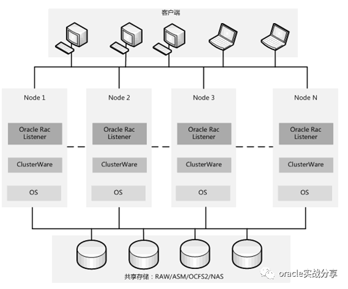
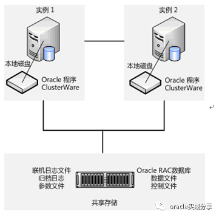

# 1. Oracle RAC 介绍

# **一、Oracle集群体系结构**

Oracle RAC，全称是Oracle Real Application  Cluster，即真正的应用集群，是oracle提供的一个并行集群系统，整个集群系统由**Oracle Clusterware** （集群就绪软件）和  **Real Application Clusters**（RAC)两大部分组成。

oracle  RAC的实质是位于不同操作系统的Oracle实例节点同时访问同一个Oracle数据库，每个节点间通过私有网络进行通信，互相监控节点的运行状态，oracle数据库所有的数据文件、联机日志文件、控制文件等均放在集群的共享存储设备上，而共享存储设备可以是RAW、ASM、OCFS2等，所有集群节点可以同时读写共享存储。Oracle  RAC的基本拓扑结构如下所示：

​​

由拓扑结构可知：

一个Oracle  Rac数据库有多个服务器节点组成，每个服务器节点上都有自己独立的OS、ClusterWare、oracle  Rac数据库程序等，并且每个节点都有自己的网络监听器。ClusterWare是一个集群软件，主要用于集群系统管理，oracle  Rac数据库程序用于提供oracle实例进程，以供客户端访问集群系统，监听服务主要用于监控自己的网络端口信息，所有的服务和程序通过操作系统都去访问一个共享存储，最终完成数据的读写。共享存储的实现方式有很多种，可以通过使用自动存储管理（ASM）、Oracle集群文件系统（OCFS）、裸设备（Raw）、网络区域存储（NAS）等来保证整个集群系统数据的一致性。

从Oracle10g起，Oracle提供了自己的集群软件，即Oracle  clusterware，它通过CRS（即Cluster Ready Services）来实现，这个软件是安装oracle  rac的前提，也是RAC环境稳定运行的基础，在oracle10g之前的版本，安装RAC时必须借助与第三方的集群软件，而在oracle10g以后，安装oracle  rac时，可以用oracle自带的集群软件，也可以使用经过RAC认证的第三方集群软件来代替。

从oracle的运行机制来说，集群中每台服务器就是一个oracle实例，多个oracle实例对应同一个oracle数据库，组成了oracle数据库集群。请看下图：

​​

从图中可以看出，运行在两个节点上的数据库实例访问同一个RAC数据库，并且两个节点的本地磁盘仅用来存放oracle安装程序和ClusterWare软件，而在共享存储上，存放了oracle的数据文件、控制文件、联机日志文件、归档日志文件等，这是安装oracle  Rac时的一种数据存储分配方式，其实，RAC提供了多种数据存储方式，这个将在下面进行独立介绍。

‍

# 二、**Oracle Clusterware体系结构与进程介绍**

## 2.1 Oracle Clusterware 简介

Cluster  Ready  Services，简称CRS，是oracle开发的一个集群软件，与其它集群软件类似，CRS主要完成集群成员管理、心跳监控、故障切换等功能，CRS要求每个集群节点的操作系统必须相同，这样，通过CRS将多个节点的操作系统绑定到了一起，客户端对集群的访问，就像访问一台服务器一样。

CRS主要有两个集群套件组成，分别是voting disk和Oracle Cluster Registry。

voting   disk，即为表决磁盘，集群中每个节点定期评估自身的健康情况，然后会把它的状态信息放入到表决磁盘上。并且节点间也会互相查看其运行状态，并把信息传递给其他节点进而写入表决磁盘。当集群节点发生故障时，还可以通过表决磁盘进行投票仲裁等，因此，表决磁盘必须放在共享存储设备上。以保证每个节点都能访问到。表决磁盘可以是一个裸磁盘分区，也可以是一个独立的文件。由于它仅记录节点运行信息，磁盘大小一般在10-20M左右即可。

Oracle Cluster Registry，简称OCR，即集群注册服务，OCR主要用于记录RAC中集群和数据库的配置信息。这些信息包括了集群节点的列表、集群数据库实例到节点的映射以及CRS应用程序资源信息。

CRS使用两种心跳设备来验证节点成员的状态，保证集群的完整性:一个是表决磁盘，集群同步服务进程每隔几秒钟都会向表决磁盘写入一条心跳信息，集群通过表决磁盘即可验证节点的状态，如果某个节点在指定的最大时间段内没有向表决磁盘写入信息，集群就认为此节点失效了，进而执行故障切换。另一个心跳是节点间私有以太网的心跳，通过这个心跳机制可以判断节点间是否出现了网络故障。两种心跳机制的结合，有效的增加了集群的可靠性。

另外，CRS建议用于内部通讯的私有以太网心跳必须与用于RAC节点间通讯的网络分开，也就是不能在同一网络中，如果RAC节点间通讯的网络与私有以太网心跳在同一个网络内，那么，必须保证该网络不能被非集群系统的节点访问到。

## 2.2 Oracle Clusterware 进程介绍

Oracle Clusterware 通过Cluster Ready Services来完成集群功能，CRS包含了一组相互协作的后台进程，下面详细介绍下CRS中几个很重要的后台进程。

1） Cluster Synchronization Services

简称CSS，用于管理与协调集群中各节点的关系，并用于节点间通信，当节点在加入或离开集群时，都由css进行通知集群。CSS在集群中对应的后台进程为CSSD，该进程由oracle用户运行和管理。当节点发生故障时，cssd会自动重启操作系统。

2） Cluster Ready Services

简称CRS，是管理群集内高可用操作的主要程序，在集群中CRS管理所有资源，包括数据库、服务、实例、vip地址、监听器、应用进程等，CRS在集群中对应的后台进程为CRSD，该进程可以对集群资源进行启动、停止、监视和容错等操作，正常状态下，CRSD监控节点各种资源，当某个资源发生异常时，自动重启或者切换该资源。

3） Process Monitor Daemon

简称OPROCD，此进程被锁定在内存中，用于监控集群及提供I/O防护（I/O   fencing）。OPROCD运行在每个节点上，且定期执行健康检测，如果在超过它所希望的间隔内，仍然不能和某个节点通信，那么，OPROCD将会重置处理器及重启节点。一个OPROCD故障也将导致Clusterware重启节点。

4） Oracle Notification Service

简称ONS，即oracle通告服务，主要用于发布和订阅Fast Application Notification事件。

5） Event Management

简称EVM，是一个事件检测的后台进程，由oracle用户运行和管理。

‍

# **三、RAC数据库体系机构与进程**

## 3.1 RAC简介

RAC是一个具有共享缓存体系结构的集群数据库，它克服了传统的不共享和共享磁盘方法的限制，为所有业务应用程序提供了一种具有可伸缩性和可用性的数据库解决方案，它一般与Oracle Clusterware 或第三方集群软件共同组成Oracle集群系统。

RAC是一个全共享式的体系架构，它的所有数据文件、控制文件、联机日志文件、参数文件等都必须存放在共享磁盘中，因为只有这样，集群所有节点才能访问到，RAC支持多种存储方式，可以使用下面几种方式的任意一种：

### 3.1.1 裸设备（Raw devices）

也就是不经过文件系统，将数据直接写入磁盘中，这种方式的好处是磁盘I/O性能很高，适合写操作频繁的业务系统，但缺点也很明显：数据维护和备份不方便，备份只能通过dd命令或者基于块级别的备份设备来完成，这无疑增加了维护成本。

### 3.1.2 集群文件系统（OCFS）

为了支持共享存储，oracle开发出了集群文件系统OCFS，这个文件系统可用于Windows、Linux和Solaris，现在已经发展到了OCFS2，通过OCFS2文件系统，多个集群节点可以同时读写一个磁盘而不破坏数据，但对于大量读写的业务系统，性能不是很高。另外，oracle  RAC也支持第三方的集群文件系统，例如Redhat的GFS等。

### 3.1.3 网络文件系统（NFS）

iSCSI  nfs  Openfiler

### 3.1.4 Automated Storage Management

 Automated  Storage  Management，简称ASM，是Oracle推荐的共享数据存储方式，它是Oracle数据库10g包含的一个特性。ASM其实就是RAW方式存储数据，但是加入了数据管理功能，它通过将数据直接写入磁盘，避免了经过文件系统而产生的I/O消耗。因而，使用ASM可以很方便地管理共享数据，并提供异步I/O的性能。ASM还可以通过分配I/O负载来优化性能，免除了手动调整I/O的需要。

## 3.2 Oracle RAC的特点

通过RAC数据库，可以构建一个高性能、高可靠的数据库集群系统，RAC的优势在于：

* 可以实现多个节点间的负载均衡

  RAC数据库集群可以根据设定的调度策略，在集群节点间实现负载均衡，因此，RAC数据库每个节点都是工作的，同时也处于互相监控状态，当某个节点出现故障时，RAC集群自动将失败节点从集群隔离，并将失败节点的请求自动转移到其它健康节点上，从而实现服务透明切换。

* 可以提供高可用服务

  这个是Oracle Clusterware实现的功能，通过CRS可以实现节点状态监控，故障透明转移，这保证了oracle数据库可以对外不间断的提供服务。

* 通过横向扩展提高了并发连接数

  RAC这个优点非常适合大型的联机事务系统中。

* 通过并行执行技术提高了事务响应时间

  这个是RAC集群的一大优势，通常用于数据分享系统中。

* 具有很好的扩展性

  在集群系统不能满足繁忙的业务系统时，RAC数据库可以很方便的添加集群节点，且可以在线完成节点的添加，并自动加入集群系统，不存在宕机时间；同时在不需要某个集群节点时，删除节点也非常简单。

RAC数据库也有一定的缺点：

* 与单机数据库相比，管理维护更复杂，并对维护人员要求更高
* 底层规划设计不好时，系统整体性能会较差，甚至不如单机系统的性能。所以，如果对RAC数据库不是很了解，不建议马上在生产环境中使用。
* 由于RAC集群系统需要多个节点，那么需要购买多台服务器，同时需要oracle企业级版本数据库，这无形中也增加了软硬件成本。

‍

‍

## 3.3 RAC进程管理

RAC数据库是由多个节点构成的，每个节点就是一个数据库实例，而每个实例都有自己的后台进程和内存结构，并且在RAC集群中，每个实例的后台进程和内存结构都是相同的，从整体上看起来，就像是一个单一数据库的镜像，但是，RAC数据库在结构上与单实例库也有不同之处：

（1）RAC数据库的每个实例至少拥有一个额外的重做线程（redo thread）

（2）RAC数据库的每个实例都拥有自己的撤消表空间（undo tablespace）

很显然，这种机制是每个实例独立的使用自己的重做线程和撤消表空间，各自锁定自己修改的数据。RAC的这种设计方式，把多个实例的操作相对独立的分开。那么RAC数据库如何实现节点数据的一致性呢，其实每个RAC实例的SGA内有一个buffer  cache（缓冲区），通过Cache  Fusion（缓存融合）技术，RAC在各个节点之间同步SGA中的缓存信息，从而保证了节点数据的一致性，同时也提高了集群的访问速度。

RAC数据库最大的特点是共享，那么如何实现多个节点有条不紊的数据共享呢，这就是要说的RAC的两个进程：即Global Cache Service (GCS) 和 the Global Enqueue Service (GES)

全局缓存服务（GCS）和全局队列服务（GES）是最基本的RAC进程，主要用于协调对共享数据库和数据库内的共享资源的同时访问。同时，GES和GCS通过使用全局资源目录(Global  Resource  Directory，GRD)来记录和维护每个数据文件的状态信息，而GRD保存在内存中，内容分布存储在所有实例上。每个实例都管理部分内容。

RAC中通过几个特别的进程与GRD相结合，使得RAC可以使用缓存融合技术，这几个特别进程是：

* Global Cache Service Processes(LMSn)

  LMS进程主要用来管理集群内数据块的访问，并在不同实例的BUFFER CACHE中传输块镜像。

* Global Enqueue Service Monitor(LMON)

  LMON主要监视群集内的全局资源和集群间的资源交互，并管理实例和处理异常，以及集群队列的恢复操作。

* Global Enqueue Service Daemon(LMD)

  LMD进程主要管理对全局队列和全局资源的访问，并更新相应队列的状态，处理来自于其他实例的资源请求。

* Lock Processes(LCK)

  LCK进程主要用来管理实例间资源请求和跨实例调用操作，并管理除Cache Fusion以外的资源请求，比如library和row cache的请求等。

* Diagnosability Daemon(DIAG)

  DIAG进程主要用来捕获实例中失败进程的诊断信息，并生成相应的TRACE文件。

## 3.4 RAC数据库存储规划

安装RAC数据库时涉及到的软件有Oracle Clusterware、Oracle Rac数据库软件，同时还涉及到voting disk、OCR等，关于每部分需要占用磁盘空间大小如下：

​​

具体使用哪种存储策略，要根据安装RAC环境的不同而不同。这里推荐三种常用的存储方式：

​​

‍

‍

‍
