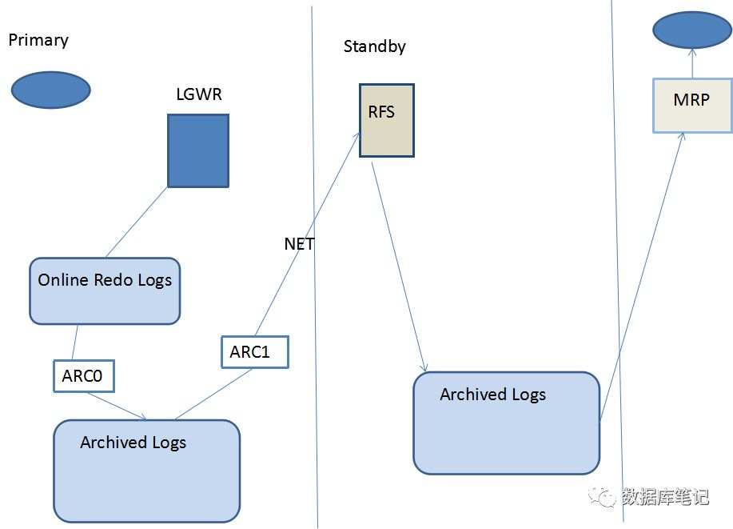
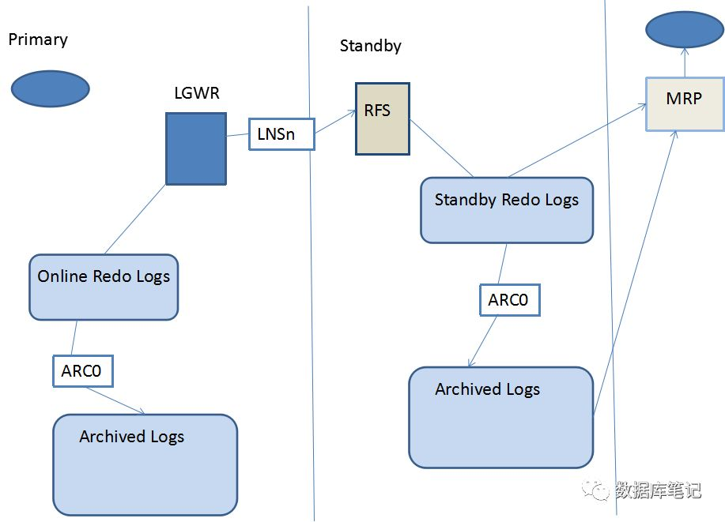
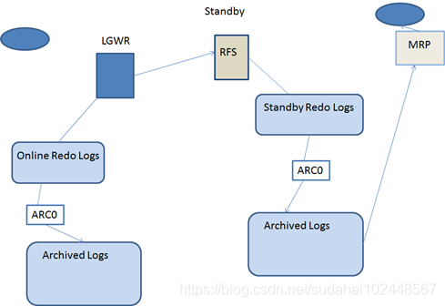

# 1. Oracle Dataguard 介绍

## 1. 概念

​`Data Guard`​是保证企业数据的高可用性(`high availability`​)、数据保护(`data protection`​)以及灾难恢复(`disaster recovery`​)的集成化灾难恢复解决方案。该技术可以维护生产数据库一个或多个同步备份，有一个生产数据库和若干个备用数据库组成，并形成一个独立的、易于管理的数据保护方案。

​`Data Guard`​备用数据库可以与生产系统位于相同的数据中心，也可以是在地理位置上分布较远的的远程灾难备份中心。

## 2. 原理

将redo log从原数据库传输到目标数据库，然后在目标数据库上应用这些日志文件，从而使目标数据库与源数据库保持同步。

​​

**执行步骤**

1. 客户端连接主库，发起更新数据的操作
2. 在主库内存中完成数据的更改，生成redo log
3. 客户端执行commit
4. 主库将重做日志写入日志文件组，同时发送给备库
5. 备库应用重做日志，应答主库
6. 主库应答客户端

通过这个机制，实现每个在主库的更新操作，都会在备库应用，从而实现同步。对于备库的应答，可以设置最大可用模式(Maximum Availability)、最大性能模式(Maximum Performance)和最大保护模式(Maximum Protection)三种方式。在最大保护模式下，主库需将redo log传输到备库后才可完成操作，从而更好地保证一致性。

容灾系统常用的ADG（ Active Data Guard），则是在DG的基础上，加入了可查询的功能，从而能够将一些报表类的业务压力从主库上分离出去。

‍

## 3. 架构

### 3.1 使用ARCH进程

​​

1、Primary Database不断的产生Redo Log，这些日志被LGWR进程写到联机日志
2、联机日志写满以后，发生日志切换，触发ARC0完成本地归档，归档位置采用LOG_ARCHIVE_DEST_1='LOCATION=/path'
3、完成本地归档以后，联机日志可以被覆盖重用
4、ARCH1进程通过Net把归档日志发送给Standby Database的RFS进程
5、Standby Database端的RFS进程把接收到的日志写入到归档日志
6、Standby Database端的MRP进程（Redo Apply）或者LSP进程（SQL Apply）在Standby Database上应用这些日志，进而同步数据

这种方式最大的问题是: `Primary Database`​只有在发生归档时才会发送日志到`Standby Database`​，如果`Primary Database`​异常宕机，联机日志中的`Redo`​内容会丢失，因此这种方式没法避免数据丢失的问题。
要想避免数据丢失，就必须使用`LGWR`​，而使用`LGWR`​又有`SYNC`​和`ASYNC`​两种方式。 缺省`Primary Database`​使用的就是`ARCH`​进程，不需要特别的指定

### 3.2 使用LGWR进程SYNC方式

​​

1、Primary Database产生的Redo日志要同时写到日志文件和网络。也就是说LGWR进程把日志写到本地日志文件的同时还要发给本地的LNSn进程（Network Server Process），再由LNSn进程把日志通过网络发送到远程目的地，每个远程目的地对应一个LNS进程，多个LNS进程能够并行工作。
2、LGWR必须等待写入本地日志文件的操作和通过LNSn进程的网络传送都成功，Primary Database上的事务才能够提交，这也是SYNC的含义所在。
3、Standby Database的RFS进程把接收到的日志写入到Standby Redo Log日志中
4、Primary Database的日志切换也会触发Standby Database上的日志切换，即Standby Database对Standby Redo Log的归档，然后触发Standby Database的MRP或者LSP进程恢复归档日志

因为`Primary Database`​的`Redo`​是实时传送的，于是`Standby Database`​端可以使用两种恢复方式：
实时恢复：只要`RFS`​把日志写入`Standby Redo Log`​就会立即进行恢复；
归档时恢复：在完成对`Standby Redo Log`​归档才触发恢复

### 3.3 使用LGWR进程ASYNC方式

​​

1、Primary Database一端产生Redo日志后，LGWR把日志同时提交给日志文件和本地LNS进程，但是LGWR进程只需要成功写入日志文件即可，不必等待LNSn进程的网络传送成功。
2、LNSn进程异步地把日志内容发送到Standby Database，多个LNSn进程可以并发发送
3、Primary Database的Online Redo Log写满后发生Log Switch，触发归档操作，也触发Standby Database对Standby Redo Log的归档，然后触发MRP或LSP进程恢复归档日志

因为`LGWR`​进程不会等待`LNSn`​进程的响应结果，所以配置`LGWR ASYNC`​方式时不需要`NET_TIMEOUT`​参数

## 5. 备库类型

​​

​​​​

||物理备库|逻辑备库|
| ------| ------------------------------------------------------------------------------| ------------------------------------------------------------------------------------------------------------|
|原理|主备物理结构一致（逻辑结构也一致），备库利用主库发送的redo log进行重做来同步|主备逻辑结构一致（物理结构不一致），备库利用主库发送过来的redo log重新解析为SQL语句，通过执行SQL语句来同步|
|优点|备库逻辑结构、物理结构均和主库保持一致，更强的一致性保证|更灵活，可以使用DBMS_LOGSTDBY包对备库做特殊设置|

物理备库与主库SCN保持一致，逻辑备库只需要数据保持一致。

## 6. 备库数据保护级别

Oracle  Data Guard  支持多种级别的数据保护模式：最大性能模式，最大可用性模式，最大保护模式。分别对应于“重要信息系统灾难恢复指南”中的5级，5级6级自适应，6级的数据保护级别。其中对应6级的最大保护模式可以实现实时数据实时同步和0数据丢失。另外，Oracle  Data Guard 可以设置延时应用时间窗口，从而防范错误操作、黑客攻击等人为错误导致的数据损坏。

|模式|数据丢失风险|传输|是否没有来⾃备⽤数据库的确认|redo归档进程|网络传输模式|控制日志传输服务是异步还是同步|standby redo是否必须|
| ----------| --------------------------| ------| --------------------------------------------------------| --------------| -----------------------------------------| --------------------------------| ----------------------|
|最大保护|零数据丢失，双重失败保护|同步|延迟主库，直到确认收到副本|LGWR|SYNC|AFFIRM|是|
|最大可用|零数据丢失，单失败保护|同步|延迟主库，直到确认收到副本、或者发生超时，然后继续处理|LGWR|SYNC|AFFIRM|是|
|最⼤性能|有少量数据丢失的可能|异步|主库不会等待备库的确认|LGWR或者ARCH|LGWR进程⽤SYNC或者ASYNC；ARCH进程⽤SYNC|AFFIRM或者 NOAFFIRM|不是，但推荐有|

### 6.1 最大保护模式

最大保护模式为主数据库提供了最高水平的数据保护，从而确保一个全面的零数据丢失的灾难恢复解决方案。当在最大保护模式下运行时，重做记录由日志写入器  (LGWR) 进程从主数据库同步地传输到备用数据库，并且直到确认事务数据在至少一个备用服务器上的磁盘上可用时，才在主数据库上提交事务。

强烈建议，这种模式应至少配置两个备用数据库。当最后参与的备用数据库不可用时，主数据库上的处理将停止。这就确保了当主数据库与其所有备用数据库失去联系时，不会丢失事务。

由于重做传输的同步特性，这种最大保护模式可能潜在地影响主数据库响应时间。可以通过配置一个低延迟网络，并为它分配足够应付高峰事务负载的带宽来将这种影响减到最小。需要这种最大保护模式的企业有股票交易所、货币交易所、金融机构等。

### 6.2 最大可用性模式

最高可用性模式拥有仅次于最高水平的主数据库数据可用性。如同最大保护模式一样，重做数据由  LGWR  从主数据库同步地传输到备用数据库，直到确认事务数据在备用服务器的磁盘上可用时，事务才在主数据库上完成。不过，在这种模式下（与最大保护模式不同），如果最后参与的备用数据库变为不可用，例如由于网络连接问题，处理将在主数据库上继续进行。备用数据库与主数据库相比，可能暂时落在后面，但当它再次变为可用时，备用数据库将使用主数据库上累积的归档日志自动同步，而不会丢失数据。

由于同步重做传输，这种保护模式可潜在地影响响应时间和吞吐量。可以通过配置一个低延迟网络，并为它分配足够应付高峰事务负载的带宽来将这种影响减到最小。

最高可用性模式适用于想要确保获得零数据丢失保护，但不想让生产数据库受网络/备用服务器故障影响的企业。如果又一个故障随后影响了生产数据库，然后最初的网络/备用服务器故障得到解决，那么这些企业将接受数据丢失的可能性。

### 6.3 最高性能模式

最高性能模式是默认的保护模式。它与最高可用性模式相比，提供了稍微少一些的主数据库数据保护，但提供了更高的性能。在这种模式下，当主数据库处理事务时，重做数据由  LGWR 进程异步传输到备用数据库上。另外，也可以将主数据库上的归档器进程 (ARCH)  配置为在这种模式下传输重做数据。在任何情况下，均先完成主数据库上的写操作，主数据库的提交操作不等待备用数据库确认接收。如果任意备用目标数据库变为不可用，则处理将在主数据库上继续进行，这对性能只有很小的影响或没有影响。

在主数据库出现故障的情况下，尚未被发送到备用数据库的重做数据会丢失。但是，如果网络有足够的吞吐量来跟上重做流量高峰，并且使用了 LGWR 进程来将重做流量传输到备用服务器，则丢失的事务将非常少或者为零。

当主数据库上的可用性和性能比丢失少量数据的风险更重要时，应该使用最高性能模式。这种模式还适合于 WAN 上的 Data Guard 部署，在 WAN 中，网络的内在延迟可能限制同步重做传输的适用性。

‍

## 7. DG相关的后台进程

```bash
ARCH (archiver)                   # 心跳检测，探测对方
LNS (log-write network-server)    # log传送
RFS (remote file server)          # 远程接数据
FAL (Fetch Archive Log )          # 解决Redo的间隔Gap
MRP (Managed Recovery Process)    # 日志被应用，恢复的过程
LSP (Logical Standby Process)     # 逻辑数据库的后台进程，SQL转换
```

### 7.1 日志接收（Redo Receive）

​`Standby Database`​的`RFS`​进程接收到日志后，就把日志写到`Standby Redo Log`​或者`Archived Log`​文件中，具体写入哪种文件，取决于`Primary`​的日志传送方式和`Standby Database`​的配置。
如果是写到`Standby Redo Log`​文件中，则当`Primary Database`​发生日志切换时，也会触发`Standby Database`​上的`Standby Redo Log`​的日志切换，并把这个`Standby Redo Log`​归档。

### 7.2 日志应用（Redo Apply）

日志应用服务，就是在`Standby Database`​上重演`Primary Database`​的日志，从而实现两个数据库的数据同步。`Redo Apply`​发生的时间分为两种：

* 实时应用:  
  这种方式必须使用`Standby Redo Log`​。每当日志被写入到`Standby Redo Log`​时，就会触发恢复，使用这种方式的好处在于可以减少数据库切换的时间（`Switchover`​或`Failover`​），因为切换时间主要用在剩余日志内容的恢复上。
* 归档应用:  
  这种方式是在`Primary Database`​发生日志切换，触发了`Standby Database`​的归档操作，归档完成后会触发恢复，这也是缺省的恢复方式。

```bash
# 如果是Physical Standby，可以使用下面的命令启用Real-Time
 alter database recover managed standby database using current logfile;

# 如果是Logical Standby，可以使用下面的命令启用Real-Time
alter database start logical standby apply immediate;
```

‍

## 8. DG 和 OGG 总结

‍
