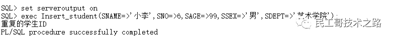
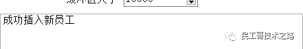

# Oralce 基础概念

‍

## Oracle 数据库体系结构

#### 数据库

Oracle数据库是数据的物理存储。这就包括（数据文件ORA或者DBF、控制文件、联机日志、参数文件）。其实Oracle数据库的概念和其它数据库不一样，这里的数据库是一个操作系统只有一个库。可以看作是Oracle就只有一个大数据库。

#### 实例

一个Oracle实例（Oracle Instance）由一系列的后台进程（Backguound Processes）和内存结构（Memory Structures）组成。一个数据库可以有n个实例。

#### 数据文件（dbf）

数据文件是数据库的物理存储单位。数据库的数据是存储在表空间中的，真正是在某一个或者多个数据文件中。而一个表空间可以由一个或多个数据文件组成，一个数据文件之只能属于一个表空间。一旦数据文件被加入到某个表空间后，就不能删除这个文件，如果要删除某个数据文件，只能删除其所属的表空间才行。  如果要删除某个数据文件，只能删除其所属的表空间才行。如果要删除某个数据文件，只能删除其所属的表空间才行。

#### 表空间

表空间是Oracle对物理数据库上相关数据文件（ORA或者DBF文件）的逻辑映射。一个数据库在逻辑上被划分成一到若干个表空间，每个表空间包含了在逻辑上相关联的一组结构。每个数据库至少由一个表空间（称之为sys表空间）。

每个表空间由同一磁盘上的一个或多个文件组成，这些文件叫数据文件（datafile）。一个数据文件只能属于一个表空间。一个数据文件只能属于一个表空间。一个数据文件只能属于一个表空间。​

#### 用户

用户是在实例下建立的。不同实例中可以建相同名字的用户。

表的数据，是由用户放入某一个表空间的，而这个表空间会随机把这些表数据放到一个或者多个数据文件中。

由于Oracle的数据库不是普通的概念，Oracle是有由户和表空间对数据进行管理和存放的。但是表不是由表空间去查询的，而是由用户去查的。因为不同的用户可以在同一个表空间建立同一个名字的表！这里区分就是用户了！​

## Oracle 常用数据库对象

#### 视图

###### 什么是视图？

* 视图是一个虚表.
* 视图建立在已有表的基础上，视图赖以建立的这些表称为基表.
* 向视图提供数据内容的语句为select语句，可以将视图理解为存储起来的select语句.
* 视图向用户提供基表数据的另一种表现形式.
* 最大的优点就是简化复杂的查询。

###### 视图的优点

​​

###### 创建视图的语法

```
create [or replace] [force|noforce] view viewName
 [(alias[, alisa]...)]
[with check option [constraint constraint]]
[with read only [constraint constraint]];
```

* force：子查询不一定存在
* noforce：子查询存在（默认）
* with read only：只能做查询操作
* 子查询可以是复杂的select语句

示例：建立一个视图，此视图包括了20号部门的全部员工信息

```
create view empView20 as select * from emp t where t.deptno=20;
select * from empView20;
```

​​

###### 语法2：

```
create or replace view 视图名称 as 子查询
```

如果视图已经存在我们可以使用语法2来创建视图，这样已有的视图会被覆盖。

```
create or replace view wmpView20 as select * from emp t where t.deptno=10;

select * from empView20;
```

​​

###### 简单视图和复杂视图

​​

不建议通过视图对表中数据进行修改，因为会受到很多的限制。

###### 创建复杂视图

示例：查询各个部门的最低工资，最高工资，平均工资:

```
create view dept_sum_vu
 (name, minsal, maxsal, avgsal)
as select d.department_name, MIN(e.salary),
    MAX(e.salary), AVG(e.salary)
 from employees e, departments d
 where e.department_id = d.department_id
 group by d.department_name;
```

##### 视图中使用DML的规定

* 可以在简单视图中执行DML操作
* 当视图定义中包含以下元素之一时不饿能使用delete：

  * 1.组函数
  * 2.GROUP BY 子句
  * 3.DISTINCT 关键字
  * 4.ROWNUM 伪列
* 当视图定义中包含以下元素之一时不能使用update：

  * 1.组函数
  * 2.GROUP BY 子句
  * 3.DISTINCT 关键字
  * 4.ROWNUM 伪列
  * 5.列的定义方式为表达式
* 当视图定义中包含以下元素之一时不能使用insert：

  * 1.组函数
  * 2.GROUP BY 子句
  * 3.DISTINCT 关键字
  * 4.ROWNUM 伪列
  * 5.列的定义方式为表达式
  * 6.列中非空的列在视图定义中未包括

###### 屏蔽DML操作

* 可以使用WITH READ ONLY 选项屏蔽对视图的DML操作
* 任何DML操作都会返回一个Oracle server 错误

###### 删除视图

删除视图只是删除视图的定义，并不会删除基本表的数据。

```
drop view vie;

drop view empView20;
```

#### 序列

在很多数据库中都存在一个自动增长的列，如果现在要想在oracle中完成自动增长的功能，则只能依靠序列完成，所有的自动增长操作，需要用户手工完成处理。并且Oracle将序列值装入内存可以提高访问效率。

序列：可供多个用户用来产生唯一数值的数据库对象：

* 自动提供唯一的数值
* 共享对象
* 主要用于提供主键值
* 将序列值装入内存可以提高访问效率

###### 语法：

```
create sequence 序列名
 [increment by n]
 [start with n]
 [{MAXVALUE n| NOMAXVALUE}]
 [{MINVALUE n| NOMINVALUE}]
 [{CYCLE|NOCYCLE}]
 [{CACHE n| NOCACHE}];
```

示例：

```
create sequence dept_deptid_seq
 increment by 10
 start with 120
 maxvalue 9999
 nocache
 nocycle;

Sequence created.
```

###### 查询序列

查询数据字典视图USER_SEQUENCES获取序列定义信息：

```
select sequence_name, min_value, max_value, increment_by, last_number
from user_sequences;
```

* 如果指定NOCACHE选项，则列LAST_NUMBER显示序列中下一个有效的值

序列创建完成之后，所有的自动增长应该由用户自己处理，所以在序列中提供了以下的两种操作：

* nextval：取得序列的下一个内容
* currval：取得序列的当前内容

在插入数据时需要自增的主键中可以这样使用:​

序列可能产生裂缝的原因：

* 回滚
* 系统异常
* 多个表公用一个序列

###### 修改序列

修改序列的增量，最大值，最小值，循环选项或是否装入内存。

```
alter sequence dept_deptid_seq
 increment by 20
 maxvalue 999999
 nochche
 noccle;
```

###### 修改序列的注意事项

* 必须时序列的拥有者或对序列有ALTER权限
* 只有将来的序列值会被改变
* 改变序列的初始值只能通过删除序列之后重建序列的方法实现

###### 删除序列

* 使用drop sequence 语句删除序列
* 删除之后，序列不能再次被引用

```
drop sequence dept_deptid_seq;

Sequence dropped.
```

#### 索引

索引是用于加速数据存取的数据对象。合理的使用索引可以大大降低i/o的次数，从而提高数据访问性能。

* 一种独立于表的模式对象，可以存储在与表不同的磁盘或表空间中
* 索引被删除或损坏，不会对 表产生影响，其影响的只是查询的速度
* 索引一旦建立，Oracle管理系统会对其进行自动维护，而且由Oracle管理系统决定何时使用索引，用户不用再查询语句中指定使用哪个索引
* 再删除一个表时，所有基于该表的索引会自动被删除
* 通过指针加速Oracle服务器的查询速度
* 通过快读定位数据的方法，减少磁盘 I/O

###### 单列索引

单列索引是基于单个列所建立的索引，比如：

```
create index 索引名 on 表明(列名);
```

###### 复合索引

复合索引是基于两个列或多个列的索引。在同一张表上可以有多个索引，但是要求列的组合必须不同，例如：

```
create index emp_idxl on emp(ename, job);
create index emp_idx1 on emp(job, ename);
```

示例：给person表的name属性建立索引

```
create index pname_index on person(name);
```

示例：给person表创建一个name和gender的索引

```
create index pname_gender_index on person(name, gender);
```

###### 什么时候创建索引

* 列中数据值分布范围很广
* 列经常在where子句或连接条件中出现
* 表经常被访问而且数据量很大，访问的数据大概占数据总量的2%到4%

###### 什么时候不要创建索引

* 表很小
* 列不经常作为连接条件或出现在where子句中
* 查询的数据大于2%到4%
* 表经常更新

###### 查询索引

可以使用数据字典视图`USER_INDEXES`​和`USER_IND_COLUMNS`​查看索引的信息。

###### 删除索引

* 使用DROP INDEX命令删除索引

```
drop index indexName;
```

* 删除索引UPPER LAST NAME IDX

```
drop index upper_last_name_idx;

Index dropped.
```

* 只有索引的拥有者或拥有drop any index 权限的用户才可以删除索引

###### 同义词

* 方便范文其它用户的对象
* 缩短对象名字的长度

```
create [public] SYNONYM synonym
for object;
```

###### 创建同义词

示例：为视图DEPT_SUM_VU创建同义词

```
create synonym d_sum
for dept_sum_vu;

Synonym Created.
```

###### 删除同义词

```
drop synonym d_sum;

Synonym dropped.
```

## Oracle 基本查询详解

#### sql简介

结构化查询语言（Structured  Query  Language）简称SQL，结构化查询语言是一种数据库查询和程序设计语言，用于存取数据以及查询、更新和管理关系数据库系统：同时也是数据库脚本文件的扩展名。结构化查询语言是高级的非过程化编程语言，允许用户在高层数据结构上工作。它不要求用户指定对数据的存取方法，也不需要用户了解具体的数据存放方式，所以具有完全不同底层结构的不同数据库系统，可以实用相同的结构化查询语言作为数据输入与管理的接口。结构化查询语言可以嵌套，这使得它具有极大的灵活性和强大的功能。

###### DML（数据库操作语言）

其语句包括动词INSERT，UPDATE和DELETE。它们分别用于添加，修改和删除表中的行。也称为动作查询语言。

###### DDL（数据库定义语言）

其语句包括动词CREATE和DROP。在数据库中创建新表或删除表（CREATE TABLE 或 DROP TABLE）：为表加入索引等。DDL包括许多与数据库目录中获得数据有关的保留字。它也是动作查询的一部分。

###### DCL（数据库控制语言）

它的语句通过GRANT 或 REVOKE 获得许可，确定单个用户和用户组对数据库对象的访问。某些RDBMS可用GRANT或REVOKE控制对表单个列的访问。

###### Select语句的语法格式

```
SELECT *|{[DISTINCT] column|expression [alias],...}
FROM table;
```

当前用户下的表

```
select * from tab;
```

​​

查询表结构

```
SQL> desc emp
```

​查询所有员工信息

```
select * from emp;
```

​​

###### 通过列名查询

SQL优化：使用列名查询效率高于使用`*`​查询。

```
select empno,ename,job,mgr,hiredate,sal,comm,deptno
from emp;
```

​​

###### 别名的用法

别名的用法共有三种:

* as “xxx”
* “xxx”
* xxx

三种写法的区别：

* 其中第1种和第2种完全相同。
* 第3种写法无法包含空格、无法为纯数字

```
select empno as "员工号",ename "雇员名",job 工作 
from emp;
```

​​

###### 消除重复数据

注意：distinct关键字作用于后面所有的列，即只要列组合起来唯一即可。

```
select distinct job from emp;
```

​​

###### 查询中的四则运算

查询雇员的月薪和年薪

```
select ename,sal,sal*12 年薪 from emp;
```

​​

###### 空值问题

什么空值：

* 空值是无效的，未指定的，未知的或不可预知的值。
* 空值不是空格或者0.

查询雇员的姓名、月薪、奖金、年薪和年收入（年薪+奖金）

```
select ename,sal,comm,sal*12 年薪,sal*12+comm 年收入
from emp;
```

​由上图可知，查询结果显然是不对的。因为不可能出现年收入为空值的情况。进一步观察可以发现，年收入为空值的奖金也是空值。

SQL中的null：

* 包含null的表达式都为空
* null永远!=null

解决方法：滤空函数 nvl 和nvl2

* nvl  
  NVL(E1, E2)的功能为：如果E1为NULL，则函数返回E2，否则返回E1本身。
* nvl2  
  NVL2(E1, E2, E3)的功能为：如果E1为NULL，则函数返回E3，若E1不为null，则返回E2。

sql修改为：

```
select ename,sal,comm,sal*12 年薪,sal*12+nvl(comm,0) 年收入
from emp;
```

​​

###### 查询空值

查询奖金为null的雇员信息

```
select * from emp where comm is null;
```

​​

###### 连接符 ||

连接符：

* 把列与列，列与字符连接在一起。
* 用“ || ” 表示。
* 可以用来‘合成’列。

字符串：

* 字符串可以是SELECT列表中的一个字符，数字，日期。
* 日期和字符只能在单引号中出现。
* 每当返回一行时，字符串被输出一次。

查询员工信息：的薪水是

```
select ename||'的薪水是'||sal 信息 from emp;
```

​​

## Oracle 条件查询、模糊查询和排序

使用where语句对结果进行过滤

```
SELECT *|{[DISTINCT] column|expression [alias],...}
FROM table
WHERE condition(s)};
```

比较运算符其它比较运算符逻辑运算符​

#### Where语句示例

###### 字符和日期

* 字符和日期要包含在单引号中。
* 字符大小写敏感，日期格式敏感。
* 默认的日期格式是DD−MON−RR。

示例：查询名叫KING的员工

```
select * from emp where ename='KING';
```

​示例：查询入职日期是17-11月-81的员工

```
select * from emp where hiredate='17-11月-81';
```

​​

###### 非空和空的限制

* 示例：查询每月能得到奖金的雇员
* 分析：只要字段中存在内容表示不为空，如果不存在内容就是null。
* 语法：列名 IS NOT NULL
* 为空：列名 IS NULL

```
select * from emp where sal is not null;
```

​​

* 示例：查询工资大于1500或者有奖金的雇员。
* 分析：多个查询条件或满足，条件之间使用“OR”

```
select * from emp where sal > 1500 or comm is not null;
```

​​

* 示例：查询工资不大于1500和没有奖金的人
* 语法：NOT（查询条件）

```
select * from emp where not(sal > 1500) and comm is null;
```

​​

###### 范围限制

* 示例：基本工资大于1500但是小于3000的全部雇员
* 分析：sal>1500, sal<3000

```
select * from emp where sal>1500 and sal<3000;
```

​between and 等价于 sal>=1500 and sal <= 3000

```
select * from emp where sal between 1500 and 3000;
```

​​

* 示例：查询1981-1-1到1981-12-31号入职的雇员
* 分析：between and 不仅可以使用在数值之间，也可以用在日期的区间

```
select * from emp where hiredate between '1-1月-1981' and '31-12月-1981';
```

​​

* 示例：查询雇员编号是7369，7499，7521的雇员编号的具体信息
* 分析：此时指定了查询范围，那么可以使用IN关键字

语法：

* 列名 IN （值1，值2，…）
* 列名 NOT IN （值1，值2，…）

其中的值不仅可以是数值类型，也可以是字符串

```
select * from emp where empno in (7369，7499，7521);
```

​示例：查询雇员姓名是‘SMITH’，‘ALLEN’，‘WARD’的雇员具体信息

```
select * from emp where ename in ('SMIT','ALLEN','WARD');
```

​注意: 如果集合中含有null，不能使用not in;

示例：查询不是10和20号部门的员工

```
select * from emp where deptno not in (10,20);
```

​添加一个null到集合中

```
select * from emp where deptno not in (10,20,null);
```

​​

###### 模糊查询

在常用的网站中经常会有模糊查询，即：输入一个关键字，把符合的内容全部的查询出来，在sql中使用LIKE语句完成。在LIKE中主要使用一下两种通配符：

* “%” : 可以匹配任意长度的内容
* “_” : 可以匹配一个长度的内容

示例：查询出所有雇员姓名中第二个字符包含“M”的雇员

```
select * from emp where ename like '_M%';
```

​在LIKE中如果没有关键字表示查询全部

示例：查询名字中带有“M”的雇员

```
select * from emp where ename like '%M%';
```

​在oracle中不等号的用法可以有两种形式“<>”和"!="。

示例：查询雇员编号不是7369的雇员信息。

```
select * from emp where empno <> 7369;
select * from emp where empno != 7369;
```

​查询带有特殊字符的关键字。

插入一条数据：

```
insert into emp (empno,ename) values(14,'TOM_CAT');
```

* 示例：查询名字含有下划线的员工
* 分析：使用escape关键字声明转义字符，一般使用“\”

```
select * from emp where ename like '%\_%' escape '\';
```

​​

#### SQL优化

```
select * from emp where condition1 and condition2
```

在Oracle中，where子句是从右向左进行解析的。

所以，在and条件中，我们应尽量把可能为false的条件放在右边，这样就可以短路计算提升效率。

##### 使用order by对结果排序

排序的语法：

在sql中可以使用ORDER BY 对查询结果进行排序，语法：

```
SELECT * | 列名 FROM 表名 {WHERE 查询条件} ORDER BY 列名1 ASC|DESC，列名2...ASC|DESC
```

* 示例：查询雇员的工资从低到高
* 分析：ORDER BY 列名 默认的排序规则是升序排列，可以不指定ASC，如果按着降序排列必须指定DESC

```
select * from emp order by sal;
```

​​

如果存在多个排序字段可以用逗号分隔。asc和desc作用于距离最近的列。

```
select * from emp order by sal asc, hiredate desc;
```

​​

order by后面可以 + 列、表达式、别名、序号

```
select empno,ename,sal,sal*12 年薪 from emp order by 年薪 desc;
```

​​

注意：ORDER BY语句要放在最后执行。

示例：查询雇员信息，按奖金升序排序：

```
select * from emp order by comm;
```

​​

示例：查询雇员信息，按奖金降序排序：

```
select * from emp order by comm desc;
```

​​

显然排序结果出现了错误，因为在Oracle中null最大。

解决方法：可以使用 null first， nulls last 来指定null的值显示的位置。

```
select * from emp order by comm desc nulls last;
```

​​

## Oracle 多表查询、层次查询

什么是笛卡尔积？

​​

###### Oracle 的连接条件的类型

* 等值连接
* 不等值连接
* 外连接
* 自连接

#### Oracle多表连接示例

###### 多表连接基本查询

使用一张以上的表做查询就是多表查询，语法：

```
SELECT {DISTINCT} *|列名... FROM 表明 别名, 表名1 别名 
{WHERE 限制条件 ORDER BY 排序字段 ASC|DESC...}
```

示例：查询员工表和部门表

```
select * from emp,dept;
```

​​

我们发线产生的记录数是56条，我们还会发现emp表是14条，dept表是4条，56正是emp表和dept表的记录数的乘积，我们称其为笛卡尔积。

如果多张表进行一起查询而且每张表的数据很大的话笛卡尔积就会变得非常大，对性能造成影响，想要去掉笛卡尔积我们需要关联查询。

再两张表中我们发现有一个共同的字段是depno，depno就是两张表的关联的字段，我们可以使用这个字段来做限制条件，两张表的关联查询字段一般是其中一张表的主键，另一张表的外键。

```
select * from emp,dept where emp.deptno = dept.deptno;
```

​​

关联之后我们发线数据条数是14条，不再是56条。

多表查询我们可以为每一张表起一个别名

```
select * from emp e, dept d where e.deptno = d.deptno;
```

示例：查询出雇员的编号，姓名，部门的编号和名称，地址

```
select e.empno, e.ename, d.deptno, d.dname, d.loc
from emp e, dept d
where e.deptno = d.deptno;
```

​​

* 示例：查询出每个员工的上级领导
* 分析：emp表中的mgr字段是当前雇员的上级领导的编号，所以该字段对emp表产生了自身关联，剋使用mgr字段和empno来关联

```
select e.empno, e.ename, e2.empno,e2.ename
from emp e, emp e2
where e.mgr = e2.empno;
```

​​

* 示例：再上一个例子的基础上查询该员工的部门名称
* 分析：只要再上一个例子基础上再加一张表的关联，使用deptno来做关联字段即可

```
select e.empno, e.ename, e1.empno, e1.ename, d.dname
from emp e, emp e1, dept d
where e.mgr = e1.empno and e.deptno=d.deptno;
```

​​

示例：查询出每个员工编号，姓名，部门名称，工资等级和他的上级领导的姓名，工资，等级。

```
select e.empno,e.ename, decode(s.grade,
                            1,'一级',
                            2,'二级',
                            3,'三级',
                            4,'四级',
                            5,'五级') grade,
                      d.dname,e1.empno, e1.ename,
                      decode(s1.grade,
                                1,'一级',
                                2,'二级',
                                3,'三级',
                                4,'四级',
                                5,'五级'）grade
from emp e, emp e1, dept d, salgrade s, salgrade s1
where e.mgr = e1.empno 
and e.deptno = d.deptno
and e.sal between s.losal and s.hisal
and e1.sal between s1.losal and s1.hisal;
```

​​

#### 外连接（左右连接）

###### 右连接

当我们在做基本连接查询的时候，查询出所有的部门下的员工，我们发线编号为40的部门下没有员工，但是要求把该部门也展示出来，上面的查询时办不到的。

```
select e.empno, e.ename, d.deptno, d.dname
from emp e, dept d
where e.deptno(+) = d.deptno;
```

​​

使用（+）表示左连接或者右连接。

* 示例：查询出所有员工的上级领导
* 分析：我们使用以前的做法发现KING的没有上级领导，需要使用外连接把他查询出来

```
select e.empno, e.ename, m.empno, m.ename
from emp e, emp m
where e.mgr = m.empno(+);
```

​​

使用left join实现：

```
select e.deptno, e.ename, m.deptno, m.ename
from emp e left join emp m
on e.mgr = m.empno;
```

​​

（+）这种形式时Oracle数据库独有的，所以left join或right join 也需要了解。

###### 层次查询（树型结构查询）

层次化查询,即树型结构查询,是SQL中经常用到的功能之一,通常由根节点,父节点,子节点,叶节点组成,其语法如下:

```
SELECT [LEVEL] ,column,expression,...

       FROM table_name

       [WHERE where_clause]

       [[START WITH start_condition] [CONNECT BY PRIOR prior_condition]];
```

* LEVEL:  
  为伪列,用于表示树的层次
* start_condition：  
  层次化查询的起始条件
* prior_condition：  
  定义父节点和子节点之间的关系

示例：查询所有员工的上级领导

分析：

​​

起始条件为King没有上级，子节点与父节点的关系为：子节点的mgr=父节点的empno。

```
select level, empno, ename, mgr
from emp
start with mgr is null
connect by prior empno = mgr
order by 1;
```

​​

## Oracle 子查询

#### 什么是子查询？

使用子查询解决问题：谁的工资比SCOTT高？

​​

###### 子查询的语法

​​

* 子查询（内查询）在主查询之间一次执行完成。
* 子查询的结果被主查询使用（外查询）。

###### 子查询的类型

​​

##### 单行子查询

* 只返回一条记录
* 单行操作符​

示例1：

```
select ename,job,sal
from emp
where job=
      (select job
      from emp
      where empno=7566) and sal >
            (select sal
            from emp
            where empno=7782);
```

​​

示例2：

```
select ename,job,sal
from emp
where sal=
     (select min(sal)
     from emp);
```

​​

示例3：

```
select deptno,min(sal)
from emp
group by deptno
having min(sal) >
      (select min(sal)
      from emp
      where deptno=20);
```

​​

示例4：查询出比雇员7654的工资高，同时从事和7788的工作一样的员工。

```
select *
from emp t1
where t1.sal>
      (select t.sal 
      from emp t 
      where t.empno=7654) and t1.job=
            (select t2.job
            from emp t2
            where t2.empno=7654);
```

​​

示例5：要求查询每个部门的最低工资和最低工资的雇员和部门名称

```
 select d.dname, a.minsal, e.ename
 from dept d,
      (select deptno, min(sal) minsal 
      from emp
      group by deptno) a,emp e
 where d.deptno=a.deptno and e.sal=a.minsal;
```

​​

#### 非法使用单行子查询示例

```
select empno,ename
from emp
where sal=
     (select min(sal)
     from emp
     group by deptno);
```

​​

#### 多行子查询

* 返回了多条记录
* 多行操作符​

示例：in 在集合中。查询部门名称是SALES和ACOUNTING的员工。

```
select * from emp where deptno in
       (select deptno from dept where dname='SALES' or dname='ACCOUNTING');
```

​​

示例：any 和集合中的任意一个值比较 。查询工资比30号部门员工高的员工信息。

```
select * from emp where sal > any
       (select sal from emp where deptno=30);
```

​​

示例：all 和集合中的所有值比较。查询工资比30号部门所有员工高的员工信息。

```
select * from emp where sal > all
       (select sal from emp where deptno=30);
```

​​

###### 子查询需要注意的问题

* 括号
* 合理的书写风格
* 可以在主查询的where、select、having、from后面使用子查询
* 不可以在group by使用子查询
* 强调from后面的子查询
* 主查询和子查询可以不是同一张表；只有子查询返回的结果 主查询可以使用 即可
* 一般不在子查询中排序；但在top-n分析问题中，必须对子查询排序
* 一般先执行子查询，再执行主查询；相关子查询列外
* 单行子查询只能使用单行操作符；多行子查询只能使用多行操作符
* 子查询中的null
* 示例：在select语句后使用子查询
* 注意：select语句后的子查询必须是单行子查询

查询员工号，姓名，薪水，7839的职位

```
select empno,ename,sal,
       (select job 
       from emp 
       where empno=7839)
from emp;
```

​​

示例：在from语句后面使用子查询。查询员工信息：员工号，姓名，月薪。

```
select * 
from (select empno, ename, sal from emp);
```

​​

示例：top-n分析问题，rownum行号：

* rownum永远按照默认的顺序生成
* rownum只能使用小于等于，不能使用大于等于

查询员工表中工资最高的前三名

```
select rownum, empno, ename, sal
from (select * from emp order by sal desc)
where rownum <= 3;
```

​​

示例：找到员工表中薪水大于本部门平均薪水的员工。

```
select e.empno, e.ename, e.sal, d.avgsal
from emp e, (select deptno, avg(sal) avgsal from emp group by deptno) d
where e. deptno=d.deptno and e.sal > d.avgsal;
```

​​

#### 相关子查询

将主查询中的值 作为参数传递给子查询。使用相关子查询解决上面的示例。

```
select empno, ename, sal, (select avg(sal) from emp where deptno=e.deptno) avgsal
from emp e
where sal > (select avg(sal) from emp where deptno=e.deptno);
```

​示例：统计每年入职员工的个数

```
select count(*) Total,
       sum(decode(to_char(hiredate, 'yyyy'), '1980', 1, 0)) "1980",
       sum(decode(to_char(hiredate, 'yyyy'), '1981', 1, 0)) "1981",
       sum(decode(to_char(hiredate, 'yyyy'), '1982', 1, 0)) "1982",
       sum(decode(to_char(hiredate, 'yyyy'), '1987', 1, 0)) "1987"
from emp;
```

​​

##### 子查询中的null值问题

* 单行子查询中的null值问题  
  ​​
* 多行子查询中的null值问题

  示例：查询不是老板的员工  
  ​​

  ​​

  查询错误，集合中有null值不可以使用not in。

## Oracle 集合运算

#### 什么是集合运算？

​​

###### 并集

​​

示例：查询10号和20部门的员工

```
select * from emp where deptno=10
union
select * from emp where deptno=20;
```

​​

###### 交集

​​

示例：显示薪水同时位于级别1（700 ~ 1300）和级别2（1201 ~ 1400）的员工信息。

```
select ename,sal from emp where sal between 700 and 1300 
intersect
select ename,sal from emp where sal between 1201 and 1400; 
```

​​

###### 差集

​​

示例：显示薪水同时位于级别1（700 ~ 1300），但不属于级别2（1201 ~ 1400）的员工信息。

```
select ename,sal from emp where sal between 700 and 1300 
minus
select ename,sal from emp where sal between 1201 and 1400; 
```

​​

###### 集合运算的注意事项

* select语句中参数类型和个数要一致
* 可以使用括号改变集合执行的顺序
* 如果有order by子句，必须放到最后一句查询语句后
* 集合运算采用第一个语句的表头作为表头

## Oracle PL/SQL基本语法、判断、循环

#### 什么是PL/SQL？

PL/SQL（Procedure   Language/SQL）是Oracle对sql语言的过程化扩展，指在SQL命令语言种增加了过程处理语句（如分支、循环等），使SQL语言具有过程处理能力。把SQL语言的数据操纵能力与过程语言的数据处理能力结合起来，使得PLSQL面向过程但比过程语言简单、高效、灵活和实用。

示例：为职工涨工资，每人涨10%的工资。

```
update emp set sal = sal * 1.1;
```

示例：按职工的职称涨工资，总裁涨1000元，经理涨800元，其他人员涨400元。

这样的需求我们就无法使用一条SQL来实现，需要借助其他程序来帮助完成，也可以使用pl/sql。

#### PL/SQL的语法

```
declare
 说明部分（变量说明，光标声明，例外说明）
begin
 语句序列（DML语句）...
exception
 列外处理语句
End；
/
```

###### 变量和变量的定义

* 说明变量（char, varchar2, date, number, boolean, long）  
  ​​
* 引用变量

```
Myname emp.ename%type;
```

引用型变量，即my_name的类型与emp表种ename列的类型一样，在sql种使用into。

```
declare
 emprec emp.ename%type;
begin
 select t.ename into emprec from emp t where t.empno = 7369;
 dbms_output.put_line(emprec);
end;
```

* 记录型变量

```
Emprec emp%rowtype
```

记录变量分量的引用

```
emp_rec.ename := 'ADAMS';
```

```
declare
 p emp%rowtype;
begin
 select * into p from emp t where t.empno = 7369;
 dbms_output.put_line(p.ename || ' ' || p.sal);
end;
```

​​

##### If语句

语法1：

```
IF 条件 THEN 语句1：
 语句2：
END IF；
```

语法2：

```
IF 条件 THEN 语句序列1：
 ELSE 语句序列2：
END IF；
```

语法3：

```
IF 条件 THEN 语句：
 ELSIF 语句序列2：
 ELSE 语句：
END IF；
```

示例1：如果从控制台输入1则输出我是1

```
declare
 pnum number := &num;
begin
 if pnum = 1 then
  dbms_output.put_line('我是1');
 end if;
end;
```

示例2：如果从控制台输入1则输出我是1，否则输出我不是1

```
declare
  mynum number := &num;
begin
  if mynum = 1 then
    dbms_output.put_line('我是1');
  else
    dbms_output.put_line('我不是1');
  end if;
end;
```

示例3：判断人的不同年龄段，18岁以下是未成年人，18以上40以下是中年人，40以上是老年人。

```
declare
  mynum number := &num;
begin
  if mynum < 18 then
    dbms_output.put_line('未成年人');
  elsif mynum >= 18 and mynum < 40 then
    dbms_output.put_line('中年人');
  elsif mynum > 40 then
    dbms_output.put_line('老年人');
  end if;
end;
```

#### 循环

语法：  
​​

示例1：使用语法1输出1到10的数字

```
declare
  step number := 1;
begin
  while step <= 10 loop
    dbms_output.put_line(step);
    step := step + 1;
  end loop;
end;
```

​​

示例2：使用语法2输出1到10的数字

```
declare
  step number := 1;
begin
  loop
    exit when step > 10;
    dbms_output.put_line(step);
    step := step + 1;
  end loop;
end;
```

示例3：使用语法3输出1到10的数字

```
declare
  step number := 1;
begin
  for step in 1 .. 10 loop
    dbms_output.put_line(step);
  end loop;
end;
```

## Oracle PL/SQL游标（光标）

在写Java程序中有集合的概念，那么在pl/sql中也会用到多条记录，这时候就需要用到游标，游标可以存储查询返回的多条数据。

游标的属性

​​

#### 语法

```
CURSOR 游标名 [(参数名 数据类型，参数名 数据类型，...)] IS SELECT 语句；
```

例如：

```
cursor c1 is select ename from emp;
```

游标的使用步骤：

* 打开游标： open c1;（打开游标执行查询）
* 取一行游标的值：fetch c1 into pjob;（取一行到变量中）
* 关闭游标：close c1；（关闭游标释放资源）
* 游标的结束的方式：exit when c1%notfound

注意：上面的pjob必须与emp表中的job列类型一致

* 定义：pjob emp.empjob%type;

示例1：使用游标方式输出emp表中的员工编号和姓名

```
declare
  cursor pc is
     select * from emp;
  pemp emp%rowtype;
begin
  open pc;
  loop
    fetch pc
      into pemp;
    exit when pc%notfound;
    dbms_output.put_line(pemp.empno || ' ' || pemp.ename);
  end loop;
  close pc;
end;
```

​​

示例2：写一段PL/SQL程序，为部门号为10号的员工涨工资

```
declare
  cursor pc(dno emp.deptno%type) is
     select empno from emp where deptno = dno;
  pno emp.empno%type;
begin
  open pc(20);
  loop
    fetch pc
      into pno;
    exit when pc%notfound;
    update emp t set t.sal = t.sal + 1000 where t.empno = pno;
  end loop;
  close pc;
end;
```

## Oracle 存储过程概述、创建和执行

#### 存储过程

存储过程是Oracle开发者在数据转换或查询报表时经常使用的方式一。存储过程是一种命名PL/SQL程序块，它将一些相关的SQL语句、流程控制语句组合在一起，用于执行某些特定的操作或者任务，可以将经常需要执行的特定的操作写成过程。通过过程名，就可以多次调用过程，从而实现程序的模块化设计。这种方式极大地节省了用户的时间，也提高了程序的效率。

#### 概述

在Oracle中，可以在数据库中定义子程序，在子程序中将一些固定的操作集中起来，由Oracle数据库服务器完成，以完成某个特定的功能。这种子程序称为存储过程（Procc-Dure）。存储过程可以通俗地理解为是存储在数据库服务器中的封装了一段或多段SQL语句的PL/SQL代码块。在数据库中有一些是系统默认的存储过程，那么可以直接通过存储过程的名称进行调用。另外，存储过程还可以在编程语言中调用，如Java、C#等等。

###### 存储过程优点：

* 存储过程在服务器端运行，执行速度快。
* 存储过程执行一次后驻留在Oracle数据库服务器的高速Cache中，以后再次执行存储过程时，只需从高速Cache中调用已经编译好的代码即可，从而提高了系统性能。
* 存储过程确保了数据库的安全。使用存储过程，可以在禁止用户直接访问应用程序中的某些数据表的情况下，授权执行访问这些数据表的存储过程。
* 自动完成需要预先执行的任务。存储过程可以设置为系统启动时自动执行，而不必在系统启动后再进行手动操作，从而方便了用户的使用，可以自动完成一些需要预先执行的任务。

#### 创建存储过程

```
CREATE [OR REPLACE] PROCEDURE procedure_name
[Parameter [IN | OUT | IN OUT] data_type1,
Parameter [IN | OUT | IN OUT] data_type2,
......]
IS|AS
 声明部分
BEGIN
 执行部分
EXCEPTION
 异常处理部分
END procedure_name;
```

* OR REPLACE: 表示如果指定的过程已经存在，则覆盖同名的存储过程。
* Procedure_name: 表示存储过程的名称。
* Parameter: 表示存储过程中的参数。
* IN: 表示向存储过程传递参数。
* OUT: 表示从存储过程返回参数。
* Date_type: 表示传入参数的数据类型，也可以带有默认值。
* AS或IS 后声明的变量主要用于过程体内，且不能加DECLARE语句。

#### 执行存储过程

语法：

```
方式一：直接调用
SQL> exec Procedure_name;

方式二：在另一个PL/SQL中调用
begin
 Procedure_name(parameter1,parameter2,...);
end;
```

示例：创建一个简单的存储过程Insert_student，该过程可用于向Student表添加数据。表信息如下：  
​​

创建存储过程：

```
create or replace procedure Insert_student is
begin
  insert into Student
  values(5,'二狗','男',28,'体育学院');
  exception
    when dup_val_on_index then
      dbms_output.put_line('重复的学生ID');
    when others then
      dbms_output.put_line('发生其它错误！');
end Insert_student;
```

执行存储过程：

```
SQL> set serveroutput on;  --保证DBMS_OUTPUT.PUT_LINE成功输出
SQL> exec Insert_student;
重复的学生ID
PL/SQL procedure successfully completed
```

#### 查看存储过程

存储过程一旦被创建就会存储到数据库服务器上，Oracle通过使用视图USER_SOURCE查看已经存在的存储过程脚本。

查看存储过程Insert_student的脚本  
​​

user_procedures视图的部分类说明

​​

## Oracle 带参数的存储过程

#### 带参数的存储过程

存储过程允许带有参数，参数的使用将增加存储过程的灵活性，给数据库编程带来极大的方便。

存储过程中如果使用了参数，在执行存储过程时必须为其指定参数。总的来说，参数可以是常量、变量和表达式等。

Oracle有三种参数模式：

* IN
* OUT
* IN OUT

#### IN参数

该类参数值由调用者传入，并且只能够被存储过程读取。这种模式的参数是最常用的，也是默认的参数模式。

示例：创建一个带有输入参数的存储过程，当使用Insert_student添加学生信息时，用户只需要向该存储过程传入参数值，然后由存储过程从中读取数据。

```
create or replace procedure Insert_student(SNO IN varchar2,SNAME IN varchar2,SSEX IN char,SAGE IN number,SDEPT IN varchar2) is
begin
 insert into student
 values(SNO,SNAME,SSEX,SAGE,SDEPT);
 exception
   when dup_val_on_index then dbms_output.put_line('重复的学生ID');
   when others then dbms_output.put_line('发生其它错误！'); 
end Insert_student;
```

执行存储过程并传递参数，共有三种方式：

* 名称传递  
  ​​
* 位置传递  
  ​​
* 组合传递  
  ​​

#### OUT参数

该类参数值由存储过程写入。

示例：创建一个带有输出参数的存储过程，该存储过程根据学生的姓名返回该学生的所属学院。

```
create or replace procedure p_getSdept(NAME IN varchar2,DEPT OUT varchar2) 
is
 temp varchar(20);
begin
  select s.SDEPT into temp
  from student s
  where s.SNAME=NAME;
  DEPT := temp;
end p_getSdept;
```

### IN OUT参数

==示例：使用IN OUT参数交换两个变量的值==

```
create or replace procedure p_swap(value1 in out number,value2 in out number) 
is
 temp number;
begin
  temp := value1;
  value1 := value2;
  value2 := temp;
end p_swap;
```

执行：

```
declare 
  var_1 varchar2:=1;
  var_2 varchar2:=2
begin
  p_swap(var_1,var_2);
  dbms_output.put_line('var_1='||var_1);
  dbms_output.put_line('var_2='||var_2);
end;
```

#### 默认值问题

创建存储过程的同时可以给输入参数提供默认值。OUT和IN OUT参数不具有默认值。

示例：根据传入SNO查询学生姓名，默认查询1号学生姓名

```
create or replace procedure p_getStudent(s_no in varchar2 default '1')
is
 name varchar2(20);
begin
  select SNAME into name
  from student 
  where SNO = s_no;
  dbms_output.put_line('name='||name);
end p_getStudent;
```

执行：  
​​

## Oracle 同义词

#### 同义词

同义词（synonym）是表、索引和视图等模式对象的一个别名。同义词只是数据库对象的替代名，与视图类似，同义词并不占用实际存储空间，只在数据字典中保存同义词的定义。在使用同义词时，Oracle简单地将它翻译成对应方案的名称。

通过使用同义词，一方面可以简化对象访问，如数据字典视图USER_INDEXES的同义词为IND，数据字典视图USER_SEQUENCES的同义词为SEQ；另一方面可以提高对象访问的安全性，如屏蔽对象所有者、对象名和数据库链接名。

在开发数据库应用程序时，应当尽量避免直接引用表、视图或其他数据库对象打的名称，而改用这些对象的同义词。这样可以避免当管理员对数据库对象做出修改和变动之后，必须重新编译应用程序。使用同义词后，即使引用的对象发生变化，也只需要在数据库中对同义词进行修改，而不必对应用程序做任何改动。

在Oracle中可以创建两种类型的同义词：

* 共用同义词（public synonym）： 共有同义词是由PUBLIC用户组所拥有，数据库中所有的用户都可以使用共有同义词。
* 私有同义词（private synonym）： 私有同义词是由创建它的用户（或方案）所拥有，也称方案同义词（schema synonym）。用户可以控制其他用户是否有权使用属于自己的方案同义词。

在创建同义词时，它所基于的对象可以不存在，并且创建同义词的用户也不需要对基础对象有任何访问权限。

语法如下

```
CREATE [OR REPLACE][PUBLIC] SYNONYM synonym_name
FOR [schema.]object;
```

为模式TEMP中的表sys_user创建一个共有同义词public_user，尽管该模式并不存在。

```
create public synonym public_user
for temp.sys_user;
```

如果同义词所对应的基础对象不存在，则当用户访问时同义词将重新编译，并验证为无效。

在操作过程中，不能修改或改变同义词，而只能删除。 删除刚刚创建的同义词

```
drop public synonym public_user;
```

Oracle在数据字典中将保存创建同义词的定义。通过数据字典视图USER_SYNONYMS，可以查询有关同义词的信息。

## Oracle 序列

#### 序列

序列（sequence）是一种数据库对象，可以为表中的行自动生成序列号，利用它可生成唯一的整数，产生一组等间隔的数值（类型为数字Number），主要用于生成唯一、连续的序号。序列是一种共享式的对象，多个用户可以共同使用序列中的序号。一般序列所生成的整数通常可以用来填充数字类型的主键列，这样当向表中插入数据时，主键列就使用了序列中的序号，从而保证主键的列值不会重复。用这种方法可以替代在应用程序中产生主键值的方法，可以获得更可靠的主键值。

#### 创建序列

一个序列的是由特殊的Oracle程序自动生成的，因此避免了在应用层实现序列而引起的性能瓶颈。序列号是一个Oracle整数，最多可以有38个数字。创建序列时，需要定义的信息包括序列名、上升或下降、序列号之间的间距和其它信息。

语法如下

```
CREATE SEQUENCE sequence_name
[START WITH start_num]
[INCREMENT BY increment_num]
[{MAXVALUE maximum_num | NOMAXVALUE}]
[{MINVALUE minimum_num | NOMINVALUE}]
[{CYCLE | NOCYCLE}]
[{CACHE cache_num | NOCACHE}]
[{ORDER | NOORDER}];
```

其中各语法选项含义如下：

* sequnce_name: 指定序列名
* start_num： 指定序列从哪个整数开始，该值默认为1
* increment_num： 指定该序列每次增加的整数增量，值默认为1。increment_num的绝对值必须小于maximum_num与minimum_num之差。
* maximum_num： 指定该序列的最大整数。maximum_num必须大于或等于start_num，而且maximum_num必须大于minimum_num。
* NOMAXVALUE： 指定升序序列的最大值为1027，降序序列的最大值为-1。NOMAXVALUE为默认值。
* minimum_num： 指定该序列的最小整数。minimum_num必须小于或等于start_num，而且minimum_num必须小于maximum_num。
* NOMINVALUE： 指定升序序列的最小值为1，降序序列的最小值为-1026。NOMINVALUE为默认值。
* CYCLE： 指定该序列即使已经达到最大值或最小值也继续生成整数。当升序序列达到最大值时，下一个生成的值是最小值。当降序序列达到最小值时，下一个生成的值是最大值。
* NOCYCLE： 指定该序列在达到最大值或最小值之后就不能再生成整数了。NOCYCLE是默认值。
* cache_num： 指定要保留在内存中整数的个数。默认要缓存的整数位20个。可以缓存的整数最少为2个；可以缓存的整数个数最多为：CELL(maximum_num - minimum_num)/ABS(increment_num)。
* NOCACHE： 指定不缓存任何整数。这可以阻止数据库为序列预分配值，从而避免序列产生不连续的情况，但这会降低性能。序列不连续的情况之所以会发生，是因为在关闭数据库时所缓存的值将全部丢失。如果省略CACHE和NOCACHE，则数据库默认缓存的整数位20个。
* ORDER： 确保按照请求次序生成整数。当使用Real  Application Clusters(RAC)时一般使用ORDER选项，Real Application  Clusters由数据库管理员安装和管理。Real Application Clusters是共享相同内存的多个数据库服务器，它们可以提高性能。
* NOORDER: 不确保按照请求次序生成整数。NOORDER为默认值。

使用默认值创建一个序列s_seq1  
​​

创建序列s_seq2，开始值为100，增幅是2，最大值是1000，序列中的序号不在内存中进行缓冲  
​​

序列的信息可以从数据字典user_sequences中获得，如下：  
​​

使用SELECT语句查看序列s_seq2的最小值、最大值、增幅等信息：  
​​

#### 修改序列

ALTER SEQUENCE语句可以用来修改序列。在修改序列时，可以修改的序列内容有如下限制：

* 不能修改序列的初值
* 序列的最小值不能大于当前值
* 序列的最大值不能小于当前值

修改序列S_SEQ2的最小值、最大值、增幅，并使其中的序号可循环使用：  
​​

#### 删除序列

对于不再使用的序列，应该及时地将其删除。DROP SEQUENCE可以用来删除序列。 删除序列S_SEQ1

​​

#### 使用序列

对用户而言，序列中的可用资源是其中包含的序号。用户可以通过SELECT命令获得可用的序号，也可以将序号应用于DML语句和表达式中。如果要使用其他用户的序列号，则必须具有对该序列的SELECT权限。

序列提供了两个伪列，即NEXTVAL和CURRVAL，用来访问序列中的序号

* NEXTVAL： 返回序列生成的下一个值。
* CURRVAL： 返回序列的当前值。

需要注意的是，在第一次引用CURRVAL之前，必须引用过一个序列的NEXTVAL，用于初始化序列的值，否则会出现错误提示。

使用序列S_SEQ1为表sys_user表插入一条数据，代码如下：

```
create table sys_user(
userId number primary key,
userName varchar2(20) not null,
userPWD varchar2(20) not null
);
```

​​

## Oracle 触发器

#### 触发器概述

触发器是一种在发生数据库事件时能够自动运行的PL/SQL代码块，它与特定表或视图上的操作相关联。触发器是大型关系数据库系统都提供的一项技术。

#### 触发器的类型

* 语句级触发器  
  在指定的操作语句操作之间或之后执行一次，不管这条语句影响了多少行。
* 行级触发器（FOR EACH ROW）  
  触发语句作用的每一条记录都被触发。在行级触发器中使用 :old和:new 伪记录变量，识别值的状态。

###### 语法

```
create [or replace] trigger 触发器名
{before | after}
{delete | insert | update [列名]|
on 表名
[for each row [when(条件)]]
PLSQL块
```

示例：在emp表创建触发器，插入数据时打印“成功插入新员工”

```
create trigger firsttrigger
after insert
on emp
declare
begin
  dbms_output.put_line('成功插入新员工');
end;

insert into emp(empno, ename, sal, deptno) values(1001, 'Tom', 3000,10);
```

​​

###### 触发器可用于

* 数据确认
* 实施复杂的安全性检查
* 做审计，跟踪表上所做的数据操作等
* 数据的备份和同步

示例：限制非工作时间向数据库插入数据

```
create or replace trigger securityEmp
before insert on emp
declare
begin
  if to_char(sysdate,'day') in ('星期四','星期六','星期天')
    or to_number(to_char(sysdate, 'hh24')) not between 8 and 18 then
       raise_application_error(-200001,'不能在工作时间插入数据');
  end if;
end;
```

##### 触发语句与伪记录变量的值

​​

示例：检查emp表中sal的修改值不低于原值

```
create or replace trigger checkSal
before update of sal on emp
for each row
declare
begin
  if :new.sal < :old.sal then
    raise_application_error(-20002,'更新后的薪水比更新前小');
  end if;
end;  

update emp set sal = 100 where empno = 1001;
```

​​

##### 查询触发器、过程及函数

```
select * from user_triggers;
select * from user_source;
```

## Oracle 管理触发器

#### 查看触发器

触发器是一种特殊的存储过程，从被创建之日起，触发器就被存储在数据库中，直到被删除。触发器与一般存储过程或者存储函数的区别在于触发器可以自动执行，而一般的存储过程或者存储函数需要调用才能执行。

Oracle提供检索与触发器相关信息的数据字典。与触发器相关的数据字典主要包括以下几种：

* USER_TRIGGERS： 存储当前用户所拥有的触发器。
* DBA_TRIGGERS： 存储管理员所拥有的触发器。
* ALL_TRIGGERS： 存储所有的触发器。
* USER_OBJECTS： 存储当前用户所拥有的对象，包括触发器。
* DBA_OBJECTS： 存储管理员所拥有的对象，包括触发器。
* ALL_OBJECTS： 存储数据库中所有的对象，包括触发器。

​​

USER_TRIGGERS表主要列的说明如下表：

​​

#### 启用和禁用触发器

Oracle提供的ALTER   TRIGGER语句用于启用和禁用触发器。禁用触发器就将它挂起，它仍然存储在数据库中，但是不会被触发，就好像根本没有触发器一样。禁用触发器常常用在当DBA有大量记录要导入到数据库中时，且DBA知道这些数据时安全和可靠的。但禁用触发器后可以节省大量的处理时间。

禁用和启用触发器的语法如下：

```
ALTER TRIGGER [schema.] trigger_name DISABLE | ENABLE;
```

#### 修改触发器

当创建的触发器需要修改时可以使用REPLACE关键字。如果在SQL Plus中创建触发器时带上了OR REPLACE关键字，可以完成过程的修改，也就是覆盖。

#### 删除触发器

对应不用的触发器除了设置禁用属性外也可以直接将其删除。可以利用如下两种方式删除触发器：

* 第一种方式利用SQL语句删除触发器。

```
DROP TRIGGER [schema.]trigger_name;
```

* 第二种方式，利用PL/SQL Developer工具删除触发器。选中需要删除的触发器，右击触发器，在弹出的快捷菜单中选择DROP即可。

## Oracle 系统事件触发器、用户事件触发器

#### 系统事件触发器

系统事件触发器是指由数据库系统事件触发的数据库触发器。数据库系统事件通常包括以下几种：

* 数据库的启动（STARTUP）
* 数据库的关闭（SHUTDOWN）
* 数据库服务器出错（SERVERERROR）

创建一个系统事件触发器，数据库启动后记录启动时间。创建系统时间触发器测试表：

```
create table DB_Log
(op_date timestamp);
```

创建系统事件触发器：

```
create or replace trigger tr_db_sstartup
after startup
on database
begin
 insert into DB_Log values(sysdate);
end tr_db_startup;
```

在创建系统事件触发器时，对于STARTUP和SERVERERROR事件，只可以创建AFTER STARTUP触发器，而对于SHUTDOWN事件，只可以创建BEFORE SHUTDOWN触发器。

SERVERERROR事件的触发器能够与数据库相关联，也能够与特定的模式相关联。与特定模式相关联时，表示只有该模式上的操作所导致的错误才会触发。

#### 用户事件触发器

用户事件触发器指与数据库定义语句DDL或用户的登录/注销等事件相关的触发器。这些事件包括以下语句，并且可以规定触发时间BEFORE或AFTER。

* CREATE
* ALTER
* DROP
* ANALYZE
* ASSOCIATE STATISTICS
* DISASSOCIATE STATISTICS
* AUDIT
* NOTAUDIT
* COMMENT
* GRANT
* REVOKE
* RENAME
* TRUNCATE

LOGOFF事件只可以指定触发时间为BEFORE。SUSPEND和LOGON事件只可以触发时间为AFTER。

创建一个用户事件的触发器，用来记录用户SCOTT所删除的所有对象。

以用户SCOTT身份连接到数据库，并创建一个用户存储信息的表：

```
CREATE TABLE SCOTT.DROP_OBJ
(object_name varchar2(20),
object_type varchar2(20),
dropped_date date);
```

创建BEFORE DROP触发器，以便在用户删除对象之前记录到日志信息表DROPPED_OBJECTS中：

```
CREATE OR REPLACE TRIGGER SCOTT.TR_DROPPED_OBJ
BEFORE DROP
ON SCOTT.SCHEMA
BEGIN
  INSERT INTO SCOTT.DROP_OBJ
  VALUES(ora_dict_obj_name,ora_dict_obj_type,SYSDATE);
END TR_DROPPED_OBJ;
```

## Oracle 替代触发器

#### INSTEAD OF触发器

INSTEAD   OF触发器主要用来对另一个表或视图进行DML操作。与DML触发器不同，在定义替代触发器后，用户对表的DML操作将不再被执行，而是执行触发器主体中的操作。使用替代触发器的一个常用情况是对视图的操作，如果一个试图由多个基表连接而成，则该视图不允许进行INSERT、UPDATE和DELETE这样的DML操作。当在视图上编写替代触发器后，用户对视图的DML操作就不会执行，而是执行触发器中的PL/SQL语句块，这样就可以通过在替代触发器中编写适当的代码，完成对组成视图的各个表进行操作。

使用触发器对基于多个表建立的视图进行更新。创建一个视图，显示学生信息，课程信息和选课信息

```
create view stu_course_sc as
select s.*,c.*,sc.grade from student s,course c,SC sc
where s.Sno=sc.Sno and c.Cno=sc.Cno;
```

​​

编写触发器：

```
create or replace trigger tr_stu_view
instead of update
on stu_course_sc
for each row
begin
  --更新Student表--
  update student set SNAME=:new.SNAME where SNO=:NEW.SNO;
  --更新course表--
  update course set CNAME=:new.CNAME where CNO=:old.CNO;
  --更新sc表--
  update sc set GRADE=:new.GRADE where SNO=:new.SNO and CNO=:old.CNO;
end;
```

测试：​

查看基表：  
​​

需要注意的是，视图的更新操作也要遵循基表自身的约束机制。

另外，在创建替代触发器时，没有BEFORE和AFTER关键字，INSTEAD OF总是等同于使用AFTER关键字的行级触发器，它会为每个受到影响的行触发一次，用户不能修改其中的：NEW值。

## Oracle DML触发器

#### 语句级触发器

创建语句级触发器，当添加学生时弹出“用户注册窗口”。

```
create or replace trigger tr_student
before insert on student
begin
  dbms_output.put_line('欢迎新同学！');
end;
```

执行：

​​

利用触发器实现日志管理功能。该触发器用来实现当在Student表中删除一条数据时，在stu_log表中添加一条包含当前操作用户（USER）和当前操作日期（SYSDATE）的记录。

创建日志表：

```
create table stu_log(
 WHO varchar2(20),
 WHEN DATE);
```

创建触发器：

```
create or replace trigger tr_stu_log
after delete
on student
begin 
  insert into stu_log values(USER,SYSDATE);
end;
```

测试：  
​​

#### 行级触发器

如果在某个表上创建了一个触发器，在对这个表进行DML操作时，每当影响一行数据，该触发器都将被激发执行一次，那么这个触发器就是行级触发器。

在行级触发器中有一个很重要的特点，当创建BEFORE行级触发器时，可以在触发器中引用受到影响的行值，甚至可以用在触发器中设置它们。

创建一个简单的行级触发器，如果对表Student进行DELETE操作，每删除一条符合条件的记录，就显示一次字符串“1行已经被删除”。

```
create or replace trigger tr_stu_del
after delete
on student
for each row
declare
begin
  dbms_output.put_line('1行已经被删除!');
end;
```

测试：  
​​

需要注意的是，在创建行级触发器时，可以指定一些条件，这样只有当特定的数据受到DML影响时，触发器才被执行。创建触发器时，可以在FOR EACH ROW子句之后使用WHEN子句指定条件。

重新编写上面例子的触发器，要求对SNAME为“张三”进行监视，只有当从表Student中删除SNAME列值为‘张三’的行时，才激发触发器。

```
create or replace trigger tr_stu_del
after delete
on student
for each row when(old.SNAME='张三')
declare
begin
  dbms_output.put_line('1行已经被删除!');
end;
```

测试：  
​​

在行级触发器中，同样可以使用条件谓词INSERT、UPDATING和DELETING，以判断当前所进行的DML操作。行级触发器通常用于对用户的DML操作进行合法性检查，使得用户修改数据的操作必须按照一定的规则进行。

为了能够比较修改前和修改后的数据，在触发器的可执行代码中，可以使用两个关联行——NEW和OLD。它们为别表示触发器被激发时，当前行的原数据和新数据。：NEW和：OLD也称之为系统变量，由  Oracle  系统管理，存储在内存中，不允许用户直接对其进行修改。：NEW和：OLD变量的结构总是与执行DML操作的表的结构相同。当触发器工作完成以后，这两个变量也随之消失。这两个变量的值是只读的，即用户不能向这两个变量写入内容，但可以引用变量中的数据。

* ：OLD 变量用于DELETE和UPDATE操作所影响的行的副本。当执行DELETE或UPDATE操作时，行从触发表中被删除，并传输到：OLD变量中。
* ：NEW 变量用户存储INSERT和UPDATE操作所影响的行的副本。当执行INSERT或UPDATE操作时，新行被添加到：NEW变量和触发表中，：NEW变量中的行即为触发表中新行的副本。

另外，需要注意的是，在触发器的可执行代码中，如果要通过OLD和NEW引用某个列的值，要在前面加上“：”，在其他地方不能使用“：”。

## Oracle 事务

#### 事务

事务是一系列的数据库操作，是数据库应用程序的基本逻辑单元。

#### 概述

事务在数据库中主要用于保证数据的一致性，防止出现错误数据。在事务内部的语句都会被看成一个单元，一旦有一个失败，那么所有的都会失败。在编程过程中也经常用到事务。

事务是一组数据库操作的逻辑工作单元，每个事物都是一个原子单位。在一个事务中可以包含一条或多条DML（数据操纵语言）、DDL（数据定义语言）和DCL（数据控制语言）语句，这些语句组成一个逻辑整体。在事务中包含的数据库操作是不可分割的整体，要么在一起被执行，要么回滚到执行事务之前的状态。对事务的操作有两个：提交（COMMIT）和回滚（ROLLBACK）。提交事务时，对数据库所做的修改便永久写入数据库。回滚事务时，对数据库所做的修改全部撤销，数据库恢复到操作前的状态。事务可用于操作数据库的任何场合，包括应用程序、存储过程和触发器等。

在数据库的应用中，经常需要使用到事务的概念。例如：银行账户之间的汇款转账操作。该操作在数据库中由以下三步完成：

* 源账户减少存储金额，例如减少10000。
* 目标账户增加存储金额，增加10000。
* 在事务日志中记录该事务。

整个交易过程，我们看做一个事务，如果操作失败，那么该事务就会回滚，所有该事务中的操作将撤销，目标账户和源账户上的资金都不会出现变化：如果操作成功，那么将对数据库永久修改，即使季候服务器断点，也不会影响该修改结果。

#### 事务的特性

事务有4个特性，简称ACID属性：

* 原子性（Atomicity）： 事务是一个完整的操作。事务的各步操作是不可分的（原子的）；要么都执行，要么都不执行。
* 一致性（Consistency）： 事务把数据库从一个一致性状态带入另一个一致性状态。
* 隔离性（Isolation）： 对数据进行修改的所有并发事务是彼此隔离的，这表明事务必须是独立的，它不应该以任何方式依赖于或影响其他事务。
* 永久性（Durability）： 事务完成后，它对数据库的修改永久有效，事务日志能够保持事务的永久性。

#### 事务的类型

一个事务中可以包含多条DML语句，或者包含一条DDL语句，或者包含一条DCL语句。事务开始于第一条SQL语句，在下列之一情况结束：

* 遇到COMMIT或ROLLBACK命令。
* 遇到一条DDL或者DCL命令。
* 系统发生错误、退出或者崩溃。

事务是一系列可以把系统带入一个新的状态的操作，如果事务被提交，则数据库进入一个新的状态，否则数据库恢复到事务以前的状态。在数据库中使用事务的好处是首先可以确保数据的一致性，其次对数据做永久修改之前可以预览以前的数据改变，还可以将逻辑上相关的操作进行分组。

控制事务的方式有两种：

* 隐式控制
* 显示控制

###### 隐式控制

该类型的事务没有明确的开始和结束标志。它由数据库自动开启，当一个程序正常结束或使用DDL语言时会自动提交。如果从SQL   PLUS非正常退出或发生系统崩溃，那么系统将自动回滚事务。如果设置AUTOCOMMIT为打开状态（默认关闭），则每次执行DML操作都会自动提交。

语法格式如下：

```
SET AUTOCOMMIT ON/OFF
```

###### 显示控制

显示方式就是利用commit和rollback命令”显示“地结束事务。

Oracle中的事务不需要设置开始标识，通常遇到登录数据库后，第一次执行DML语句时；或者是当事务结束后，第一次执行DML语句时，事务就开始了。

#### 事务的保存点

在事务中可以根据用户的需要设置保存点。如果让事务回滚到指定位置，需要在事务中预先设置事务保存点（Save   Point）。所谓保存点，是指在其所在位置之前的事务语句不能回滚的位置，回滚事务后，保存点之后的事务语句被回滚，但保存点之前的语句依然被有效执行，即不能回滚。

使用SAVEPOINT命令可以设置事务保存点，其基本语法如下：

```
SAVEPOINT <保存点名>;
```

需要说明的是，可以将事务的语句分为几个部分，设置多个保存点，这样在实施事务回滚时，可以根据需要回滚事务到不同的保存点位置。

## Oracle 锁

#### 锁概述

加锁是实现数据库并发控制的一个非常重要的技术。当事务在对某个数据对象进行操作前，先向系统发出请求，对其加锁。加锁后事务就对该数据对象有了一定的控制，在该事务释放锁之前，其他的事务不能对此数据对象进行更新操作。

Oracle通过使用锁（Lock）机制维护数据的完整性、并发性和一致性。

Oracle在两个不同级别上提供读取一致性：语句级读取一致性和事务级读取一致性。

* 语句级读取一致性： Oracle总是实施语句级读取一致性，保证单个查询所返回的数据与该查询开始时保持一致。
* 事务级读取一致性： 事务级读取一致性是指在同一个事物中的所有数据对时间点是一致的。

#### 锁的分类

在数据库中有两种基本的锁类型：排他锁（Exclusive Locks，即X锁）和共享锁（Share Locks，即S锁）。

排他锁， 也称之为写锁。这种模式的锁防止资源的共享，用做数据的修改。假如有事务T给数据A加上该锁，那么其他的事务将不能对A加任何锁，所以此时只允许T对该数据进行读取和修改，直到事务完成将该类型的锁释放为止。

共享锁， 也称之为读锁。该模式锁下的数据只能被读取，不能被修改。如果有事务T给数据A加上共享锁后，那么其他事务不能对其加排他锁，只能加共享锁。加了该锁的数据可以被并发地读取。

#### 锁的类型

* DML锁（Data Locks，数据锁）： 用户保护数据的完整性。
* DDL锁（Dictionary Locks，字典锁）： 用于保护数据库对象的结构，如表、索引等的结构定义。
* 内部所和闩（Internal Locks and Latches）： 保护数据库的内部结构。

DMl锁的目的在于保证并发情况下的数据完整性，在Oracle数据库中，DML锁主要包括TM锁和TX锁， 其中TM锁称为表级锁，TX锁称为事物锁或行级锁。

当Oracle执行DML语句时，系统自动在所要操作的表上申请TM类型的锁。当TM锁获得后，系统再自动申请TX类型的锁，并将实际锁定的数据行的锁标志位进行置位。这样在事务加锁前检查TX锁相容性时就不用再逐行检查锁标志了，只需要检查TM锁模式的相容性即可，大大提高了系统的效率。TM锁包括了SS、SX、S、X等多种模式， 在数据库中用0~6来表示。

不同的SQL操作产生不同类型的TM锁，如下表

​​

在数据行上只有X锁（排他锁）。在Oracle数据库中，当一个事务首次发起一个DML语句时就获得一个TX锁，该锁保持到事务被提交或回滚。当两个或多个会话在表的同一条记录上执行DML语句时，第一个会话在该条记录上加锁，其他的会话处于等待状态。当第一个会话提交后，TX锁被释放，其他会话才可以加锁。

当Oracle数据库发生TX锁等待时，如果不及时处理常常会引起Oracle数据库挂起，或导致死锁的发生。这些现象都会对实际应用产生极大的危害，如长时间未响应、大量事务失败等。

在日常工作中，如果发现执行SQL语句时，数据库长时间没有响应，很可能是产生了TX锁等待的现象。为了解决这个问题，首先应该找出持锁的事务，然后再进行相关的处理，如提交事务或强行中断事务。

Oracle在动态状态表**V

LOCK表的结构如下图：

​​

## Oracle 加锁的方法

#### 行共享锁（Row Share ，RS）

对数据表定义了行共享锁后，如果被事务A获得，那么其他事务可以进行并发查询、插入、删除及加锁，但不能以排他方式存取该数据表。

为Student表添加行共享锁  
​​

#### 行排他锁（Row Exclusive，RX）

当事务A获得行排他锁后，其他事务可以对同一数据表中的其他数据行进行并发查询、插入、修改、删除及加锁，但不能使用行共享锁、行共享排他锁和行排他锁3种方式加锁。

为Student表添加行排他锁  
​​

#### 共享锁（Share，S）

当事务A获得共享锁后，其他事务可以对同一数据表中的其他数据行进行并发查询、加共享锁但不能修改表，不能使用排他锁、行共享排他锁和行排他锁3种方式加锁。

为Student表添加共享锁

第一步：为表Student添加排他锁  
​​

第二步：打开一个新的SQL Plus会话，分别执行查询和更新操作  
​​

此时，新打开的会话可以查询，但是更新语句一直处于锁等待的状态。回到第一个会话，当解除锁，例如输入rollback回滚操作后，新会话会立刻执行完成。  
​​

#### 共享行排他锁（Share Row Exclusive，SRX）

当事务A获得共享排他锁后，其他事务可以执行查询和对其他数据行加锁，但不能修改表，也不能再添加共享锁、共享行排他锁、行排他锁和排他锁。

为Student添加共享行排他锁

第一步：为Student添加共享行排他锁  
​​

第二步：新会话中为student添加共享锁  
​​

发现，新打开的会话窗口，为已经添加共享排他锁的事务再次添加共享锁时，一直处于等待状态，当第一个会话释放资源时，第二个会话方可执行。  
​​

#### 排他锁（Exclusive，X）

排他锁是最严格的锁，当事务A获得排他锁后，事务A可以执行对数据表的读写操作，其他事务可以执行查询但不能执行插入、修改和删除操作。

其他事务可以执行查询和对其他数据行加锁，但不能修改表，也不能再添加共享锁、共享行排他锁，行排他锁和排他锁。

为Student表添加排他锁

第一步：为表Student添加排他锁  
​​

第二步：打开一个新的SQL Plus会话，分别执行查询和更新操作  
​​

此时，新打开的会话可以查询，但是更新语句一直处于锁等待状态。回到第一个会话，解除锁，新会话立刻执行完成。  
​​

## Oracle 函数（创建、调用和删除）

#### 函数

函数一般用于计算和返回一个值，可以将经常需要进行的计算写成函数。函数的调用是表达式的一部分，而过程的调用是一条PL/SQL语句。

函数与过程在创建形式上有些相似，也是编译后放在内存中供用户使用，只不过调用时函数要用表达式，而不像过程只需调用过程名。另外，函数必须有一个返回值，而过程则没有。

#### 创建函数

创建函数的语法和创建存储过程的语法也很相似。它们在数据库内采用相同的规则，参数的传递也相同。

创建函数的基本语法如下：

```
CREATE [OR REPLACE] FUNCTION function_name
[parameter1 [IN|OUT|IN OUT]data_type1,
parameter2 [IN|OUT|IN OUT]data-type2,
......]
RETURN data_type;
IS|AS
 声明部分
BEGIN
 执行部分
EXCEPTION
 异常处理部分
END [function_name];
```

在语法结构上，定义存储过程和函数的区别主要有两处：

* 一是函数有RETURN数据类型子句，用于指定函数返回值的数据类型；
* 二是在函数体内，用户可以在任何地方使用RETURN语句返回值，其返回值的数据类型必须是函数头中声明的，并且执行RETURN语句后函数将返回，不再执行下面的语句。

示例：创建函数用于求两个数的平均值

```
create or replace function f_avg(num1 in number,num2 in number)
return number as
result_avg number;
begin
  result_avg :=(num1 + num2)/2;
  return result_avg;
end f_avg;
/
```

创建函数之后就可以在需要时调用，调用函数与调用过程不同。调用函数时需要一个变量来保存函数的返回的结果值，这样函数就组成了表达式的一部分。这也就意味着，函数不能像调用过程那样独立地调用。

使用匿名程序块中调用函数f_avg()获取两个数的平均值：  
​​

创建函数用于计算选修某门课程的学生人数

```
create or replace function f_count(c_name in varchar2) return number
as resultCount number;
begin
  select count(distinct s.Sno) into resultCount
  from student s,course c,sc sc
  where s.Sno=sc.Sno and c.Cno=sc.Cno and c.Cname=c_name;
  return(resultCount);
end f_count;
/
```

​​

​​

#### 调用函数

函数声明时所定义的参数成为形式参数，应用程序调用时为函数传递的参数称为实际参数。实际参数和形式参数之间的数据传递有两种方法：传址法和传值法。

调用函数和调用过程有所不同，需要一个变量来保存返回的值，这样函数就组成了表达式的一部分。因此不能像调用过程那样独立地调用函数。

#### 删除函数

对于不再使用的函数，可以使用DROP FUNCTION语句进行删除，语法如下：

```
DROP FUNCTION <function_name>;
```

​​

## Oracle 单行函数

#### 什么是SQL的函数？

​​

##### 函数的类型

​​

#### 单行函数

​​

#### 字符函数

​​

示例：接收字符输入返回字符或者数值，dual是伪表 。

1.把小写的字符串转换成大写的字符：upper(str)

```
select upper('tomcat') from dual;
```

​2.把大写字符变成小写字符：lower(str)

```
select lower('TOMCAT') from dual;
```

​3.把首字符大写：initcap(str)

```
select initcap('tomcat') from dual;
```

​4.字符串的连接可以使用concat或使用“||”，建议使用"||"  concat(str1,str2)

```
select concat('hello',' world') from dual;
```

​5.字符串的截取，使用substr，第一个参数是源字符串，第二个参数是开始索引，第三个参数长度，开始的索引使用1和0效果相同 substr(str, start, length)

```
select substr('hello',1,3) from dual;
```

​6.获取字符串的长度length(str)

```
select length('hello') from dual;
```

​7.字符串替换，第一个参数是源字符串，第二个参数是被替换的字符串，第三个是替换字符串replace(str,source, target)。

```
select replace('ababab','a','c') from dual;
```

​8.字符串填充

左填充：lpad 右填充：rpad 第一个参数为原字符串，第二个参数为填充到多少位，第三个参数为填充的字符。

```
select rpad('tom',10,'@') from dual;
```

​9.去掉前后指定的字符：trim

```
select trim('h' from 'hello world') from dual;
```

​​

#### 数值函数

​​

1.四舍五入，第一个参数为原数值，第二个参数为保留位数

```
select round(123.45678,2) from dual;
```

​​

2.截断，第一个参数为原数值，第二个参数为保留位数

```
select trunc(123.45678,2) from dual;
```

​​

3.求余

```
select mod(1500,400) from dual;
```

​​

#### 日期函数

* Oracle中的日期

  * Oracle中的日期型数据实际含有两个值；日期和时间。
  * 默认的使其格式是：DD-MON-RR
* 日期的数学运算

  * 在日期上加上或减去一个数字结果仍为日期
  * 两个日期相减返回日期之间相差的天数
  * 可以用数字除24
* 日期函数

​​

* 日期的四舍五入  
  ​​

###### 日期函数示例

* 示例：查询雇员进入公司的周数
* 分析：查询雇员进入公司的天数（sysdate - 入职日期）/ 7 就是周数

```
select ename,round((sysdate - hiredate)/7) from emp;
```

​​

2.获得两个时间段中的月数：MONTHS_BETWEEN（），示例：查询所有雇员进入公司的月数。

```
select ename,round(months_between(sysdate,hiredate)) from emp;
```

​​

3.获得几个月后的日期：ADD_MONTHS()：ADD_MONTHS()，示例：查询所有雇员进入公司的月数。

```
select add_months(sysdate, 3) from dual;
```

​​

#### 转换函数

​​

###### 隐式数据类型转换

Oracle自动完成数据类型的转换​

###### 显示数据类型转换

​​

TO_CHAR函数对日期的转换

```
TO_CHAR(date, 'format_model')
```

日期的格式：  
​​

TO_CHAR 函数对数字的转换

```
TO_CHAR(number, 'format_madel')
```

数字转换的格式：  
​​

* TO_NUMBER和TO_DATE函数

使用TO_NUMBER函数将字符串转换成数字

```
TO_NUMBER(char[, 'format_model'])
```

使用TO_DATE函数将字符串转换成日期

```
TO_DATE(char[,'format_model'])
```

###### TO_CHAR:字符串转换函数

* 示例：查询所有的雇员，将年月日分开，此时可以使用TO_CHAR函数拆分
* 注意：拆分时使用通配符
* 年：y，年是四位使用yyyy
* 月：m，月是两位使用mm
* 日：d，日是两位使用dd

```
select empno,ename,to_char(hiredate,'yyyy-mm-dd') from emp;
```

​​

在结果中10以下的月前面被补了前导零，可以使用fm去掉前导零

```
select empno,ename,to_char(hiredate,'fmyyyy-mm-dd') from emp;
```

​​

###### TO_CHAR还可以给数字做格式化

示例：把雇员的工资按三位用“，”分隔，在oracle中“9”代表一位数字

```
select ename,to_char(sal,'99,999') from emp;
```

​​

如果在钱的前面加上国家的符号可以使用“$”代表是美元，如果要使用本地的钱的单位使用“L”。

```
select ename, to_char(sal,'L99,999') from emp;
```

​​

###### TO_NUMBER:数值转换函数

TO_NUMBER可以把字符串转换数值

```
select to_number('10')+to_number('10') from dual;
```

​​

###### TO_DATE：日期转换函数

TO_DATE可以把字符串的数据转换成日期类型

```
select to_date('1985-04-22', 'yyyy-mm-dd') from dual;
```

​​

#### 通用函数

* 什么是通用函数？

这些函数适用于任何数据类型，同时也适用于空值

常用的通用函数：

* NVL(expr1, expr2)
* NVL2(expr1, expr2, expr3)
* NULLIF(expr1, expr2)
* COALESCE(expr1, expr2, …, exprn)

###### 通用函数示例

1.空值处理nvl

示例：查询所有的雇员的年薪

```
select ename, nvl(comm,0) 奖金, sal*12+nvl(comm,0) 年薪 from emp;
```

​​

###### 条件表达式

什么是条件表达式？在SQL语句中使用IF-THEN_ELSE。

实现的方式：

* CASE表达式：SQL99的语法，类似Basic，比较繁琐
* DECODE函数：Oracle自己的语法，类似Java，比较简单

###### CASE表达式

```
CASE expr WHEN comparison_expr1 THEN return_expr1
   [WHEN comparison_expr2 THEN return_expr2
    WHEN comparison_exprn THEN return_exprn
    ELSE else_expr]
END
```

###### DECODE函数

```
DECODE(col|expression, search1, result1
    [, search2, result2, ...,}
    [, default])     
```

示例：根据10号部分员工的工资，显示税率

```
select ename, sal,
 decode (trunc(sal/2000, 0),
        0, 0.00,
        1, 0.09,
        2, 0.20,
        3, 0.30,
        4, 0.40,
        5, 0.42,
        6, 0.44,
            0.45) TAX_TATE
from emp
where deptno = 10;
```

​​

## Oracle 多行函数

#### 什么是多行函数（分组函数）？

* 分组函数作用于一组数据，并对一组数据返回一个值。
* 也叫：组函数，分组函数
* 组函数会忽略空值：NVL函数使分组函数无法忽略空值

#### 常用的多行函数

* AVG
* COUNT
* MAX
* MIN
* SUM

#### 多行函数示例

###### 统计记录数 count()

示例：查询出所有员工的记录数

```
select count(*) from emp;
```

​​

注意：不建议使用count(*)，可以使用一个具体的列以免影响性能。

```
select count(ename) from emp;
```

​​

###### 最小值查询 min()

示例：查询出来员工最低工资

```
select min(sal) from emp;
```

​​

###### 最大值查询 max()

示例：查询出员工的最高工资

```
select max(sal) from emp;
```

​​

###### 平均值查询 avg()

示例：查询出员工的平均工资

```
select avg(sal) from emp;
```

​​

###### 求和函数 sum()

示例：查询出20号部分的员工的工资总和

```
select sum(sal) from emp where emp.deptno=20;
```

​​

#### 分组数据

​​

示例：查询每个部分的人数

```
select deptno, count(ename) from emp group by deptno;
```

​​

示例：查询每个部分的人数

```
select deptno, count(ename) from emp group by deptno;
```

​​

示例：查询出每个部分的平均工资

```
select deptno, avg(sal) from emp group by deptno;
```

​​

示例：查询出来部门编号和部门下的人数

```
select deptno, count(ename) from emp;
```

出错，报ORA-00937的错误

​​

注意：

* 如果使用分组函数，SQL只可以把GROUP BY分组条件字段和分组函数查询出阿里，不能有其它字段。
* 如果使用分组函数，不使用GROUP BY 只可以查询出来分组函数的值

#### 过滤分组数据

示例：查询出部分平均工资大于2000的部门

```
select deptno, avg(sal) from emp
group by deptno having avg(sal)>2000;
```

​​

#### WHERE和HAVING的区别

最大区别在于：where后面不能有组函数

​​

##### 多个列的分组

* 示例：按照部门不同的职位，统计工资的总和
* 分析：先按照第一个列分组，如果相同，再按第二个列分组，以此类推

```
select deptno, job, sum(sal) from emp group by deptno,job;
```

​​

## Oracle 使用DDL语句管理表、约束

#### 创建表空间

表空间是Oracle数据库的逻辑单元。数据库–表空间。一个表空间可以与多个数据库文件（物理结构）关联一个数据库下可以建立多个表空间，一个表空间可以建立多个用户、一个用户下可以建立多个表。

```
create tablespace zhangs
datafile 'd:\zhangs.dbf'
size 100m
autoextend on
next 10m;
```

* zhangs：为表空间名称
* datafile：指定表空间对应的数据文件
* size：定义的是表空间的初始大小
* autoextend on：自动增长，当表空间存储都占满时，自动增长
* next：指定的时一次自动增长的大小

#### 用户

###### 创建用户

```
create user acton
identified by 930205
default tablespace zhangs;
```

* identified by：用户的密码
* default tablespace：表空间名称

Oracle数据库与其它数据库产品的区别在于，表和其它的数据库对象都是存储在用户下的。

###### 用户赋权限

新创建的用户没有任何全新，登录后会提示。

​​

Oracle中已存在三个重要的角色：connect角色，resource角色，dba角色。

###### CONNECT角色

是授予最终用户的典型权力，最基本的

```
ALTER SESSION：修改会话  
CREATE CLUSTER：建立聚簇  
CREATE DATABASE LINK：建立数据库连接  
CREATE SEQUENCE：建立序列  
CREATE SESSION：建立会话  
CREATE SYNONYM：建立同义词  
CREATE VIEW：建立视图
```

###### RESOURCE角色

是授予开发人员的

```
CREATE CLUSTER：建立聚簇  
CREATE PROCEDURE：建立过程  
CREATE SEQUENCE：建立序列  
CREATE TABLE：建表  
CREATE TRIGGER：建立触发器  
CREATE TYPE：建立类型
```

###### DBA角色

拥有全部特权，是系统最高权限，只有DBA才可以创建数据库结构，并且系统权限也需要DBA授出，且DBA用户可以操作全体用户的任意表，包括删除。

```
grant dba to acton;
```

进入system用户下给用户赋予dba权限，否则无法正常登录。

###### 创建表

语法：

```
create table [schema.] table
 (column datatype [default expr][, ...]);
```

数据类型：​

使用子查询创建表的语法：

```
create table t_table
 [(column, column...)]
as subquery;

//如果只想创建表结构，不需要表中的数据，可以给一个永远为假的条件
create table t_table1 as
select * from t_table2 where 1=2;
```

示例：创建person表：

```
create table person(
       pid number(10),
       name varchar2(10),
       gender number(1) default 1,
       birthday date);

insert into person(pid,name,gender,birthday)
values(1,'张三',1,to_date('1999-12-22','yyyy-MM-dd'));

select * from person;
```

​​

###### 修改表

在sql中使用alter可以修改表

* 添加语法：

```
alter table 表名称 add(类名1 类型 [default 默认值]， 列名2 类型 [default 默认值]...)
```

* 修改语法：

```
alter table 表名称 modify(列名1 类型 [default 默认值]，列名2 类型 [default 默认值]...)
```

* 修改列名：

```
alter table 表名称 rename column 列名1 to 列名 2
```

示例：在person表中增加列address

```
alter table person add(address varchar2(10));
```

​​

示例：把person表的address列的长度修改成20

```
alter table person modify(address varchar2(20));
```

###### 删除表

```
drop table 表名
```

#### 约束

在数据库开发中，约束是必不可少的，使用约束可以更好的保证数据库的完整性。在Oracle数据库中，约束的类型包括：

* 主键约束：Primary Key
* 非空约束：Not Null
* 唯一约束：Unique
* 外键约束：Foreign Key
* 检查性约束 Check

###### 主键约束

主键约束都是在id上使用，而且本身已经默认了内容不能为空，可以在建表的时候指定。创建一张表，把pid作为主键。

```
create table person(
 pid number(10) primary key,
 name varchar2(10),
 gender number(1) default 1,
 birthday date);
```

主键不可重复，SCOTT.SYSC0017981是系统自动分配的约束名字

​​

主键不可为空  
​​

我们可以自己来指定主键约束的名字

```
create table person(
 pid number(10),
 name varchar2(10),
 gender number(1) default 1,
 birthday date,
 constraint person_pk_pid primary key(pid));
```

​​

###### 非空约束

使用非空约束，可以使指定的字段不可以为空。

示例：建立一张pid和name不可以为空的表

```
create table person(
 pid number(10) not null,
 name varchar2(10) not null,
 gender number(1),
 birthday date);
```

​​

###### 唯一约束（unique）

表中的一个字段的内容是唯一的

范例：建一个name是唯一的表

```
create table person(
 pid number(10),
 name varchar2(10) unique,
 gender number(1),
 birthday date);
```

​​

唯一约束的名字也可以自定义

```
create table person(
 pid number(10),
 name varchar2(10),
 gender number(1),
 birthday date,
 constraint person_name_unique(name));
```

​​

###### 检查约束

使用检查约束可以来约束字段值的合法范围。

示例：创建一张表性别只能是1 或 2

```
create table person(
 pid number(10),
 name varchar2(10),
 gender number(1) check(gender in (1, 2)));
```

​​

检查约束也可以自定义

```
create table person(
 pid number(10),
 name varchar2(10),
 gender number(1),
 birthday date,
 constraint person_gender_ck check(gender in (1, 2)));
```

​​

###### 外键约束

之前所讲的都是单表的约束，外键是两张表的约束，可以保证关联数据的完整性。  
示例：创建两张表，一张订单表，一张订单明细表，订单和明细是一对多的关系

```
create table orders(
 order_id number(10),
 total_price number(10, 2),
 order_time date,
 constraint orders_order_id_pk primary key(order_id));

create table order_detail(
 detail_id number(10),
 order_id number(10),
 item_name varchar2(10),
 quantity number(10),
 constraint order_detail_detail_id_pk primary key(detail_id));
```

```
insert into orders values(1, 200, to_date('2015-12-12', 'yyyy-MM-dd'));

insert into order_detail values(1, 2, 'java', 1);
```

向两张表中插入如上两条数据，我们发现在order_detail表中插入的order_id在order表中并不存在，这样在数据库中就产生了脏数据。此时需要外键来约束它。

再次建表：

```
create table orders(
 order_id number(10),
 total_price number(10, 2),
 order_time date,
 constraint orders_order_id_pk primary key(order_id));

create table order_detail(
 detail_id number(10),
 order_id number(10),
 item_name varchar2(10),
 quantity number(10),
 constraint order_detail_detail_id_pk primary key(detail_id)
 constraint order_detail_order_id_fk foreign key(order_id) references orders(order_id));
```

​​

注意：

* 外键一定是主表的主键
* 删表时一定先删子表再删主表，如果直接删主表会出现由于约束存在无法删除的问题

```
SQL> drop table orders  
drop table orders 
```

ORA-02449：表中的唯一/主键被外键引用，但是可以强制删除：

```
drop table orders cascade constraint;  
```

但是不建议使用

删除主表的数据可以先删除子表的关联数据，再删出表，也可以使用级联删除。级联删除在外键约束上要加上`on delete cascade`​

```
constraint order_detail_order_id_fk foreign key(order_id)
 references orders(order_id) on delete cascade
```

这样删除主表数据的时候会把子表的关联数据一同删除

​​

##### 终极示例：

```
 create table student
(
   sid number constraint student_pk primary key,
   sname varchar2(20) constraint student_name_notnull not null,
   gender varchar2(2) constraint student_gender check (gender in ('男','女')),
   email varchar2(40) constraint student_email_unique unique
                      constraint student_email_notnull not null,
deptno number constraint student_fk references dept(deptno) on delete set null
);
```

## Oracle 使用DML语句处理数据及控制事务

#### 数据操作语言

DML（Data Manipulation Language - 数据操作语言）可以在下列条件执行：

* 向表中插入数据
* 修改现存数据
* 删除现存数据

事务是由完成若干项工作的DML语句组成的。

###### 插入数据

insert语句语法：

```
insert into table [(column [, column...]}]
values (value [, value...]);
```

使用这种语法一次只能向表中插入一条数据。

* 为每一列添加一个新值。
* 按列的默认顺序列出各个列的值。
* 在insert子句中随意列出列名和它们的值。
* 字符和日期型数据应包含在单引号中。

```
insert into departments(department_id, department_name, manager_id, location_id)
values(17, 'Public Relations', 100, 1700);

1 row created.
```

###### 向表中插入空值

* 隐式方式：在列名表中省略该列的值。

```
insert into department (department_id, department_name)
values (30, 'Purchasing');

1 row created.
```

* 显示方式：在VALUES子句中指定空值。

```
insert into departments
values (100, 'Finance', NULL, NULL);

1 row created.
```

###### 插入指定的值

SYSDATE记录当前系统的日期和时间

```
insert into employees (employee_id, first_name, last_name, email, phone_number, hire_date, job_id, salary, commission_pct, manager_id, department_id)
values (113, 'Louis', 'Popp', 'LPOPP', '515.124.4567', SYSDATE, 'AC_ACCOUNT', 6900, NULL, 205,100);
```

加入新成员

```
insert into employees
values (114, 'Den', 'Raphealy', 'DRAPHEAL', '515.127.4561', TO_DATE('FEB 3,1999', 'MON DD, YYYY'), 'AC_ACCOUNT', 11000, NULL, 100, 30);

1 row created.
```

###### 创建脚本

* 在SQL语句中使用 & 变量指定列值。
* & 变量放在VALUES子句中。

```
insert into departments (department_id, department_name, location_id)
values(&department_id, '&department_name', &location);
```

###### 从其它表中拷贝数据

* 在INSERT语句中加入子查询。

```
insert into sales_reps(id, name, salary, commission_pct)
select employee_id, last_name, salary, commission_pct
from employees
where job_id like '%REP%';

4 rows created.
```

* 不必书写VALUES子句
* 子查询中的值列表应与INSERT子句中的列名对应

###### 更新数据

* 使用UPDATE语句更新数据

```
update table
set column = value[, column = value, ...]
[where condition];
```

* 可以一次更新多条数据
* 使用where子句指定需要更新的数据

```
update employees
set department id = 70
where employee_id = 113;

1 row updated.
```

* 如果省略where子句，则表中的所有数据都将被更新

```
update copy_emp
set department_id = 110;

22 rows updated.
```

###### 在update语句使用子查询

示例：更新114号员工的工作和工资使其与205号员工相同

```
update employees
set job_id = (select job_id
 from employees
 where employee_id = 205), salary = (select salary
  from employees
  where employee id = 205)
where employee_id = 114;

1 row updated.
```

###### 在update语句中使用子查询

* 在update中使用子查询，使更新基于另一个表中的数据

```
update copy_emp
set department_id = (select department_id
 from employees
 where employee_id = 100)
where job_id = (select job_id
 from employees
 where employee_id = 200);

1 row updated.
```

###### 更新中的数据完整性错误

```
update employees
set department_id = 55
where department_id = 110;
```

​​

不存在55号部门

###### 使用DELETE语句从表中删除数据

```
delete [from] table
[where condition];
```

* 使用where子句指定删除的记录

```
delete from departments
where department_name = 'Finace';

1 row deleted.
```

* 如果省略where子句，则表中的全部数据将被删除

```
delete from copy_emp;

22 rows deleted.
```

###### 在DELETE中使用子查询

* 在delete中使用子查询，使删除基于另一个表中的数据

```
delete from employees
where department_id = (select department_id
 from departments
 where department_name like '%Public%');

1 row deleted.
```

###### 删除中的数据完整性错误

```
delete from departments
where department_id = 60;
```

​​

##### Delete 和 Truncate

* 都是删除表中的数据
* Delete操作可以rollback，可以闪回
* Delete操作可能产生碎片，并且不释放空间
* Truncate：清空表

##### 控制事务

​​

###### 回滚到保留点

* 使用SAVEPOINT 语句在当前事务中创建保存点
* 使用 ROLLBACK TO SAVEPOINT语句回滚到创建的保存点

```
update...
savepoint update done;

Savepoint created.

insert...
rollback to update_done;

Rollback complete.
```

###### 数据库的隔离级别

对于同时运行的多个事务，当这些事务访问数据库中相同的数据时，如果没有采取必要的隔离机制，就会导致各种并发问题：

脏读： 对于两个事务T1，T2， T1读取了已经被T2更新但还没有提交的字段。之后，若T2回滚，T1读取的内容就是临时且无效的。

不可重复读：对于两个事务T1， T2， T1读取了一个字段，然后T2更新了该字段。之后，T1再次读取同一个字段，值就不同了。

幻读：对于两个事务T1，T2，T1从一个表中读取了一个字段，然后T2在该表中插入了一些新的行。之后，如果T1再次读取同一个表，就会多出几行。

数据库事务的隔离性：数据库系统必须具有隔离并发运行各个事务的能力，是他们不会相互影响，避免各种并发问题。

一个事务与其它事务隔离的程度称为隔离级别。数据库规定了多种事务隔离级别，不同隔离级别对应不同的干扰程度，隔离级别越高，数据一致性越好，但并发性越弱。

###### 数据库提供的4种事务隔离级别

​​

Oracle支持的2种事务隔离级别：

* READ COMMITED
* SERIALIZABLE
* Oracle默认的事务隔离级别为：READ COMMITED
* MySQL默认的事务隔离级别为：REPEATABLE READ

##### 总结

​​

## Oracle PL/SQL存储过程、存储函数

#### 存储过程

存储过程（Stored   Procedure）是在大型数据库系统中，一组为了完成特定功能的SQL语句集，经编译后存储在数据库中，用户通过指定存储过程的名字并给出参数（如果该存储过程带有参数）来执行它。存储过程是数据库中的一个重要对象，任何一个设计良好的数据库应用程序都应该用到存储过程。

存储过程语法：

```
create [or replace] PROCEDURE 过程名 [(参数名 in/out 数据类型)]
AS 
begin
 PLSQL子程序体;
end;
```

或者

```
create [or replace] PROCEDURE 过程名 [(in/out 数据类型)]
is 
begin
 PLSQL子程序体：
end 过程名;
```

示例：打印hello world

```
create or replace procedure sayhelloworld
as
begin
  dbms_output.put_line('hello world');
end;
```

调用：

```
方式一：直接调用
SQL> exec sayhelloworld;
```

​​

```
方式二：在另一个PL/SQL中调用
begin
 syahelloworld();
end;
```

​​

###### 带参数的存储过程

示例：给指定的员工涨100工资，并打印出涨前和涨后的工资

```
create or replace procedure raiseSalary(eno in number)
is
       --定义变量保存涨前的薪水
       psal emp.sal%type;
begin
       --得到涨前的薪水
       select sal into psal from emp where empno=eno;
       
       --涨100
       update emp set sal=sal+100 where empno=eno;
       
       --要不要commit？
       
       dbms_output.put_line('涨前:'||psal||'   涨后：'||(psal+100));
end raiseSalary;
```

调用：

```
begin
  raiseSalary(eno => 7902);
  commit;
end;
```

​​

##### 存储函数

函数（Function）为一命名的存储程序，可以带参数，并返回一个计算值。函数和过程的结构类似，但必须有一个RETURN子句，用于返回函数值。函数说明要指定函数名、结果值的类型，以及参数类型等。

建立存储函数的语法：

```
CREATE [OR REPLACE] FUNCTION 函数名（参数列表）
RETURN 函数值的类型
AS
 PLSQL子程序体；
END[函数名];
```

存储过程和存储函数的区别：

* 一般来讲，过程和函数的区别在于函数可以有一个返回值；而过程没有返回值。
* 但过程和函数都可以通过out指定一个或多个输出参数。我们可以理用out参数，在过程和函数中实现返回多个值。

示例：查询某个员工的年薪

```
create or replace function queryEmpIncome(eno in number) 
return number
is
       --定义变量保存月薪和奖金
       psal emp.sal%type;
       pcomm emp.comm%type;
begin
       --得到月薪和奖金
       select sal,comm into psal,pcomm from emp where empno=eno; 
       
       --返回年收入
       return psal*12+nvl(pcomm,0);

end queryEmpIncome;
```

调用：

```
begin
  :result := queryempincome(7839);
end;
```

​​

使用存储过程替换上面的示例：

```
create or replace procedure empincomep(eno in emp.empno%type, income out number)
is
  psal emp.sal%type;
  pcomm emp.comm%type;
begin
  select t.sal, t.comm into psal, pcomm from emp t 
  where t.empno = eno;
    income := psal*12+nvl(pcomm,0);
end empincomep;
```

调用：

```
declare
  income number;
begin
  empincomep(7369, income);
  dbms_output.put_line(income);
end;
```

​​

## Oracle PL/SQL例外

#### 例外

例外是程序设计语言提供的一种功能，用来增强程序的健壮性和容错性。

##### 系统定义例外

* No_data_found：没有找到数据
* Too_many_rows：select …into语句匹配多个行
* Zero_Divide：被零除
* Value_error：算数或转换错误
* Timeout_on_resource：在等待资源时发生超时

示例：被0除

```
declare
  pnum number;
begin
  pnum := 1/0;
  
exception
  when zero_divide then dbms_output.put_line('1: 0不能做分母');
                        dbms_output.put_line('2: 0不能做分母');
  when others then dbms_output.put_line('其他例外');
end;
```

​​

##### 自定义例外

用户可以自定义异常，在声明中来定义异常

```
DECLARE
 自定义异常名 exception;
```

```
DECLARE
 My_job char(10);
 v_sal emp.sal%type;
 No_data exception;
 cursor c1 is select distinct job from emp order by job;
```

示例：查询部门号是50的员工

```
declare
  no_emp_found exception;
  cursor pemp is
    select t.ename from emp t where t.deptno = 50;
  pename emp.ename%type;
begin
  open pemp;
  fetch pemp
    into pename;
  if pemp%notfound then
    raise no_emp_found;
  end if;
  close pemp;
exception
  when no_emp_found then
    dbms_output.put_line('没有找到员工');
  when others then
    dbms_output.put_line('其他错误');
end;
```

​​

## Oracle 使用Java程序调用存储过程

#### 创建工程并导入Oracle的驱动jar包

###### 创建一个JDBCUtils工具类

```
package pers.zhang.utils;

import java.sql.Connection;
import java.sql.DriverManager;
import java.sql.ResultSet;
import java.sql.SQLException;
import java.sql.Statement;

public class JDBCUtils {

 private static String driver = "oracle.jdbc.OracleDriver";
 private static String url = "jdbc:oracle:thin:localhost/orcl";
 private static String user = "scott";
 private static String password = "123456";
 
 static{
  //注册驱动
  //DriverManager.registerDriver(driver)
  try {
   Class.forName(driver);
  } catch (ClassNotFoundException e) {
   throw new ExceptionInInitializerError(e);
  }
 }

 public static Connection getConnection(){
  try {
   return DriverManager.getConnection(url, user, password);
  } catch (SQLException e) {
   e.printStackTrace();
  }
  return null;
 }

 /*
  * 运行Java：
  * java -Xms100M -Xmx200M HelloWorld
  * 
  * 技术方向：
  * 1、性能优化
  * 2、故障诊断：死锁(JDK: ThreadDump)
  *               Oracle: 自动处理
  */
 public static void release(Connection conn,Statement st,ResultSet rs){
  if(rs != null){
   try {
    rs.close();
   } catch (SQLException e) {
    e.printStackTrace();
   }finally{
    rs = null; ///-----> 原因：Java GC: Java的GC不受代码的控制
   }
  }
  if(st != null){
   try {
    st.close();
   } catch (SQLException e) {
    e.printStackTrace();
   }finally{
    st = null;
   }
  }
  if(conn != null){
   try {
    conn.close();
   } catch (SQLException e) {
    e.printStackTrace();
   }finally{
    conn = null;
   }
  }
 }
}
```

#### 实现过程的调用

过程定义：

```
--统计年薪的过程
create or replace procedure proc_countyearsal(eno in number, esal out number)
as
begin
  select sal * 12 + nvl(comm, 0) into esal from emp where empno = eno;
end;  

--调用
declare
   esal number;
begin
  proc_countyearsal(7839,esal);
  dbms_output.put_line(esal);
end;
```

过程调用：

```
 @Test
 public void testProcedure01() {
  Connection conn = null;
  CallableStatement callSt = null;
  
  try {
   conn = JDBCUtils.getConnection();
   callSt = conn.prepareCall("{call proc_countyearsal(?,?)}");
   
   //对于in参数赋值
   callSt.setInt(1, 7839);
   //对于out参数声明
   callSt.registerOutParameter(2, OracleTypes.NUMBER);
   
   callSt.execute();
   
   System.out.println(callSt.getObject(2));
  }catch(Exception e) {
   e.printStackTrace();
  }
 }
```

运行JUnit测试输出：

```
60000
```

#### 游标引用的Java测试

定义过程，并返回引用型游标

```
--定义过程
create or replace procedure proc_cursor_ref (dno in number, empList out sys_refcursor)
as
begin
  open empList for select * from emp where deptno = dno;
end;

--在pl/sql中调用
declare
  mycursor_c sys_refcursor;
  myempc emp%rowtype;
begin
  proc_cursor_ref(20,mycursor_c);
  loop
    fetch mycursor_c into myempc;
    exit when mycursor_c%notfound;
    dbms_output.put_line(myempc.empno || ',' || myempc.ename);
  end loop;
  close mycursor_c;
end;
```

​​

java代码调用游标类型的out参数:

```
 @Test
 public void testFunction01() {
  Connection conn = null;
  CallableStatement callSt = null;
  ResultSet rs = null;
  
  try {
   conn = JDBCUtils.getConnection();
   callSt = conn.prepareCall("{call proc_cursor_ref(?,?)}");
   
   callSt.setInt(1, 20);
   callSt.registerOutParameter(2, OracleTypes.CURSOR);
   
   callSt.execute();
   
   rs = ((OracleCallableStatement)callSt).getCursor(2);
   while(rs.next()) {
    System.out.println(rs.getObject(1) + "," + rs.getObject(2));
   }
   
  }catch(Exception e) {
   e.printStackTrace();
  }
 }
```

运行JUnit测试输出：

```
7369,SMITH
7566,JONES
7788,SCOTT
7876,ADAMS
7902,FORD
```
