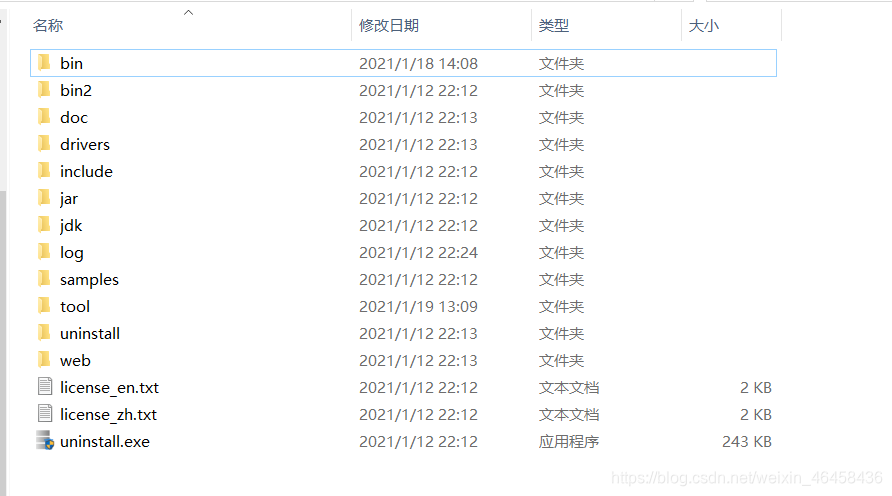

# DM8 部署

# 达梦数据库服务端安装

达梦数据库下载地址：
https://www.dameng.com/list_103.html

## 一、环境准备

原则建议分 3 块盘符，分别是 dmdata 实例盘、dmbak 备份盘和 dmarch 归档盘。

```bash
### 1.修改主机名
hostnamectl set-hostname dmdb
# 在hosts文件中添加ip和主机名的映射
sed -i "\$a 192.168.10.150 dmdb"  /etc/hosts 

### 2.修系统字符集
echo "LANG="zh_CN.UTF-8"" > /etc/locale.conf
source /etc/locale.conf

### 3.关闭selinux和firewalld
sed -i 's/SELINUX=enforcing/SELINUX=disabled/g' /etc/selinux/config
setenforce 0
systemctl stop firewalld && systemctl disable firewalld 

### 4.关闭 Transparent Hugepages
#透明大页 缩写 THP ，这个是 RHEL 6 开始引入的一个功能，在 Linux6 上透明大页是默认启用的。  
#标准大页是从 Linux Kernel 2.6 后被引入的，目的是通过使用大页[内存](https://so.csdn.net/so/search?q=%E5%86%85%E5%AD%98&spm=1001.2101.3001.7020)来取代传统的 4kb 内存页面， 以适应越来越大的系统内存，让操作系统可以支持现代硬件架构的大页面容量功能。  

#标准大页有两种格式大小： 2MB 和 1GB ， 2MB 页块大小适合用于 GB 大小的内存， 1GB 页块大小适合用于 TB 级别的内存； 2MB 是默认的页大小。  
#由于 标准大页 很难手动管理，而且通常需要对代码进行重大的更改才能有效的使用，因此 RHEL 6 开始引入了 透明大页 （ THP ）， THP 是一个抽象层，能够自动创建、管理和使用传统大页。  
#THP 为系统管理员和开发人员减少了很多使用传统大页的复杂性 , 因为 THP 的目标是改进性能 , 因此其它开发人员 ( 来自社区和红帽 ) 已在各种系统、配置、应用程序和负载中对 THP 进行了测试和优化。这样可让 THP 的默认设置改进大多数系统配置性能。但是 , 不建议对数据库工作负载使用 THP 。  
#这两者最大的区别在于 : 标准大页管理是预分配的方式，而透明大页管理则是动态分配的方式。

# 查看是否启用了  Transparent Hugepages
cat /sys/kernel/mm/transparent_hugepage/enabled
[always] madvise never  # 启用状态

# 永久禁用THP(Transparent HugePages )--直接执行立即生效
vim /etc/rc.d/rc.local
------------------------------------------------------
echo never > /sys/kernel/mm/transparent_hugepage/enabled 
echo never > /sys/kernel/mm/transparent_hugepage/defrag

### 5.新建 dmdba 用户和组
groupadd dinstall
useradd -g dinstall -m  -s /bin/bash dmdba
echo Ninestar2022 | passwd --stdin dmdba

### 6.资源限制
# 限制用户进程的数量对于linux系统的稳定性非常重要。
cat >> /etc/security/limits.conf  << EOF
#soft是一个警告值，而hard则是一个真正意义的阀值，超过就会报错
#用户可以打开的最大进程数
#查看系统中可创建的进程数实际值 cat /proc/sys/kernel/pid_max
dmdba soft nproc 65536
dmdba hard nproc 65536
#用户可以打开的最大的文件描述符数量,默认1024，这里的数值会限制tcp连接
#查看系统最大文件描述符 cat /proc/sys/fs/file-max
dmdba soft nofile 65536
dmdba hard nofile 65536
#最大栈大小(kb)
dmdba soft stack 16384
dmdba hard stack 32768
EOF

# 检查是否生效 
su - dmdba 
ulimit -a

### 7.挂载DM数据库iso安装包
mount -o loop /opt/dm8_20220902_x86_rh6_64_ent_8.1.2.138.iso /mnt


### 8.创建安装目录
mkdir -p /data/{dmapp,dmdata}
chown -R dmdba:dinstall /data/{dmapp,dmdata}
```

## 二、数据库安装

*命令行安装*

```bash
su - dmdba
-------------------------------------------------
### 1. -i 静默安装
/mnt/DMInstall.bin -i

#步骤1：选择安装语言
#步骤2：验证key文件
#步骤3：输入时区
#步骤4：选择安装类型
#步骤5：选择安装路径
#步骤6：安装小结
#步骤7：安装
#步骤8：安装并启动数据库备份插件（DmAPService）


### 2.配置环境变量
su - dmdba
cat  >> .bash_profile <<EOF
export DM_HOME=/data/dmapp
export PATH=\$PATH:\$DM_HOME/bin:\$DM_HOME/tool
EOF
source .bash_profile
```

一些常用的脚本启动工具：

|可执行文件|作用|
| -----------------| -----------------------------------------------------------------------------------------------------------------------|
|./DMInstall.bin|可执行的安装文件|
|./uninstall.sh|安装目录中的软件卸载脚本|
|./dbca.sh|安装目录的tool目录下，数据库配置助手：创建、删除数据库实例，注册、删除数据库服务|
|./dmservice.sh|安装目录的tool目录下，DM服务查看器：启动和停止数据库服务|
|./manager|DM管理工具|
|./console|控制台工具（参数，备份与还原，系统信息）|
|./nca.sh|网络配置助手，用于disql连接数据库的ip对应别名，配置文件在/etc/dm_svc.conf，disql用法格式：disql 用户名/密码@别名:端口|
|./disql|安装目录的bin目录下；用于连接数据库，用法：./disql 用户名/密码@localhost:端口号|
|./dts|数据库迁移工具|
|./dminit|命令行创建数据库实例|
|./dmserver|用于启动命令行创建的数据库实例，exit或Ctrl+C终止服务|

```bash
./DMInstall.bin   可执行的安装文件
./uninstall.sh    安装目录中的软件卸载脚本
./dbca.sh         安装目录的tool目录下，数据库配置助手：创建、删除数据库实例，注册、删除数据库服务
./dmservice.sh    安装目录的tool目录下，DM服务查看器：启动和停止数据库服务
./manager         DM管理工具
./console         控制台工具（参数，备份与还原，系统信息）
./nca.sh          网络配置助手，用于disql连接数据库的ip对应别名，配置文件在/etc/dm_svc.conf，disql用法格式：disql 用户名/密码@别名:端口
./disql           安装目录的bin目录下；用于连接数据库，用法：./disql 用户名/密码@localhost:端口号
./dts             数据库迁移工具
./dminit          命令行创建数据库实例
./dmserver        用于启动命令行创建的数据库实例，exit或Ctrl+C终止服务
```

## 三、创建数据库实例

使用`dminit help` 命令查看创建实例参数

```bash
dminit PATH=/data/dmdata \
CASE_SENSITIVE=1 \
CHARSET=1 \
LOG_SIZE=2048 \
DB_NAME=fmsdb \
SYSDBA_PWD=Ninestar123 \
INSTANCE_NAME=fmsdb 

#实际环境中，簇大小建议选择 16，页大小选择 32K，日志大小选择 2048，字符集和大小写敏感需要和应用厂商对接后，再进行选择。
-----------------------------------------------------------
#EXTENT_SIZE        簇是进行存储空间分配的基本单位。一个簇是由一系列逻辑上连续的数据页组成的逻辑存储结构【默认16页】
#PAGE_SIZE          数据文件使用的页大小，可以为 4 KB、8 KB、16 KB 或 32 KB 之一，选择的页大小越大，则 DM 支持的元组长度也越大，但同时空间利用率可能下降，【默认8 KB】
#CASE_SENSITIVE     标识符大小写敏感，默认值为 Y 。取值 Y、1，N、0 
#CHARSET            字符集选项。0 代表 GB18030；1 代表 UTF-8；2 代表韩文字符集 EUC-KR；取值 0、1 或 2 之一。默认值为 0。
```

## 四、注册服务

注册数据库服务、守护服务、监控服务等
**注册服务需使用 **​***root***​ ** 用户进行注册**。使用 root 用户进入数据库安装目录的 `~/script/root` 下:

```bash
cd /data/dmapp/script/root
./dm_service_installer.sh -t dmserver -dm_ini /data/dmdata/fmsdb/dm.ini -p fmsdb

```

## 五、启动数据库

```bash
/data/dmapp/bin/DmServiceFMSDB start
----------------------------------------------------------------
# 命令行连接
#disql SYSDBA/Ninestar123@192.168.10.150:8001
#创建表空间
create tablespace jy2web datafile '/data/dmdata/fmsdb/JY2WEB01.DBF' size 1024 autoextend on next 1024 maxsize unlimited;
create tablespace jy2gm   datafile '/data/dmdata/fmsdb/JY2GM01.DBF'   size 1024 autoextend on next 1024 maxsize unlimited;
#创建用户JY2WEB并指定默认的表空间及默认的索引表空间。
create user jy2web identified by Ninestar2022 default tablespace jy2web;
create user jy2gm   identified by Ninestar2022 default tablespace jy2gm;
# 授权
grant resource,dba to jy2web;
grant resource,dba to jy2gm;

----------------------------------------------------------------
disql jy2web/Ninestar2022

```

## 六、其他配置

### Linux(Unix)下License的安装

**操作方法如下**：

首先，找到DM服务器所在的目录，方法是以root用户或安装用户登录到Linux系统，启动终端，执行以下命令即可进入DM服务器程序安装的目录：

```bash
# 关闭达梦数据库
/data/dmdbms/bin/DmServicejyv2g  stop
# 再将dm.key文件拷贝到该目录，替换原有的dm.key即可
# 更新拥有者权限
chown dmdba.dinstall dm.key
```

‍

### DM7.6之前版本默认密码是转为大写存储的，登录时要注意。

比如用户设置test1/test123456，那么登录的时候用test1/TEST123456和TEST1/TEST123456可以登录，用test1/test123456和TEST1/test123456就不能登录。如果设置密码时加引号，则存储实际的密码。

 DM8版本后大小写默认通用，用户名密码默认统一都存储大写的，登录时用大小写都可以，都转为大写做匹配。如果设置密码时加引号，则存储实际的密码。

‍

‍

# 达梦数据库客户端安装

达梦数据库下载地址：  
[https://www.dameng.com/list_103.html](https://www.dameng.com/list_103.html)

1. 解压后双击setup.exe 安装向导
2. 选择语言和时区（时区和服务端一样）
   `select sysdate;`
3. *验证key文件
4. 选择安装组件：客户端安装
5. 选择安装目录
6. 安装确认
7. 打开【开始菜单】使用DM管理工具连接数据库

‍

‍

# 目录文件及各配置文件、参数说明

​​

```bash
bin      数据库核心文件目录。（常用命令./dminit ./dmserver ./dmsql ./dimp ./dexp都在该目录下）
doc      数据库手册(安装手册，系统管理员手册，SQL语言使用手册等)存放目录。
drivers  数据库驱动存放目录。
log      数据库日志文件存放目录。
samples  配置文件样板（dmarch归档文件，dmmal通信文件等）存放目录。
tool     数据库工具（管理工具，数据迁移工具，审计与分析工具等）存放目录。
web      web工具（DEM）的连接及配置手册存放目录。
license_en 英文《软件产品授权证书》概述。
license_zh 中文《软件产品授权证书》概述。
release_en 英文达梦数据库管理系统版本号汇总。
release_zn 中文达梦数据库管理系统版本号汇总。
uninstall.exe 数据库卸载，双击即可按照提示进行数据库的卸载。
```

## 各配置文件、参数说明

以下文件在初始化实例目录下

达梦数据库参数文件主要有实例参数文件dm.ini、归档参数文件dmarch.ini及配置集群的参数文件dmmal.ini、dmwatcher.ini、dmmpp.ini、dmtimer.ini、dmwmon.ini。

达梦数据库的参数文件，dm.ini是必须的，其它均可选择配置。且除了实例参数文件dm.ini外，其它参数文件按照部署规范配置好后，基本上没有调整的必要性。

|参数文件|说明|
| ---------------| ------------------------------------------------------------------------------------------------------------------------------------------------------------------------------------------------------------------------------------------------------------------|
|dm.ini|达梦数据库启动所必须的配置文件，通过配置该文件可以设置达梦数据库服务器的各种功能和性能选项。达梦数据库是否读参数文件dmarch.ini、dmmal.ini、dmmpp.ini、dmtimer.ini，均有dm.ini参数文件中的相应参数(MAL\_INI、ARCH\_INI、MPP\_INI、TIMER\_INI)来控制。|
|dmarch.ini|用于配置REDO日志的本地归档和远程归档。所谓远程归档指这台实例的REDO日志发送到集群中另外一个实例(该实例为这台实例的备机)。|
|dmmal.ini|达梦数据库集群间MAL系统的配置文件，通过该文件配置达梦集群中每个实例的IP地址、端口号等信息。|
|dmwatcher.ini|守护进程的配置文件。|
|dmmpp.ini|MPP集群的配置文件。|
|dmtimer.ini|异步备机的配置文件。|
|dmmonitor.ini|数据守护系统的监视器配置文件。|

**实例参数文件dm.ini**中主要分为两类：功能配置参数、性能调优参数。具体有：
dm.ini参数列表：

|参数名|说明|
| -------------------| ----------------------------------------------------------|
|CTL\_PATH|必配，实例控制文件路径。|
|SYSTEM\_PATH|必配，系统表空间路径。|
|TEMP\_PATH|必配，临时表空间路径。|
|BAK\_PATH|必配，数据库备份默认路径。|
|INSTANCE\_NAME|必配，数据库实例名称。|
|ARCH\_INI|选配项，REDO本地归档开关，如不配置，无法进行数据库备份。|
|MAL\_INI|集群必配项，MAL通信开关。|
|DW\_PORT|集群必配项，数据库和守护进程的TCP通信端口。|
|TIMER\_INI|选配，异步备机开关，配置异步备机必须要配置该项。|
|MPP\_INI|选配，MPP集群开关，配置MPP集群必须要配置该项。|

其它参数均为选配项，包括功能参数、性能调优参数、监控参数等，请在压力测试中根据性能增加其它参数，
