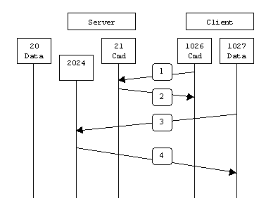

# ftp

* 📄 ftp-windows
* 📄 ftp常用命令
* 📄 sftp-linux
* 📄 sftp-windwos
* 📄 vsftp-linux

　　‍

# ftp和sftp的区别

　　sftp和ftp的区别在安全通道，使用的协议，链接方式，安全性等方面都有不同。

* ftp（File Transfer Protocol，文件传输协议） 是 TCP/IP 协议组中的协议之一。使用20，21两个端口，**20是数据链路的端口，21是控制链路的端口**。
* sftp（Secure File Transfer Protocol ，安全文件传送协议）sftp 是ssh服务的一部分，**和ssh一样，使用22端口**。能够为传输文件提供一种安全的加密方法，但是这种安全是以牺牲效率为代价的。

# 主动模式与被动模式

　　sftp不存在主被动模式，ftp可配置主被动模式

## 主动模式 PORT

　　FTP客户端使用随机端口N与**FTP服务端的21端口**建立连接，并开始倾听N+1端口，同时通过21端口将N+1端口告诉FTP服务端。FTP服务端获取到客户端告诉它的N+1端口后，使用**数据传输的20端口**与FTP客户端N+1端口建立连接，从而进行数据传输。图示如下：


　　传输数据时，server端主动连接client端，server端开启21端口的“准入”和20端口的“准出”。

　　**这样的连接有时候会被客户端的防火墙阻止**。

## 被动模式 PASV

　　client端会开通随机的两个端口N和N+1（N>1023）。其中，N端口与server端21端口建立通讯，并发送PASV命令到server端。server端接收到PASV命令之后，会随机创建一个端口P（P>1023），并将端口P返回给client端。client拿到P端口后，就会通过N+1端口与P端口建立数据传输连接。图示如下：



　　被动模式解决了服务器主动发起到客户端连接会被阻止的问题。

```bash
pasv_min_port=2024       # 在PASV工作模式下，数据连接可以使用的端口范围的最小端口,0表示任意端口。默认值为0。
pasv_max_port=2034       # 在PASV工作模式下，数据连接可以使用的端口范围的最大端口,0表示任意端口。默认值为0。

```

　　‍

　　‍
