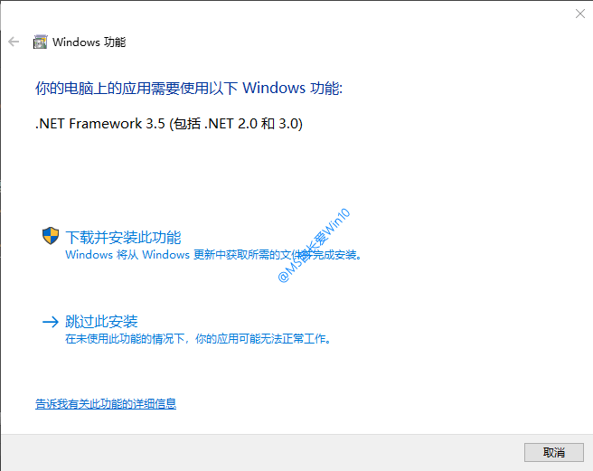
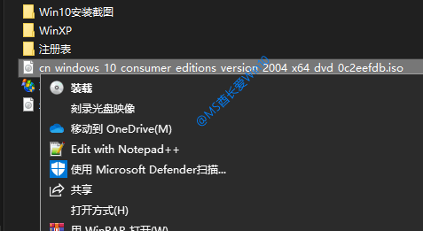
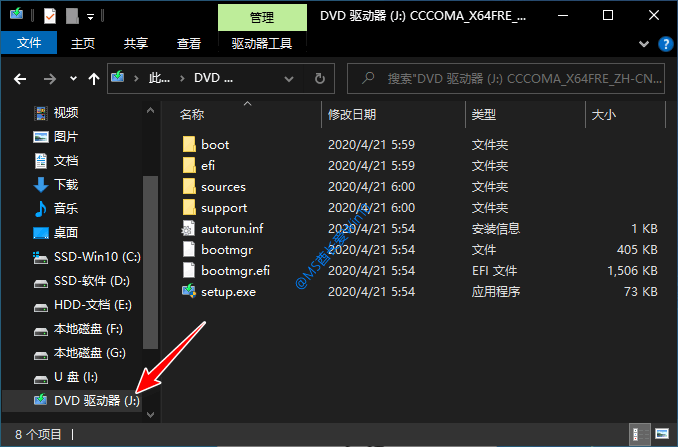
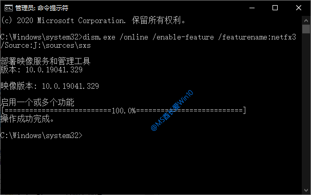
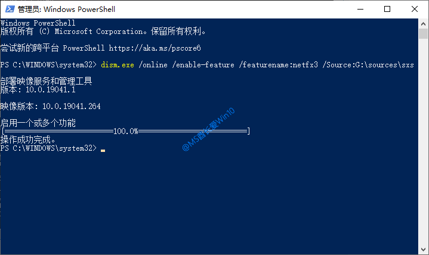
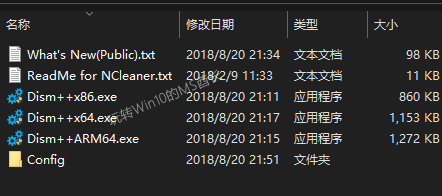
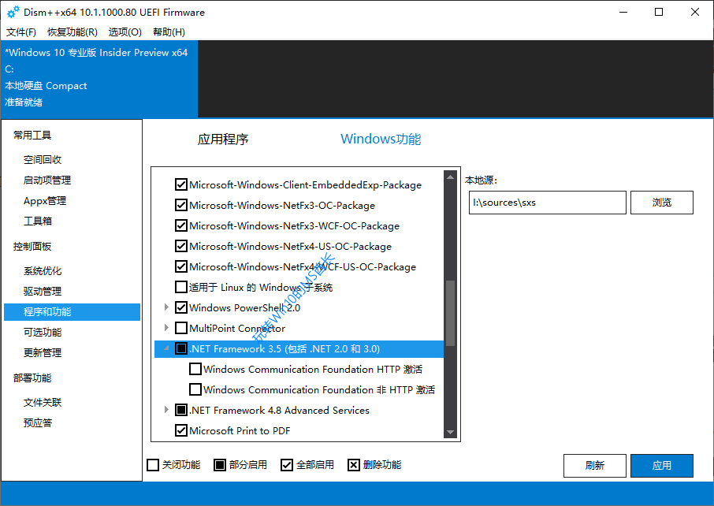
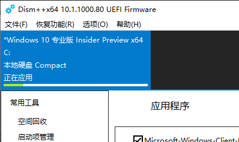

# 离线安装.NET Framework 3.5

我们在安装运行某些软件的时候，会遇到提示“你的电脑上的应用需要使用以下Windows功能:.NET Framework 3.5(包括.NET 2.0和3.0)”。如图：

​​

如果你选择“下载并安装此功能。Windows将从Windows更新中获取所需的文件并完成安装”，就会发现下载的速度奇慢。通常等了很久，还是眼睁睁地看着进度条在那滚动，并且最后还不一定下载安装成功。

那么现在MS酋长就来分享一下Win10离线安装.NET Framework 3.5的方法，包括.net 3.5离线安装包，助你快速成功安装.NET Framework 3.5。

## 方法一：DISM命令离线安装.NET Framework 3.5

首先，我们需要下载Win10 ISO镜像。

在Win10 ISO镜像文件上点击右键，选择“装载”。如图：

​​

这时“此电脑”中就会显示虚拟光驱“DVD驱动器(X:)”，记下盘符，MS酋长这里显示的盘符是“J:”。如图：

​​

然后以管理员身份运行命令提示符。方法是：

*在Win10任务栏搜索框中输入 cmd ，在搜索结果中选择“以管理员身份运行”。*

或者以管理员身份运行Windows PowerShell。方法是：

*右键点击Win10开始按钮，选择“Windows PowerShell(管理员)”）。*

在打开的“管理员:命令提示符”或“管理员: Windows PowerShell”窗口中输入以下命令：

​`dism.exe /online /enable-feature /featurename:netfx3 /Source:J:\sources\sxs`​

_注：其中的盘符 J: 要改成你实际的虚拟光驱盘符

​​

在“管理员: 命令提示符”中运行命令

​​

在“管理员: Windows PowerShell”中运行命令

按回车键运行命令。等待部署完毕，进度100%，提示“操作成功完成”。

这样Win10就成功安装了.NET Framework 3.5。

## 方法二：DISM命令部署cab格式.NET Framework 3.5离线安装包

如果你不想下载体积庞大的Win10 ISO镜像，那么也可以下载cab格式的.NET Framework 3.5离线安装包，然后运行DISM命令部署即可。

**cab格式.NET Framework 3.5离线安装包下载地址：**

[百度网盘](http://pan.baidu.com/s/1geAjsaf)

**安装方法：**

先把下载的名为NetFx3.cab的离线安装包放到Win10系统盘C:\Windows文件夹里。

然后以管理员身份运行命令提示符，输入并按回车键运行以下命令：

​`dism /online /Enable-Feature /FeatureName:NetFx3 /Source:"%windir%" /LimitAccess`​

等待部署进度100%即可。

## 方法三：Dism++离线安装.NET Framework 3.5

上面两个方法都需要运行dism命令，小白用户表示有难度，而且屡发错误安装失败等问题。所以MS酋长再分享一个借助Dism++工具离线安装.NET Framework 3.5的方法，无需输入命令即可完成。

### 步骤一：下载Win10 ISO镜像

参见《[使用微软媒体创建工具下载原版Win10 ISO镜像](https://www.run1314.com/media-creation-tool-download-win10-iso/)》。

### 步骤二：下载Dism++工具软件

最新版Dism++下载地址：

[官方网站](http://www.chuyu.me/zh-Hans/index.html)

解压之后，可以看到其中包括x86、x64和ARM64三个程序文件，分别对应32位、64位和ARM版Windows10系统。

​​

### 步骤三：装载Win10 ISO镜像

这个和“方法一”中装载Win10 ISO镜像的方法一样，利用的都是Win10自带的虚拟光驱功能，这里不再赘述。

### 步骤四：运行Dism++安装.NET Framework 3.5

MS酋长的是64位Win10系统，所以就运行Dism++x64.exe 。在窗口左侧的导航窗格中定位至“控制面板 – 程序和功能”，然后在右侧主窗格中切换到“Windows功能”标签。如图：

​​

在可选功能列表中找到.NET Framework 3.5(包括.NET 2.0和3.0 )，在选择框中点击一下，显示为“部分启用”即可。

Dism++窗口最右侧的“本地源”则已经自动定位至Win10 ISO镜像的 I:\sources\sxs 目录。

点击右下角的“应用”按钮，窗口顶部就会显示有“正在应用”进度条。如图：

​​

待应用完成后，会重新显示“准备就绪”，这时候.NET Framework 3.5已经安装完成了。
