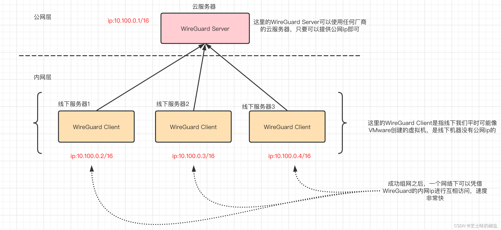
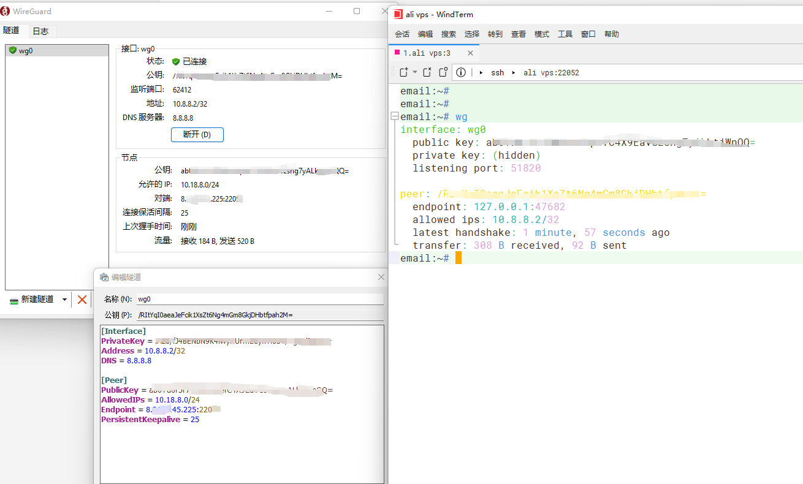

# WireGuard

## Wireguard 与 OpenVPN

自 2001 年推出以来，OpenVPN 已成为 VPN 行业的宠儿。多年来，VPN 协议不断发展，并因其对密码学的支持以及它可以在两者中运行而广受赞誉 [UDP 和 TCP](https://fastestvpn.com/zh-CN/%E6%96%B0%E9%97%BB/tcp-%E4%B8%8E-udp/) 模式。 在 TCP 中运行 OpenVPN 对于绕过防火墙特别有帮助，因为它使用端口 443，这也是 [HTTPS](https://fastestvpn.com/zh-CN/%E6%96%B0%E9%97%BB/%E4%BB%80%E4%B9%88%E6%98%AFhttps/) 交通。 阻止该端口意味着 Web 流量无法通过防火墙。

但是  OpenVPN 是 20 年前推出的。 Wireguard 希望成为更精简、更快的新协议。 Wireguard 只有 4000 到 5000  行代码，而 IPsec 有 400,000 行代码，这一事实证明了这一点。 因为它的代码行数更少，所以出现潜在漏洞的机会也更少。

OpenVPN 支持各种密码套件，允许旧设备支持该协议。 但它也为可能暴露漏洞的糟糕实施打开了大门。 通过定义密码套件，Wireguard 确保设备和服务器遵循最佳安全协议。

Wireguard 和 OpenVPN 之间的另一个区别是它们对服务器进行身份验证的方式。 OpenVPN基于 [SSL / TLS](https://fastestvpn.com/zh-CN/%E6%96%B0%E9%97%BB/%E4%BB%80%E4%B9%88%E6%98%AFhttps/)，它使用 OpenSSL 库进行加密。 它可以使用用户名和密码或证书进行身份验证。 相比之下，Wireguard 使用公钥加密进行身份验证。

## Wireguard 与 OpenVPN – 优点和缺点

因为 Wireguard 使用公钥加密，Wireguard  需要静态 IP 地址。 VPN 作为一种动态分配 IP 地址的服务是有问题的。 Wireguard 做的另一件事是将用户的 IP  地址保存在内存中，直到服务器重新启动。 这与 OpenVPN 等 VPN 协议形成对比，后者会在用户结束连接后从内存中清除 IP 地址信息。

解决 Wireguard 静态 IP 地址要求的一种方法是建立双 NAT，它将动态分配一个面向公众的 IP 地址到用户的静态 IP 地址，以便目的地无法识别用户。

OpenVPN 的主要缺点是配置和缺乏对 OpenVPN 的本地支持。 设置 OpenVPN 可能是一个具有挑战性且漫长的过程。 由于其相对复杂的设置，可能会出现配置不当的情况。

OpenVPN 未内置于 Windows、Linux 或 macOS 中，这意味着需要额外的软件才能使其正常工作。

## 使用 WireGuard 组网

​​​​

‍

下面用WireGuard演示一台公网服务器和一台线下机器异步组网：

### WireGuard Server（一台公网服务器）

```bash
#更新update
$ sudo yum update -y

#安装wireguard --centos
$ sudo yum install epel-release elrepo-release
$ sudo yum install yum-plugin-elrepo
$ sudo yum install kmod-wireguard wireguard-tools

#安装wireguard --debian
$ sudo apt install wireguard wireguard-tools

#开启内核转发
echo "net.ipv4.ip_forward=1" >> /etc/sysctl.conf
sysctl -p

#创建目录
mkdir -p /etc/wireguard
cd  /etc/wireguard
#生成server密钥对 
wg genkey > server_key && wg pubkey < server_key > server_pub 

#生成client密钥对 
wg genkey > client_key && wg pubkey < client_key > client_pub 
```

编辑服务端文件  
​`vim /etc/wireguard/wg0.conf   #输入以下内容`​

```bash
[Interface]
Address = 172.168.1.1/24   # 分配给本机的ip
SaveConfig = true
ListenPort = 22054               # 监听端口UDP
PrivateKey = <server_private_key >


PostUp = iptables -A FORWARD -i wg0 -j ACCEPT; iptables -A FORWARD -o wg0 -j ACCEPT; iptables -t nat -A POSTROUTING -o eth0 -j MASQUERADE
PostDown = iptables -D FORWARD -i wg0 -j ACCEPT; iptables -D FORWARD -o wg0 -j ACCEPT; iptables -t nat -D POSTROUTING -o eth0 -j MASQUERADE

# Client，可以有很多 Peer
[Peer] 
PublicKey = <client_public >
AllowedIPs = 172.168.1.2/24       #分配给client的ip

```

启动与停止

```bash
wg-quick up  /etc/wireguard/wg0.conf
wg-quick down  /etc/wireguard/wg0.conf

# 启动/停止 VPN 网络接口
ip link set wg0 up
ip link set wg0 down

# 注册/注销 VPN 网络接口
ip link add dev wg0 type wireguard
ip link delete dev wg0

# 注册/注销 本地 VPN 地址
ip address add dev wg0 192.0.2.3/32
ip address delete dev wg0 192.0.2.3/32

# 添加/删除 VPN 路由
ip route add 192.0.2.3/32 dev wg0
ip route delete 192.0.2.3/32 dev wg0
```

查看信息

```bash
# 查看系统 VPN 接口信息
ip link show wg0

# 查看 VPN 接口详细信息
wg show all
wg show wg0

# 查看 VPN 接口地址
ip address show wg0

# 查看系统路由表
ip route show table main
ip route show table local

# 获取到特定 IP 的路由
ip route get 222.222.222.1
```

一键安装请参考这个项目：[https://github.com/angristan/wireguard-install](https://github.com/angristan/wireguard-install)

‍

### WireGuard Client（N台非公网服务器）

客户端下载：[https://www.wireguard.com/install/](https://www.wireguard.com/install/)

客户端同样需要开启内核转发

```bash
#开启内核转发
echo "net.ipv4.ip_forward=1" >> /etc/sysctl.conf
sysctl -p
```

安装方式同上，以下是客户端的配置文件

```bash
[Interface]
PrivateKey = <client_private_key>
Address =  172.168.1.2/24       #分配给client的ip
DNS = 8.8.8.8  # 连接后使用的 DNS, 如果要防止 DNS 泄露，建议使用内网的 DNS 服务器

[Peer]
PublicKey = < server_public>
Endpoint = x.x.x.x:51820  # 服务端公网暴露地址，51280 是上面指定的
AllowedIPs =  172.168.1.0/24,172.17.0.11/20  # 指定要访问的服务端网段,或者设置0.0.0.0/0来进行全局代理.
PersistentKeepalive = 25

```

**windows 开启/关闭转发数据包 ip_forward**

通过注册表进行设置：regedit

HKEY_LOCAL_MACHINE\SYSTEM\CurrentControlSet\Services\Tcpip\Parameters

1：开启；0：关闭

重启系统

‍

### 配置nginx转发

**注意监听端口为UDP**

```bash
  stream {
  log_format proxy '$remote_addr $status [$time_iso8601] $session_time ';
  open_log_file_cache off;
  limit_conn_zone $binary_remote_addr zone=stream_conn_zone:5m;

server {
    listen 22054 udp;
    proxy_pass 127.0.0.1:51820;
    proxy_timeout 120;     # 链接保持时间
    proxy_connect_timeout 30s;
    limit_conn stream_conn_zone 6;
    access_log logs/wireguard.log proxy ;
  }
```

### 测试

​​

‍

## WireGuard-iptable 配置

### 中继服务器配置 iptable

```bash
PostUp   = iptables -A FORWARD -i wg0 -j ACCEPT; iptables -A FORWARD -o wg0 -j ACCEPT; iptables -t nat -A POSTROUTING -o eth0 -j MASQUERADE
PostDown = iptables -D FORWARD -i wg0 -j ACCEPT; iptables -D FORWARD -o wg0 -j ACCEPT; iptables -t nat -D POSTROUTING -o eth0 -j MASQUERADE
```

‍

‍

## 配置详解

WireGuard 使用   [INI](https://zh.wikipedia.org/wiki/INI%E6%96%87%E4%BB%B6) 语法作为其配置文件格式。配置文件可以放在任何路径下，但必须通过绝对路径引用。默认路径是 `/etc/wireguard/wg0.conf`​。

配置文件的命名形式必须为 `${WireGuard 接口的名称}.conf`​。通常情况下 WireGuard 接口名称以 `wg`​ 为前缀，并从 `0`​ 开始编号，但你也可以使用其他名称，只要符合正则表达式 `^[a-zA-Z0-9_=+.-]{1,15}$`​ 就行。

你可以选择使用 `wg`​ 命令来手动配置 VPN，但一般建议使用 `wg-quick`​，它提供了更强大和用户友好的配置体验，可以通过配置文件来管理配置。

下面是一个配置文件示例：

```ini
[Interface]                                       ;这一节定义本地 VPN 配置
# Name = node1.example.tld     ;这是 `INI` 语法中的标准注释，用于展示该配置部分属于哪个节点。这部分配置会被 WireGuard 完全忽略
Address = 192.0.2.3/24 ;定义本地节点应该对哪个地址范围进行路由。如果是常规的客户端，则将其设置为节点本身的单个 IP（使用 CIDR 指定，例如 192.0.2.3/32）；如果是中继服务器，则将其设置为可路由的子网范围。
		* 常规客户端，只路由自身的流量：Address = 192.0.2.3/32
		* 中继服务器，可以将流量转发到其他对等节点（peer）：Address = 192.0.2.1/24
		* 也可以指定多个子网或 IPv6 子网：Address = 192.0.2.1/24,2001:DB8::/64	
ListenPort = 51820      ;默认端口号是 `51820`。常规客户端不需要此选项
PrivateKey = localPrivateKeyAbcAbcAbc=   ;本地节点的私钥
DNS = 1.1.1.1,8.8.8.8   ;客户端将会使用这里指定的 DNS 服务器来处理 VPN 子网中的 DNS 请求
Table = 12345   ;定义 VPN 子网使用的路由表，默认不需要设置
MTU = 1500      ;最大传输单元,默认不需要设置，一般由系统自动确定。
PreUp = /bin/example arg1 arg2 %i           ;启动 VPN 接口之前运行的命令
PostUp = /bin/example arg1 arg2 %i         ;启动 VPN 接口之后运行的命令
PreDown = /bin/example arg1 arg2 %i      ;停止 VPN 接口之前运行的命令
PostDown = /bin/example arg1 arg2 %i    ;停止 VPN 接口之后运行的命令

[Peer]   ；定义能够为一个或多个地址路由流量的对等节点（peer）的 VPN 设置
# Name = node2-node.example.tld
AllowedIPs = 192.0.2.1/24   ;允许该对等节点（peer）发送过来的 VPN 流量中的源地址范围。
		* AllowedIPs = 192.0.2.3/32       ;对等节点（peer）是常规客户端，只路由自身的流量
		* AllowedIPs = 192.0.2.1/24       ;对等节点（peer）是中继服务器，可以将流量转发到其他对等节点（peer）
		* AllowedIPs = 0.0.0.0/0,::/0       ;对等节点（peer）是中继服务器，可以转发所有的流量，包括外网流量和 VPN 流量，可以用来干嘛你懂得
Endpoint = node1.example.tld:51820            ;指定远端对等节点（peer）的公网地址
PublicKey = remotePublicKeyAbcAbcAbc=    ;对等节点（peer）的公钥
PersistentKeepalive = 25                                  ;表示每隔 `25` 秒发送一次 ping 来检查连接。
```

‍

## 高级特性

### IPv6

前面的例子主要使用 `IPv4`​，WireGuard 也支持 `IPv6`​。例如：

```ini
[Interface]
AllowedIps = 192.0.2.3/24, 2001:DB8::/64

[Peer]
...
AllowedIPs = 0.0.0.0/0, ::/0
```

### 转发所有流量

如果你想通过 VPN 转发所有的流量，包括 VPN 子网和公网流量，需要在 `[Peer]`​ 的 `AllowedIPs`​ 中添加 `0.0.0.0/0, ::/0`​。

即便只转发 `IPv4`​ 流量，也要指定一个 `IPv6`​ 网段，以避免将 `IPv6`​ 数据包泄露到 VPN 之外。详情参考：  [reddit.com/r/WireGuard/comments/b0m5g2/ipv6_leaks_psa_for_anyone_here_using_wireguard_to](https://www.reddit.com/r/WireGuard/comments/b0m5g2/ipv6_leaks_psa_for_anyone_here_using_wireguard_to/)

例如：

```ini
[Interface]
# Name = phone.example-vpn.dev
Address = 192.0.2.3/32
PrivateKey = <private key for phone.example-vpn.dev>

[Peer]
# Name = public-server1.example-vpn.dev
PublicKey = <public key for public-server1.example-vpn.dev>
Endpoint = public-server1.example-vpn.dev:51820
AllowedIPs = 0.0.0.0/0, ::/0
```

一般只有把 VPN 当做武当纵云梯来用时，才会需要转发所有流量，不多说，点到为止。

### NAT-to-NAT 连接

如果两个对等节点（peer）都位于 NAT 后面，想不通过中继服务器直接连接，需要保证至少有一个对等节点（peer）具有稳定的公网出口，使用静态公网 IP 或者通过 `DDNS`​ 动态更新 `FQDN`​ 都可以。

​`WebRTC`​ 协议可以动态配置两个 NAT 之间的连接，它可以通过信令服务器来检测每个主机的 `IP:Port`​ 组合。而 WireGuard 没有这个功能，它没有没有信令服务器来动态搜索其他主机，只能硬编码 `Endpoint+ListenPort`​，并通过 `PersistentKeepalive`​ 来维持连接。

总结一下 NAT-to-NAT 连接的前提条件：

* 至少有一个对等节点（peer）有固定的公网 IP，如果都没有固定的公网 IP，也可以使用 `DDNS`​ 来维护一个稳定的域名。
* 至少有一个对等节点（peer）指定 UDP `ListenPort`​，而且它的 NAT 路由器不能做 UDP 源端口随机化，否则返回的数据包将被发送到之前指定的 `ListenPort`​，并被路由器丢弃，不会发送到新分配的随机端口。
* 所有的对等节点（peer）必须在 `[Peer]`​ 配置中启用其他对等节点（peer）的 `PersistentKeepalive`​，这样就可以维持连接的持久性。

对于通信双方来说，只要**服务端**所在的 NAT 路由器没有指定到 NAT 后面的对等节点（peer）的转发规则，就需要进行 UDP 打洞。

UDP 打洞的原理：

1. ​`Peer1`​ 向 `Peer2`​ 发送一个 UDP 数据包，不过 `Peer2`​ 的 NAT 路由器不知道该将这个包发给谁，直接丢弃了，不过没关系，这一步的目的是让 `Peer1`​ 的 NAT 路由器能够接收 UDP 响应并转发到后面的 `Peer1`​。
2. ​`Peer2`​ 向 `Peer1`​ 发送一个 UDP 数据包，由于上一步的作用，`Peer1`​ 的 NAT 路由器已经建立临时转发规则，可以接收 UDP 响应，所以可以接收到该数据包，并转发到 `Peer1`​。
3. ​`Peer1`​ 向 `Peer2`​ 发送一个 UDP 响应，由于上一步的作用，由于上一步的作用，`Peer2`​ 的 NAT 路由器已经可以接收 UDP 响应，所以可以接收到该数据包，并转发到 `Peer2`​。

**这种发送一个初始的数据包被拒绝，然后利用路由器已建立的转发规则来接收响应的过程被称为 『UDP 打洞』。**

当你发送一个 UDP 数据包出去时，路由器通常会创建一个临时规则来映射源地址/端口和目的地址/端口，反之亦然。从目的地址和端口返回的  UDP 数据包会被转发到原来的源地址和端口，这就是大多数 UDP 应用在 NAT 后面的运作方式（如 BitTorrent、Skype  等）。这个临时规则会在一段时间后失效，所以 NAT 后面的客户端必须通过 `PersistentKeepalive`​ 定期发送数据包来维持连接的持久性。

当两个对等节点（peer）都位于 NAT 后面时，要想让 UDP 打洞生效，需要两个节点在差不多的时间向对方发送数据包，这就意味着双方需要提前知道对方的公网地址和端口号，可以在 `wg0.conf`​ 中指定。

#### UDP 打洞的局限性

从 2019 年开始，很多以前用过的老式打洞方法都不再有效了。以前很著名的就是   [pwnat](https://github.com/samyk/pwnat) 开创的一种新的打洞方法，它能够在不需要代理、第三方服务器、upnp、DMZ、sproofing、dns 转换的情况下实现 NAT 中的 P2P 通信。它的原理也很简单：

通过让客户端假装成为一个互联网上任意的 `ICMP`​ 跳跃点（ a random hop on the Internet）来解决这个问题，从而让服务端能够获取到客户端的 IP 地址。`traceroute`​ 命令也是使用这项技术来检测 Internet 上的跳跃点。

具体来说，当服务器启动时，它开始向固定地址 `3.3.3.3`​ 发送固定的 **ICMP 回应请求包**（ICMP echo request packets）。显然，我们无法从 `3.3.3.3`​ 收到返回的 **ICMP 回应数据包**（ICMP echo packets）。然而，`3.3.3.3`​ 并不是我们可以访问的主机，我们也不是想伪装成它来发 ICMP 回应数据包。相反，pwnat 技术的实现原理在于，当我们的客户端想要连接服务端时，客户端（知道服务器IP地址）会向服务端送 **ICMP 超时数据包**（ICMP Time Exceeded packet）。 这个 ICMP 数据包里面包含了服务端发送到 `3.3.3.3`​ 的原始固定 **ICMP 回应请求包**。

为什么要这样做呢？好吧，我们假装是互联网上的一个 ICMP 跳越点，礼貌地告诉服务器它原来的 **ICMP 回应请求包**无法传递到 `3.3.3.3`​。而你的 NAT 是一个聪明的设备，它会注意到 **ICMP 超时数据包**内的数据包与服务器发出 **ICMP 回应请求包**相匹配。然后它将 **ICMP 超时数据包**转发回 NAT 后面的服务器，包括来自客户端的完整 IP 数据包头，从而让服务端知道客户端 IP 地址是什么！

现在这种类似的 UDP 打洞方法受到了很多的限制，详情可以参考  [上篇文章](https://icloudnative.io/posts/wireguard-docs-theory/)，这里不过多阐述。除了 UDP 打洞之外，我们仍然可以使用硬编码的方式指定两个对等节点（peer）的公网地址和端口号，这个方法对大多数 NAT 网络都有效。

#### 源端口随机化

如果所有的对等节点（peer）都在具有严格的 UDP 源端口随机化的 NAT 后面（比如大多数蜂窝网络），那么无法实现 `NAT-to-NAT`​ 连接。因为双方都无法协商出一个 `ListenPort`​，并保证自己的 NAT 在发出 ping 包后能够接收发往该端口的流量，所以就无法初始化打洞，导致连接失败。因此，一般在 `LTE/3G`​ 网络中无法进行 p2p 通信。

#### 使用信令服务器

上节提到了，如果所有的对等节点（peer）都在具有严格的 UDP 源端口随机化的 NAT 后面，就无法直接实现 `NAT-to-NAT`​ 连接，但通过第三方的信令服务器是可以实现的。信令服务器相当于一个中转站，它会告诉通信双方关于对方的 `IP:Port`​ 信息。这里有几个项目可以参考：

* [takutakahashi/wg-connect](https://github.com/takutakahashi/wg-connect)
* [git.zx2c4.com/wireguard-tools/tree/contrib/nat-hole-punching](https://git.zx2c4.com/wireguard-tools/tree/contrib/nat-hole-punching/)

#### 动态 IP 地址

WireGuard 只会在启动时解析域名，如果你使用 `DDNS`​ 来动态更新域名解析，那么每当 IP 发生变化时，就需要重新启动 WireGuard。目前建议的解决方案是使用 `PostUp`​ 钩子每隔几分钟或几小时重新启动 WireGuard 来强制解析域名。

总的来说，`NAT-to-NAT`​ 连接极为不稳定，而且还有一堆其他的限制，所以还是建议通过中继服务器来通信。

NAT-to-NAT 配置示例：

Peer1：

```ini
[Interface]
...
ListenPort = 12000

[Peer]
...
Endpoint = peer2.example-vpn.dev:12000
PersistentKeepalive = 25
```

Peer2：

```ini
[Interface]
...
ListenPort = 12000

[Peer]
...
Endpoint = peer1.example-vpn.dev:12000
PersistentKeepalive = 25
```

更多资料：

* [samyk/pwnat](https://github.com/samyk/pwnat)
* [en.wikipedia.org/wiki/UDP_hole_punching](https://en.wikipedia.org/wiki/UDP_hole_punching)
* [stackoverflow.com/questions/8892142/udp-hole-punching-algorithm](https://stackoverflow.com/questions/8892142/udp-hole-punching-algorithm)
* [stackoverflow.com/questions/12359502/udp-hole-punching-not-going-through-on-3g](https://stackoverflow.com/questions/12359502/udp-hole-punching-not-going-through-on-3g)
* [stackoverflow.com/questions/11819349/udp-hole-punching-not-possible-with-mobile-provider](https://stackoverflow.com/questions/11819349/udp-hole-punching-not-possible-with-mobile-provider)
* [WireGuard/WireGuard@](https://github.com/WireGuard/WireGuard/tree/master/contrib/examples/nat-hole-punching)​[`master`](https://github.com/WireGuard/WireGuard/tree/master/contrib/examples/nat-hole-punching)​[/contrib/examples/nat-hole-punching](https://github.com/WireGuard/WireGuard/tree/master/contrib/examples/nat-hole-punching)
* [staaldraad.github.io/2017/04/17/nat-to-nat-with-wireguard](https://staaldraad.github.io/2017/04/17/nat-to-nat-with-wireguard/)
* [golb.hplar.ch/2019/01/expose-server-vpn.html](https://golb.hplar.ch/2019/01/expose-server-vpn.html)

### 动态分配子网 IP

这里指的是对等节点（peer）的 VPN 子网 IP 的动态分配，类似于 DHCP，不是指 `Endpoint`​。

WireGuard 官方已经在开发动态分配子网 IP 的功能，具体的实现可以看这里：  [WireGuard/wg-dynamic](https://github.com/WireGuard/wg-dynamic)

当然，你也可以使用 `PostUp`​ 在运行时从文件中读取 IP 值来实现一个动态分配 IP 的系统，类似于 Kubernetes 的 CNI 插件。例如：

```ini
[Interface]
...
PostUp = wg set %i allowed-ips /etc/wireguard/wg0.key <(some command)
```

### 奇技淫巧

#### 共享一个 peers.conf 文件

介绍一个秘密功能，可以简化 WireGuard 的配置工作。如果某个 `peer`​ 的公钥与本地接口的私钥能够配对，那么 WireGuard 会忽略该 `peer`​。利用这个特性，我们可以在所有节点上共用同一个 peer 列表，每个节点只需要单独定义一个 `[Interface]`​ 就行了，即使列表中有本节点，也会被忽略。具体方式如下：

* 每个对等节点（peer）都有一个单独的 `/etc/wireguard/wg0.conf`​ 文件，只包含 `[Interface]`​ 部分的配置。
* 每个对等节点（peer）共用同一个 `/etc/wireguard/peers.conf`​ 文件，其中包含了所有的 peer。
* Wg0.conf 文件中需要配置一个 PostUp 钩子，内容为 `PostUp = wg addconf /etc/wireguard/peers.conf`​。

关于 `peers.conf`​ 的共享方式有很多种，你可以通过 `ansible`​ 这样的工具来分发，可以使用 `Dropbox`​ 之类的网盘来同步，当然也可以使用 `ceph`​ 这种分布式文件系统来将其挂载到不同的节点上。

#### 从文件或命令输出中读取配置

WireGuard 也可以从任意命令的输出或文件中读取内容来修改配置的值，利用这个特性可以方便管理密钥，例如可以在运行时从 `Kubernetes Secrets`​ 或 `AWS KMS`​ 等第三方服务读取密钥。

### 容器化

WireGuard 也可以跑在容器中，最简单的方式是使用 `--privileged`​ 和 `--cap-add=all`​ 参数，让容器可以加载内核模块。

你可以让 WireGuard 跑在容器中，向宿主机暴露一个网络接口；也可以让 WireGuard 运行在宿主机中，向特定的容器暴露一个接口。

下面给出一个具体的示例，本示例中的 `vpn_test`​ 容器通过 WireGuard 中继服务器来路由所有流量。本示例中给出的容器配置是 `docker-compose`​ 的配置文件格式。

中继服务器容器配置：

```yaml
version: '3'

services:
  wireguard:
    image: linuxserver/wireguard
    ports:
      - 51820:51820/udp
    cap_add:
      - NET_ADMIN
      - SYS_MODULE
    volumes:
      - /lib/modules:/lib/modules
      - ./wg0.conf:/config/wg0.conf:ro
```

中继服务器 WireGuard 配置 `wg0.conf`​：

```ini
[Interface]
# Name = relay1.wg.example.com
Address = 192.0.2.1/24
ListenPort = 51820
PrivateKey = oJpRt2Oq27vIB5/UVb7BRqCwad2YMReQgH5tlxz8YmI=
DNS = 1.1.1.1,8.8.8.8
PostUp = iptables -A FORWARD -i wg0 -j ACCEPT; iptables -t nat -A POSTROUTING -o eth0 -j MASQUERADE; ip6tables -A FORWARD -i wg0  -j ACCEPT; ip6tables -t nat -A POSTROUTING -o eth0 -j MASQUERADE
PostDown = iptables -D FORWARD -i wg0 -j ACCEPT; iptables -t nat -D POSTROUTING -o eth0 -j MASQUERADE; ip6tables -D FORWARD -i wg0 -j ACCEPT; ip6tables -t nat -D POSTROUTING -o eth0 -j MASQUERADE

[Peer]
# Name = peer1.wg.example.com
PublicKey = I+hXRAJOG/UE2IQvIHsou2zTgkUyPve2pzvHTnd/2Gg=
AllowedIPs = 192.0.2.2/32
```

客户端容器配置：

```yaml
version: '3'

services:
  wireguard:
    image: linuxserver/wireguard
    cap_add:
      - NET_ADMIN
      - SYS_MODULE
    volumes:
      - /lib/modules:/lib/modules
      - ./wg0.conf:/config/wg0.conf:ro
  
  vpn_test:
    image: curlimages/curl
    entrypoint: curl -s http://whatismyip.akamai.com/
    network_mode: 'service:wireguard'
```

客户端 WireGuard 配置 `wg0.conf`​：

```ini
[Interface]
# Name = peer1.wg.example.com
Address = 192.0.2.2/32
PrivateKey = YCW76edD4W7nZrPbWZxPZhcs32CsBLIi1sEhsV/sgk8=
DNS = 1.1.1.1,8.8.8.8

[Peer]
# Name = relay1.wg.example.com
Endpoint = relay1.wg.example.com:51820
PublicKey = zJNKewtL3gcHdG62V3GaBkErFtapJWsAx+2um0c0B1s=
AllowedIPs = 192.0.2.1/24,0.0.0.0/0
PersistentKeepalive = 21
```
