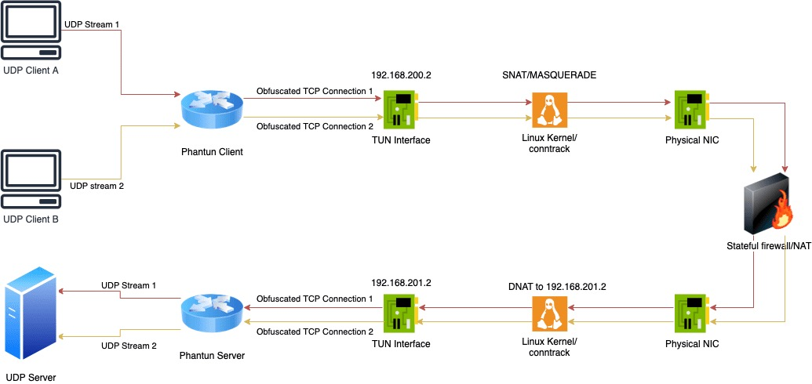

# WireGuard

> [WireGuard](https://icloudnative.io/tags/wireguard/)  作为一个更先进、更现代的 VPN 协议，比起传统的 IPSec、OpenVPN 等实现，效率更高，配置更简单，并且已经合并入 Linux  内核，使用起来更加方便，简直就是 VPN 中的战斗机。越来越多的高人利用 WireGuard 实现很多奇奇怪怪的需求。例如国内与国外机器通过  WireGuard 打通隧道，变成伪 IPLC 专线；或者打通本地与 Kubernetes 集群的网络。

作为 IT homelab 人员，经常需要连到家里的机器， openvpn 之类的配置麻烦啰嗦。这里写下 wireguard  的简单搭建。它比 IPSec 更快，更简单，更精简，更有用。它工作在内核态，比 OpenVPN 更高效。WireGuard 设计为通用  VPN，适用于多种不同情况。它是跨平台的，可大规模部署。

通常如下图的部署: 一台 ECS 主机，得有公网 IP，下图就是 `pc ----> ECS <------ 家里的 pc`​

```bash
            +----------+
            |          |
   +------->+ ECS      +<-----+
   |        +----------+      |
   |                          |
   |                          |
   |                          |
   |                          |          home
   |                      +---+------------------+
+--++                     |                      |
|PC |                     |            +---+     |
+---+                     |            |PC |     |
                          |            +---+     |
                          |                      |
                          +----------------------+
```

## 1. 登录到 ECS 上

得益于 wireguard 中没有 client/server 的概念，只要所有 nat 中的某台机器能够和 gateway 主机建立连接，即可实现共享所有节点的网络资源。这里 ECS 有公网ip，所以担当 gateway

### 1.1 安装 wireguard

[官方安装文档](https://www.wireguard.com/install/) ，或者查看 [如何在五分钟内装好 WireGuard？](https://mp.weixin.qq.com/s?__biz=MzU1MzY4NzQ1OA==&mid=2247488853&idx=1&sn=38acb5689db9d9d69ab1ebc78248e0ed&chksm=fbee5598cc99dc8ee81dc6e2a6ed12bb1fd61efd19f152c75e6e41aadb79a15562d7a6c9cb81&mpshare=1&scene=1&srcid=1118udSysN19LYkQxZEVWFTY&sharer_sharetime=1605681632258&sharer_shareid=8eaca72194dae7b3d51d5c708436eee4&key=8236791ccb71351070dff27fe2ad7a9f146455609c8c7a4bc57532e008e6e2a92c27e10b673a090dd88e54740c3391dbc2623a4128ba12f4ebfc9f83dbaf4ec0e6f01195f693765eb5690757359f4eaecfd37a78bb722773f7c6fa6a83cfbe73fa5273902c5aa16b765ece15a9130e8b12a3496d7bf2ae684ac9200cc5f39a31&ascene=1&uin=MzA1MzI4OTMzMQ==&devicetype=Windows+10+x64&version=6300002f&lang=zh_CN&exportkey=AREByymqoZ6jfJZckbtVD7I=&pass_ticket=Jm9uDmvylBr7yM4ArNVQwkHhP3TB921kMFgCmo8A4uq+xezPGCG3aYKbPKyDMclJ&wx_header=0) ECS 是 linux 系统的话内核要5.x以上，没有就升级下内核，其他个人 pc 电脑则下载客户端，当然软路由的话则去找个带 wireguard的固件。

```bash
yum -y install https://www.elrepo.org/elrepo-release-7.0-4.el7.elrepo.noarch.rpm
rpm --import https://www.elrepo.org/RPM-GPG-KEY-elrepo.org
yum --enablerepo=elrepo-kernel install -y kernel-lt

yum -y --enablerepo=elrepo-kernel install kernel-lt-{devel,headers,perf}
# 失败就加   --skip-broken 


awk -F\' '$1=="menuentry " {print i++ " : " $2}' /etc/grub2.cfg

#看数字
grub2-set-default 2
grub2-mkconfig -o /etc/grub2.cfg
reboot

yum install dkms kmod-wireguard wireguard-tools

reboot

modprobe wireguard
# 查看下能否加载模块
lsmod | grep wireguard
# 增加模块开机导入
echo wireguard > /etc/modules-load.d/wireguard.conf

# 设置开机器自启
systemctl enable wg-quick@wg0.service
systemctl daemon-reload
```

### 1.2 配置

```bash
# 开启转发
sysctl -w net.ipv4.ip_forward=1
sysctl -p
```

### 1.3 生成密钥对

wg 的每个互相之间要一对密钥，例如 A 连 gateway， A 需要 gateway的公钥，gateway 需要 A 的公钥，不能共用一套密钥对。

生成 gateway 的密钥对

```bash
cd /etc/wireguard
# 生成 gateway 的密钥对
wg genkey | tee gw-privatekey      | wg pubkey > gw-publickey

# 生成个人电脑的密钥对
wg genkey | tee pc-privatekey      | wg pubkey > pc-publickey

# 生成家里电脑的密钥对
wg genkey | tee home-pc-privatekey | wg pubkey > home-pc-publickey
```

### 1.4 配置文件

wg 的组网得定义一个网段，这个网段和你所有运行了 wg 的局域网的 ip 不能一样，例如我定义的是 `10.1.0.1/24`​，ecs 上配置文件为：

```bash
cat > wg0.conf <<EOF
[Interface]
ListenPort = 16000 # 客户端连过来填写的端口，安全组的tcp和udp都要放行
Address = 10.1.0.1/24  #wg之前通信组网的内网ip和段
PrivateKey = $(cat gw-privatekey)   # 使用 shell 读取gateway的私钥到这里
# 下面两条是放行的iptables和MASQUERADE
PostUp   = iptables -A FORWARD -i %i -j ACCEPT; iptables -A FORWARD -o %i -j ACCEPT; iptables -t nat -A POSTROUTING -o eth0 -j MASQUERADE
PostDown = iptables -D FORWARD -i %i -j ACCEPT; iptables -D FORWARD -o %i -j ACCEPT; iptables -t nat -D POSTROUTING -o eth0 -j MASQUERADE

# pc
[Peer]
PublicKey = $(cat pc-publickey)
AllowedIPs = 10.1.0.2/32

# home-pc
[Peer]
PublicKey = $(cat home-pc-publickey)
# wg 接口进来的下面的这些段发往 home-pc
# 例如下面的个人pc 定义这些网段走 wg，然后会发到 ecs，因为这块内容是 ecs 的 wg 配置，ecs会把请求发到 home-pc 那去
AllowedIPs = 10.1.0.3/32, 192.168.2.0/24, 10.243.0.0/16, 10.76.6.0/24, 172.13.0.0/16

EOF
```

然后是每个客户端的配置文件，下面是我笔记本 wg 的客户端软件配置文件内容。

```bash
cat > pc.conf <<EOF
[Interface]
PrivateKey = $(cat pc-privatekey)
Address = 10.1.0.2/24 #wg之前通信组网的内网ip和段，主机位每个得不一样
# DNS = 192.168.2.3

[Peer]
PublicKey = $(cat gw-publickey)   # gateway的公钥
# pc 上访问下面的这些段都会发往 ecs 上的 wg
AllowedIPs = 10.1.0.0/24, 192.168.2.0/24, 10.243.0.0/16, 10.76.6.0/24, 172.13.0.0/16
Endpoint = $(curl -s ip.sb):16000 #gateway 公网ip和端口
PersistentKeepalive = 10 # 心跳时间
EOF
```

家里的电脑 wg 配置文件

```bash
cat > home-pc.conf <<EOF
[Interface]
PrivateKey = $(cat home-pc-privatekey)
Address = 10.1.0.3/24 #wg之前通信组网的内网ip和段，主机位每个得不一样

[Peer]
PublicKey = $(cat gw-publickey)   # gateway的公钥
AllowedIPs = 10.1.0.0/24
Endpoint = $(curl -s ip.sb):16000  # gateway 公网ip和端口
PersistentKeepalive = 10 # 心跳时间
EOF
```

然后把 `pc.conf`​ 和 `home-pc.conf`​ 的内容拷贝到对应的 wg 客户端软件里。

讲解下配置文件，家里的台式机 proxmox 里有软路由，并不是上面我说的 pc，这样我接入的设备也可以访问。我个人是推荐搞个 proxmox 整虚拟机和软路由。

家里的路由器网段是 `192.168.2.0/24`​，`192.168.2.3`​是软路由，主要是上面有dns server（adguard home），家里整个网络上添加 hosts 我是直接在dns server上添加的。所以我个人PC那里写了 `DNS = 192.168.2.3`​，这样 dns 解析都走到家里的软路由上，不需要本地配置 hosts。

​`10.243.0.0/16, 10.76.6.0/24, 172.13.0.0/16`​ 的网段都是家里的内网网段。`AllowedIPs`​意思就是把请求目的 IP 是这些网段的，都发到 wg0 这个接口上，也就是添加路由表。这样我在外面哪里，我个人 pc 打开 wg 后，就能访问这些内网网段了。

不要在一些云厂商上使用 `100.64.0.0/10`​ 网段, 如果你有兴趣查询了该地址段, 那么你应该明白它叫 CGNAT; 很不幸的是例如 Aliyun 底层的 apt 源等都在这个范围内, 可能会有一些奇怪问题。

ECS上启动 wg 和停止 wg

```bash
wg-quick up wg0 #默认取 /etc/wireguard/$name.conf
# 指定配置文件启动 wg-quick up /etc/wireguard/wg0.conf
wg-quick down wg0
```

PostUp 和 PostDown 就是启动后和停止后的命令，是 Linux 的话就推荐写 iptables 放行转发和做 NAT。

查看组网状态，shell 上 wg 回车即可

```bash
$ wg
interface: wg0
  public key: FZcFhf0eq2yFgXPNBqYnpoZHnzmgFI7JCLp/5vn1DG0=
  private key: (hidden)
  listening port: 16000

peer: OtydRPJDt+H8upZDz5zJueRjUQ0tS4tr9P6w4BL2+w0=
  endpoint: xxxxxxxxxxx:53956
  allowed ips: 10.1.0.3/32, 192.168.2.0/24, 10.243.0.0/16, 10.76.6.0/24, 172.13.0.0/16
  latest handshake: 1 minute, 2 seconds ago
  transfer: 485.48 MiB received, 55.88 MiB sent

peer: VkhLdmaPS2KmhlSOrPk1XS1MWZrhb+00BdsC0swUBhk=
  endpoint: xxxxxxxxxx:13545
  allowed ips: 10.1.0.2/32
  latest handshake: 21 minutes, 25 seconds ago
  transfer: 56.11 MiB received, 476.83 MiB sent
```

### 1.5 一些注意点

* 如果是软路由，开了 pxsswxll 代理之类的，记得把 ECS 的 公网IP 设置为不走代理。
* openwrt 运行 wireguard 的话：`网络`​ – `防火墙`​ – `常规设置`​ – `常规设置`​ – `转发`​ 设置为`接受`​
* openwrt 的  wg0 接口推荐添加一个 wg0 的 firewall zone，然后 zone 里修改，允许转发到 lan(或者全部勾选上)。这个 zone 开 动态伪装 和 mss 。

### 1.6 死亡回环

如果你有  N 个局域网组网，假设 A 设备上 wg 能连到 B 局域网，然后你把 A 带到 B 的局域网内，只要 A 分配到了 B 局域网 IP  ，默认路由和 A 上 wg 的路由都包含 B  的网段，你会抓包发现包发过去没有回应（也就是你无法网络上通到这个A设备，ssh啥的都不行）。避免这种办法有个优雅手段就是在 A 设备拿到 B  局域网之前提前准备好 `hotplug`​。也可以用 fmark 避免这种问题。

```bash
cat > /etc/hotplug.d/iface/50-wg << 'EOF'
#!/bin/sh
if [ "ifup" = "$ACTION" ] && [ "$INTERFACE" = "wg0" ]; then
    # 设备在 192.168.101.0/24 网段内 wg 不代理 192.168.101.0/24，否则代理 192.168.101.0/24
    if ip -4 a s | grep -Eq 192.168.101. &&  uci show network.@wireguard_wg0[0] | grep -Eq 192.168.101.0 ;then
        uci del_list network.@wireguard_wg0[0].allowed_ips='192.168.101.0/24'
        ip route delete 192.168.101.0/24 dev wg0
    else
        uci add_list network.@wireguard_wg0[0].allowed_ips='192.168.101.0/24'
        ip route add 192.168.101.0/24 dev wg0
    fi
    # 测了下 commit network 并不会触发 ifup wg从而死循环，所以上面临时操作下路由表
    uci commit network
fi
EOF
```

## 2. 使用 Phantun 将 WireGuard 的 UDP 流量伪装成 TCP

> WireGuard 在国内网络环境下会遇到一个致命的问题：**UDP 封锁/限速**。虽然通过  WireGuard 可以在隧道内传输任何基于 IP 的协议（TCP、UDP、ICMP、SCTP、IPIP、GRE 等），但 WireGuard  隧道本身是通过 UDP 协议进行通信的，而国内运营商根本没有能力和精力根据 TCP 和 UDP 的不同去深度定制不同的 QoS  策略，几乎全部采取一刀切的手段：**对 UDP 进行限速甚至封锁**。
>
> 鲁迅先生说过：羊毛出在羊身上！突破口还是在运营商身上：虽然对 UDP 不友好，但却**无力深度检测 TCP 连接的真实性**。
>
> 这就好办了，既然你对 TCP 连接睁一只眼闭一只眼，那我将 UDP 连接伪装成 TCP 连接不就蒙混过关了。目前支持将 UDP 流量伪装成 TCP 流量的主流工具是 [udp2raw](https://github.com/wangyu-/udp2raw-tunnel)，相信很多小伙伴对这个工具都轻车熟路了，但是很遗憾，今天的主角不是它，而是另一款比它更强大的新工具：[Phantun](https://github.com/dndx/phantun)。

### 2.1 Phantun介绍

Phantun 整个项目**完全使用 Rust 实现**，性能吊打  udp2raw。它的初衷和 udp2raw 类似，都是为了实现一种简单的用户态 TCP 状态机来对 UDP 流量做伪装。主要的目的是希望能让  UDP 流量看起来像是 TCP，又不希望受到 TCP retransmission 或者 congestion control 的影响。

需要申明的是，**Phantun 的目标不是为了替代 udp2raw**，从一开始 Phantun 就希望设计足够的简单高效，所以 udp2raw 支持的 **ICMP 隧道，加密，防止重放**等等功能 Phantun 都选择不实现。

Phantun  假设 UDP 协议本身已经解决了这些问题，所以整个转发过程就是简单的明文换头加上一些必要的 TCP 状态控制信息。对于我日常使用的  WireGuard 来说，Phantun 这种设计是足够安全的，因为 WireGuard 的协议已经更好的实现了这些安全功能。

Phantun 使用 TUN 接口来收发 3 层数据包，udp2raw 使用 Raw Socket + BFP 过滤器。个人感觉基于 TUN 的实现要稍微的优雅一点，而且跨平台移植也要更容易。

Phantun  的 TCP 连接是按需创建的，只启动 Client 不会主动去连接服务器，需要第一个数据包到达了后才会按需创建。每个 UDP 流都有自己独立的  TCP 连接。这一点跟 udp2raw 很不一样，udp2raw 所有的 UDP 连接共用一个 TCP 连接。这样做的坏处就是 udp2raw  需要额外的头部信息来区分连接，更加增加了头部的开销。跟纯 UDP 比较，Phantun 每个数据包的额外头部开销是 12  byte，udp2raw 根据我的测试达到了 44 bytes 。

### 2.2 Phantun 工作原理

​​

Phantun 分为服务端和客户端，服务端会监听一个端口，比如 4567（通过 `--local`​ 参数指定），并将 UDP 数据包转发到 UDP 服务（这里指的就是服务端 WireGuard 的监听端口和地址，通过 `--remote`​ 参数指定）。

客户端也会监听一个端口，比如 `127.0.0.1:4567`​（通过 `--local`​ 参数指定），并且通过 `--remote`​ 参数与服务端（比如 `10.0.0.1:4567`​）建立连接。

客户端与服务端都会创建一个 TUN 网卡，客户端 TUN 网卡默认分配的 IPv4/IPv6 地址分别是 `192.168.200.2`​ 和 `fcc8::2`​，服务端 TUN 网卡默认分配的 IPv4/IPv6 地址分别是 `192.168.201.2`​ 和 `fcc9::2`​。

客户端与服务端都需要开启 IP forwarding，并且需要创建相应的 NAT 规则。客户端在流量离开物理网卡之前，需要对 IP `192.168.200.2`​ 进行 SNAT；服务端在流量进入网卡之前，需要将 IP DNAT 为 `192.168.201.2`​。

### 1.3 Phantun 配置步骤

接下来我会通过一个示例来演示如何使用 Phantun 将 WireGuard 的 UDP 流量伪装成 TCP。我们需要在服务端和客户端分别安装 phantun，可以到 [release 页面](https://github.com/dndx/phantun/releases)下载，推荐下载静态编译版本 `phantun_x86_64-unknown-linux-musl.zip`​。

#### 1.3.1服务端

假设服务端的公网 IP 地址是 `121.36.134.95`​，WireGuard 监听端口是 `51822`​。首先修改配置文件 `/etc/wireguard/wg0.conf`​，在 `[Interface]`​ 中添加以下配置：

```bash
MTU = 1300
PreUp = iptables -t nat -A PREROUTING -p tcp -i eth0 --dport 4567 -j DNAT --to-destination 192.168.201.2
PreUp = RUST_LOG=info phantun_server --local 4567 --remote 127.0.0.1:51822 &> /var/log/phantun_server.log &
PostDown = iptables -t nat -D PREROUTING -p tcp -i eth0 --dport 4567 -j DNAT --to-destination 192.168.201.2
PostDown = killall phantun_server || true

```

你需要将 eth0 替换为你服务端的物理网卡名。MTU 值先不管，后面再告诉大家调试方法。

```ini
PreUp = iptables -t nat -A PREROUTING -p tcp -i eth0 --dport 4567 -j DNAT --to-destination 192.168.201.2
```

这条 iptables 规则表示将 `4567`​ 端口的入站流量 DNAT 为 TUN 网卡的 IP 地址。

```ini
PreUp = RUST_LOG=info phantun_server --local 4567 --remote 127.0.0.1:51822 &> /var/log/phantun_server.log &
```

这里会启动 phantun_server，监听在 `4567`​ 端口，并将 UDP 数据包转发到 WireGuard。

服务端完整的 WireGuard 配置

```bash
# local settings for Endpoint B
[Interface]
PrivateKey = QH1BJzIZcGo89ZTykxls4i2DKgvByUkHIBy3BES2gX8= 
Address = 10.0.0.2/32
ListenPort = 51822
MTU = 1300
PreUp = iptables -t nat -A PREROUTING -p tcp -i eth0 --dport 4567 -j DNAT --to-destination 192.168.201.2
PreUp = RUST_LOG=info phantun_server --local 4567 --remote 127.0.0.1:51822 &> /var/log/phantun_server.log &
PostDown = iptables -t nat -D PREROUTING -p tcp -i eth0 --dport 4567 -j DNAT --to-destination 192.168.201.2
PostDown = killall phantun_server || true

# remote settings for Endpoint A
[Peer]
PublicKey = wXtD/VrRo92JHc66q4Ypmnd4JpMk7b1Sb0AcT+pJfwY= 
AllowedIPs = 10.0.0.1/32
```

最后重启 WireGuard 即可：

```bash
$ systemctl restart wg-quick@wg0
```

#### 1.3.2客户端

假设客户端的 WireGuard 监听端口是 `51821`​。首先修改配置文件 `/etc/wireguard/wg0.conf`​，在 `[Interface]`​ 中添加以下配置：

```ini
MTU = 1300
PreUp = iptables -t nat -A POSTROUTING -o eth0 -s 192.168.200.2 -j MASQUERADE
PreUp = RUST_LOG=info phantun_client --local 127.0.0.1:4567 --remote 121.36.134.95:4567 &> /var/log/phantun_client.log &
PostDown = iptables -t nat -D POSTROUTING -o eth0 -s 192.168.200.2 -j MASQUERADE
PostDown = killall phantun_client || true
```

你需要将 eth0 替换为你服务端的物理网卡名。

```ini
PreUp = iptables -t nat -A POSTROUTING -o eth0 -s 192.168.200.2 -j MASQUERADE
```

这条 iptables 规则表示对来自 `192.168.200.2`​（TUN 网卡） 的出站流量进行 MASQUERADE。

```ini
PreUp = RUST_LOG=info phantun_client --local 127.0.0.1:4567 --remote 121.36.134.95:4567 &> /var/log/phantun_client.log &
```

这里会启动 phantun_client，监听在 `4567`​ 端口，并与服务端建立连接，将伪装的 TCP 数据包传送给服务端。

除此之外还需要修改 WireGuard peer 的 Endpoint，将其修改为 127.0.0.1:4567。

```ini
Endpoint = 127.0.0.1:4567
```

客户端完整的 WireGuard 配置：

```ini
# local settings for Endpoint A
[Interface]
PrivateKey = 0Pyz3cIg2gRt+KxZ0Vm1PvSIU+0FGufPIzv92jTyGWk=
Address = 10.0.0.1/32
ListenPort = 51821
MTU = 1300
PreUp = iptables -t nat -A POSTROUTING -o eth0 -s 192.168.200.2 -j MASQUERADE
PreUp = RUST_LOG=info phantun_client --local 127.0.0.1:4567 --remote 121.36.134.95:4567 &> /var/log/phantun_client.log &
PostDown = iptables -t nat -D POSTROUTING -o eth0 -s 192.168.200.2 -j MASQUERADE
PostDown = killall phantun_client || true

# remote settings for Endpoint B
[Peer]
PublicKey = m40NDb5Cqtb78b1DVwY1+kxbG2yEcRhxlrLm/DlPpz8=
Endpoint = 127.0.0.1:4567
AllowedIPs = 10.0.0.2/32
PersistentKeepalive = 25
```

最后重启 WireGuard 即可：

```bash
$ systemctl restart wg-quick@wg0
```

查看 phantun_client 的日志：

```bash
$ tail -f /var/log/phantun_client.log
 INFO  client > Remote address is: 121.36.134.95:4567
 INFO  client > 1 cores available
 INFO  client > Created TUN device tun0
 INFO  client > New UDP client from 127.0.0.1:51821
 INFO  fake_tcp > Sent SYN to server
 INFO  fake_tcp > Connection to 121.36.134.95:4567 established
```

查看 wg0 接口：

```bash
$ wg show wg0
interface: wg0
  public key: wXtD/VrRo92JHc66q4Ypmnd4JpMk7b1Sb0AcT+pJfwY=
  private key: (hidden)
  listening port: 51821

peer: m40NDb5Cqtb78b1DVwY1+kxbG2yEcRhxlrLm/DlPpz8=
  endpoint: 127.0.0.1:4567
  allowed ips: 10.0.0.2/32
  latest handshake: 1 minute, 57 seconds ago
  transfer: 184 B received, 648 B sent
  persistent keepalive: every 25 seconds
```

测试连通性：

```bash
$ ping 10.0.0.2 -c 3
PING 10.0.0.2 (10.0.0.2) 56(84) bytes of data.
64 bytes from 10.0.0.2: icmp_seq=1 ttl=64 time=13.7 ms
64 bytes from 10.0.0.2: icmp_seq=2 ttl=64 time=14.4 ms
64 bytes from 10.0.0.2: icmp_seq=3 ttl=64 time=15.0 ms

--- 10.0.0.2 ping statistics ---
3 packets transmitted, 3 received, 0% packet loss, time 2005ms
rtt min/avg/max/mdev = 13.718/14.373/15.047/0.542 ms
```

## MTU 调优

如果你使用 ping 或者 dig 等工具（小数据包）测试 WireGuard 隧道能够正常工作，但浏览器或者远程桌面（大数据包）却无法正常访问，很有可能是 MTU 的问题，你需要将 MTU 的值调小一点。

Phantun 官方建议将 MTU 的值设为 `1428`​（假设物理网卡的 MTU 是 1500），但经我测试是有问题的。建议直接将 MTU 设置为最低值 `1280`​，然后渐渐增加，直到无法正常工作为止，此时你的 MTU 就是最佳值。
