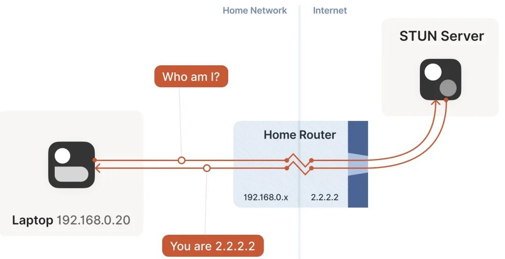
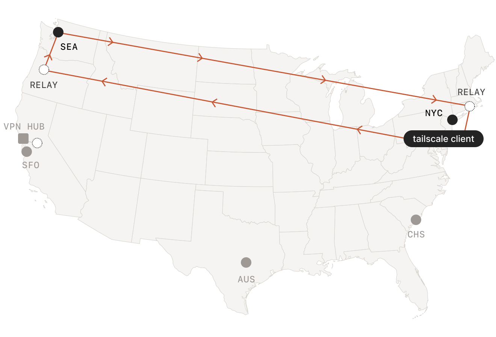

# headscale

Tailscale 是一种利用 NAT 穿透(aka: P2P 穿透)技术的 VPN 工具. Tailscale 客户端等是开源的, 不过遗憾的是中央控制服务器目前并不开源; Tailscale 目前也提供免费的额度给用户使用, 在 NAT 穿透成功的情况下也能保证满速运行.

不过一旦无法 NAT 穿透需要做中转时, Tailscale 官方的服务器由于众所周知的原因在国内访问速度很拉胯; 不过万幸的是开源社区大佬们搓了一个开源版本的中央控制服务器(Headscale), 也就是说: **我们可以自己搭建中央服务器啦, 完全 “自主可控” 啦**

P2P内网穿透原理：[NAT 概述](../计算机网络/NAT%20概述.md)    [NAT 穿透](../计算机网络/NAT%20穿透.md)

## headscale 部署

下载地址：[https://github.com/juanfont/headscale/releases/](https://github.com/juanfont/headscale/releases/)

```bash
# 创建部署目录
mkdir -p /data/headscale/
# 创建空的SQLite数据库文件
touch /data/headscale/db.sqlite

mkdir -p  /etc/headscale/
cd /etc/headscale/
# 下载配置文件模板
wget https://github.com/juanfont/headscale/raw/main/config-example.yaml
cp config-example.yaml config.yaml

# 编辑配置文件
vim config.yaml
-------------------------------------------------
server_url: https://doshell.cn:22xxx
listen_addr: 127.0.0.1:8904
private_key_path: /data/headscale/private.key
private_key_path: /data/headscale/noise_private.key
ip_prefixes:
  #  - fd7a:115c:a1e0::/48
  - 172.168.1.0/24
db_path: /data/headscale/db.sqlite
 magic_dns: false

# Enabling this option makes devices prefer a random port for WireGuard traffic over the
# default static port 41641. This option is intended as a workaround for some buggy
# firewall devices. See https://tailscale.com/kb/1181/firewalls/ for more information.
randomize_client_port: true

-------------------------------------------------

# 启动
nohup ./headscale serve >> ./headscale.log 2>&1 &

# 创建一个 namespace
./headscale namespaces create default
./headscale namespaces list
# 新版本
./headscale user create default
./headscale user list
```

## tailscale 客户端接入

下载地址：[https://tailscale.com/download/linux/static](https://tailscale.com/download/linux/static)

### linux

```bash
zypper install tailscale

# 启动服务
systemctl enable --now tailscaled

# 打开转发，如果需要其他节点访问当前节点同网段的机器
echo 'net.ipv4.ip_forward = 1' >> /etc/sysctl.d/ipforwarding.conf
#echo 'net.ipv6.conf.all.forwarding = 1' >> /etc/sysctl.d/ipforwarding.conf
sysctl -p /etc/sysctl.d/ipforwarding.conf


# Tailscale 接入 Headscale
# 将 <HEADSCALE_PUB_IP> 换成你的 Headscale 公网 IP 或域名
tailscale up --login-server=http://ip:8080 --accept-routes=true --accept-dns=false --advertise-routes=192.168.188.0/24
#--login-server: 指定使用的中央服务器地址(必填)
#--advertise-routes: 向中央服务器报告当前客户端处于哪个内网网段下, 便于中央服务器让同内网设备直接内网直连(可选的)或者将其他设备指定流量路由到当前内网(可选)
#--accept-routes: 是否接受中央服务器下发的用于路由到其他客户端内网的路由规则(可选)
#--accept-dns: 是否使用中央服务器下发的 DNS 相关配置(可选, 推荐关闭)

# 执行完上面的命令后，会出现下面的信息：
To authenticate, visit:

        http://8.210.145.225:11053/register/nodekey:6207f14cc8d47cac320da2468d08c9494a580cc67846c50c0e067d994f927e32

# 将后面的nodekey复制，然后再headscale服务端 执行 注册到指定的namespace
#./headscale -n sds nodes register --key nodekey:a4ee2f23243ead015342c250eae83d1c5d2e4433502135d922453fda4338e3
./headscale nodes register --user USERNAME --key nodekey:a4ee2f23243ead015342c250eae83d1c5d2e4433502135d92245
# 注册成功，查看注册的节点
./headscale nodes list
```

### windows

Windows Tailscale 客户端想要使用 Headscale 作为控制服务器，只需在浏览器中打开 URL：`https://doshell.xx:220xx/windows`​，便会出现如下的界面：


**注册客户端到headscale控制服务器**

打开 windows CMD命令行界面，执行以下命令

```bash
# 将 <HEADSCALE_PUB_IP> 换成你的 Headscale 公网 IP 或域名
tailscale up --login-server=https://doshell.cn:22051 --accept-routes=true --accept-dns=false --advertise-routes=192.168.188.0/24
tailscale up --login-server=https://doshell.top:11051 --accept-routes=true --accept-dns=false
```

然后将浏览器弹出的命令在服务端执行：


**客户端开启路由转发功能**

搜索框输入`regedit`，打开注册表编辑器，在注册表编辑器中将参数**IPEnableRouter**的值从0修改为1，然后关闭注册表编辑器并重新启动系统。
`HKEY_LOCAL_MACHINE\SYSTEM\CurrentControlSet\Services\Tcpip\Parameters`

## 开启路由转发

大多数时候我们可能并不会在每个服务器上都安装 Tailscale 客户端, 通常只安装 2、3 台, 然后想通过这两三台转发该内网的所有流量. **此时你需要**

- 启动 tailscale 时设置正确的路由提示 `--advertise-routes=192.168.1.0/24` 来告诉 Headscale 服务器 “我这个节点可以转发这些地址的路由”
- 其他节点启动时需要增加 `--accept-routes=true` 选项来声明 “我接受外部其他节点发布的路由”

然后在headscale服务端启用客户端发布的子网

```bash
# 查看注册的节点
./headscale nodes list
# 发布客户端的子网
./headscale routes enable -i 1 -r "192.168.188.0/24"
# 查看客户端发布的subnet
./headscale routes list
```

## 管理命令

### headscale 服务端命令

```bash
# 删除客户端
./headscale nodes delete -i <id>
# 启用发布的子网
./headscale routes enable -i 1 -r "192.168.188.0/24"
# 查看客户端发布的subnet
./headscale routes list
```

### tailscale 客户端命令

```bash
# 将您的设备连接到tailscale或headscale服务端，并在需要时进行身份验证。
tailscale up [flags] 
# --accept-dns            接受管理控制台中的 [DNS 配置]，默认接受 DNS 设置。
# --accept-risk=<risk>    接受风险并跳过风险类型的确认。这可以是 或 ，也可以是空字符串以不接受风险。 lose-ssh all 
# --accept-routes         接受其他节点的[子网路由]。Linux 设备默认为不接受路由。
# --advertise-exit-node   提供作为来自 Tailscale 网络的出站互联网流量的[出口节点]默认为不提供作为退出节点。
# --advertise-routes=<ip>  向headscale服务端公开[子网路由]，是得其他节点可以访问
# --advertise-tags=<tags>  向此设备授予标记的权限
# --authkey=<key>    提供[身份验证密钥] 自动将节点验证为用户帐户。
# --exit-node=<ip>   提供用作出口节点的[尾标 IP] 要禁用出口节点，请传递带有空参数的标志：。`--exit-node=`
# --exit-node-allow-lan-access 允许在通过出口节点路由流量时直接访问本地网络。默认不允许直接访问您的 LAN。
# --force-reauth      强制重新进行身份验证。
# --hostname=<name>   提供用于设备的主机名，而不是操作系统提供的主机名。请注意，这将更改 [MagicDNS]中使用的计算机名称。
# --netfilter-mode  （仅限Linux）用于控制自动防火墙配置程度的高级功能。 值为“关闭”、“不转移”或“打开”。默认为“开”，但 Synology 默认为“关”除外。设置此标志 设置为“关闭”将禁用 的所有管理。设置为“nodivert”创建和管理尾鳞子链，但保留这些子链的调用 链条连接到管理员。设置为“开”意味着对尾鳞规则进行全面管理。请注意，如果您设置为“关闭” 或“nodivert”，您有责任为尾标流量安全地配置防火墙。我们建议使用安装的规则作为起点。`netfilter``--netfilter-mode``--netfilter-mode=on`
# --operator=<user>   提供 Unix 用户名，而不是操作 。`root``tailscaled`
# --qr                为网络登录 URL 生成二维码。默认不显示 QR 码。
# --reset             将未指定的设置重置为默认值。
#  --shields-up       阻止来自headscale网络上其他设备的[传入连接]，适用于个人设备 仅建立传出连接。
# --snat-subnet-routes （仅限 Linux）将 NAT 流量源发送到使用 通告的本地路由。 默认将 NAT 流量提供给通告的路由。 设置为 false 以禁用子网路由伪装。--advertise-routes
# --ssh     运行[尾鳞 SSH]服务器，允许根据尾网管理员声明的访问策略进行[访问]，默认为 false。
# -timeout=<duration> 等待尾部秤服务初始化的最长时间。 可以是可解析的任何值`duration`[`time.ParseDuration()`].默认为 ，将永久阻止。`0s`
# --unattended      （仅限视窗）在[无人值守模式下]运行，即使在当前用户注销后，Tailscale 仍会继续运行。

SUBCOMMANDS
  up         Connect to Tailscale, logging in if needed
  down       Disconnect from Tailscale
  set        Change specified preferences
  login      Log in to a Tailscale account
  logout     Disconnect from Tailscale and expire current node key
  switch     Switches to a different Tailscale account
  netcheck   Print an analysis of local network conditions
  ip         Show Tailscale IP addresses
  status     Show state of tailscaled and its connections
  ping       Ping a host at the Tailscale layer, see how it routed
  nc         Connect to a port on a host, connected to stdin/stdout
  ssh        SSH to a Tailscale machine
  version    Print Tailscale version
  web        Run a web server for controlling Tailscale
  file       Send or receive files
  bugreport  Print a shareable identifier to help diagnose issues
  cert       Get TLS certs
  lock       Manage tailnet lock
  licenses   Get open source license information
```

## nginx 代理

```bash
# 修改 headscale 配置文件
server_url: https://xxxx.cn:8080
listen_addr: 127.0.0.1:8905

# 修改nginx
###### headscale
        location / {
            proxy_pass http://127.0.0.1:8905/;  # headscale listen_addr
            proxy_http_version 1.1;
            proxy_buffering off;
            proxy_set_header X-Real-IP $remote_addr;
            proxy_set_header X-Forwarded-For $proxy_add_x_forwarded_for;
            proxy_set_header X-Forwarded-Proto $http_x_forwarded_proto;
            proxy_set_header Upgrade $http_upgrade;
            proxy_set_header Connection "Upgrade";
            proxy_set_header Host $proxy_host;
         }
```

## headscale 配置文件说明

```yaml
# From: www.posase.im  
# Author: Posase  
# headscale 会查看 /etc/headscale/ 或者 ~/.headscale/ 下的 config.yaml 或 config.json  
# 建议/必须修改的地方加* 端口都可以自行修改 部分内容来自机翻  
# 移动了官方配置的部分位置，带问好的可能存疑，仅供参考，善用搜索  
  
# Headscale Config  
server_url: http://test.domain.com:8080 # *客户端连接地址 替换为自己域名  
listen_addr: 0.0.0.0:8080               # 监听地址  
metrics_listen_addr: 127.0.0.1:9090     # 监听 /metrics 的地址，希望将此端点保密到内部网络  
grpc_listen_addr: 0.0.0.0:50443         # 监听 gRPC 地址 gRPC 用于 远程控制 headscale  
grpc_allow_insecure: false              # 允许在 INSECURE 模式下使用 gRPC 后台 不建议开启  
private_key_path: /var/lib/headscale/private.key # 加密流量的私钥文件，会自动生成  
ip_prefixes:                            # 用来分配 IP 地址的前缀  
  - fd7a:115c:a1e0::/48  
  - 100.64.0.0/10  
  
# 其他设置  
disable_check_updates: false            # 开启时自动检查更新  
ephemeral_node_inactivity_timeout: 30m  # 离线节点过多久删除  
log_level: info                         # 日志等级  
acl_policy_path: ""                     # ACL 策略路径 https://tailscale.com/kb/1018/acls/  
  
unix_socket: /var/run/headscale.sock    # 用于 CLI 连接， 无需验证的 socket  
unix_socket_permission: "0770"  
  
# DERP Config  
# DERP 中继服务器配置，当无法直接进行打洞，可以通过 中继服务器 转发流量连接  
# https://tailscale.com/blog/how-tailscale-works/#encrypted-tcp-relays-derp  
derp:  
  # 本地 DERP 配置  
  server:  
    enabled: true   # *本机 DERP 开关，server_url 必须是 https 且 有 ssl 证书  
    region_id: 999  # 本机 DERP 服务的 地区id， 这个对于每一个 DERP 服务器来说是唯一的  
    region_code: "headscale"                # 区域代码 这两个参数可以自定义  
    region_name: "Headscale Embedded DERP"  # 区域名字  
    stun_listen_addr: "0.0.0.0:3478"        # 监听需要转发的 UDP  
  
  # 外部 DERP 服务器配置 yaml 的列表形式  
  # key  
  #   - xxxxx  
  # key: [xxx, xxx] 这样应该也可以把？  
  urls: []  
  #  - https://controlplane.tailscale.com/derpmap/default # *不建议使用，国外节点很卡  
  paths: []  
  #  - /etc/headscale/derp-example.yaml  
  
  # DERP 其他配置  
  auto_update_enabled: true # 定时更新中继服务器  
  update_frequency: 24h     # 更新间隔  
  
# 数据库配置  
# SQLite config  
db_type: sqlite3  
db_path: /var/lib/headscale/db.sqlite  
  
# # Postgres config  
# db_type: postgres  
# db_host: localhost  
# db_port: 5432  
# db_name: headscale  
# db_user: foo  
# db_pass: bar  
  
# TLS configuration  
# 会自动使用 Let's Encrypt 申请证书  
acme_url: https://acme-v02.api.letsencrypt.org/directory    # 申请脚本目录  
acme_email: "xxx@mail.com"                                  # 注册邮箱  
tls_letsencrypt_hostname: "test.domain.com"                 # 申请的域名  
# 客户端认证模式 disabled：不需要认证，relaxed：需要证书但不验证，enforced：需要证书且认证  
tls_client_auth_mode: disabled                                
tls_letsencrypt_cache_dir: /var/lib/headscale/cache         # 证书存放目录  
# ACME 类型 More: https://github.com/juanfont/headscale/blob/main/docs/tls.md  
tls_letsencrypt_challenge_type: HTTP-01                       
# 如果选择 HTTP-01 需要一个验证端口 :http=port 80  
tls_letsencrypt_listen: ":http"                               
  
# 如果使域名证书了则需要添加证书路径 
tls_key_path: "/var/lib/headscale/cache/key.pem"  
tls_cert_path: "/var/lib/headscale/cache/cert.pem"  
  
## DNS Config  
# 查看知识库以更好的理解这个功能  
# - https://tailscale.com/kb/1054/dns/  
# - https://tailscale.com/kb/1081/magicdns/  
# - https://tailscale.com/blog/2021-09-private-dns-with-magicdns/  
dns_config:  
  nameservers:  # 向客户端公开的 DNS 列表 https://tailscale.com/kb/1054/dns/  
    - 1.1.1.1  
  
  # 每个域名使用不同的 DNS  
  # restricted_nameservers:  
  #   foo.bar.com:  
  #     - 1.1.1.1  
  #   darp.headscale.net:  
  #     - 1.1.1.1  
  #     - 8.8.8.8  
  
  domains: []                           # 需要使用 DNS 的域名?  
  magic_dns: false                   # *使用 MagicDns https://tailscale.com/kb/1081/magicdns/  
  base_domain: example.com  # 定义基础域名以创建 MagicDns 主机名
```

## 中继服务器

### **STUN 是什么**

Tailscale 的终极目标是让两台**处于网络上的任何位置**的机器建立**点对点连接**（直连），但现实世界是复杂的，大部份情况下机器都位于 NAT 和防火墙后面，这时候就需要通过打洞来实现直连，也就是 NAT 穿透。

NAT 按照 **NAT 映射行为**和**有状态防火墙行为**可以分为多种类型，但对于 NAT 穿透来说根本不需要关心这么多类型，只需要看 **NAT 或者有状态防火墙是否会严格检查目标 Endpoint**，根据这个因素，可以将 NAT 分为  **Easy NAT** 和 **Hard NAT**。

* **Easy NAT** 及其变种称为 “Endpoint-Independent Mapping” (**EIM，终点无关的映射**) 这里的 Endpoint 指的是目标 Endpoint，也就是说，有状态防火墙只要看到有客户端自己发起的出向包，就会允许相应的入向包进入，**不管这个入向包是谁发进来的都可以**。
* **hard NAT** 以及变种称为 “Endpoint-Dependent Mapping”（**EDM，终点相关的映射**） 这种 NAT 会针对每个目标 Endpoint 来生成一条相应的映射关系。在这样的设备上，如果客户端向某个目标 Endpoint 发起了出向包，假设客户端的公网 IP 是 2.2.2.2，那么有状态防火墙就会打开一个端口，假设是 4242。那么只有来自该目标 Endpoint 的入向包才允许通过 `2.2.2.2:4242`​，其他客户端一律不允许。这种 NAT 更加严格，所以叫 Hard NAT。

对于 Easy NAT，我们只需要提供一个第三方的服务，它能够告诉客户端“它看到的客户端的公网 ip:port 是什么”，然后将这个信息以某种方式告诉通信对端（peer），后者就知道该和哪个地址建连了！这种服务就叫 **STUN** (Session Traversal Utilities for NAT，NAT会话穿越应用程序)。它的工作流程如下图所示：

* 笔记本向 STUN 服务器发送一个请求：“从你的角度看，我的地址什么？”
* STUN 服务器返回一个响应：“我看到你的 UDP 包是从这个地址来的：`ip:port`​”。

​​

### **中继是什么**

对于 **Hard NAT** 来说，STUN 就不好使了，即使 STUN 拿到了客户端的公网 `ip:port`​ 告诉通信对端也于事无补，因为防火墙是和 STUN 通信才打开的缺口，这个缺口只允许 STUN 的入向包进入，其他通信对端知道了这个缺口也进不来。通常企业级 NAT 都属于 Hard NAT。

这种情况下打洞是不可能了，但也不能就此放弃，可以选择一种折衷的方式：创建一个中继服务器（relay server），客户端与中继服务器进行通信，中继服务器再将包中继（relay）给通信对端。

至于中继的性能，那要看具体情况了：

* 如果能直连，那显然没必要用中继方式；
* 但如果无法直连，而中继路径又非常接近双方直连的真实路径，并且带宽足够大，那中继方式并不会明显降低通信质量。延迟肯定会增加一点，带宽会占用一些，但**相比完全连接不上，还是可以接受的**。

事实上对于大部分网络而言，Tailscale 都可以通过各种黑科技打洞成功，只有极少数情况下才会选择中继，中继只是一种 fallback 机制。

​​

Tailscale 会自动选择离目标节点最近的 DERP server 来中继流量

Tailscale 使用的算法很有趣，**所有客户端之间的连接都是先选择 DERP 模式（中继模式），这意味着连接立即就能建立（优先级最低但 100% 能成功的模式），用户不用任何等待**。然后开始并行地进行路径发现，通常几秒钟之后，我们就能发现一条更优路径，然后将现有连接透明升级（upgrade）过去，变成点对点连接（直连）。

因此，DERP 既是 Tailscale 在 NAT 穿透失败时的保底通信方式（此时的角色与 TURN 类似），也是在其他一些场景下帮助我们完成 NAT 穿透的旁路信道。换句话说，它既是我们的保底方式，也是有更好的穿透链路时，帮助我们进行连接升级（upgrade to a peer-to-peer connection）的基础设施。

### **自建私有 DERP server**

‍
