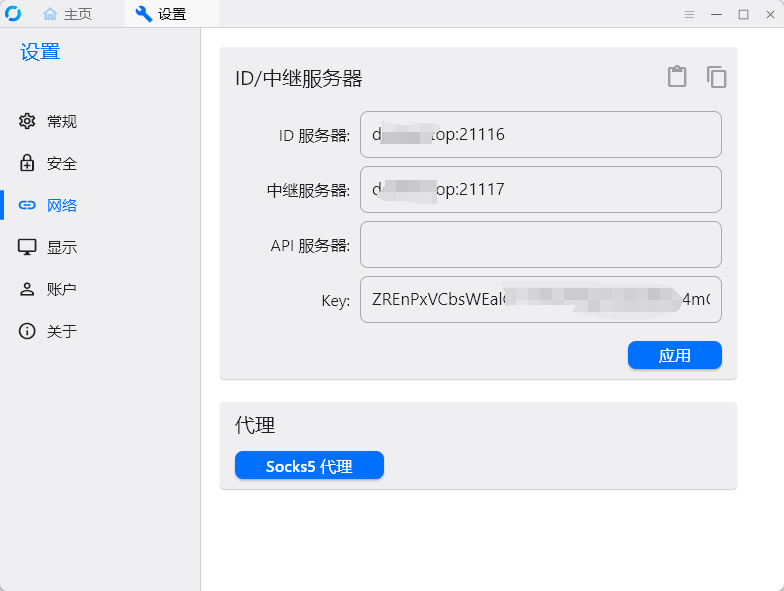

# rustdesk

**RustDesk优点**

1、自建服务端。搭建在自己的云服务器就相当于独享高速带宽！

2、点对点通信。TCP隧道功能一旦打洞成功，相当于用户之间直连，不走服务器带宽！

3、通信加密。配置公钥后，必须拥有公钥才能正常使用！

4、内置文件传输。得益于点对点通信，文件传输不也是手到擒来嘛！

‍

服务下载地址：[https://github.com/rustdesk/rustdesk-server/releases](https://github.com/rustdesk/rustdesk-server/releases)

客户端下载地址：[https://rustdesk.com/zh/ ](https://rustdesk.com/zh/)支持IOS、Mac、Windows、Android、Linux等等！

‍

[官方文档](https://www.chengzz.com/?golink=aHR0cHM6Ly9ydXN0ZGVzay5jb20vZG9jcy96aC1jbi9zZWxmLWhvc3Qv) 安装方式多种多样，但是我还是用 [docker-compose](https://www.chengzz.com/tag/docker-compose) 部署比较方便，毕竟不会影响到服务器环境还能在需要的时候修改配置，官方也有提供 docker-compose.yml 配置文件

## 安装 rustdesk-server

*hbbs* - *RustDesk* ID注册服务器; 21116

*hbbr* - *RustDesk* 中继服务器.21117

### 获取docker-compose脚本

[https://github.com/rustdesk/rustdesk-server/blob/master/docker-compose.yml](https://github.com/rustdesk/rustdesk-server/blob/master/docker-compose.yml)

```yaml
version: '3'

networks:
  rustdesk-net:
    external: false

services:
  hbbs:
    container_name: hbbs
    ports:
      - 21115:21115
      - 21116:21116
      - 21116:21116/udp
      - 21118:21118
    image: rustdesk/rustdesk-server:latest
    # 请把 www.xxxaaa.cn:21117 修改为自己的域名
    # 如果您禁止没有key的用户建立非加密连接，请在运行hbbs和hbbr的时候添加-k _参数
    command: hbbs -r www.xxxaaa.cn:21117 -k _
    volumes:
      - /data/rustdesk/hbbs:/root
    networks:
      - rustdesk-net
    depends_on:
      - hbbr
    restart: unless-stopped

  hbbr:
    container_name: hbbr
    ports:
      - 21117:21117
      - 21119:21119
    image: rustdesk/rustdesk-server:latest
    command: hbbr
    volumes:
      - /data/rustdesk/hbbr:/root
    networks:
      - rustdesk-net
    restart: unless-stopped
```

```yaml
mkdir -p /data/rustdesk/{hbbr,hbbs}
mv docker-compose.yml  /data/rustdesk/
docker-compose up -d
```

务必在防火墙开启这几个端口， **请注意21116同时要开启TCP和UDP**。

* hbbs 监听21115(tcp), 21116(tcp/udp), 21118(tcp)；
* hbbr 监听21117(tcp), 21119(tcp)；
* 21115是hbbs用作NAT类型测试；
* 21116/UDP是hbbs用作ID注册与心跳服务；
* 21116/TCP是hbbs用作TCP打洞与连接服务；
* 21117是hbbr用作中继服务, 21118和21119是为了支持网页客户端；
* 如果您不需要网页客户端（21118，21119）支持，对应端口可以不开；

‍

## 客户端使用

​​​​

‍
