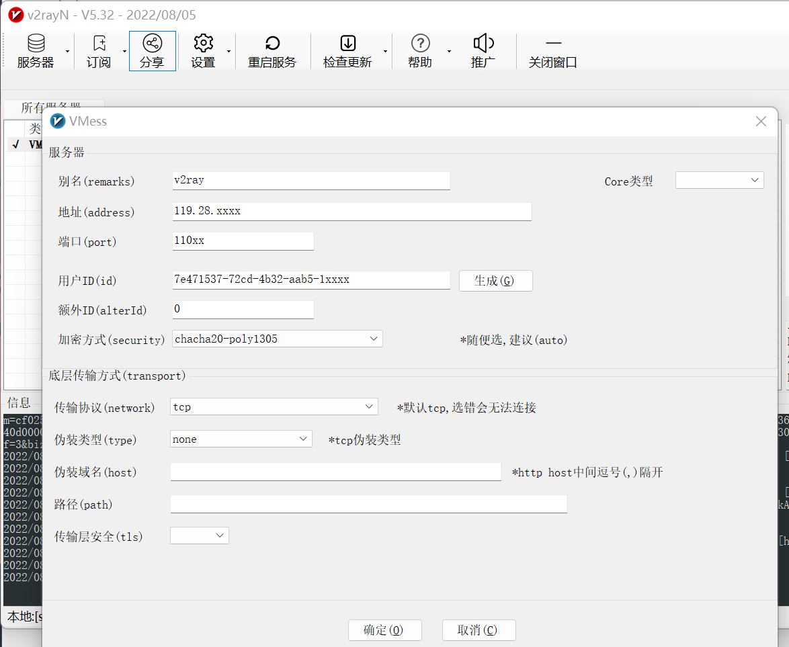
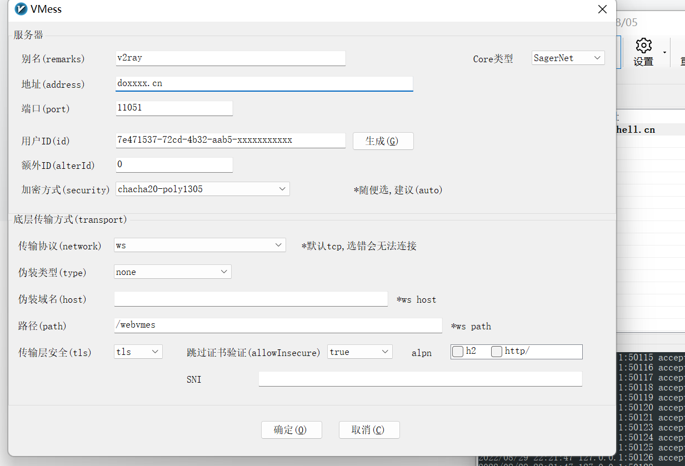

# v2ray

V2Rray 官网：[https://www.v2ray.com/](https://www.v2ray.com/)  
V2Rray 下载地址：[https://github.com/v2fly/v2ray-core/releases](https://github.com/v2fly/v2ray-core/releases)  
参考：[https://www.v2ray.com/awesome/tools.html](https://www.v2ray.com/awesome/tools.html)

v2ray(Project V) 相对于 Shadowsocks，v2ray 更像全能选手，拥有更多可选择的协议 / 传输载体 (Socks、HTTP、TLS、TCP、mKCP、WebSocket )，还有强大的路由功能，不仅仅于此，它亦包含 Shadowsocks 组件，你只需要安装 v2ray，你就可以使用所有的 v2ray 相关的特性包括使用 Shadowsocks，由于 v2ray 是使用 GO 语言所撰写的，天生的平台部署优势，下载即可使用，

# v2ray服务端部署

```bash
# 手动安装
# 下载V2Ray的发行版程序
wget https://github.com/v2fly/v2ray-core/releases/download/v4.45.2/v2ray-linux-64.zip

# 解压到/data
mkdir -p /data/v2ray
unzip -qd /data/v2ray/ 2ray-linux-64.zip

# 详细说明：V2Ray的程序目录文件详情情况：
/data/v2ray/
|-- config.json                #配置文件
|-- geoip.dat                  #数据文件
|-- geoip-only-cn-private.dat
|-- geosite.dat
|-- systemd
|   `-- system
|       |-- v2ray.service
|       `-- v2ray@.service
|-- v2ctl
|-- v2ray
|-- vpoint_socks_vmess.json
`-- vpoint_vmess_freedom.json

# 启动服务
/data/v2ray/v2ray -config /data/conf/config.json  &

# 生成uuid
cat /proc/sys/kernel/random/uuid
```

## 配置 vmess 协议

```json
{
  "log": {
        "access": "/data/v2ray/access.log",
        "error": "/data/v2ray/error.log",
        "loglevel": "warning"
    },
  "inbounds": [
    {
      "port": 8899,
      "protocol": "vmess",
      "settings": {
        "clients": [
          {
            "id": "7e471537-72cd-4b32-aab5-xxxxxxxxxxx",
            "alterId": 0
          }
        ]
      }
    }
  ],
  "outbounds": [
    {
      "protocol": "freedom",
      "settings": {}
    }
  ]
}

```

## 配置 WebSocket + TLS + Web

```json
{
  "log": {
        "access": "/data/v2ray/access.log",
        "error": "/data/v2ray/error.log",
        "loglevel": "warning"
    },
  "inbounds": [
    {
      "port": 8899,
      "protocol": "vmess",
      "settings": {
        "clients": [
          {
            "id": "7e471537-72cd-4b32-aab5-xxxxxxxxxxx",
            "alterId": 0
          }
        ]
      },
      "streamSettings": {
        "network": "ws",
        "wsSettings": {"path": "/webvmes"}
      }
    }
  ],
  "outbounds": [
    {
      "protocol": "freedom",
      "settings": {}
    }
  ]
}
```

修改nginx配置

```bash
    server {
        listen       11051 ssl;
        server_name  doshell.cn;
        #证书文件名称
        ssl_certificate /data/nginx/ssl/doshell.crt;
        #私钥文件名称
        ssl_certificate_key /data/nginx/ssl/doshell.key;
        ssl_session_timeout 5m;
        ssl_protocols TLSv1.2 TLSv1.3;
        ssl_ciphers ECDHE-RSA-AES128-GCM-SHA256:ECDHE-ECDSA-AES128-GCM-SHA256:ECDHE-RSA-AES256-GCM-SHA384:ECDHE-ECDSA-AES256-GCM-SHA384:DHE-RSA-AES128-GCM-SHA256:DHE-DSS-AES128-GCM-SHA256:kEDH+AESGCM:ECDHE-RSA-AES128-SHA256:ECDHE-ECDSA-AES128-SHA256:ECDHE-RSA-AES128-SHA:ECDHE-ECDSA-AES128-SHA:ECDHE-RSA-AES256-SHA384:ECDHE-ECDSA-AES256-SHA384:ECDHE-RSA-AES256-SHA:ECDHE-ECDSA-AES256-SHA:DHE-RSA-AES128-SHA256:DHE-RSA-AES128-SHA:DHE-DSS-AES128-SHA256:DHE-RSA-AES256-SHA256:DHE-DSS-AES256-SHA:DHE-RSA-AES256-SHA:!aNULL:!eNULL:!EXPORT:!DES:!RC4:!3DES:!MD5:!PSK;
        ssl_prefer_server_ciphers on;
        ssl_session_tickets off;
        ssl_stapling on;
        ssl_stapling_verify on;
        #access_log  logs/host.access.log  main;
# v2ray
        location /webvmes {
            proxy_redirect off;
            proxy_pass http://127.0.0.1:8899;
            proxy_http_version 1.1;
            proxy_set_header Upgrade $http_upgrade;
            proxy_set_header Connection "upgrade";
            proxy_set_header Host $http_host;
        }
```

# v2ray客户端部署

## windows

如果服务端的配置为 [vmess 协议](#vmess%20协议)



如果服务端的配置为 [WebSocket + TLS + Web](#WebSocket%20+%20TLS%20+%20Web)



## linux

linux环境下v2ray程序不区分客户端和服务端，客户端同样适用服务端的程序

```bash
# 手动安装
# 下载V2Ray的发行版程序
wget https://github.com/v2fly/v2ray-core/releases/download/v4.45.2/v2ray-linux-64.zip

# 解压到/data
mkdir -p /data/v2ray
unzip -qd /data/v2ray/ 2ray-linux-64.zip

# 修改配置文件
# 可以使用在windows客户端配置完成后，导出所选服务器为客户端配置

# 启动服务
nohup ./v2ray -config ./config.json >> ./v2ray.log 2>&1 &

# 手动系统全局配置代理
# 配置`.bashrc`文件
----------------------------------
start_v2ray(){
# ### 配置curl、wget等命令使用代理
  export http_proxy='http://127.0.0.1:10808'
  export https_proxy='http://127.0.0.1:10808'
  echo "设置代理"
}
stop_v2ray_(){
 unset http_proxy
 unset https_proxy
 echo "取消代理"
}
-----------------------------------
source .bashrc

start_v2ray
```
