# 蓝眼云盘

## 介绍

蓝眼云盘致力于打造成一个优雅，好用，高效，克制的开源云盘。

[在线体验](https://tanker.eyeblue.cn/) (体验账号： demo 密码：123456)

官网：[https://tank-doc.eyeblue.cn/basic/](https://tank-doc.eyeblue.cn/basic/)

## 特色

- 支持Docker安装
- 支持Sqlite，无需额外依赖，可做到开箱即用
- 安装包仅10M左右，跨平台支持。`windows`​, `linux`​, `macOS`​均提供安装包
- 支持 文件上传，文件夹上传，拖拽上传，url抓取上传，复制粘贴上传，文件预览，文件下载，聚合下载，提取码分享
- 支持共享空间，可以多人共同管理一个空间中的文件
- 提供编程接口，可以当作网站的第三方文件存储器
- 支持图片缓存，可使用参数对图片进行处理
- 支持多用户，支持用户空间限制
- 支持简体中文和英文
- 支持预览接口自定义

## 软件架构

蓝眼云盘采用前后端分离的模式开发。后端使用Golang语言，前端采用React框架；前端打包后的静态文件夹放置于后端`/html`​目录下，后端对前后端资源做统一路由。

​ [eyebluecn/tank](https://github.com/eyebluecn/tank)

​ [eyebluecn/tank-front](https://github.com/eyebluecn/tank-front)

## 领域模型



## 安装

### Linux

#### 基本步骤

1. 安装MySQL，并创建一个数据库(使用UTF-8编码，否则不能存储中文)
2. 下载最新版本的蓝眼云盘，[去下载](https://tank-doc.eyeblue.cn/basic/download.html)
3. 解压，运行根目录下`tank`​
4. 打开 `http://127.0.0.1:6010`​ 看到安装引导页面即表示软件安装成功。接着按照UI引导安装蓝眼云盘即可。

#### 更多的运行方法

1. 文件`tank`​是可执行文件，可以直接运行，如步骤3所示。
2. \[推荐\]如果你希望开机启动蓝眼云盘，或者可以使用系统的`systemctl`​或`service`​来控制蓝眼云盘。

    ```bash
    vim /etc/systemd/system/tank.service
    #==========================================


    [Unit]
    Description=EyeblueTank
    Documentation=https://tank-doc.eyeblue.cn
    Wants=network.target
    After=network.target

    [Service]
    Type=simple
    DynamicUser=yes
    ExecStart=/data/program/tank/tank
    Restart=always
    RestartSec=3

    [Install]
    WantedBy=multi-user.target
    ```

‍

3. 装载`tank`​服务，并启动（停止）蓝眼云盘

    ```
    # 装载tank服务
    systemctl daemon-reload
    # 设置tank开机启动
    systemctl enable tank.service
    # 查看tank状态
    systemctl status tank.service
    # 启动tank
    systemctl start tank.service
    # 重启tank
    systemctl restart tank.service
    # 停止tank
    systemctl stop tank.service
    ```

‍

4. 如果你只是简单地希望蓝眼云盘常驻后台运行，请使用根目录`service`​文件夹下的脚本文件。

    ```
    # 启动蓝眼云盘
    ./startup.sh
    # 停止蓝眼云盘
    ./shutdown.sh
    ```

‍

### Windows

1. 安装MySQL，并创建一个数据库(使用UTF-8编码，否则不能存储中文)
2. 下载最新版本的蓝眼云盘，[去下载](https://tank-doc.eyeblue.cn/basic/download.html)
3. 解压，双击根目录下的`tank.exe`​运行
4. 打开 `http://127.0.0.1:6010`​ 看到安装引导页面即表示软件安装成功。接着按照UI引导安装蓝眼云盘即可。

### macOS

#### 基本步骤

1. 安装MySQL(使用UTF-8编码)
2. 下载最新版本的蓝眼云盘，[去下载](https://tank-doc.eyeblue.cn/basic/download.html)
3. 解压，运行根目录下`tank`​
4. 打开 `http://127.0.0.1:6010`​ 看到安装引导页面即表示软件安装成功。接着按照UI引导安装蓝眼云盘即可。

#### 更多的运行方法

1. 文件`tank`​是可执行文件，可以直接运行，如步骤3所示。
2. 如果你只是简单地希望蓝眼云盘常驻后台运行，请使用根目录`service`​文件夹下的脚本文件。

```
# 启动蓝眼云盘
./startup.sh
# 停止蓝眼云盘
./shutdown.sh
```
