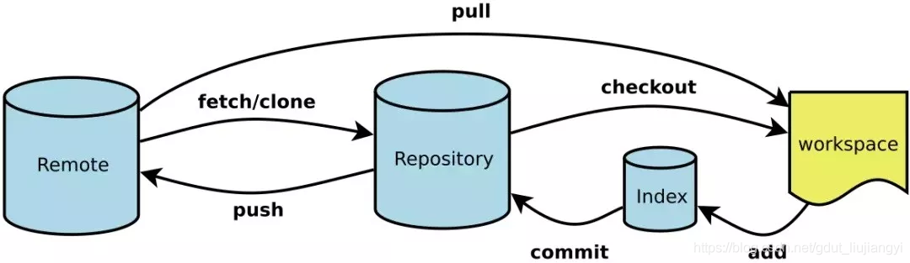
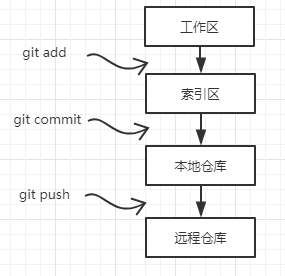

# git

**Git**是一款免费、开源的分布式版本控制系统，用于敏捷高效地处理任何或小或大的项目。

​                     ​

- workspace： 工作区
   直接写好的代码，以文件形式存在硬盘上的，其实就是保存在workspace工作区
- index/stage : 暂存区，`git add`之后会存入
  即是 .git 目录下的index 文件。暂存区会记录git add 添加文件的相关信息（文件名，大小，timestamp…）
  不保存文件实体，通过id指向每个文件实体。可以使用git status 查看暂存区的状态。暂存区标记了你当前工作区中，哪些内容是被git 管理的
- Repository ： 本地仓库，`git commit`之后会存入
  版本控制系统的仓库，存在于本地。当执行git commit命令后，会将暂存区内容提交到仓库之中。
- Remote ： 远程仓库，`git push` 之后会存入
   与本地仓库概念基本一致，不同之处在于一个存在远程，可用于远程协作，一个却是存在于本地。通过push/pull可实现本地与远程的交互；

---

git 远程仓库

> 远程仓库不一定非得是 `github`​ 那种专门的"中央服务器",甚至局域网的另外一台电脑也可以充当"中央服务器"的角色,因为它存在的最初目的只是方便大家**交换彼此的提交记录**而已!  
> 所以本地仓库和远程仓库的基本行为应该是一致的,约定俗成的规定是远程仓库一般不直接参与日常开发工作,主要作为项目托管中心.

‍

## git 服务端部署

```bash
yum install git-core
#为 Git 创建一个用户
 useradd -d /home/git git
echo "Ninestar123" | passwd --stdin git

# 为了容易的访问服务器，我们设置一个免密 ssh 登录。首先在你本地电脑上创建一个 ssh 密钥：
ssh-keygen -t rsa -b 1024
# 现在您必须将这些密钥复制到服务器上，以便两台机器可以相互通信。在本地机器上运行以下命令：
cat ~/.ssh/id_rsa.pub | ssh git@remote-server "mkdir -p ~/.ssh && cat >> ~/.ssh/authorized_keys"
# 现在，用 ssh 登录进服务器并为 Git 创建一个项目路径。你可以为你的仓库设置一个你想要的目录。
mkdir   /home/git/project-1.git
# 初始化
cd  /home/git/project-1.git
git init --bare

==============================================
# 现在我们需要在本地机器上新建一个基于 Git 版本控制仓库：
mkdir -p /data/git/project.local
cd /data/git/project.local
# 现在在该目录中创建项目所需的文件。留在这个目录并启动 git：
git init
# 把所有文件添加到仓库中：
git add .
# 现在，每次添加文件或进行更改时，都必须运行上面的 add 命令。 您还需要为每个文件更改都写入提交消息。提交消息基本上说明了我们所做的更改。
git commit -m "message"  -a
#在这种情况下，我有一个名为 GoT（《权力的游戏》的点评）的文件，并且我做了一些更改，所以当我运行命令时，它指定对文件进行更改。 在上面的命令中 -a 选项意味着提交仓库中的所有文件。 如果您只更改了一个，则可以指定该文件的名称而不是使用 -a。
git commit -m "message"  GoT.txt
# 到现在为止，我们一直在本地服务器上工作。现在我们必须将这些更改推送到远程服务器上，以便通过互联网访问，并且可以与其他团队成员进行协作。
git remote add origin ssh://git@remote-server/home/git/project-1.git
# 现在，您可以使用 pull 或 push 选项在服务器和本地计算机之间推送或拉取：
git push origin master
# 如果有其他团队成员想要使用该项目，则需要将远程服务器上的仓库克隆到其本地计算机上：
git clone git@remote-server:/home/git/project.git
# 现在他们可以编辑文件，写入提交更改信息，然后将它们推送到服务器：
git commit -m 'corrections in GoT.txt story' -a
# 然后推送改变：
git push origin master

```

‍

## git 常用命令

1. 新建代码库

```bash
# 在当前目录新建一个Git代码库
git init
# 新建一个目录，将其初始化为Git代码库
git init [project-name]
# 下载一个项目和它的整个代码历史
git clone [url]
```

2. 配置

```bash
# 显示当前的Git配置
git config --list
# 编辑Git配置文件
git config -e [--global]
# 设置提交代码时的用户信息
git config [--global] user.name "[name]"
git config [--global] user.email "[email address]"
```

3. 增加/删除文件

```bash
# 添加指定文件到暂存区
git add [file1] [file2] ...
# 添加指定目录到暂存区，包括子目录
git add [dir]
# 添加当前目录的所有文件到暂存区
git add .
# 添加每个变化前，都会要求确认
# 对于同一个文件的多处变化，可以实现分次提交
git add -p
# 删除工作区文件，并且将这次删除放入暂存区
git rm [file1] [file2] ...
# 停止追踪指定文件，但该文件会保留在工作区
git rm --cached [file]
# 改名文件，并且将这个改名放入暂存区
git mv [file-original] [file-renamed]
```

4. 代码提交

```bash
# 提交暂存区到仓库区
git commit -m [message]
# 提交暂存区的指定文件到仓库区
git commit [file1] [file2] ... -m [message]
# 提交工作区自上次commit之后的变化，直接到仓库区
git commit -a
# 提交时显示所有diff信息
git commit -v
# 将add和commit合为一步
git commit -am 'message'
# 使用一次新的commit，替代上一次提交
# 如果代码没有任何新变化，则用来改写上一次commit的提交信息
git commit --amend -m [message]
# 重做上一次commit，并包括指定文件的新变化
git commit --amend [file1] [file2] ...
```

5. 分支

```bash
# 列出所有本地分支
git branch
# 列出所有远程分支
git branch -r
# 列出所有本地分支和远程分支
git branch -a
# 新建一个分支，但依然停留在当前分支
git branch [branch-name]
# 新建一个分支，并切换到该分支
git checkout -b [branch]
# 新建一个分支，指向指定commit
git branch [branch] [commit]
# 新建一个分支，与指定的远程分支建立追踪关系
git branch --track [branch] [remote-branch]
# 切换到指定分支，并更新工作区
git checkout [branch-name]
# 切换到上一个分支
git checkout -
# 建立追踪关系，在现有分支与指定的远程分支之间
git branch --set-upstream [branch] [remote-branch]
# 合并指定分支到当前分支
git merge [branch]
# 选择一个commit，合并进当前分支
git cherry-pick [commit]
# 删除分支
git branch -d [branch-name]
# 删除远程分支
git push origin --delete [branch-name]
git branch -dr [remote/branch]
# 检出版本v2.0
git checkout v2.0
# 从远程分支develop创建新本地分支devel并检出
git checkout -b devel origin/develop
# 检出head版本的README文件（可用于修改错误回退）
git checkout -- README 
```

6. 标签

```bash
# 列出所有tag
git tag
# 新建一个tag在当前commit
git tag [tag]
# 新建一个tag在指定commit
git tag [tag] [commit]
# 删除本地tag
git tag -d [tag]
# 删除远程tag
git push origin :refs/tags/[tagName]
# 查看tag信息
git show [tag]
# 提交指定tag
git push [remote] [tag]
# 提交所有tag
git push [remote] --tags
# 新建一个分支，指向某个tag
git checkout -b [branch] [tag]
```

7. 查看信息

```bash
# 显示有变更的文件
git status
# 显示当前分支的版本历史
git log
# 显示commit历史，以及每次commit发生变更的文件
git log --stat
# 搜索提交历史，根据关键词
git log -S [keyword]
# 显示某个commit之后的所有变动，每个commit占据一行
git log [tag] HEAD --pretty=format:%s
# 显示某个commit之后的所有变动，其"提交说明"必须符合搜索条件
git log [tag] HEAD --grep feature
# 显示某个文件的版本历史，包括文件改名
git log --follow [file]
git whatchanged [file]
# 显示指定文件相关的每一次diff
git log -p [file]
# 显示过去5次提交
git log -5 --pretty --oneline
# 显示所有提交过的用户，按提交次数排序
git shortlog -sn
# 显示指定文件是什么人在什么时间修改过
git blame [file]
# 显示暂存区和工作区的差异
git diff
# 显示暂存区和上一个commit的差异
git diff --cached [file]
# 显示工作区与当前分支最新commit之间的差异
git diff HEAD
# 显示两次提交之间的差异
git diff [first-branch]...[second-branch]
# 显示今天你写了多少行代码
git diff --shortstat "@{0 day ago}"
# 显示某次提交的元数据和内容变化
git show [commit]
# 显示某次提交发生变化的文件
git show --name-only [commit]
# 显示某次提交时，某个文件的内容
git show [commit]:[filename]
# 显示当前分支的最近几次提交
git reflog
```

8. 远程同步

```bash
# 下载远程仓库的所有变动
git fetch [remote]
# 显示所有远程仓库
git remote -v
# 显示某个远程仓库的信息
git remote show [remote]
# 增加一个新的远程仓库，并命名
git remote add [shortname] [url]
# 取回远程仓库的变化，并与本地分支合并
git pull [remote] [branch]
# 上传本地指定分支到远程仓库
git push [remote] [branch]
# 强行推送当前分支到远程仓库，即使有冲突
git push [remote] --force
# 推送所有分支到远程仓库
git push [remote] --all
```

9. 撤销

```bash
# 恢复暂存区的指定文件到工作区
git checkout [file]
# 恢复某个commit的指定文件到暂存区和工作区
git checkout [commit] [file]
# 恢复暂存区的所有文件到工作区
git checkout .
# 重置暂存区的指定文件，与上一次commit保持一致，但工作区不变
git reset [file]
# 重置暂存区与工作区，与上一次commit保持一致
git reset --hard
# 重置当前分支的指针为指定commit，同时重置暂存区，但工作区不变
git reset [commit]
# 重置当前分支的HEAD为指定commit，同时重置暂存区和工作区，与指定commit一致
git reset --hard [commit]
# 重置当前HEAD为指定commit，但保持暂存区和工作区不变
git reset --keep [commit]
# 新建一个commit，用来撤销指定commit
# 后者的所有变化都将被前者抵消，并且应用到当前分支
git revert [commit]
# 暂时将未提交的变化移除，稍后再移入
git stash
git stash pop

```

10. 其他

```bash
git init                  # 初始化本地git仓库（创建新仓库）
git config --global user.name "xxx"          # 配置用户名
git config --global user.email "xxx@xxx.com" # 配置邮件
git config --global color.ui true            # git status等命令自动着色
git config --global color.status auto
git config --global color.diff auto
git config --global color.branch auto
git config --global color.interactive auto
git config --global --unset http.proxy      # remove  proxy configuration on git
git clone git+ssh://git@192.168.53.168/VT.git  # clone远程仓库
git status                   # 查看当前版本状态（是否修改）
git add xyz                  # 添加xyz文件至index
git add .                    # 增加当前子目录下所有更改过的文件至index
git commit -m 'xxx'          # 提交
git commit --amend -m 'xxx'  # 合并上一次提交（用于反复修改）
git commit -am 'xxx'         # 将add和commit合为一步
git rm xxx                   # 删除index中的文件
git rm -r *                  # 递归删除
git log                      # 显示提交日志
git log -1                   # 显示1行日志 -n为n行
git log -5
git log --stat               # 显示提交日志及相关变动文件
git log -p -m
git show dfb02e6e4f2f7b573   # 显示某个提交的详细内容
git show dfb02               # 可只用commitid的前几位
git show HEAD                # 显示HEAD提交日志
git show HEAD^               # 显示HEAD的父（上一个版本）的提交日志 ^^为上两个版本 ^5为上5个版本
git tag                      # 显示已存在的tag
git tag -a v2.0 -m 'xxx'     # 增加v2.0的tag
git show v2.0                # 显示v2.0的日志及详细内容
git log v2.0                 # 显示v2.0的日志
git diff                     # 显示所有未添加至index的变更
git diff --cached            # 显示所有已添加index但还未commit的变更
git diff HEAD^               # 比较与上一个版本的差异
git diff HEAD -- ./lib       # 比较与HEAD版本lib目录的差异
git diff origin/master..master   # 比较远程分支master上有本地分支master上没有的
git diff origin/master..master --stat    # 只显示差异的文件，不显示具体内容
git remote add origin git+ssh://git@192.168.53.168/VT.git # 增加远程定义（用于push/pull/fetch）
git branch                   # 显示本地分支
git branch --contains 5008   # 显示包含提交50089的分支
git branch -a                # 显示所有分支
git branch -r                # 显示所有原创分支
git branch --merged          # 显示所有已合并到当前分支的分支
git branch --no-merged       # 显示所有未合并到当前分支的分支
git branch -m master master_copy    # 本地分支改名
git checkout -b master_copy         # 从当前分支创建新分支master_copy并检出
git checkout -b master master_copy  # 上面的完整版
git checkout features/performance   # 检出已存在的features/performance分支
git checkout --track hotfixes/BJVEP933   # 检出远程分支hotfixes/BJVEP933并创建本地跟踪分支
git checkout v2.0                   # 检出版本v2.0
git checkout -b devel origin/develop# 从远程分支develop创建新本地分支devel并检出
git checkout -- README              # 检出head版本的README文件（可用于修改错误回退）
git merge origin/master             # 合并远程master分支至当前分支
git cherry-pick ff44785404a8e       # 合并提交ff44785404a8e的修改
git push origin master              # 将当前分支push到远程master分支
git push origin :hotfixes/BJVEP933  # 删除远程仓库的hotfixes/BJVEP933分支
git push --tags                     # 把所有tag推送到远程仓库
git fetch                           # 获取所有远程分支（不更新本地分支，另需merge）
git fetch --prune                   # 获取所有原创分支并清除服务器上已删掉的分支
git pull origin master              # 获取远程分支master并merge到当前分支
git mv README README2               # 重命名文件README为README2
git reset --hard HEAD               # 将当前版本重置为HEAD（通常用于merge失败回退）
git rebase
git branch -d hotfixes/BJVEP933     # 删除分支hotfixes/BJVEP933（本分支修改已合并到其他分支）
git branch -D hotfixes/BJVEP933     # 强制删除分支hotfixes/BJVEP933
git ls-files                        # 列出git index包含的文件
git show-branch                     # 图示当前分支历史
git show-branch --all               # 图示所有分支历史
git whatchanged                     # 显示提交历史对应的文件修改
git revert dfb02e6e4f2f7b13802818   # 撤销提交dfb5c0013802e392818
git ls-tree HEAD                    # 内部命令：显示某个git对象
git rev-parse v2.0                  # 内部命令：显示某个ref对于的SHA1 HASH
git reflog                          # 显示所有提交，包括孤立节点
git show HEAD@{5}
git show master@{yesterday}         # 显示master分支昨天的状态
git log --pretty=format:'%h %s' --graph  # 图示提交日志
git show HEAD~3
git show -s --pretty=raw 2be7fcb476
git stash                           # 暂存当前修改，将所有至为HEAD状态
git stash list                      # 查看所有暂存
git stash show -p stash@{0}         # 参考第一次暂存
git stash apply stash@{0}           # 应用第一次暂存
git grep "delete from"              # 文件中搜索文本“delete from”
git grep -e '#define' --and -e SORT_DIRENT
git gc
git fsck
git archive  # 生成一个可供发布的压缩
```
