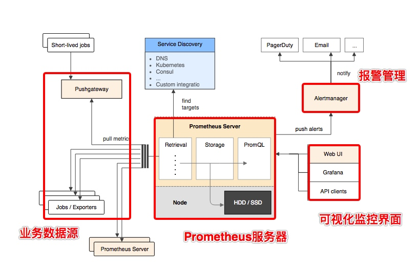

# prometheus 部署

## 基本原理

Prometheus的基本架构如下图所示：


从上图可以看到，整个 Prometheus 可以分为四大部分，分别是：

- **Prometheus 服务器**
  Prometheus Server 是 Prometheus组件中的核心部分，负责实现对监控数据的获取，存储以及查询。
- **NodeExporter 业务数据源**
  业务数据源通过 Pull/Push 两种方式推送数据到 Prometheus Server。
- **AlertManager 报警管理器**
  Prometheus 通过配置报警规则，如果符合报警规则，那么就将报警推送到 AlertManager，由其进行报警处理。
- **可视化监控界面**
  Prometheus 收集到数据之后，由 WebUI 界面进行可视化图标展示。目前我们可以通过自定义的 API 客户端进行调用数据展示，也可以直接使用 Grafana 解决方案来展示。

简单地说，Prometheus 的实现架构也并不复杂。**其实就是收集数据、处理数据、可视化展示，再进行数据分析进行报警处理。** 但其珍贵之处在于提供了一整套可行的解决方案，并且形成了一整个生态，能够极大地降低我们的研发成本。


## 部署 Prometheus 服务端

Prometheus 服务端负责数据的收集，因此我们应该首先安装并运行 Prometheus Server。

从 [https://prometheus.io/download/](https://prometheus.io/download/) 找到最新版本的Prometheus Sevrer软件包：

```bash
# 上传解压
tar -zxf prometheus-2.37.5.linux-amd64.tar.gz 

# Start Prometheus.
./prometheus --config.file=prometheus.yml 

# ./premetheus -h 命令行常用参数：  
# --config.file="prometheus.yml" # 指定配置文件  
# --web.listen-address= "0.0.0.0:9090" # 监听地址和端口  
# --log.level=info # 日志级别  
# --alertmanager.timeout=10s # 与报警组件的超时时间  
# --storage.tsdb.path="data/ " # 数据目录  
# --storage.tsdb.retention.time=15d # 数据保存时间，默认15天

```

**Prometheus 配置文件**

```yml
# 全局配置
global:
  scrape_interval: 15s     # 采集数据时间间隔
  evaluation_interval: 15s # 评估告警规则时间间隔，默认1分钟
  scrape_timeout： 5s      # 采集数据超时时间，默认10秒

# 告警配置
alerting:
  alertmanagers:
    - static_configs:
        - targets: [192.168.0.104:9093]

# 加载一次规则并根据全局“evaluation_interval”定期评估它们。
rule_files:
  # - "first_rules.yml"
  # - "second_rules.yml"

# A scrape configuration containing exactly one endpoint to scrape:
# Here it's Prometheus itself.
scrape_configs:
  # 配置被监控端，称为target，每个target用job_name分组管理，又分为静态配置和服务发现
  - job_name: "prometheus"

    # metrics_path defaults to '/metrics'
    # scheme defaults to 'http'.

    static_configs:
      - targets: ["192.168.0.104:9090"]
```

## 部署 NodeExporter 客户端

NodeExporter 是 Prometheus 提供的一个可以采集到主机信息的应用程序，它能采集到机器的 CPU、内存、磁盘等信息。

我们从 [https://prometheus.io/download/](https://prometheus.io/download/) 获取最新的 Node Exporter 版本的二进制包。

```bash
# 下载解压后运行 Node Exporter，我们指定用 8080 端口运行:
./node_exporter --web.listen-address 192.168.0.104:8080

```

访问 `http://localhost:8080/metrics`，可以看到当前 node exporter 获取到的当前主机的所有监控数据，如下所示：


## 配置 Prometheus 监控数据源

现在我们运行了 Prometheus 服务器，也运行了业务数据源 NodeExporter。但此时 Prometheus 还获取不到任何数据，我们还需要配置下 prometheus.yml 文件，让其去拉取 Node Exporter 的数据。

我们配置一下 Prometheus 的配置文件，让 Prometheus 服务器定时去业务数据源拉取数据。编辑prometheus.yml 并在 scrape_configs 节点下添加以下内容:

```yml
scrape_configs:
  - job_name: 'prometheus'
    static_configs:
      - targets: ['192.168.0.104:9090']
  # 采集node exporter监控数据
  - job_name: 'node'
    static_configs:
      - targets: ['192.168.0.104:8080']
```

上面配置文件配置了两个任务。一个是名为 prometheus 的任务，其从「localhost:9090」地址读取数据。另一个是名为 node 的任务，其从「localhost:8080」地址读取数据。
配置完成后，我们重新启动 Prometheus。

```bash
./prometheus --config.file=prometheus.yml
```

## 部署 AlertManager

Prometheus将数据采集和报警分成了两个模块。报警规则配置在`Prometheus Servers`上，然后发送报警信息到`AlertManger`，然后我们的`AlertManager`就来管理这些报警信息，包括**silencing**、**inhibition**，聚合报警信息过后通过email、PagerDuty、HipChat、Slack 等方式发送消息提示。

让`AlertManager`提供服务总的来说就下面3步： * 安装和配置`AlertManger` * 配置`Prometheus`来和`AlertManager`通信 * 在`Prometheus`中创建报警规则

我们从 [https://prometheus.io/download/](https://prometheus.io/download/) 获取最新的 AlertManager 版本的二进制包。

### 配置alertmanager

Alertmanager的配置主要包含两个部分：路由(route)以及接收器(receivers)。所有的告警信息都会从配置中的顶级路由(route)进入路由树，根据路由规则将告警信息发送给相应的接收器。

在Alertmanager中可以定义一组接收器，比如可以按照角色(比如系统运维，数据库管理员)来划分多个接收器。接收器可以关联邮件，Slack以及其它方式接收告警信息。

当前配置文件中定义了一个默认的接收者default-receiver由于这里没有设置接收方式，目前只相当于一个占位符。关于接收器的详细介绍会在后续章节介绍。

在配置文件中使用route定义了顶级的路由，路由是一个基于标签匹配规则的树状结构。所有的告警信息从顶级路由开始，根据标签匹配规则进入到不同的子路由，并且根据子路由设置的接收器发送告警。目前配置文件中只设置了一个顶级路由route并且定义的接收器为default-receiver。因此，所有的告警都会发送给default-receiver。关于路由的详细内容会在后续进行详细介绍。

`vim alertmanager.yml`

```yml
# 发件邮箱配置，
global:
route:
  group_by: ['alertname']
  group_wait: 30s
  group_interval: 5m
  repeat_interval: 1h
  receiver: 'web.hook'
#  配置后端告警媒介： email，wechat，webhook等等
receivers:
  - name: 'web.hook'
    webhook_configs:
      - url: 'http://127.0.0.1:5001/'
inhibit_rules:
  - source_match:
      severity: 'critical'
    target_match:
      severity: 'warning'
    equal: ['alertname', 'dev', 'instance']

```

### 启动Alertmanager

Alermanager会将数据保存到本地中，默认的存储路径为`data/`。因此，在启动Alertmanager之前需要创建相应的目录：
`./alertmanager`

用户也在启动Alertmanager时使用参数修改相关配置。`--config.file`用于指定alertmanager配置文件路径，`--storage.path`用于指定数据存储路径。

## 关联Prometheus与Alertmanager

编辑Prometheus配置文件prometheus.yml,并添加以下内容:

```yml
alerting:
  alertmanagers:
    - static_configs:
        - targets: ['192.168.0.104:9093']
```

### 告警规则

```yml
groups:
- name: "system info"
 rules:
- alert: "服务器宕机"  		# 告警名称 alertname
expr: up == 0 		     	# 告警表达式，当表达式条件满足，即发送告警
for: 1m 			    	# 等待时长，等待自动恢复的时间。
labels: 	# 此label不同于 metric中的label，发送给alertmanager之后用于管理告警项，比如匹配到那个label即触发哪种告警
 severity: critical 		# key:value 皆可完全自定义
annotations: 				# 定义发送告警的内容，注意此地的labels为metric中的label
 summary: "{{$labels.instance}}:服务器宕机"
 description: "{{$labels.instance}}:服务器无法连接，持续时间已超过3mins"
- alert: "CPU 使用过高"
expr: 100-(avg(rate(node_cpu_seconds_total{mode="idle"}[1m]))by(instance)*100) > 40
for: 1m
labels:
 servirity: warning
annotations:
 summary: "{{$labels.instance}}:CPU 使用过高"
 description: "{{$labels.instance}}:CPU 使用率超过 40%"
 value: "{{$value}}"
- alert: "CPU 使用率超过90%"
expr: 100-(avg(rate(node_cpu_seconds_total{mode="idle"}[1m])) by(instance)* 100) > 90
for: 1m
labels:
 severity: critical
annotations:
 summary: "{{$labels.instance}}:CPU 使用率90%"
 description: "{{$labels.instance}}:CPU 使用率超过90%，持续时间超过5mins"
 value: "{{$value}}"
```

如果需要在配置文件中使用中文，务必注意编码规则为utf8，否则报错
