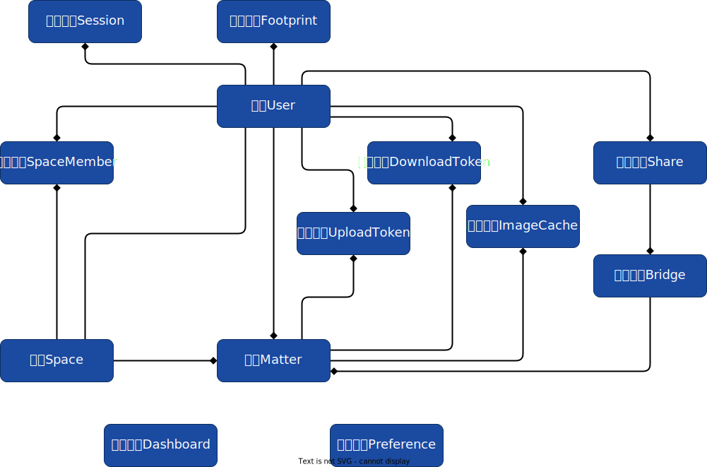

蓝眼云盘致力于打造成一个优雅，好用，高效，克制的开源云盘。
官网：[https://tank-doc.eyeblue.cn/basic/](https://tank-doc.eyeblue.cn/basic/)

## 特色

- 支持Docker安装
- 支持Sqlite，无需额外依赖，可做到开箱即用
- 安装包仅10M左右，跨平台支持。`windows`​, `linux`​, `macOS`​均提供安装包
- 支持 文件上传，文件夹上传，拖拽上传，url抓取上传，复制粘贴上传，文件预览，文件下载，聚合下载，提取码分享
- 支持共享空间，可以多人共同管理一个空间中的文件
- 提供编程接口，可以当作网站的第三方文件存储器
- 支持图片缓存，可使用参数对图片进行处理
- 支持多用户，支持用户空间限制
- 支持简体中文和英文
- 支持预览接口自定义

## 软件架构

蓝眼云盘采用前后端分离的模式开发。后端使用Golang语言，前端采用React框架；前端打包后的静态文件夹放置于后端`/html`​目录下，后端对前后端资源做统一路由。

​ [eyebluecn/tank](https://github.com/eyebluecn/tank)
​ [eyebluecn/tank-front](https://github.com/eyebluecn/tank-front)

## 领域模型



## 安装

### Linux

#### 基本步骤

1. 安装MySQL，并创建一个数据库(使用UTF-8编码，否则不能存储中文)
2. 下载最新版本的蓝眼云盘，[去下载](https://tank-doc.eyeblue.cn/basic/download.html)
3. 解压，运行根目录下`tank`​
4. 打开 `http://127.0.0.1:6010`​ 看到安装引导页面即表示软件安装成功。接着按照UI引导安装蓝眼云盘即可。

#### 更多的运行方法

1. 文件`tank`​是可执行文件，可以直接运行，如步骤3所示。
2. \[推荐\]如果你希望开机启动蓝眼云盘，或者可以使用系统的`systemctl`​或`service`​来控制蓝眼云盘。
```bash
vim /etc/systemd/system/tank.service
#==========================================

[Unit]
Description=EyeblueTank
Documentation=https://tank-doc.eyeblue.cn
Wants=network.target
After=network.target

[Service]
Type=simple
DynamicUser=yes
ExecStart=/data/program/tank/tank
Restart=always
RestartSec=3

[Install]
WantedBy=multi-user.target
```

3. 装载`tank`​服务，并启动（停止）蓝眼云盘
```bash
systemctl daemon-reload
# 查看tank状态
systemctl status tank.service
# 启动tank
systemctl start tank.service
```

4. 如果你只是简单地希望蓝眼云盘常驻后台运行，请使用根目录`service`​文件夹下的脚本文件。
```bash
# 启动蓝眼云盘
./startup.sh
# 停止蓝眼云盘
./shutdown.sh
```

### Windows

1. 安装MySQL，并创建一个数据库(使用UTF-8编码，否则不能存储中文)
2. 下载最新版本的蓝眼云盘，[去下载](https://tank-doc.eyeblue.cn/basic/download.html)
3. 解压，双击根目录下的`tank.exe`​运行
4. 打开 `http://127.0.0.1:6010`​ 看到安装引导页面即表示软件安装成功。接着按照UI引导安装蓝眼云盘即可。

### macOS

#### 基本步骤

1. 安装MySQL(使用UTF-8编码)
2. 下载最新版本的蓝眼云盘，[去下载](https://tank-doc.eyeblue.cn/basic/download.html)
3. 解压，运行根目录下`tank`​
4. 打开 `http://127.0.0.1:6010`​ 看到安装引导页面即表示软件安装成功。接着按照UI引导安装蓝眼云盘即可。

#### 更多的运行方法

1. 文件`tank`​是可执行文件，可以直接运行，如步骤3所示。
2. 如果你只是简单地希望蓝眼云盘常驻后台运行，请使用根目录`service`​文件夹下的脚本文件。

```bash
# 启动蓝眼云盘
./startup.sh
# 停止蓝眼云盘
./shutdown.sh
```
