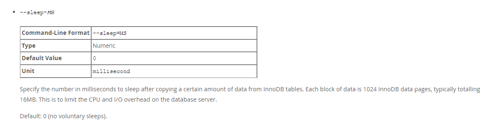
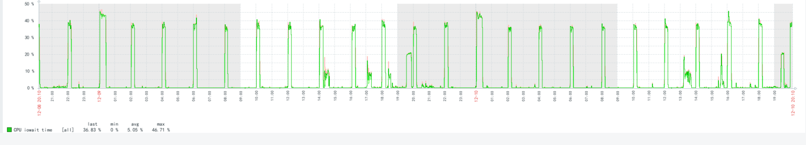
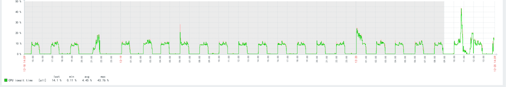

通常情况下，我们总是系统备份的速度是越快越好。 但是，有时候这会导致IO压力，我们需要削峰处理。

我们在mysqlbackup命令中，添加sleep参数即可。  
​

修改前：  
​

修改后（削峰，其实备份的IO总量并没有减少，但是IO的波峰被削平了，同时备份时间也被延长了）：  
​

类似的，我们如果pg数据库，由于大表autovacuum导致IOPS波峰，也可以用这个思路来解决。调整autovacuum的参数如下（具体根据实际情况定）：

autovacuum\_vacuum\_scale\_factor\=0.001 autovacuum\_vacuum\_cost\_delay\=100 autovacuum\_vacuum\_cost\_limit\=1500

```
autovacuum_vacuum_scale_factor=0.001
autovacuum_vacuum_cost_delay=100
autovacuum_vacuum_cost_limit=1500
```

参考：  
[16.10 Performance / Scalability / Capacity Options](https://dev.mysql.com/doc/mysql-enterprise-backup/4.1/en/backup-capacity-options.html)

‍
