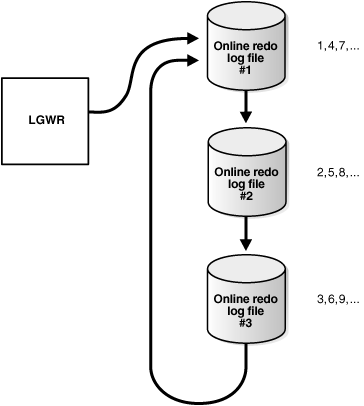
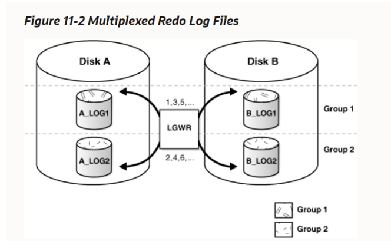

#oracle

恢复操作最关键的结构是重做日志，它由两个或多个预先分配的文件组成，在数据库发生更改时这些文件存储所有更改。Oracle数据库的每个实例都有一个相关的重做日志，以在实例故障情况下保护数据库。

## 一、基本概念

### 1.1 数据写入流程​​

见：[Oracle之事务流程分析](Oracle之事务流程分析.md)

### 1.2 什么是重做日志（redo log）


当用户执行DML操作，数据块发生改变时，产生的变更向量则会写入到重做日志文件中。有了这些记录，当系统由于断电等因素突然宕掉，数据库缓冲区内的大量脏数据还没来得及写入到数据文件中时，也可以通过redo log恢复。

相应的，日志写入也有一块内存区域叫日志缓冲区， 由日志写入器（LGWR）把日志缓冲区内的内容写入到磁盘的重做日志文件中。相比数据库写入器（DBWn），LGWR的写入要频繁的多。在下面三种情况LGWR会执行写入：

- a. commit时写入
- b.日志缓冲区的占用率达到1/3。
- c.DBWn要写入脏缓冲区前

当用户执行DML并且commit后，不一定会触发DBWn写入，但一定会触发LGWR写入。因此就算执行DML并且commit后，数据只写入了数据库缓冲区，而此时数据库缓冲区中的数据丢失了，也可以通过redo log恢复。

‍

### 1.3 什么是归档日志（archive redo log）

[Oracle之redo log 归档](Oracle之redo%20log%20归档.md)


所谓归档，就是将重做日志文件（redo log）永久保存到归档日志文件（archive redo log）中。archive redo log和redo log作用是一样的，只不过redo log会不断被重写，而archive redo log则不会，它保留了关于数据更改的完整的历史记录。 由ARCn进程负责将redo log备份到archive redo log。

以上就是数据写入的大体流程，数据库同步主要就是依赖重做日志（redo log）和归档日志（archive redo log）完成的。

‍

### 1.4 重做日志内容

重做记录，也称为重做条目，由一组更改向量组成，每一个更改向量都是对数据库中单个块所做更改的描述。例如，如果您更改了雇员表中的工资值，您将生成一个重做记录，其中包含更改向量，用于描述对表的数据段块、撤消段数据块和撤消段的事务表的更改。

重做条目记录了可以用来重建对数据库所做的所有更改的数据，包括撤销段。因此，重做日志还可以保护回滚数据。当您使用重做数据恢复数据库时，数据库读取重做记录中的更改向量，并将更改应用到相关的块中。

重做记录在SGA的重做日志缓冲区中以循环方式进行缓冲，并被数据库后台进程log Writer (LGWR)写入其中一个重做日志文件。当事务被提交时，LGWR将事务重做记录从SGA的重做日志缓冲区写到重做日志文件中，并为每个提交的事务分配一个系统变更号(SCN)来标识重做记录。只有当所有与给定事务相关的重做记录都在磁盘在线日志中时，用户进程才会被通知事务已经提交。

在提交相应的事务之前，重做记录也可以写入重做日志文件。如果重做日志缓冲区被填满，或者另一个事务提交，LGWR会将重做日志缓冲区中的所有重做日志条目刷新到重做日志文件中，即使有些重做记录可能没有被提交。如果需要，数据库可以回滚这些更改。

### 1.5 Oracle数据库如何写入重做日志

一个数据库的重做日志由两个或多个重做日志文件组成。数据库至少需要两个文件，以确保在归档另一个文件时(如果数据库处于ARCHIVELOG模式)，其中一个文件始终可写。

LGWR以循环方式写入重做日志文件。当当前重做日志文件填满时，LGWR开始向下一个可用的重做日志文件中写入。当最后一个可用的重做日志文件被填满时，LGWR返回到第一个重做日志文件并写入，再次开始循环。循环写入重做日志文件的过程如下图所示（源自Oracle官网）。每一行旁边的数字表示LGWR写入每个重做日志文件的顺序。


根据是否启用归档，LGWR可以重用被填满的重做日志文件分以下两种情况：

- 如果归档被禁用(数据库处于NOARCHIVELOG模式)，则在将记录在其中的更改写入数据文件后，这个被填满的重做日志文件是可用的。
- 如果启用了归档(数据库处于ARCHIVELOG模式)，则在将记录的更改写入数据文件并归档后，LGWR就可以使用这个被填满的重做日志文件。

##### （1）active(current)和inactive重做日志文件

Oracle数据库一次只使用一个重做日志文件来存储从重做日志缓冲区写入的重做记录。LGWR正在主动写入的重做日志文件称为当前(current)重做日志文件。

实例恢复所需的重做日志文件称为活动(active)重做日志文件。实例恢复不再需要的重做日志文件称为非活动（inactive）重做日志文件。

如果您启用了归档(数据库处于ARCHIVELOG模式)，那么在归档程序后台进程(ARCn)将其内容归档之前，数据库不能重用或覆盖活动在线日志文件。如果禁用了归档（数据库处于 NOARCHIVELOG 模式），则当最后一个重做日志文件已满时，LGWR 将继续在序列中的下一个日志文件变为非活动状态时覆盖该文件。

```sql
select  v.group#, v.status,g.member from v$log v , v$logfile g where v.GROUP#=g.GROUP#;

-- CURRENT.   redo日志为当前活跃的日志，就是LGWR进程写的日志文件，处于该状态下的日志为数据库当前正在写入的日志组。活跃中的日志组无法进行删除。删除前需要将日志组切换到 INACTIVE状态。
-- ACTIVE.    是指活动的非当前日志，在进行实例恢复时会被用到。Active状态意味着Checkpoint尚未完成，脏数据未写入到硬盘，因此该日志文件不能被覆盖。
-- INACTIVE.  是非活动日志，在实例恢复时不再需要，但在介质恢复时可能需要。
-- UNUSED.    通常指从未被使用的日志组，即新添加的日志组。
```

##### （2）日志切换和日志系列号

日志切换是指数据库停止写入一个重做日志文件并开始写入另一个重做日志文件的点。正常情况下，当当前重做日志文件被完全填满且必须继续写入下一个重做日志文件时，就会发生日志切换。
但是，您可以配置日志切换，使其定期发生，而不管当前重做日志文件是否已被完全填满。您也可以手动强制日志切换。
每次发生日志切换，LGWR开始写入时，Oracle数据库为每个重做日志文件分配一个新的日志序列号。当数据库归档重做日志文件时，归档的日志保留其日志序列号。一个被循环返回使用的重做日志文件被给出下一个可用的日志序列号。
每个联机或归档重做日志文件由其日志序列号唯一标识。在崩溃、实例或介质恢复期间，数据库使用必要的归档文件和重做日志文件按日志序列号的升序正确地应用重做日志文件。

```sql
# 手动强制日志切换
alter system switch logfile;

# 配置日志切换，定期发生


```

‍

## 二、规划重做日志

### 2.1 多路复用重做日志文件

为了防止涉及重做日志本身的故障，Oracle数据库允许多路复用重做日志，这意味着两个或多个相同的重做日志副本可以自动维护在不同的位置。

为了最大的好处，这些位置应该在不同的磁盘上。然而，即使重做日志的所有副本都在同一个磁盘上，冗余也可以帮助防止I/O错误、文件损坏等。当重做日志文件多路复用时，**LGWR将相同的重做日志信息并发写入多个相同的重做日志文件中，从而消除了单点重做日志故障的问题。**

多路复用是通过创建重做日志文件组来实现的。组由一个重做日志文件及其多路复用副本组成。每一个相同的副本都被认为是组的一个成员。每个重做日志组由一个数字定义，例如组1、组2等等。




在上图中，A\_LOG1和B\_LOG1都是第一组的成员，A\_LOG2和B\_LOG2都是第二组的成员，依此类推。一个组的每个成员大小必须相同。

日志文件组的每个成员都是同时处于活动状态，即由LGWR同时写入，这由LGWR分配的相同的日志序列号指示。在上图中，第一个LGWR同时写A\_LOG1和B\_LOG1。然后同时写A\_LOG2和B\_LOG2，依此类推。LGWR从不同时向不同组的成员写入(例如，写入A\_LOG1和B\_LOG2)。

**注意**：Oracle建议您复用重做日志文件。如果需要恢复，那么日志文件数据的丢失可能是灾难性的。注意，当你复用重做日志时，数据库必须增加它执行的I/O量。这可能会影响数据库的整体性能，具体取决于您的配置。

##### （1）重做日志故障的响应

当LGWR无法写入组中的某个成员时，数据库将该成员标记为INVALID，并向LGWR跟踪文件和数据库警报日志写入错误消息，指出无法访问的文件存在的问题。

当重做日志成员不可用时，LGWR的具体反应取决于可用性缺失的原因，如下表所示。

|条件|LGWR的行为|
| ----------------------------------------------------------------| ------------------------------------------------------------------------------------------------------------------------------------------------------------------------------------------------------------------------------------------------------------------------------------------------------------------------------------------------------------------|
|LGWR 至少可以向组中的一个成员成功写入|写入照常进行。LGWR向组中可用的成员写入数据，忽略不可用的成员。|
|LGWR无法在日志切换时访问下一个组，因为该组必须被归档|数据库操作将暂时停止，直到组变为可用或组被归档为止。|
|由于介质故障，在日志切换时下一个组的所有成员都不能被LGWR访问|Oracle 数据库返回错误，数据库实例关闭。在这种情况下，您可能需要使用丢失的重做日志对数据库执行介质恢复。如果数据库检查点已经移动到丢失的重做日志之外，则不需要进行介质恢复，因为数据库已经将重做日志中记录的数据保存到数据文件中。您只需要删除不可访问的重做日志组。如果数据库没有归档坏日志，在删除日志之前使用ALTER database CLEAR LOGFILE UNARCHIVED禁用归档。|
|当LGWR向一个组的所有成员写入时，该组的所有成员突然变得无法访问|Oracle数据库返回错误，数据库实例立即关闭。在这种情况下，您可能需要执行介质恢复。如果包含日志的介质实际上并没有丢失——例如，如果日志的驱动器被无意中关闭了——则可能不需要进行介质恢复。在这种情况下，您只需要打开驱动器并让数据库执行自动实例恢复。|

##### （2）合法与不合法的配置

在大多数情况下，多路复用重做日志应该是对称的:所有重做日志组的成员数量应该相同。然而，数据库并不要求多路复用重做日志是对称的。

例如，一个组可以只有一个成员，而其他组可以有两个成员。此配置可防止磁盘故障暂时影响某些重做日志成员，但使其他成员保持不变。

一个实例重做日志的唯一要求是它至少有两个组。合法和非法的多路复用重做日志配置如下图所示。第二个配置是非法的，因为它只有一个组。

### 2.2 在不同的磁盘上放置重做日志成员

在建立多路复用重做日志时，将一个组的成员放在不同的物理磁盘上。如果单个磁盘故障，则组中只有一个成员对LGWR不可用，而其他成员对LGWR仍可访问，因此实例可以继续工作。

如果你归档重做日志，将重做日志成员分散到不同的磁盘上，以消除LGWR和ARCn后台进程之间的争用。例如，如果你有两组多路复用重做日志成员(一个双工重做日志)，将每个成员放在不同的磁盘上，并将存档目标设置为第五个磁盘。这样做将避免LGWR(写入成员)和ARCn(读取成员)之间的争用。

数据文件也应该与重做日志文件放在不同的磁盘上，以减少写数据块和重做记录时的争用。

**redo文件的多路复用：** 通常应该通过指定db_create_online_log_dest_n 参考[Oracle OMF](../Oracle%20高级特性/Oracle%20OMF.md)

### 2.3 规划重做日志文件大小

在设置重做日志文件的大小时，要考虑是否要归档重做日志。应该调整重做日志文件的大小，以便将一个填满的组归档到离线存储媒介的单个单元中(如磁带或磁盘)，使媒介上未使用的空间最少。

例如，假设一个磁带上只能容纳一个已填满的重做日志组，并且有49%的磁带存储空间未使用。在这种情况下，最好稍微减小重做日志文件的大小，以便在每个磁带上可以归档两个日志组。

同一个多路复用重做日志组的所有成员大小必须相同。不同组的成员可以有不同的大小。然而，在不同组之间使用不同的文件大小并没有什么好处。如果未将检查点设置为在日志切换之间发生，请将所有组的大小设置为相同，以确保定期发生检查点。

重做日志文件允许的最小大小是4 MB。

### 2.4 规划重做日志文件块大小

与数据库块大小(可以在2K到32K之间)不同，重做日志文件总是默认块大小等于磁盘的物理扇区大小。从历史上看，这通常是512字节(512B)。

一些较新的大容量磁盘驱动器提供4K字节(4K)扇区大小，以提高ECC能力和提高格式化效率。大多数Oracle数据库平台都能够检测到这种较大的扇区大小。然后，数据库自动在这些磁盘上创建具有4K块大小的重做日志文件。

然而，当块大小为4K时，重做浪费会增加。事实上，与512B块相比，4K块的重做浪费是显著的。你可以通过查看VSESSTAT和VSYSSTAT视图中存储的统计数据来确定重做浪费的数量。

```sql
SYS@orcl&gt; select name,value from v$sysstat where name = 'redo wastage';

NAME      VALUE
---------------------------------------------------------------- ----------
redo wastage     773492
```

为了避免额外的重做浪费，如果您正在使用仿真模式磁盘- 4K扇区大小的磁盘驱动器，在磁盘接口上模拟512B扇区大小，您可以通过指定512B块大小或在某些平台上指定1K块大小来覆盖重做日志的默认4K块大小。但是，当重做日志写与4K物理扇区的开始没有对齐时，将导致显著的性能下降。因为4K物理扇区中8个512B槽中的7个没有对齐，所以通常会发生性能下降。因此，在4K扇区大小的仿真模式磁盘上规划重做日志块大小时，必须在性能和磁盘浪费之间的评估权衡。

可以在CREATE DATABASE、ALTER DATABASE和CREATE CONTROLFILE语句中使用BLOCKSIZE关键字指定联机重做日志文件的块大小。在某些平台上，允许的块大小是512和4096。在其他平台上，允许的块大小为1024和4096。

下面的语句添加了一个块大小为512B的重做日志文件组。BLOCKSIZE 512子句有效，但对于512B扇区大小的硬盘不是必需的。对于4K扇区大小的仿真模式磁盘，BLOCKSIZE 512子句将覆盖默认的4K大小。

```sql
ALTER DATABASE orcl ADD LOGFILE
  GROUP 4 ('/u01/logs/orcl/redo04a.log','/u01/logs/orcl/redo04b.log')
  SIZE 100M BLOCKSIZE 512 REUSE;

# 查看重做日志文件的块大小
SYS@orcl&gt; select blocksize from v$log where group# = 4;

 BLOCKSIZE
----------
       512
  
```

### 2.5 选择重做日志文件的数量

为数据库实例确定适当的重做日志文件数量的最佳方法是测试不同的配置。在不妨碍LGWR写入重做日志信息的情况下，最优配置的组尽可能少。

在某些情况下，一个数据库实例可能只需要两个组。在其他情况下，数据库实例可能需要额外的组，以确保LGWR始终可以使用回收的组。在测试期间，确定当前重做日志配置是否令人满意的最简单方法是检查LGWR跟踪文件和数据库警报日志的内容。如果消息显示LGWR经常需要等待某个组，因为检查点未完成或组还未被归档，则需要添加组。

在设置或更改实例重做日志的配置之前，考虑可以限制重做日志文件数量的参数。以下参数限制了可以添加到数据库中的重做日志文件的数量:

- MAXLOGFILES：CREATE DATABASE语句中使用的MAXLOGFILES参数确定每个数据库的最大重做日志文件组数。组值范围为1到MAXLOGFILES。您可以超过MAXLOGFILES限制，控制文件将根据需要进行扩展。如果没有为CREATE DATABASE语句指定MAXLOGFILES，则数据库使用特定于操作系统的默认值。
- MAXLOGMEMBERS：CREATE DATABASE语句中使用的MAXLOGMEMBERS参数确定每个组的最大成员数。与MAXLOGFILES一样，覆盖此上限的惟一方法是重新创建数据库或控制文件。因此，在创建数据库之前考虑这个限制是很重要的。如果没有为CREATE DATABASE语句指定MAXLOGMEMBERS参数，则数据库使用操作系统默认值。

### 2.6 控制归档滞后

您可以强制所有已启用的重做日志线程按一定的时间间隔切换当前日志。

在主/备数据库配置中，通过在主站点归档重做日志，然后将其传输到备数据库，备用数据库可以使用更改。备用数据库正在应用的更改可能滞后于主数据库上发生的更改，因为备用数据库必须等待主数据库重做日志中的更改被归档（到归档的重做日志中），然后再传送给它。要限制这种延迟，可以设置ARCHIVE\_LAG\_TARGET初始化参数。设置此参数可使您以秒为单位指定延迟时间。

##### （1）设置ARCHIVE\_LAG\_TARGET初始化参数

当你设置ARCHIVE\_LAG\_TARGET初始化参数时，会导致数据库定期检查实例的当前重做日志，并决定何时切换日志。

**如果满足以下条件，则实例将切换日志**:

- 当前日志是在n秒之前创建的，当前日志的估计归档时间是m秒(与当前日志中使用的重做块的数量成正比)，其中n + m超过了ARCHIVE\_LAG\_TARGET初始化参数的值。
- 当前日志包含重做记录。

在Oracle Real Application Clusters环境中，如果其他线程落后，实例还会导致其他线程切换并存档它们的日志。当集群中的一个实例比其他实例更空闲时(比如当您运行Oracle Real Application Clusters的两个节点主/备配置时)，这可能特别有用。

ARCHIVE\_LAG\_TARGET初始化参数为数据库当前日志提供了可以持续的最长时间(以秒为单位)的上限。因为还考虑了估计的存档时间，所以这不是确切的日志切换时间。

```sql
# 将日志切换间隔设置为30分钟(典型值)。
ARCHIVE_LAG_TARGET = 1800

# ARCHIVE_LAG_TARGET是一个动态参数，可以通过ALTER SYSTEM set语句设置：
## 例如设置其值为30s，设置之前查看日志组的状态
SYS@orcl&gt; select group#,sequence#,status from v$log;

    GROUP#  SEQUENCE# STATUS
---------- ---------- ----------------
 1   82 INACTIVE
 2   83 CURRENT
 3   81 INACTIVE
 4    0 UNUSED
## 设置archive_lag_target
SYS@orcl&gt; alter system set archive_lag_target = 30;
System altered.

## 30s后再次查看日志组的信息
SYS@orcl&gt; select group#,sequence#,status from v$log;
    GROUP#  SEQUENCE# STATUS
---------- ---------- ----------------
 1   82 INACTIVE
 2   83 ACTIVE
 3   81 INACTIVE
 4   84 CURRENT

## 查看完之后，可以将该参数设置为0，禁用基于时间的日志切换功能
```

值为0将禁用此基于时间的日志切换功能。这是默认设置。

即使没有备用数据库，也可以设置ARCHIVE\_LAG\_TARGET初始化参数。例如，可以专门设置ARCHIVE\_LAG\_TARGET参数，以强制切换和归档日志。

**注意**：在Oracle Real Application Clusters环境的所有实例中，ARCHIVE\_LAG\_TARGET参数必须设置为相同的值。如果不这样做，就会导致不可预测的行为。

##### （2）ARCHIVE\_LAG\_TARGET设置的影响因素

在设置ARCHIVE\_LAG\_TARGET初始化参数时，有几个因素需要考虑。
在确定是否要设置ARCHIVE\_LAG\_TARGET初始化参数以及确定该参数的值时，需要考虑以下因素。

- 切换(以及归档)日志的开销
- 由于日志满的情况，发生正常日志切换的频率有多高
- 在备用数据库中可以容忍丢失多少重做

如果自然日志切换的频率比指定的间隔要高，那么设置ARCHIVE\_LAG\_TARGET可能没什么用。然而，在重做生成速度不正常的情况下，间隔确实为每个当前日志覆盖的时间范围提供了上限。

如果ARCHIVE\_LAG\_TARGET初始化参数设置为非常低的值，可能会对性能产生负面影响。这可能会迫使频繁切换日志。将该参数设置为合理的值，以免降低主数据库的性能。

## 三、创建重做日志组和成员

为数据库规划重做日志，并在数据库创建过程中创建所有所需的重做日志文件组和成员。但是，在有些情况下，您可能需要创建额外的组或成员。例如，向重做日志添加组可以纠正重做日志组可用性问题。

要创建新的重做日志组和成员，您必须拥有ALTER DATABASE系统权限。数据库最多可以有MAXLOGFILES个组。

### 3.1 创建重做日志组

要创建一组新的重做日志文件，使用SQL语句 `ALTER DATABASE 和 ADD LOGFILE`​子句。

```sql
-- 1.例如，下面的语句向数据库添加了一组新的重做日志：
alter database add logfile ('/u01/logs/orcl/redo05a.log','/u01/logs/orcl/redo05b.log') size 100M;

-- 查看验证
select group#,member from v$logfile where member like '%redo05%';
    GROUP# MEMBER
---------- ------------------------------------------------------------
 5 /u01/logs/orcl/redo05a.log
 5 /u01/logs/orcl/redo05b.log
  
select group#,sequence#,status from v$log;
    GROUP#  SEQUENCE# STATUS
---------- ---------- ----------------
 1   82 INACTIVE
 2   83 INACTIVE
 3   85 CURRENT
 4   84 INACTIVE
 5    0 UNUSED

-- 可以发现，如果我们在添加日志组时，没有通过group关键字指定组号，oracle会为其分配下一个可用的组号（例如，4的下一个就是5）

-- 2.您还可以使用group子句指定标识组的编号：
alter database add logfile group 7 ('/u01/logs/orcl/redo07a.log','/u01/logs/orcl/redo07b.log') size 100M blocksize 512;

-- 查看验证
select group#,member from v$logfile where member like '%redo07%';
    GROUP# MEMBER
---------- ------------------------------------------------------------
 7 /u01/logs/orcl/redo07a.log
 7 /u01/logs/orcl/redo07b.log

```

使用组号可以使重做日志组的管理更容易。但是，组号必须在1到MAXLOGFILES之间。不要跳过重做日志文件组编号(即不要将您的组编号为10、20、30等)，否则将消耗数据库控制文件中不必要的空间。BLOCKSIZE子句是可选的。
**注意**：提供新日志成员的完整路径名，以指定它们的位置。否则，将在数据库服务器的默认目录或当前目录中创建文件，具体取决于您的操作系统。

### 3.2 创建重做日志成员

在某些情况下，可能没有必要创建一组完整的重做日志文件。一个组可能已经存在，但不完整，因为该组的一个或多个成员被删除(例如，因为磁盘故障)。在这种情况下，您可以向现有的组中添加新成员。为现有的组创建新的重做日志成员。

- 运行带有ADD LOGFILE MEMBER子句的ALTER DATABASESQL语句。

```sql
-- 1.为重做日志组号4添加一个新的重做日志成员
alter database add logfile member '/u01/logs/orcl/redo04c.log' to group 4;
Database altered.

-- 查看验证
select group#,member from v$logfile where member like '%redo04%';
    GROUP# MEMBER
---------- ----------------------------------------
 4 /u01/logs/orcl/redo04a.log
 4 /u01/logs/orcl/redo04b.log
 4 /u01/logs/orcl/redo04c.log

-- 2.当使用ALTER DATABASE语句时，您可以通过在TO子句中指定组的所有其他成员来标识目标组，如下面的示例所示：
alter database add logfile member '/u01/logs/orcl/redo07c.log' to ('/u01/logs/orcl/redo07a.log','/u01/logs/orcl/redo07b.log');

select group#,member,status from v$logfile where member like '%redo07%';

    GROUP# MEMBER    STATUS
---------- ---------------------------------------- -------
 7 /u01/logs/orcl/redo07a.log
 7 /u01/logs/orcl/redo07b.log
 7 /u01/logs/orcl/redo07c.log    INVALID

```

注意，必须指定文件名，但不需要指定大小。新成员的大小是由现有组成员的大小确定的。

**注意**：完全指定新日志成员的文件名，以指示应该在哪里创建操作系统文件。否则，将在数据库服务器的默认目录或当前目录中创建文件，具体取决于您的操作系统。您可能还会注意到，新日志成员的状态显示为INVALID。这是正常的，当它第一次使用时，它将更改为活动(空白)。

## 四、重定位和重命名重做日志成员

您可以使用操作系统命令重新定位重做日志，然后使用ALTER DATABASE语句使数据库知道它们的新名称(位置)。

这个过程是必要的，例如，如果当前用于一些重做日志文件的磁盘将要被移除，或者如果数据文件和几个重做日志文件存储在同一个磁盘上，应该将它们分开以减少争用。

要重命名重做日志成员，您必须具有ALTER DATABASE系统权限。此外，您可能还需要操作系统特权来将文件复制到所需的位置，以及打开和备份数据库的特权。

在重新定位重做日志或对数据库进行任何其他结构更改之前，请完全备份数据库，以防在执行操作时遇到问题。作为预防措施，在重命名或重新定位一组重做日志文件后，立即备份数据库控制文件。

**重命名重做日志成员**：

```sql
-- 1.关闭数据库
SYS@orcl&gt; shutdown;

-- 2.将重做日志迁移到新的位置（以日志组5为例）
[oracle@oracle4 ~]$ mkdir /u01/logs/orcl_new
[oracle@oracle4 ~]$ mv /u01/logs/orcl/redo05a.log /u01/logs/orcl_new/redo05A.log
[oracle@oracle4 ~]$ mv /u01/logs/orcl/redo05b.log /u01/logs/orcl_new/redo05B.log
[oracle@oracle4 ~]$ ll /u01/logs/orcl_new
total 204808
-rw-r----- 1 oracle dba 104858112 Dec  7 08:58 redo05A.log
-rw-r----- 1 oracle dba 104858112 Dec  7 08:58 redo05B.log

-- 3.启动数据库到挂载状态
SYS@orcl&gt; startup mount;

-- 4.重命名重做日志成员
-- 使用带有RENAME FILE子句的ALTER DATABASE语句重命名数据库重做日志文件。
SYS@orcl&gt; alter database rename file '/u01/logs/orcl/redo05a.log','/u01/logs/orcl/redo05b.log'
      to '/u01/logs/orcl_new/redo05A.log','/u01/logs/orcl_new/redo05B.log';
Database altered.

-- 5.打开数据库
-- 重做日志更改在数据库打开时生效。
SYS@orcl&gt; alter database open;
Database altered.

-- 查看验证
SYS@orcl&gt; select group#,sequence#,status from v$log where group# = 5;
    GROUP#  SEQUENCE# STATUS
---------- ---------- ----------------
 5   86 INACTIVE
SYS@orcl&gt; select group#,member from v$logfile where group# = 5;

    GROUP# MEMBER
---------- ----------------------------------------
 5 /u01/logs/orcl_new/redo05A.log
 5 /u01/logs/orcl_new/redo05B.log
```

## 五、删除重做日志组和成员

在某些情况下，您可能希望删除整个重做日志成员组。

例如，您希望减少实例重做日志中的组数。在另一种情况下，您可能希望删除一个或多个特定的重做日志成员。例如，如果磁盘发生故障，您可能需要删除故障磁盘上的所有重做日志文件，以便数据库不会尝试写入不可访问的文件。在其他情况下，特定的重做日志文件不再需要。例如，文件可能存储在不合适的位置。

### 5.1 删除日志组

要删除重做日志组，必须具有ALTER DATABASE系统权限。在删除重做日志组之前，需要考虑以下限制和注意事项:

- 一个实例至少需要两组重做日志文件，而不考虑组中的成员数。(一个组由一个或多个成员组成。)
- 当重做日志组处于非活动状态时，才可以删除重做日志组。如果必须删除当前组，则首先强制进行日志切换。
- 在删除重做日志组之前，请确保重做日志组已存档(如果启用了存档)。要查看是否发生了这种情况，请使用V$LOG视图。

```sql
SYS@orcl&gt; select group#,sequence#,archived,status from v$log;

    GROUP#  SEQUENCE# ARC STATUS
---------- ---------- --- ----------------
 1   88 YES INACTIVE
 2   89 NO  CURRENT
 3   85 YES INACTIVE
 4   84 YES INACTIVE
 5   86 YES INACTIVE
 7   87 YES INACTIVE
```

**删除重做日志组**：

```sql
-- 1.删除重做日志组7
SYS@orcl&gt; alter database drop logfile group 7;

-- 2.如果没有使用Oracle Managed Files，请在操作系统层面删除响应的日志文件
[oracle@oracle4 ~]$ ll /u01/logs/orcl/redo07*
-rw-r----- 1 oracle dba 104858112 Dec  7 10:57 /u01/logs/orcl/redo07a.log
-rw-r----- 1 oracle dba 104858112 Dec  7 10:57 /u01/logs/orcl/redo07b.log
-rw-r----- 1 oracle dba 104858112 Dec  6 23:23 /u01/logs/orcl/redo07c.log
[oracle@oracle4 ~]$ rm -f /u01/logs/orcl/redo07*
```

当重做日志组从数据库中删除，并且您没有使用Oracle Managed Files特性时，操作系统文件不会从磁盘中删除。相反，会更新关联数据库的控制文件以从数据库结构中删除组的成员。删除重做日志组后，确保成功完成删除，然后使用相应的操作系统命令删除的重做日志文件。

当使用Oracle Managed Files时，操作系统文件的清理会自动完成。

### 5.2 删除重做日志成员

要删除重做日志成员，必须具有ALTER DATABASE系统权限。在删除单个重做日志成员之前，请考虑以下限制和注意事项:

- 允许删除重做日志文件，以使多路复用重做日志暂时变得不对称。但是，您应该立即纠正这种情况，以便所有组至少有两个成员，从而消除重做日志可能出现的单点故障。
- 一个实例总是需要至少两个有效的重做日志文件组，而不管组中的成员数量(一个组由一个或多个成员组成。)。如果要删除的成员是该组的最后一个有效成员，则在其他成员生效之前不能删除该成员。要查看重做日志文件状态，使用V$LOGFILE视图。如果数据库无法访问重做日志文件，重做日志文件将变为INVALID。如果数据库怀疑它不完整或不正确，它就变成STALE。过期的日志文件在下一次将其组设置为活动组时再次有效。
- 只有当重做日志成员不属于活动组或当前组时，才可以删除它。要删除活动组的成员，首先强制发生日志切换。
- 在删除重做日志成员之前，请确保重做日志成员所属的组已存档(如果启用了存档)。要查看是否发生了这种情况，请使用V$LOG视图。

```sql
-- 1.删除特定的非活动重做日志成员
-- 运行带有DROP LOGFILE MEMBER子句的ALTER DATABASE语句。
-- 例如删除日志组4中个一个成员日志文件
-- 先确定组状态和是否已归档
select group#,status,archived from v$log where group# = 4;

    GROUP# STATUS    ARC
---------- ---------------- ---
 4 INACTIVE    YES

-- 查看重做日志组4中的成员
select group#,member,type from v$logfile where group# = 4;

    GROUP# MEMBER    TYPE
---------- ---------------------------------------- -------
 4 /u01/logs/orcl/redo04a.log    ONLINE
 4 /u01/logs/orcl/redo04b.log    ONLINE
 4 /u01/logs/orcl/redo04c.log    ONLINE

-- 删除重做日志成员/u01/logs/orcl/redo04c.log
alter database drop logfile member '/u01/logs/orcl/redo04c.log';
Database altered.
```

当重做日志成员从数据库中删除时，不会从磁盘中删除操作系统文件。相反，更新关联数据库的控制文件以从数据库结构中删除成员。删除重做日志文件后，确保删除成功，然后使用相应的操作系统命令删除删除的重做日志文件。

若要删除活动组的成员，必须首先强制进行日志切换。

## 六、强制日志切换

日志切换发生在LGWR停止写入一个重做日志组并开始写入另一个重做日志组时。默认情况下，当当前重做日志文件组被填满时，会自动发生日志切换。

您可以强制日志切换使当前活动的组变为非活动，并可用于重做日志维护操作。例如，您希望删除当前活动的组，但直到该组处于非活动状态时才能够这样做。如果当前活动的组必须在完全填满该组成员之前的特定时间存档，您可能还希望强制进行日志切换。这个选项在需要很长时间来填充大重做日志文件的配置中很有用。

要强制日志切换，必须具有ALTER SYSTEM权限。

```sql
-- 运行带有SWITCH LOGFILE子句的ALTER SYSTEM语句。
SYS@orcl&gt; alter system switch logfile;
System altered.
```

## 七、验证重做日志文件中的块

您可以配置数据库使用校验和来验证重做日志文件中的块。

如果你将初始化参数DB\_BLOCK\_CHECKSUM设置为TYPICAL(默认值)，那么数据库在将每个数据库块写入磁盘时计算一个校验和，包括将每个重做日志块写入当前日志时。

Oracle数据库使用校验和来检测重做日志块中的损坏。当恢复过程中从归档日志中读取重做日志块，以及将该块写入归档日志文件时，数据库将验证重做日志块。如果检测到损坏，将引发一个错误并将其写入警报日志。

如果在尝试归档重做日志块时检测到损坏，系统会尝试从组中的其他成员读取该重做日志块。如果该块在重做日志组的所有成员中都已损坏，则无法进行归档。

DB\_BLOCK\_CHECKSUM参数的值可以使用ALTER SYSTEM语句动态更改。

**注意**：启用DB\_BLOCK\_CHECKSUM会有轻微的开销，并降低数据库性能。监视数据库性能，以确定使用数据块校验和检测损坏的好处是否大于对性能影响。

## 八、清除重做日志文件

重做日志文件可能在数据库打开时损坏，并最终停止数据库活动，因为无法继续存档。

在这种情况下，在不关闭数据库的情况下重新初始化文件:

- 运行ALTER DATABASE CLEAR LOGFILE SQL语句。

```sql
# 清除重做日志组4中的日志文件
SYS@orcl&gt; alter database clear logfile group 4;

Database altered.
```

**这个语句克服了两种不可能删除重做日志的情况**:

- 如果只有两个日志组
- 损坏的重做日志文件属于当前组

如果损坏的重做日志文件尚未存档，则在语句中使用UNARCHIVED关键字。

```
alter database clear unarchived logfile group 4;
```

此语句清除已损坏的重做日志并避免将其存档。已清除的重做日志即使没有归档，也可以使用。

如果清除恢复某个备份所需的日志文件，则不能再从该备份中进行恢复。数据库在警报日志中写入一条消息，描述您无法从中恢复的备份。

**注意**：如果清除了未归档的重做日志文件，则应该对数据库进行另一次备份。

要清除使脱机表空间联机所需的未归档重做日志，请使用 ALTER DATABASE CLEAR LOGFILE 语句中的UNRECOVERABLE DATAFILE 子句。

如果清除使脱机表空间联机所需的重做日志，则将无法使表空间再次联机。您将不得不删除表空间或执行不完全恢复。注意，正常脱机的表空间不需要恢复。

## 九、设置FORCE LOGGING的优先级

您可以在不同级别上设置FORCE LOGGING和NOLOGGING，例如针对数据库、可插拔数据库(PDB)、表空间或数据库对象。当FORCE LOGGING设置为一个或多个级别时，FORCE LOGGING设置的优先级决定重做日志中记录的内容。

您可以将多租户容器数据库 （CDB） 和非 CDB 置于FORCE LOGGING模式。在这种模式下，数据库将记录数据库中除了临时表空间和临时段的更改之外的所有更改。此设置优先于您为单个表空间指定的任何 NOLOGGING 或 FORCE LOGGING 设置以及您为单个数据库对象指定的任何 NOLOGGING 设置，并且独立于这些设置。

您还可以将表空间设置为FORCE LOGGING模式。数据库记录对表空间中所有对象的所有更改(临时段除外)，会覆盖单个对象的任何NOLOGGING设置。

此外，您还可以通过logging\_clause子句为各种类型的数据库对象指定日志属性，以确定某些DML操作是否将被记录在重做日志文件中((logging：记录，NOLOGGING：不记录)。
**您可以为以下类型的数据库对象指定日志属性**:

- 表
- 索引
- 物化视图

**日志组的状态**：

- UNUSED：从未写入过联机重做日志。这是刚刚添加的重做日志的状态，或者刚好在重置（resetlogs）日志之后（当它不是当前重做日志时）。
- CURRENT：当前重做日志。这意味着重做日志是活动的。重做日志可以打开或关闭。
- ACTIVE：日志处于活动状态，但不是当前日志。它是崩溃恢复所必需的。它可能用于块恢复。它可能被存档，也可能不会被存档。
- CLEARING ：在执行ALTER DATABASE CLEAR LOGFILE语句后，将日志重新创建为空日志。日志清除后，状态变为“UNUSED”。
- CLEARING\_CURRENT：正在清除当前日志中的关闭线程。如果切换发生故障，例如I/O错误写入新的日志头，日志可以保持在这种状态。
- INACTIVE ：实例恢复不再需要的日志。它可能用于介质恢复。它可以存档，也可以不存档
