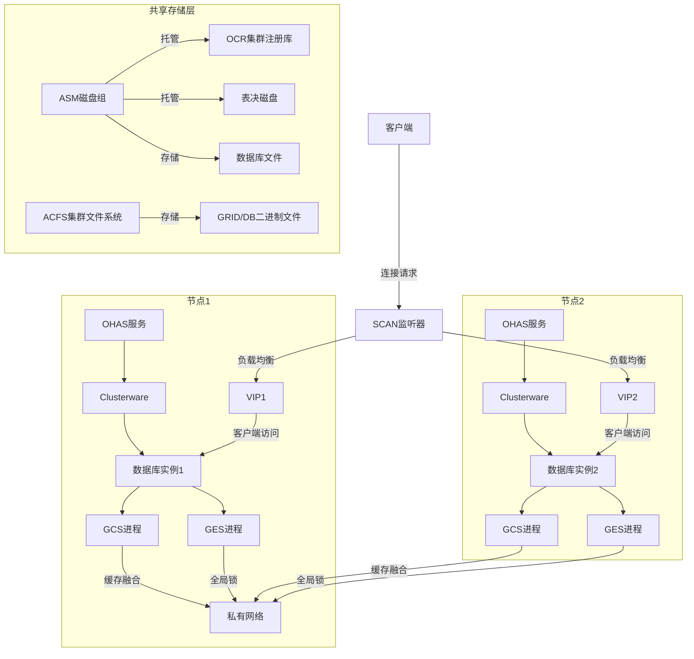

Oracle RAC（Real Application Clusters）的核心组件协同工作，使多个服务器节点能够像访问单一数据库一样访问共享数据库，提供**高可用性、可扩展性和负载均衡**。以下是其核心组件、服务及功能说明：

### **一、核心组件及服务**

|**组件类别**|**核心组件**|**主要功能与服务**|
|---|---|---|
|**共享存储层**|**ASM (Automatic Storage Management)**|提供集群文件系统管理，自动条带化与镜像，管理数据文件、控制文件、在线日志等。|
||**ACFS (ASM Cluster File System)**|存放集群配置文件（OCR、Voting Disk）、数据库安装文件等。|
|**集群管理层**|**Clusterware (CRS)**|节点监控、故障转移、资源管理（VIP、SCAN VIP、监听器、数据库实例）。|
||**OHAS (Oracle High Availability Services)**|启动集群守护进程（cssd、crsd、diskmon 等）。|
||**Voting Disks**|存储集群节点状态，解决“脑裂”问题（至少3个）。|
||**OCR (Oracle Cluster Registry)**|存储集群资源配置信息（如节点列表、服务、VIP等）。|
|**网络层**|**Public Network**|客户端访问数据库（VIP/SCAN VIP）。|
||**Private Network (Interconnect)**|节点间高速通信（缓存融合、心跳检测），需用RDMA（如InfiniBand）或10GbE+。|
|**数据库实例层**|**RAC Database Instances**|每个节点独立运行的实例，共享同一数据库。|
||**GCS (Global Cache Service)**|管理全局数据块缓存，实现跨节点缓存一致性。|
||**GES (Global Enqueue Service)**|管理全局锁资源（如行级锁、表锁），协调并发访问。|
||**LMON、LMD、LCK、RMSn 等后台进程**|负责实例间通信、死锁检测、资源管理等（如 `LMON` 监控集群健康）。|

---

### **二、Oracle RAC 核心架构图（逻辑视图）**

#### **关键路径说明：**

1. **存储层**
    - ASM 统一管理 OCR、Voting Disks 及数据库文件。
    - ACFS 存放集群软件和数据库安装文件（可选）。
2. **集群管理层**
    - 每个节点的 OHAS 启动 Clusterware 进程（`crsd`、`cssd`、`diskmon`）。
    - Clusterware 通过**Voting Disks**避免脑裂，通过**OCR**读取资源配置。
3. **网络层**
    - **Public Network**：客户端通过 SCAN VIP（由DNS轮询解析）连接数据库。
    - **Interconnect**：节点间通过私有网络同步缓存（GCS）和锁信息（GES）。
4. **数据库层**
    - 各节点实例共享同一份数据文件，但拥有独立 SGA 和 PGA。
    - **GCS**：跨节点传递数据块（如节点1请求节点2缓存中的块）。
    - **GES**：全局锁管理（例如：节点2的会话要更新节点1锁定的行）。

---

### **三、关键技术点**

1. **缓存融合（Cache Fusion）**
    - 通过 Interconnect 直接传递数据块，避免写入磁盘。
    - 例如：节点1需要块X，若节点2的缓存中有，则直接发送。
2. **高可用实现**
    - **节点故障**：Clusterware 检测后，VIP 漂移到存活节点，实例自动重启。
    - **存储冗余**：ASM 支持 FAILGROUP 镜像，Voting Disk/OCR 多副本。
3. **负载均衡**
    - **客户端**：通过 SCAN 的 DNS 轮询分配连接。
    - **服务端**：通过 `LISTENER` 和 `LOAD_BALANCE=ON` 分发会话。

---

### **四、运维注意**

- **Interconnect 性能**：网络延迟直接影响 GCS 效率，需专用低延迟网络。
- **脑裂防护**：Voting Disks 必须奇数个（>=3），分布在独立存储。
- **OCR 备份**：定期用 `ocrconfig -export` 备份，损坏将导致集群不可用。
- **Patch 一致性**：所有节点的 GRID 和 Database 版本需完全一致。
> 📌 **工具推荐**：  
> 用 `crsctl status res -t` 查看资源状态，`asmcmd lsdsk` 检查 ASM 磁盘组，`oifcfg` 管理网络配置。

通过以上组件协作，Oracle RAC 实现了**单点故障透明转移**与**线性性能扩展**，是核心业务高可用的基石。