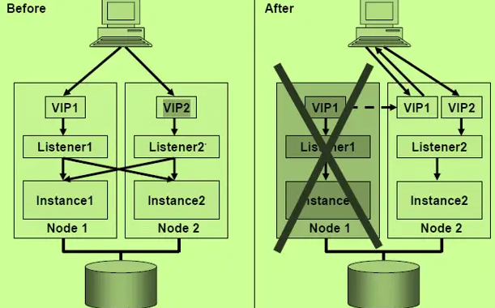
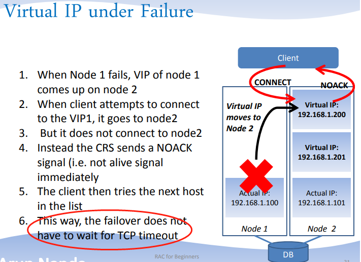
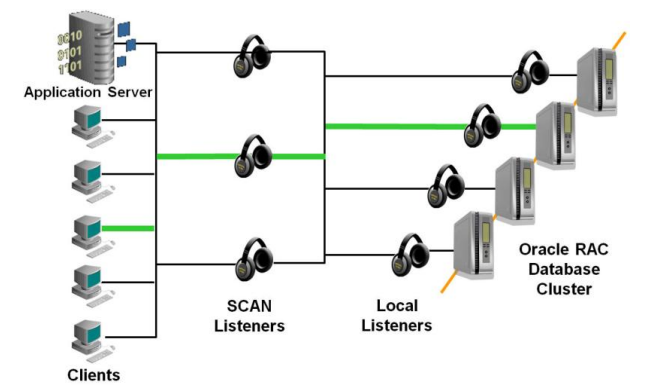

在Oracle RAC中，有Public IP、Private IP、Virtual IP、SCAN IP、GNS VIP及HAIP，这些IP支撑Oracle 数据库内部及外部的通信。

从Oracle 11g开始，安装RAC至少需要**7个IP地址**，两块网卡（一块公网网卡，一块私网网卡），**Public IP、Virtual IP、SCAN IP都在同一个网段，使用的是公网网卡**，private在另一个网段，使用的是私网网卡。

## **Public IP**

Oracle通过Public IP对外提供网络服务。如果RAC中Public IP所在的网卡设备故障，那么该节点将无法继续对外提供服务，所以，建议通过开启操作系统层面的多网卡绑定技术来实现IP Failover。

## **Private IP**

节点和节点之间的通信，主要为集群之间与数据库实例之间的通信使用。从11gR2开始推出HAIP技术提供私网的高可用性和负载均衡特性，之前版本通过服务器的双网卡绑定提供私网的可靠性。

## **Virtual IP**

VIP是Oracle 10g RAC的新特性，称为虚拟IP。VIP是在Public IP所在的网卡上由Oracle集群软件虚拟出来的一个IP，需要和Public IP设置在同一个子网网段中。Oracle集群软件安装之前只需定义好（/etc/hosts文件）即可，而无需事先配置。

VIP需要和PUBLIC  IP同一个子网，它们是由GI的Clusterware来管理的。VIP在其节点服务器发生故障的时候会自动漂移到另外正常的节点服务器上，如果RAC是多个节点运行的，那具体漂移到哪个活动的节点将由Clusterware决定。VIP发生漂移现象之后，其当前的节点服务器LOCAL   LISTENER是不会监听它的请求的，所以有客户端向这个VIP发送请求时，Clusterware的FAN会通知客户端向别的VIP发送请求，客户端收到通知后通过Failover机制把请求重新发送到ADDRESS列表中的其他VIP上，如下所示：



虽然有这种较复杂的过程，但始终对客户端是透明进行的，而且这个过程完成时间非常短暂，客户端也就几乎感受不到有节点宕机。等故障节点恢复正常，漂移的VIP也回到此节点上，继续提供服务。

VIP的优点在于相比TCP，客户端感知失败的时间更短、不需要等待TCP超时。



[TAF](https://www.thegeeksearch.com/configuring-transparent-application-failover-taf-in-oracle-rac/)是OCI的特性，虽然可以做到透明（指的是不需要应用端做reconnect）的failover（针对查询，DML事务还是回滚），因为大部分都不使用oci模式（尤其是jdbc，虽然支持oic），而是应用去做连接池自动重连，所以不展开。

可以使用如下命令让节点1的VIP强制漂移到节点2上去：

```bash
crsctl relocate resource ora.raclhr-11gr2-n1.vip -n raclhr-11gR2-N2 -f
```

下命令针对Oracle 11g版本之前：

```javascript
crs_relocate ora.lhr-11gr2-rac1.vip -c lhr-11gR2-rac2 -f
```

## **SCAN IP**

### scan 概念

SCAN(Single Client Access Name)是Oracle从11g  R2开始推出的，客户端可以通过SCAN特性负载均衡地连接到RAC数据库。SCAN提供一个域名来访问RAC，域名可以解析1个到3个（注意，最多3个）SCAN  IP，我们可以通过DNS或者GNS来解析实现。其中DNS大家都很熟悉，这里不多说。GNS(Grid Naming  Service)则是Oracle 11g R2的新功能，可以通过DHCP服务为节点和SCAN分配VIP和SCAN  IP。另外还有个优点是，对于新加入集群的节点，它会自动分配VIP地址，更新集群资源，客户端依然通过SCAN特性负载均衡地连接到新增集群节点上。DNS和GNS配置与解析相关内容在下面还有说明。

除了DNS和GNS解析方法外，SCAN也可以使用hosts文件来解析，但SCAN域名只能定义一个SCAN   IP，和VIP连接是一样的，不能体现出scan ip的特性（负载均衡），所以这种方法也是Oracle不推荐使用的。

SCAN最明显的优点就是，当集群中新增加了节点或者删除了节点，不需要额外维护客户端。

### **SCAN 工作流程**

在启用SCAN 特性之后，除了多几个SCAN IP 之外，还会多几个SCAN IP Listener，每个SCAN IP对应一个SCAN  IP Listener，为了性能考虑，每个SCAN IP以及其对应的SCAN IP Listener将被独立的分配到各个节点上，<span data-type="text" style="color: var(--b3-font-color12);">cluster内部的service在每个scan listener上都有注册</span>。

客户端链接的时候，会随机的连接到某一个SCAN IP及起对应的SCAN IP Listner上， SCAN IP  Listener接收到连接请求时，会根据 LBA 算法（least loaded  instance），将该客户端的连接请求，转发给对应的Instance上的VIP Listener（最终还是由local的listener提供服务给客户端），从而完成了整个客户端与服务器的连接过程。

**简单点就是：**

**client -&gt;**  **scan listener -&gt;**  **local listener（local or remote listener） -&gt;**  **local instance**

如果Cluster其中某个运行SCAN IP的节点出现异常，则其余正常的SCAN IP节点将自动接管。

<span data-type="text" style="color: var(--b3-font-color3);">如果某个节点发生故障，运行在此节点上的SCAN IP会进行漂移，这时候SCAN监听器也跟着漂移到正常的节点上，继续为SCAN IP监听连接请求，当PMON进程下次动态更新实例信息到该SCAN监听器之后，它又重新接受客户端的连接。这和VIP产生漂移的时候是有所区别的。</span>

如果客户端是11g R2的版本，则客户端只需在tns中配置域名解析，即可实现failover，如果客户端版本低于11g  R2，则无法通过域名解析出多个SCAN IP地址，因此如果要实现failover，必须在客户端的tns中配置3个SCAN  IP的地址进行解析，这也是为何Oracle强烈建议在使用11g R2数据库时，客户端也最好使用11g R2的原因。



‍

要使用SCAN IP来连接rac数据库，并且实现负载均衡的功能，那么需要在数据库中配置参数remote_listener：

```bash
alter system set remote_listener='raclhr-19c-scan:1521' sid='*';
```

其中，raclhr-19c-scan是集群的scan名称。

通过设置这个参数，任何数据库实例都会向SCAN监听器注册，主要用于注册远程数据库实例，所以SCAN监听器能够负载均衡地分发连接请求到节点本地监听器上，也就是连接到其本地节点上实例上。

scan监听器的监听状态如下：

```bash
[root@raclhr-19c-n1 ~]# lsnrctl status LISTENER_SCAN1

LSNRCTL for Linux: Version 19.0.0.0.0 - Production on 02-MAR-2021 15:06:21

Copyright (c) 1991, 2019, Oracle.  All rights reserved.

Connecting to (DESCRIPTION=(ADDRESS=(PROTOCOL=IPC)(KEY=LISTENER_SCAN1)))
STATUS of the LISTENER
------------------------
Alias                     LISTENER_SCAN1
Version                   TNSLSNR for Linux: Version 19.0.0.0.0 - Production
Start Date                02-MAR-2021 09:54:36
Uptime                    0 days 5 hr. 11 min. 45 sec
Trace Level               off
Security                  ON: Local OS Authentication
SNMP                      OFF
Listener Parameter File   /u01/app/19.3.0/grid/network/admin/listener.ora
Listener Log File         /u01/app/grid/diag/tnslsnr/raclhr-19c-n1/listener_scan1/alert/log.xml
Listening Endpoints Summary...
  (DESCRIPTION=(ADDRESS=(PROTOCOL=ipc)(KEY=LISTENER_SCAN1)))
  (DESCRIPTION=(ADDRESS=(PROTOCOL=tcp)(HOST=192.168.59.56)(PORT=1521)))
Services Summary...
Service "86b637b62fdf7a65e053f706e80a27ca" has 2 instance(s).
  Instance "rac19c1", status READY, has 1 handler(s) for this service...
  Instance "rac19c2", status READY, has 1 handler(s) for this service...
Service "9188f464f9113646e053343ba8c0fe51" has 2 instance(s).
  Instance "rac19c1", status READY, has 1 handler(s) for this service...
  Instance "rac19c2", status READY, has 1 handler(s) for this service...
Service "pdblhr1" has 2 instance(s).
  Instance "rac19c1", status READY, has 1 handler(s) for this service...
  Instance "rac19c2", status READY, has 1 handler(s) for this service...
Service "rac19c" has 2 instance(s).
  Instance "rac19c1", status READY, has 1 handler(s) for this service...
  Instance "rac19c2", status READY, has 1 handler(s) for this service...
Service "rac19cXDB" has 2 instance(s).
  Instance "rac19c1", status READY, has 1 handler(s) for this service...
  Instance "rac19c2", status READY, has 1 handler(s) for this service...
Service "rac19c_CFG" has 2 instance(s).
  Instance "rac19c1", status READY, has 1 handler(s) for this service...
  Instance "rac19c2", status READY, has 1 handler(s) for this service...
The command completed successfully

```

接下来做负载均衡测试：

```bash
[root@raclhr-19c-n2 ~]# more lhr_load_banlance.sh 
#!/bin/bash  
for i in {1..100}
do
echo $i
sqlplus -S "sys/lhr@192.168.59.56/rac19c as sysdba" <<EOF
select instance_name from v\$instance;
EOF
done
exit 0
EOF
[root@raclhr-19c-n2 ~]# chmod +x lhr_load_banlance.sh
[root@raclhr-19c-n2 ~]# ./lhr_load_banlance.sh > a.txt
[root@raclhr-19c-n2 ~]# more a.txt | grep rac19c1 | wc -l
42
[root@raclhr-19c-n2 ~]# more a.txt | grep rac19c2 | wc -l 
58
```

可以看到，通过SCAN IP基本上是负载均衡的连接到rac的2个节点上。

## **GNS VIP**

GNS  VIP同SCAN VIP，也是Oracle从11g R2开始提供的。GNS VIP是提供GNS服务的IP地址，它绑定到某个节点的PUBLIC  IP所在网卡上，当节点出现故障，GNS资源会自动切换到其他正常的节点继续提供GNS解析服务。如果我们不使用GNS解析方法，那么也不会存在GNS  VIP。

## **HAIP**

在Oracle 11.2.0.2之前，私网的冗余一般是通过在OS上做网卡绑定（如Bond等）来实现的，从Oracle 11.2.0.2版本开始推出HAIP（Highly Available IP）技术替代了操作系统层面的网卡绑定技术，功能更强大、更兼容。HAIP通过其提供的独特的`169.254.*`​网段的IP地址实现集群内部链接的高可用及负载均衡。所以，在11.2.0.2或更高版本安装RAC的时候需要注意`169.254.*`​的IP地址不能被占用。有了HAIP技术则可以不再需要借助任何第三方的冗余技术来实现私网网卡的冗余。

资源ora.cluster_interconnect.haip将会启动一个到四个本地HAIP地址附在Private网络适配器上（私网网卡）。通过HAIP完成Oracle RAC和ASM等内部通讯。如果某一个私有网卡物理损坏，那么该网卡上的HAIP地址会漂移到其它的可用的**私有网络**上。多个私网网卡可以在安装阶段定义，也可以在GRID配置完成之后，通过调用`$GRID_HOME/bin/oifcfg setif`​工具（命令为：oifcfg setif -global eth2/192.168.1.0:cluster_interconnect）来配置HAIP。

HAIP的个数取决于GRID激活的私网网卡的个数。如果只有1块私网网卡，那么GRID将会创建1个HAIP。如果有两块私网网卡，那么GRID将会创建两个HAIP。若超过两块私网网卡则GRID创建4个HAIP。GRID最多支持4块私网网卡，而集群实际上使用的HAIP地址数则取决于集群中最先启动的节点中激活的私网网卡数目。如果选中更多的私网网卡作为Oracle的私有网络，那么多余4个的不能被激活。

管理ora.cluster_interconnect.haip这个资源的是ohasd.bin进程，其对应的log位于`GRIDHOME/log/HOSTNAME/ohasd/ohasd.log`​以及`GRIDHOME/log/HOSTNAME/agent/ohasd/orarootagent_root/orarootagent_root.log`​这两个位置。需要注意的是，从Oracle 12c开始，集群的告警日志已经归于ADR中，目录位置在`GRIDBASE/diag/HOSTNAME/crs/trace`​中，可以使用adrci命令来查看：

```bash
[root@raclhr-19c-n1 ~]# adrci

ADRCI: Release 19.0.0.0.0 - Production on Tue Mar 2 15:31:08 2021

Copyright (c) 1982, 2019, Oracle and/or its affiliates.  All rights reserved.

ADR base = "/u01/app/grid"
adrci> show home
ADR Homes: 
diag/asmcmd/user_oracle/raclhr-19c-n1
diag/asmcmd/user_grid/raclhr-19c-n1
diag/kfod/raclhr-19c-n1/kfod
diag/tnslsnr/raclhr-19c-n1/listener
diag/tnslsnr/raclhr-19c-n1/listener_scan2
diag/tnslsnr/raclhr-19c-n1/asmnet1lsnr_asm
diag/tnslsnr/raclhr-19c-n1/listener_scan3
diag/tnslsnr/raclhr-19c-n1/listener_scan1
diag/asm/+asm/+ASM1
diag/rdbms/_mgmtdb/-MGMTDB
diag/clients/user_root/host_4079108462_110
diag/clients/user_grid/host_4079108462_110
diag/crs/raclhr-19c-n1/crs

[root@raclhr-19c-n1 trace]# pwd
/u01/app/grid/diag/crs/raclhr-19c-n1/crs/trace
[root@raclhr-19c-n1 trace]# ll *ohasd*
-rw-rw---- 1 root oinstall  1358974 Mar  2 15:32 ohasd_cssdagent_root.trc
-rw-rw---- 1 root oinstall   262948 Mar  2 15:32 ohasd_cssdagent_root.trm
-rw-rw---- 1 root oinstall  1323737 Mar  2 15:32 ohasd_cssdmonitor_root.trc
-rw-rw---- 1 root oinstall   256254 Mar  2 15:32 ohasd_cssdmonitor_root.trm
-rw-rw---- 1 grid oinstall  2213526 Mar  2 15:32 ohasd_oraagent_grid.trc
-rw-rw---- 1 grid oinstall   405923 Mar  2 15:32 ohasd_oraagent_grid.trm
-rw-rw---- 1 root oinstall 17569942 Mar  2 15:32 ohasd_orarootagent_root.trc
-rw-rw---- 1 root oinstall  2998382 Mar  2 15:32 ohasd_orarootagent_root.trm
-rw-rw---- 1 root oinstall  7550545 Mar  2 15:32 ohasd.trc
-rw-rw---- 1 root oinstall  1170542 Mar  2 15:32 ohasd.trm

```

在HAIP资源online以后，通过操作系统命令ifconfig  -a就能查看到多了类似于eth1:1的虚拟网卡，HAIP地址为169.254.X.X。当然也可以在数据库级别通过GV$CLUSTER_INTERCONNECTS视图查看HAIP的地址。HAIP对应的地址由系统自动分配，无法由用户手工进行指定。

```bash
SQL> select * from GV$CLUSTER_INTERCONNECTS;

   INST_ID NAME            IP_ADDRESS                                     IS_ SOURCE                              CON_ID
---------- --------------- ---------------------------------------------- --- ------------------------------- ----------
         2 ens37:1         169.254.12.150                                 NO                                           0
         1 ens37:1         169.254.15.64                                  NO                                           0
```

**Oracle数据库**和ASM实例可以通过HAIP来实现私网通讯的高可用性和负载均衡。私网的流量会在这些私网网卡上实现负载均衡，如果某个网卡出现了故障，它上面的HAIP会自动切换到别的可用的私网网卡上，从而不影响私网的通讯。**Windows**平台目前不支持HAIP技术。

但是，在有些客户环境下，私网是通过VLAN划出来的，而出于网络管理要求，VLAN的IP地址与网卡必须是绑定的，私网IP也必须是固定的IP地址（虽然按Oracle RAC的安装要求，私网应该是独立隔离的网络），这时HAIP会无法分配，导致依赖它的ASM资源无法启动。HAIP存在不少Bug，若不幸碰到，则可以将HAIP功能禁用掉。

如果用户使用的是操作系统级别的绑定或者没有使用私网的绑定，那么可以通过在RDBMS和ASM的参数文件中设置cluster_interconnect指定私网地址将HAIP覆盖（如果有多个私网地址，请用英文冒号分隔）。虽然说HAIP本身依然存在，但是ASM实例和RDBMS实例以后就不会使用HAIP。

```bash
-- 修改DB参数
alter system set cluster_interconnects="192.168.2.52" scope=spfile sid='rac19c1';
alter system set cluster_interconnects="192.168.2.53" scope=spfile sid='rac19c2';

-- 修改ASM参数
alter system set cluster_interconnects="192.168.2.52" scope=spfile sid='+ASM1';
alter system set cluster_interconnects="192.168.2.53" scope=spfile sid='+ASM2';


-- 重启集群
crsctl stop has -f
crsctl start has


-- DB和ASM查询
SQL> select * from GV$CLUSTER_INTERCONNECTS;

   INST_ID NAME            IP_ADDRESS                                     IS_ SOURCE                              CON_ID
---------- --------------- ---------------------------------------------- --- ------------------------------- ----------
         2 ens37           192.168.2.53                                   NO  cluster_interconnects parameter          0
         1 ens37           192.168.2.52                                   NO  cluster_interconnects parameter          0

```

#### **禁用HAIP**

除了上边修改cluster_interconnect参数外，我们也可以选择禁用HAIP。在禁用HAIP后，ASM和DB默认使用私网的网卡地址。禁用HAIP的步骤如下所示。

使用root用户执行以下命令。

1、停止所有节点的CRS

```bash
crsctl stop crs
```

2、依次在每个节点中执行以下命令（节点1执行完毕以下所有命令后再在节点2执行）

```javascript
crsctl start crs -excl -nocrs
crsctl stop res ora.asm -init
crsctl modify res ora.cluster_interconnect.haip -attr "ENABLED=0" -init
crsctl modify res ora.asm -attr "START_DEPENDENCIES='hard(ora.cssd,ora.ctssd)pullup(ora.cssd,ora.ctssd)weak(ora.drivers.acfs)',STOP_DEPENDENCIES='hard(intermediate:ora.cssd)'" -init
crsctl stop crs
```

说明，ora.cluster_interconnect.haip的ENABLED属性的原始值为1：

```bash
ENABLED=1
```

ora.asm资源的START_DEPENDENCIES和STOP_DEPENDENCIES的原始值为：

```bash
START_DEPENDENCIES=hard(ora.cssd,ora.ctssd)pullup(ora.cssd,ora.ctssd)weak(ora.cluster_interconnect.haip,ora.drivers.acfs)
STOP_DEPENDENCIES=hard(intermediate:ora.cssd,shutdown:ora.cluster_interconnect.haip)
```

3、依次在每个节点启动CRS

```javascript
crsctl start crs
```

4、检查HAIP是否禁用

```javascript
crsctl stat res -t -init
```

若ora.cluster_interconnect.haip为offline则为禁用状态。

```javascript
ora.cluster_interconnect.haip
      1        ONLINE  OFFLINE                               STABLE
```

然后执行如下命令：

```javascript
ifconfig -a 或ip a |grep 169.254
```

查看是否还有169.254开头的地址，如果没有了，那么说明已经禁用成功。

下面给出查看资源的属性值的命令：

```javascript
[root@rac2 ~]# crsctl stat res ora.cluster_interconnect.haip  -p -init | grep ENABLED
ENABLED=0
[root@rac2 ~]# crsctl stat res ora.asm  -p -init | grep START_DEPENDENCIES
START_DEPENDENCIES=hard(ora.cssd,ora.ctssd)pullup(ora.cssd,ora.ctssd)weak(ora.drivers.acfs)
[root@rac2 ~]# 
[root@rac2 ~]# crsctl stat res ora.asm  -p -init | grep STOP_DEPENDENCIES 
STOP_DEPENDENCIES=hard(intermediate:ora.cssd)
```

若启用HAIP，则过程和禁用的过程一致，其主要修改命令如下：

```javascript
crsctl modify res ora.cluster_interconnect.haip -attr "ENABLED=1" -init
crsctl modify res ora.asm -attr "START_DEPENDENCIES='hard(ora.cssd,ora.ctssd)pullup(ora.cssd,ora.ctssd)weak(ora.cluster_interconnect.haip,ora.drivers.acfs)',STOP_DEPENDENCIES='hard(intermediate:ora.cssd,shutdown:ora.cluster_interconnect.haip)'" -init
```

## **LOCAL LISTENER**

本地监听器，RAC的每个节点上都会有独立的本地监听器，它会监听该节点的PUBLIC  IP和VIP，而每个节点的实例在启动的时候也向本地监听器进行注册，当然它也会向SCAN监听器注册，当VIP或者PUBLIC  IP(这种情况比较少见)有连接请求的时候，本地监听器就接受处理并和本地实例建立连接。如果某个节点故障，其上面的VIP会进行漂移，但本地监听器并不会产生漂移。

## **SCAN LISTENER**

SCAN监听器，它是实现SCAN负载均衡的原理所在。如果RAC上有三个SCAN  VIP，那么SCAN监听器也有三个，它们各自监听SCAN VIP的连接请求。SCAN监听器跟着SCAN  VIP随机分配到节点服务器上，如果某个节点发生故障，运行在此节点上的SCAN  VIP会进行漂移，这时候SCAN监听器也跟着漂移到正常的节点上，继续为SCAN  VIP监听连接请求，当PMON进程下次动态更新实例信息到该SCAN监听器之后，它又重新接受客户端的连接。这和VIP产生漂移的时候是有所区别的。

## **LOCAL_LISTENER**

 这是Oracle的参数，这个参数控制着本地监听器的注册，因为本地监听器的工作机制关系，通过本地监听器的数据库连接请求只会连接到本地节点的实例上。

## **REMOTE_LISTENER**

同LOCAL_LISTENER是Oracle的参数，通过这个设置，任何实例都会向SCAN监听器注册，所以SCAN监听器能够负载均衡地分发连接请求到节点本地监听器上，也就是连接到其本地节点上实例上。
