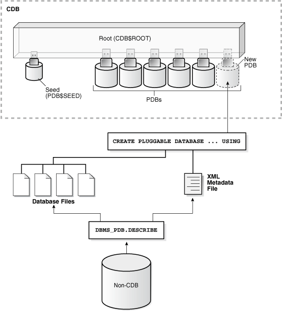

#oracle

为了将以前的旧库整合起来，需要将旧库都插入到12c数据库当中统一管理

这篇文章主要介绍如何将原有的11g数据库作为pdb插到已有的12c数据库当中去

现有环境

|SID|版本|CDB|
| --------| ----------| -----|
|Test|11.2.0.4|NO|
|Ora12c|12.2.0.1|YES|

## 升级11g数据库

参考[通过DBUA升级11g到12.2](https://www.xbdba.com/2018/12/11/oracle-11g-dbua-upgrade-12cr2/ "通过DBUA升级11g到12.2")，不过多介绍

从NO-CDB插入到CDB示意图



## 确认源库信息

```bash
sys@TEST> show parameter db_name

PARAMETER_NAME                                               TYPE                              VALUE
------------------------------------------------------------ --------------------------------- -----------------------------------------------
db_name                                                      string                            test
sys@TEST> select name, cdb from v$database;

NAME                        CDB
--------------------------- ---------
TEST                        NO

sys@TEST> select instance_name from v$instance;

INSTANCE_NAME
------------------------------------------------
test
```

## DBMS_PDB包

这个包的作用主要是用于生成源数据库的元数据信息，通过它允许一个非CDB的库插入到一个已经存在的CDB当中

首先要保持源库的干净，没有数据处于恢复状态等等情况，可以正常关闭然后启动到read only状态

```bash
sys@TEST> shutdown immediate
Database closed.
Database dismounted.
ORACLE instance shut down.
sys@TEST> startup open read only
```

查看数据文件位置，后面`FILE_NAME_CONVERT`​会用到

```bash
sys@TEST> select file_name from dba_data_files;

FILE_NAME
--------------------------------------------------------------
/u01/app/oracle/oradata/test/system01.dbf
/u01/app/oracle/oradata/test/sysaux01.dbf
/u01/app/oracle/oradata/test/undotbs01.dbf
/u01/app/oracle/oradata/test/users01.dbf
```

执行`DBMS_PDB.DESCRIBE`​,生成一个XML文件，其实就跟拔下一个PDB的操作一样

```bash
BEGIN
  DBMS_PDB.DESCRIBE(
    pdb_descr_file => '/u01/app/oracle/oradata/test/test.xml');
END;
/
```

正常关闭源库

```bash
sys@TEST> shutdown immediate
Database closed.
Database dismounted.
ORACLE instance shut down.
```

连到目标库上

```bash
sys@ORA12C> select name, CDB from v$database;

NAME                        CDB
--------------------------- ---------
ORA12C                      YES
```

检查源库是否能被插入到目标库

```bash
set serveroutput on
DECLARE
   compatible BOOLEAN := FALSE;
BEGIN   
   compatible := DBMS_PDB.CHECK_PLUG_COMPATIBILITY(
        pdb_descr_file => '/u01/app/oracle/oradata/test/test.xml');
   if compatible then
      DBMS_OUTPUT.PUT_LINE('YES');
   else DBMS_OUTPUT.PUT_LINE('NO');
   end if;
END;
/
```

如果返回`NO`​,则需要检查原因

```bash
col cause for a30
col name for a10
col message for a80
select name,cause,type,message,status from PDB_PLUG_IN_VIOLATIONS where name='TEST';
```

用刚才生成的XML文件创建一个新的PDB

```bash
CREATE PLUGGABLE DATABASE test USING '/u01/app/oracle/oradata/test/test.xml'
  COPY
  FILE_NAME_CONVERT = ('/u01/app/oracle/oradata/test/', '/u01/app/oracle/oradata/ora12c/test/');

Pluggable database created.
```

切换到新建的PDB，通过`$ORACLE_HOME/rdbms/admin/noncdb_to_pdb.sql`​语句清除一些PDB不需要的信息

```bash
ALTER SESSION SET CONTAINER=test;

@?/rdbms/admin/noncdb_to_pdb.sql
```

启动pdb

```bash
sys@ORA12C> alter session set container=test;

Session altered.

sys@ORA12C> alter pluggable database open;

Pluggable database altered.

sys@ORA12C> select name,open_mode from v$PDBS;

NAME       OPEN_MODE
---------- ------------------------------
TEST       READ WRITE
```

至此，原有的11g库正式转成了12c的一个pdb。
