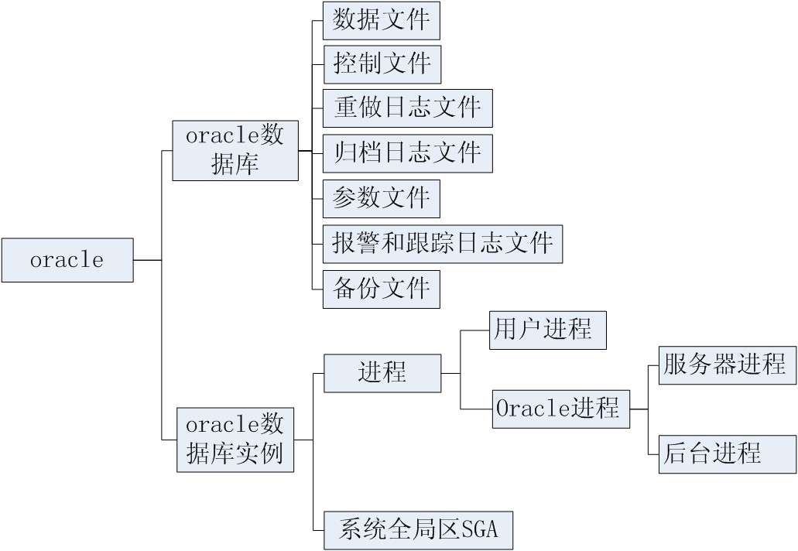

#oracle
Oracle数据库的体系结构包括四个方面：数据库的物理结构、逻辑结构、内存结构及进程。
## 物理结构

物理数据库结构是由构成数据库的操作系统文件所决定，Oracle数据库文件包括：

1. **数据文件（Data File）**   
    数据文件用来存储数据库中的全部数据，例如数据库表中的数据和索引数据.通常以为 *.dbf格式，例如:userCIMS.dbf 。*
2. ***日志文件（Redo Log File）***    
    *日志文件用于记录数据库所做的全部变更（如增加、删除、修改）、以便在系统发生故障时，用它对数据库进行恢复。名字通常为Log*.dbf格式，如：Log1CIMS.dbf,Log2CIMS.dbf 。
3. **控制文件（Control File）**   
    每个Oracle数据库都有相应的控制文件，它们是较小的二进制文件，用于记录数据库的物理结构，如：数据库名、数据库的数据文件和日志文件的名字和位置等信息。用于打开、存取数据库。名字通常为Ctrl*ctl 格式，如Ctrl1CIMS.ctl。*
4. ***配置文件***​*配置文件记录Oracle数据库运行时的一些重要参数，如：数据块的大小，内存结构的配置等。名字通常为init*.ora 格式，如：initCIMS.ora 。

‍

## 逻辑结构

Oracle数据库的逻辑结构描述了数据库从逻辑上如何来存储数据库中的数据。逻辑结构包括表空间、段、区、数据块和模式对象。数据库的逻辑结构将支配一个数据库如何使用系统的物理空间.模式对象及其之间的联系则描述了关系数据库之间的设计. 

一个数据库从逻辑上说是由一个或多个表空间所组成，表空间是数据库中物理编组的数据仓库，每一个表空间是由段(segment)组成，一个段是由一组区(extent)所组成，一个区是由一组连续的数据库块(database block)组成，而一个数据库块对应硬盘上的一个或多个物理块。一个表空间存放一个或多个数据库的物理文件（即数据文件）.一个数据库中的数据被逻辑地存储在表空间上。　　

1. **表空间（tablespace）**   
    Oracle数据库被划分为一个或多个称为表空间的逻辑结构，它包括两类表空间，System表空间和非System表空间，其中，System表空间是安装数据库时自动建立的，它包含数据库的全部数据字典，存储过程、包、函数和触发器的定义以及系统回滚段。除此之外，还能包含用户数据。  
    一个表空间包含许多段，每个段有一些可以不连续的区组成，每个区由一组连续的数据块组成，数据块是数据库进行操作的最小单位。　　  
    每个表空间对应一个或多个数据文件，每个数据文件只能属于一个表空间。
2. **段（segment）**   
    段是一个或多个不连续的区的集合，它包括一个表空间内特定逻辑结构的所有数据，段不能跨表空间存放。Oracle数据库包括数据段、索引段、临时段、回滚段等。
3. **区（extent）**   
    区是由一组连续的数据块所组成的数据库存储空间分配的逻辑单位。
4. **数据库块（database block）**   
    数据库块也称逻辑块或ORACLE块，它对应磁盘上一个或多个物理块，它的大小由初始化参数db-block-size（在文件init.ora中）决定，典型的大小是2k。Pckfree 和pctused 两个参数用来优化数据块空间的使用。
5. **模式对象（schema object）**   
    Oracle数据库的模式对象包括表、视图、序列、同意词、索引、触发器、存储.过程等。

‍

## 内存结构

SGA是Oracle为一个实例分配的一组共享内存缓冲区，它包含该实例的数据和控制信息。SGA在实例启动时被自动分配，当实例关闭时被收回。数据库的所有数据操作都要通过SGA来进行。SGA中内存根据存放信息的不同，可以分为如下几个区域：

1. Buffer Cache：存放数据库中数据库块的拷贝。  
    它是由一组缓冲块所组成，这些缓冲块为所有与该实例相链接的用户进程所共享。缓冲块的数目由初始化参数DB_BLOCK_BUFFERS确定，缓冲块的大小由初始化参数DB_BLOCK_SIZE确定。大的数据块可提高查询速度。它由DBWR操作。
2. 日志缓冲区Redo Log Buffer：存放数据操作的更改信息。  
    它们以日志项（redo entry）的形式存放在日志缓冲区中。当需要进行数据库恢复时，日志项用于重构或回滚对数据库所做的变更。日志缓冲区的大小由初始化参数LOG_BUFFER确定。大的日志缓冲区可减少日志文件I/O的次数。后台进程LGWR将日志缓冲区中的信息写入磁盘的日志文件中，可启动ARCH后台进程进行日志信息归档。
3. 共享池Shared Pool：包含用来处理的SQL语句信息。  
    它包含共享SQL区和数据字典存储区。共享SQL区包含执行特定的SQL语句所用的信息。数据字典区用于存放数据字典，它为所有用户进程所共享。
4. Cursors：一些内存指针，执行待处理的SQL语句
5. 其他信息区：除了上述几个信息区外，还包括一些进程之间的通讯信息（如封锁信息）；在多线索服务器配置下，还有一些程序全局区的信息，请求队列和响应队列等。

‍

## 进程

​

oracle中的进程共分为三类：用户进程、服务进程、后台进程。其中后台进程伴随实例的启动而启动，他们主要是维护数据库的稳定，相当于一个企业中的管理者及内部服务人员。他们并不会直接给用户提供服务。

‍

***每一个运行着的 ORACLE 数据库都对应一个 ORACLE 实例，当一个数据库在数据库服务器(不考虑机器的类型)上启动的时候，ORACLE 分配一块叫做 System Global Area (SGA) 的内存区域并启动一个或者多个ORACLE 进程。SGA 和 ORACLE 进程合起来称作 ORACLE 实例。*** 

‍

‍

### 用户进程

‍

### 服务器进程

‍

### 后台进程

1. DBWn (n代表数字1..n，表示可能有几个DBW在运行) )--<u>数据写入 database write</u>  
    作用:把SGA中被修改的数据同步到磁盘文件中。保证Buffer Cache中有足够的空闲数据块数量。  
    触发条件: 1、检查点  
    2、一个服务进程在设定的时间内没有找到空闲块  
    3、每三秒自动唤醒一次。  
    设置:DB_WRITER_PROCESS用来定义DBWn进程数量。(commit命令只是把记录修改写入日志文件，不是把修改后的数据写入数据文件)
2. LGWR --<u>日志文件写入 log write</u>  
       作用:把log buffer中的日志内容写入联机的日志文件中，释放log用户buffer空间。  
       触发条件:1、用户发出commit命令。(在oracle中称为快速提交机制(fast commit)):把redo log buffer中的记录写入日志文件，写入一条提交的记录  
                2、三秒定时唤醒。  
                3、log buffer超过1/3，或日志数量超过1M。  
                4、DBWR进程触发:DBWn视图将脏数据块写入磁盘先检测他的相关redo记录是否写入联机日志文件，如果没有就通知LGWR进程。在oracle中成为提前写机制(write ahead):redo记录先于数据记录被写入磁盘
3. CKPT --<u>检查点事件 checkpoint</u>  
       作用:维护数据库一致性状态。检测点时刻数据文件与SGA中的内容一致，这不是一个单独的进程，要和前两个进程一起工作呦。DBWR写入脏数据，同时触发LGWR进程。  
          CKPT更新控制文件中的检查点记录。  
       触发条件:日志切换(log switch)会触发检查点。
4. PMON  --<u>进程监控 process monitor</u>  
       作用:1、发现用户进程异常终止，并进行清理。释放占用资源。(清理异常终止用户使用的锁)  
            2、向监听程序动态的注册实例。  
       触发条件:定时被唤醒，其他进程也会主动唤醒它。
5. SMON --<u>系统监控 system monitor</u>  
       作用:1、负责实例恢复，前滚(Roll Forward)恢复到实例关闭的状态，使用最后一次检查点后的日志进程重做。这时包括提交和未提交的事务。打开数据库，进行回滚(Roll Back):回滚未提交的事务。(oracle承诺commit之后数据不会丢失，现在我们可以大致的了解是如何实现这个承诺，以及在数据的安全性和数据库性能之间的平衡选择。)  
            2、负责清理临时段，以释放空间  
       触发条件:定期被唤醒或者被其他事务主动唤醒。
6. ARCn --<u>归档操作 archive</u>  
       作用:发生日志切换时把写满的联机日志文件拷贝到归档目录中。  
       触发条件:日志切换时被LGWR唤醒。  
       设置:LOG_ARCHIVE_MAX_PROCESSES可以设置oracle启动的时候ARCn的个数。
7. MMON --<u>AWR主要的进程 manageability monitor</u>  
       作用:1、收集AWR必须的统计数据，把统计数据写入磁盘。10g中保存在SYSAUX表空间中。  
            2、生成server--generated报警  
       每小时把shared pool中的统计信息写入磁盘，或者shared pool占用超过15%。
8. MMNL --轻量级的MMON manageability monitor light
9. MMAN --<u>自动内容管理 memory manager</u>  
       作用:每分钟都检查AWR性能信息，并根据这些信息来决定SGA组件最佳分布。  
       设置:STATISTICS_LEVEL:统计级别  
            SGA_TARGET:SGA总大小
10. CJQ0 --<u>数据库定时任务 job queue coordinator</u>
11. RVWR --recover writer  
        作用:为flashback database提供日志记录。把数据块的前镜像写入日志。
12. CTWR --change tarcking writer  
        作用:跟踪数据块的变化，把数据块地址记录到 change_tracking file文件中。RMAN的增量备份将使用这个文件来确定那些数据块发生了变化，并进行备份。

以上是oracle中比较常见的后台进程，不是所有的进程。其中DBWn，ARCn可以设置数据库启动时的数量。这些进程在系统中可以不止一个。

‍
