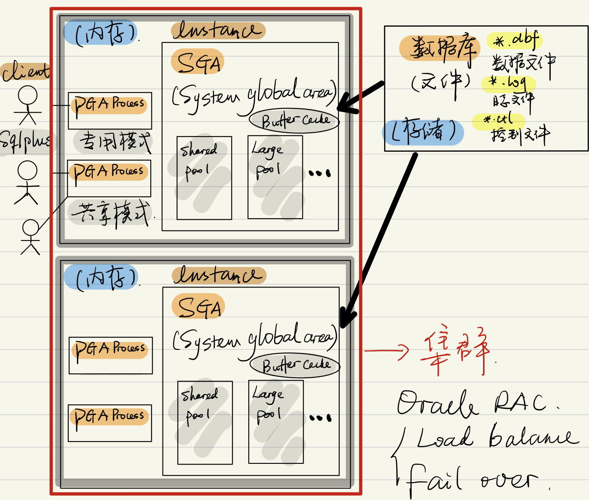
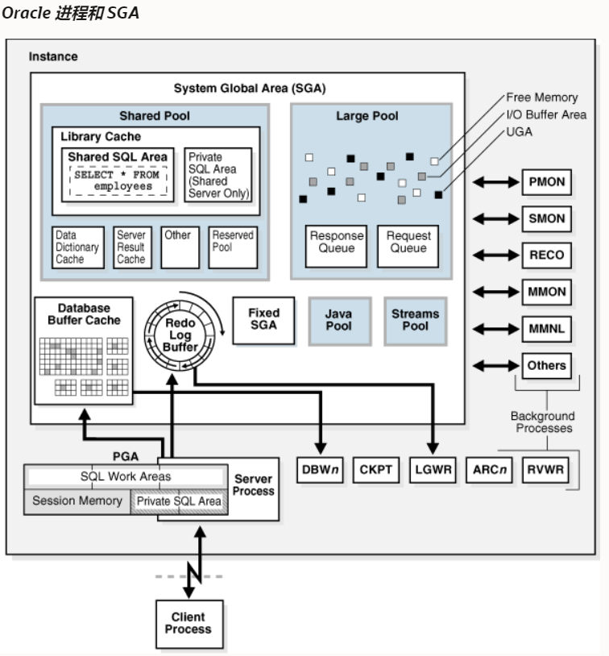
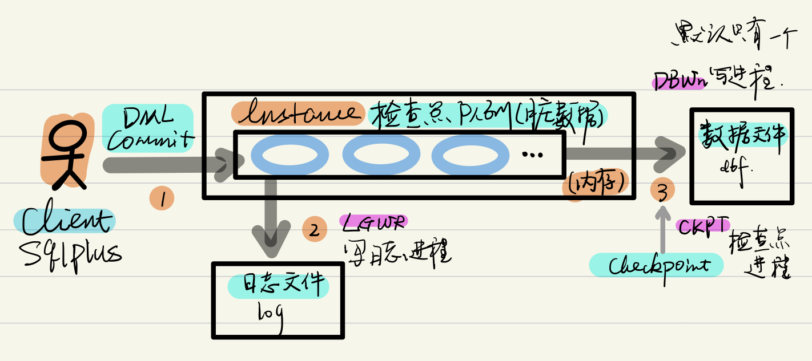
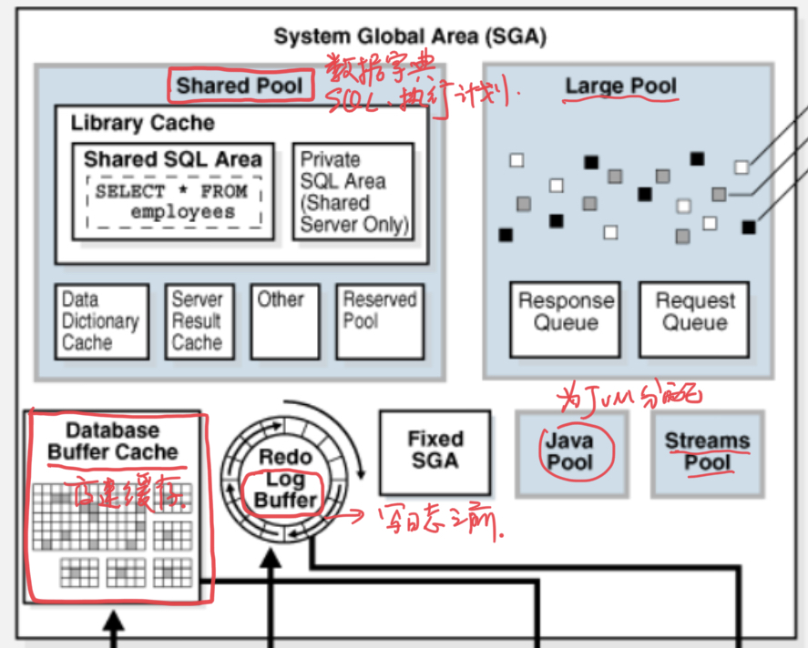
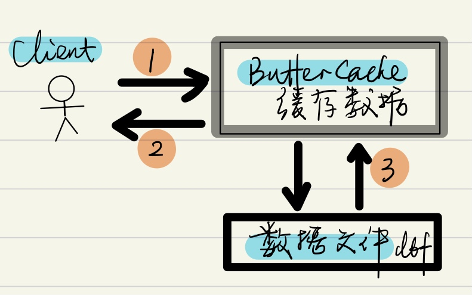

#oracle
1. 什么是关系型数据库？ 基于关系模型的数据库，即基于二维表（行、列）存储数据的库。
2. 什么是数据库? 数据库是存储介质上的文件—>物理存储结构
3. 什么是实例instance？ 内存中运行的数据库进程，包括读入内容的数据库文件； 数据库和实例可用是1:1，也可用是1:N的关系

​

## 架构-存储结构



### 物理存储结构

```bash
#实验的数据目录和文件
[root@oracle-12 prod]# pwd
/oracle_data/prod
[root@oracle-12 prod]# ll
total 2428380
-rw-r----- 1 oracle oinstall   10600448 May 17 16:50 control01.ctl
-rw-r----- 1 oracle oinstall   10600448 May 17 16:50 control02.ctl
-rw-r----- 1 oracle oinstall  104865792 May 17 15:05 lmtbsq1.dbf
-rw-r----- 1 oracle oinstall  209715712 May 17 16:50 redo01.log
-rw-r----- 1 oracle oinstall  209715712 May 17 00:15 redo02.log
-rw-r----- 1 oracle oinstall  209715712 May 17 15:00 redo03.log
-rw-r----- 1 oracle oinstall  576724992 May 17 16:50 sysaux01.dbf
-rw-r----- 1 oracle oinstall 1073750016 May 17 16:46 system01.dbf
-rw-r----- 1 oracle oinstall   33562624 May 17 10:49 temp01.dbf
-rw-r----- 1 oracle oinstall   73408512 May 17 16:46 undotbs01.dbf
-rw-r----- 1 oracle oinstall    5251072 May 17 15:05 users01.dbf
```

- 数据文件（\*.DBF） 数据文件是一个二进制文件，是用于保存用户应用程序数据和Oracle系统内部数据的文件，这些文件在操作系统中就是普通的操作系统文件。 Oracle在创建表空间的同时会创建数据文件。

  必须存在的数据文件：

  - system01.dbf 系统的数据文件
  - sysaux01.dbf 系统的辅助数据文件，数据字典，AWR信息（性能诊断和调优使用）
  - undotbs01.dbf 还原历史数据的记录文件
  - temp.dbf 临时数据文件，排序等

  可选数据文件：

  - 用户数据文件lmtbsq1.dbf
- 日志文件（\*.LOG） 日志文件在Oracle数据库中分为重做日志（Redo Log File）文件和归档日志文件两种。重做日志文件是Oracle数据库正常运行不可缺少的文件。重做日志文件主要记录了数据库操作过程。用于备份和还原数据库，以达到数据库的最新状态。

  Oracle推荐： - 使用日志组来管理日志文件 - 每组至少两个成员 - 写日志以日志组为单位 - 默认有三个日志组

  ```bash
  #默认情况下，使用非归档模式
  SYS@prod>archive log list;
  Database log mode              No Archive Mode
  Automatic archival             Disabled
  Archive destination            /u01/app/oracle/product/db/dbs/arch
  Oldest online log sequence     5
  Current log sequence           7


  #如果使用归档模式，在覆盖组1会进行归档拷贝
  #查看默认情况下log表：
  SYS@prod>select group#,members from v$log;

      GROUP#    MEMBERS
  ---------- ----------
           1          1
           2          1
           3          1

  #现在的log组有三个，每组一个成员
  ```

  1. 客户端，如sqlplus 执行DML commit
  2. 将事务写入日志文件，如果日志写入成功，就算客户端的commit操作成功。
  3. 数据还在检查点队列，尚未写入存储中的数据文件
  4. 如果此时内存发生崩溃等情况，可用通过log文件恢复丢失的数据，称作实例恢复
  5. 当触发了检查点Checkpoint的时候，会以最高优先级唤醒数据库的写进程。来写脏数据到数据文件
    什么是检查点 参考：[Oracle 检查点](Oracle%20检查点.md)

- 控制文件（.CTL） 控制文件是一个二进制文件，它主要记录数据库的名称、数据库的数据文件存放位置等信息。一个控制文件只能属于一个数据库。 如果控制文件丢失，这数据库就无法操作。

  - 数据文件和Log文件的位置
  - 在启动过程中，系统会找tcl文件定位数据文件和log文件
  - rman备份的元信息也存放在ctl文件中
  - Oracle推荐多路复用机制—多存几份，应当放到不同的物理存储位置

  ```bash
  SQL> desc v$controlfile
  Name                  Type          Nullable Default Comments
  --------------------- ------------- -------- ------- --------
  STATUS                VARCHAR2(7)   Y                       
  NAME                  VARCHAR2(513) Y                       
  IS_RECOVERY_DEST_FILE VARCHAR2(3)   Y                       
  BLOCK_SIZE            NUMBER        Y                       
  FILE_SIZE_BLKS        NUMBER        Y                       
  CON_ID                NUMBER        Y                       

  SQL> select name from v$controlfile;
  NAME
  --------------------------------------------------------------------------------
  /oracle_data/prod/control01.ctl
  /oracle_data/prod/control02.ctl
  ```

### 逻辑存储结构

通过逻辑存储结构管理物理存储结构


1. 数据库
2. 表空间，重点关注[表空间](https://www.notion.so/ae1c306764744032b0f7d8b4679605fb)
3. 段Segment
4. 区Extent
5. 数据块 8K default

```bash
SQL> show parameter db_block_size;
NAME                                 TYPE        VALUE
------------------------------------ ----------- ------------------------------
db_block_size                        integer     8192
```

- 一个block - 8k，数据仓库 16k
- extent 若干连续的bolck

## 架构-进程结构

Oracle 进程是运行 Oracle 数据库代码的执行单元。在多线程体系结构中，Oracle 进程可以是操作系统进程，也可以是操作系统进程中的线程。Oracle 进程包括以下子类型：

- 后台进程从数据库实例开始，执行维护任务，如执行实例恢复、清理进程、将重做缓冲区写入磁盘等。
- 服务器进程根据客户端请求执行工作（1-3）。

​

```bash
[oracle@oracle-12 prod]$ ps -ef |grep ora_ |grep -v grep
**oracle   21078     1  0 May15 ?        00:00:08 ora_pmon_prod**
oracle   21081     1  0 May15 ?        00:00:02 ora_clmn_prod
oracle   21083     1  0 May15 ?        00:00:16 ora_psp0_prod
oracle   21085     1  0 May15 ?        00:14:28 ora_vktm_prod
oracle   21110     1  0 May15 ?        00:00:04 ora_svcb_prod
oracle   21112     1  0 May15 ?        00:00:13 ora_pman_prod
oracle   21114     1  0 May15 ?        00:03:08 ora_dia0_prod
**oracle   21116     1  0 May15 ?        00:00:11 ora_dbw0_prod
oracle   21118     1  0 May15 ?        00:00:05 ora_lgwr_prod**
**oracle   21120     1  0 May15 ?        00:00:31 ora_ckpt_prod**
oracle   21122     1  0 May15 ?        00:00:03 ora_lg00_prod
**oracle   21124     1  0 May15 ?        00:00:02 ora_smon_prod**
oracle   21126     1  0 May15 ?        00:00:01 ora_lg01_prod
oracle   21128     1  0 May15 ?        00:00:08 ora_smco_prod
oracle   21130     1  0 May15 ?        00:00:01 ora_reco_prod
...
oracle   21430     1  0 May15 ?        00:00:03 ora_p01b_prod
oracle   21521     1  0 May15 ?        00:00:01 ora_qm02_prod
oracle   21525     1  0 May15 ?        00:00:01 ora_q002_prod
oracle   21527     1  0 May15 ?        00:00:01 ora_q003_prod
oracle   23523     1  0 22:00 ?        00:00:00 ora_w007_prod
```

1. **ora_dbw0_prod 写进程，默认只有一个**

    1. 参数：

    ```bash
    SQL> show parameter writer
    NAME                                 TYPE        VALUE
    ------------------------------------ ----------- ------------------------------
    db_writer_processes                  integer     1
    ```

    原则：写进程的个数一般不超过CPU的核数
2. **ora_lgwr_prod 写日志进程**

    1. 日志组为单位
    2. 看前面的日志文件内容
3. **ora_ckpt_prod Checkpoint进程**

    1. 完全检查点
    2. 增量检查点
4. **ora_smon_prod 系统的监控进程 System Monitor**

    1. Oracle的核心进程
    2. 关闭Oracle最快的方式：kill -9 _smon进程号_
5. **ora_pmon_prod Process Monitor**

    1. 当系统出现错误的时候，负责清理现场
6. 其他

[Database Concepts](https://docs.oracle.com/en/database/oracle/oracle-database/12.2/cncpt/process-architecture.html#GUID-2E691FEA-9027-47E4-A3D0-1B235BBA295A)

## 架构-内存结构

### SGA System Global Area

```bash
SQL> show parameter sga
NAME                                 TYPE        VALUE
------------------------------------ ----------- ------------------------------
allow_group_access_to_sga            boolean     FALSE
lock_sga                             boolean     FALSE
pre_page_sga                         boolean     TRUE
sga_max_size                         big integer 41216M
sga_min_size                         big integer 0
sga_target                           big integer 41216M
unified_audit_sga_queue_size         integer     1048576

SYS@prod>show sga;

Total System Global Area 4.3218E+10 bytes
Fixed Size                 15710000 bytes
Variable Size            5637146832 bytes
Database Buffers         3.7447E+10 bytes
Redo Buffers              118505472 bytes
```

sga\_target big integer 41216M，这是在数据库配置的时候设定的值；

默认情况，sga\_target 为 0，表示sga的值有系统自动指定



#### SGA-BufferCache



1. 客户端在buffercache中查询数据
2. BufferCache如果有数据，称为一次命中
3. 如果没有数据，读取数据文件＊.dbf直接返回数据

‍

查看buffercache大小,0表示有Oracle自动指定

```bash
SQL> show parameter cache_size
NAME                                 TYPE        VALUE
------------------------------------ ----------- ------------------------------
client_result_cache_size             big integer 0
data_transfer_cache_size             big integer 0
db_16k_cache_size                    big integer 0
db_2k_cache_size                     big integer 0
db_32k_cache_size                    big integer 0
db_4k_cache_size                     big integer 0
db_8k_cache_size                     big integer 0
**db_cache_size                        big integer 0**
db_flash_cache_size                  big integer 0
db_keep_cache_size                   big integer 0
db_recycle_cache_size                big integer 0
```

#### SGA-Shared Pool

数据字典、SQL、执行计划，

```bash
SQL> show parameter shared_pool
NAME                                 TYPE        VALUE
------------------------------------ ----------- ------------------------------
shared_pool_reserved_size            big integer 224M
shared_pool_size                     big integer 0
```

#### SGA-log Buffer

有明确的值

```bash
SQL> show parameter log_buffer
NAME                                 TYPE        VALUE
------------------------------------ ----------- ------------------------------
log_buffer                           big integer 112120K
```

#### 其他pool

```bash
SQL> show parameter java_pool
NAME                                 TYPE        VALUE
------------------------------------ ----------- ------------------------------
java_pool_size                       big integer 0

SQL> show parameter large_pool
NAME                                 TYPE        VALUE
------------------------------------ ----------- ------------------------------
large_pool_size                      big integer 0

SQL> show parameter streams_pool
NAME                                 TYPE        VALUE
------------------------------------ ----------- ------------------------------
streams_pool_size                    big integer 0
```

‍

### PGA：Process Global Area

```bash
SQL> show parameter pga
NAME                                 TYPE        VALUE
------------------------------------ ----------- ------------------------------
pga_aggregate_limit                  big integer 20564M
pga_aggregate_target                 big integer 10282M

#默认情况，sga_target  为 0
```

11g以后提供2个功能。

- AMM，Automatic memory management。设置一个总内存，让Oracle自动分配SGA和PGA。memory\_target = SGA + n\*PGA

```bash
SQL> show parameter memory
NAME                                 TYPE        VALUE
------------------------------------ ----------- ------------------------------
hi_shared_memory_address             integer     0
inmemory_adg_enabled                 boolean     TRUE
inmemory_clause_default              string    
inmemory_expressions_usage           string      ENABLE
inmemory_force                       string      DEFAULT
inmemory_max_populate_servers        integer     0
inmemory_query                       string      ENABLE
inmemory_size                        big integer 0
inmemory_trickle_repopulate_servers_percent integer 1
inmemory_virtual_columns             string      MANUAL
memory_max_target                    big integer 0
memory_target                        big integer 0
optimizer_inmemory_aware             boolean     TRUE
shared_memory_address                integer     0
```

- ASMM（Automatic Shared Memory Management）自动分配SGA内部的各部分内存使用。
