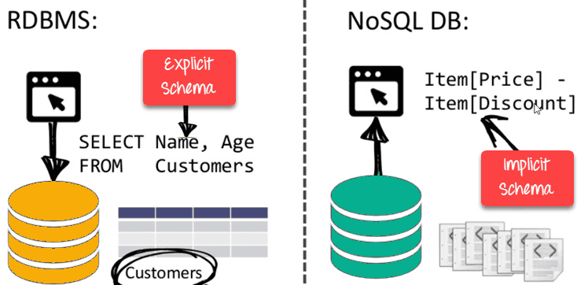
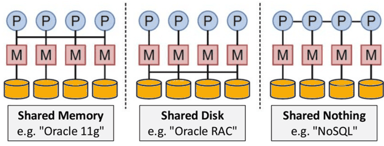

# 关系型数据库

## 什么是关系数据库 (RDBMS)?

关系数据库是一种用于存储相互关联的数据点并提供数据点访问的数据库。[它](https://www.oracle.com/cn/database/what-is-database/)采用关系模型，直接、直观地在表中展示数据。在关系数据库中，表中的每一行都代表一条记录，每条记录都具有一个唯一的 ID（又被称为键），而表中的列则用于存储数据的属性 — 每条记录的每一个属性通常都有一个值。籍此，用户可以轻松在数据点之间建立关联。

## 关系数据库示例

通过以下简单的关系数据库示例，您可以了解小企业如何使用两个表来处理产品订单。
第一个表是客户信息表，其中每一条记录都包含一位客户的姓名、地址、货运和账单信息、电话号码以及其他联系信息。信息的每一位（每个属性）则位于自己的列中，每一行（即每一条记录）都将由数据库分配一个唯一的 ID（键）。
第二个表是客户订单表，其中每一条记录都包含下单的客户的 ID、所订购的产品、数量、大小和颜色等，但不包含客户的姓名和联系信息。

这两个表只有一个共同点：标识列（key）。基于这一公共列，关系数据库可以在这两个表之间创建关系。随后，当企业的订单处理应用向数据库提交订单时，数据库将转到客户订单表，提取关于产品订单的正确信息，然后使用该表中的客户 ID 在客户信息表中查找客户的帐单和货运信息。这样，仓库就可以正确提取产品，客户就可以及时收到货物，企业就可以受到货款。

## 关系数据库的结构

在关系模型中，逻辑数据结构（数据表、视图和索引）与物理存储结构是分离的。这种分离意味着，数据库管理员可以在不影响基于逻辑结构的数据的访问的前提下管理物理数据存储。例如，当对数据库文件重命名时，文件中表的名称不会发生改变。

这一特点同样也适用于数据库操作，一种经过明确定义，可驱使应用对数据库中数据和结构进行操作的操作。逻辑操作允许应用指定其所需的内容，物理操作则可确定如何访问该数据然后执行任务。

为了确保数据始终准确、可访问，关系数据库应当遵循特定的完整性规则，例如“禁止在表中复制行，避免错误信息进入数据库”。

## 关系模型

在数据库的早期年代，每个应用都按照自己独特的结构存储数据。为此，开发人员需要深入了解数据结构才能找到和使用所需数据。大多数时候，这些数据结构都效率低下、难以维护、难以优化，无法支撑和实现良好的应用性能。关系数据库模型就是为解决数据结构随意、混乱的问题而出现的。

关系数据模型提供了标准化的数据展现和查询方法，可确保所有应用都能轻松访问和使用所需数据。事实上，开发人员从一开始就意识到了关系数据库模型的主要优势在于表。利用表，他们可以直观、高效、灵活地存储和访问结构化信息。

此外，随着开发人员开始使用结构化查询语言 (SQL) 在数据库中写入和查询数据，关系模型的另一项优势也逐渐开始显现。多年以来，SQL  被广泛用作数据库查询语言。它以关系代数为基础，提供了一种内部一致的数学语言，可以更轻松地提升所有数据库查询的性能。相比之下，其他方式都需要开发人员对查询进行定义。

## 关系数据库管理系统的优势

如今，各种类型和规模的企业都使用简单而强大的关系模型来满足各种信息需求，使用关系数据库执行库存跟踪、电子商务事务处理、大量的任务关键型客户信息管理等工作。而这一切都源于关系数据库能够帮助企业安全、基于规则、一致地管理信息，出色满足所有数据点相互关联的信息的需求。

自 20 世纪 70 年代出现以来，关系模型凭借独特的优势一路发展，成为了今天市场接受最广泛的数据库模型。

## 关系模型和数据一致性

关系模型可充分保证各个应用和数据库副本（又被称为实例）之间数据的一致性。例如，当一名客户在 ATM  上存钱结束后，在手机上查看账户余额时，他希望看到这笔存款立即出现在最新的账户余额中。在这一方面，关系数据库能够确保数据库的多个实例中的数据始终一致，表现非常出色。

相比之下，其他类型的数据库很难在面对大量数据时提供这种及时的一致性。即使是一些最新的数据库（例如  NoSQL），也只能提供“最终一致性”。换言之，在扩展数据库或多个用户同时访问同一数据时，数据需要一些时间才能更新至“最新状态”。最终一致性在某些使用场景中是可接受的，例如产品目录清单维护。但对于关键业务操作（例如购物车交易），关系数据库仍然是当前的黄金标准。

## 提交和原子性

关系数据库可非常细粒度地处理业务规则和策略，并具有严格的提交策略（即永久更改数据库）。例如，某库存数据库跟踪 3  个始终需协同使用的部件，当从库存中提取某一个部件时，也必须同时提取另外两个部件；如果 3 个部件中的任意一个不可用，则 3  个部件都无法提取。换言之，在数据库做出任何提交操作前，所有 3 个部件都必须处于可用状态才能提取。而在明确可以提交所有 3  个部件前，关系数据库不会就任何一个部件执行提交。这种多方面提交功能被称为原子性。对于确保数据库中数据准确以及符合业务规则、法规和政策，原子性至为关键。

## ACID 属性和 RDBMS

原子性、一致性、隔离性和持久性是定义关系数据库事务的四个关键属性，常缩写为 ACID。

- **原子性**定义构成完整数据库事务的所有要素。
- **一致性**确保事务结束后数据点处于正确状态。
- **隔离性**指一项事务在被提交之前不会对其他事务产生影响，可避免混淆。
- **持久性**可确保所有对数据的修改在事务提交后都是永久的。

## 存储过程和关系数据库

许多数据访问都涉及重复性操作。例如，即使是从数据表中获取信息这种简单查询，也可能需要重复数百或数千次才能获得所需结果。通常来说，这类访问需要特定类型的代码予以实现。然而，开发人员并不希望在每个新应用中都为此编写新的代码。对此，关系数据库支持存储过程，允许开发人员通过简单的应用调用来访问特定的代码块。例如，开发人员可通过一个存储过程，面向多个应用的用户实现一致的记录标记。此外，存储过程还可以帮助开发人员确保以特定方式在应用中实现特定数据函数。

## 数据库锁定和并发性

当多个用户或应用同时尝试更改同一数据时，数据库中可能会发生冲突。对此，锁定和并发技术可在保证数据完整性的同时减少冲突的发生。

数据库锁定可防止其他用户和应用在数据更新期间访问数据。在某些数据库中，锁定作用于整个表，可能对应用性能产生负面影响。而在另外一些数据库（例如 Oracle 关系数据库）中，锁定仅限于特定记录，换言之表中其他未锁定的记录仍然可用，这有助于实现更强的应用性能。

当多个用户或应用同时在同一数据库中调用查询时，并发性将执行活动管理，根据定义的数据控制策略确保用户和应用正确访问。

‍

# NoSQL数据库

## 什么是 NoSQL 数据库？

通常，“NoSQL 数据库”是指非关系型数据库。不管它是“non SQL”的缩写，还是“not only SQL”的缩写，大多数人都同意，NoSQL 数据库是以关系表之外的格式存储数据的。NoSQL 数据库之所以如此大受欢迎，是因为它们为用户提供了灵活的数据存储模式。

## NoSQL的功能

- **非关系**

  - NoSQL数据库从不遵循关系模型
  - 切勿为tables 提供固定的固定列记录
  - 使用自包含的聚合或BLOB
  - 不需要对象关系映射和数据规范化
  - 没有复杂的功能，例如查询语言，查询计划者，
  - 参照完整性联接，ACID
- **动态架构**

  - NoSQL数据库是无模式的或具有宽松模式的数据库
  - 不需要对数据架构进行任何形式的定义
  - 提供同一域中的异构数据结

- **简单的API**

  - 提供易于使用的界面，用于存储和查询提供的数据
  - API允许进行低级数据操作和选择方法
  - 基于文本的协议，通常与带有JSON的HTTP REST一起使用
  - 多数不使用基于标准的查询语言
  - 支持Web的数据库作为面向互联网的服务运行
- **分布式**

  - 可以以分布式方式执行多个NoSQL数据库
  - 提供自动缩放和故障转移功能
  - 通常可牺牲ACID概念来实现可伸缩性和吞吐量
  - 分布式节点之间几乎没有同步复制，多为异步多主复制，对等，HDFS复制
  - 仅提供最终的一致性
  - 无共享架构。这样可以减少协调并提高分布。

## 为什么使用MongoDB

以下是一些为什么应该开始使用MongoDB的原因

- **面向文档的**–由于MongoDB是NoSQL类型的数据库，它不是以关系类型的格式存储数据，而是将数据存储在文档中。这使得MongoDB非常灵活，可以适应实际的业务环境和需求。
- **临时查询**-MongoDB支持按字段，范围查询和正则表达式搜索。可以查询返回文档中的特定字段。
- **索引**-可以创建索引以提高MongoDB中的搜索性能。MongoDB文档中的任何字段都可以建立索引。
- **复制**-MongoDB可以提供副本集的高可用性。副本集由两个或多个mongo数据库实例组成。每个副本集成员可以随时充当主副本或辅助副本的角色。主副本是与客户端交互并执行所有读/写操作的主服务器。辅助副本使用内置复制维护主数据的副本。当主副本发生故障时，副本集将自动切换到辅助副本，然后它将成为主服务器。
- **负载平衡**-MongoDB使用分片的概念，通过在多个MongoDB实例之间拆分数据来水平扩展。MongoDB可以在多台服务器上运行，以平衡负载或复制数据，以便在硬件出现故障时保持系统正常运行。
