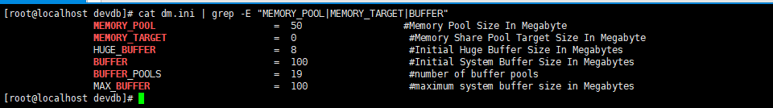
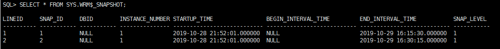
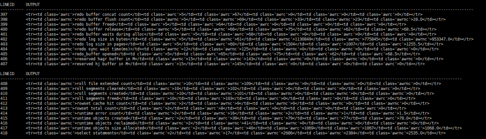
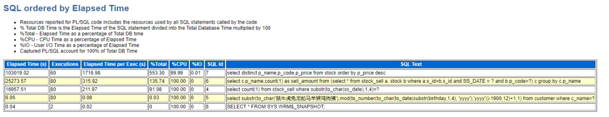

‍

## 参数优化

查看 dm 配置文件  
​`cd /dm7/dmdbms/devdb cat dm.ini | grep -E "MEMORY_POOL|MEMORY_TARGET|BUFFER"`​



发现数据库参数配置为安装时候的默认配置，参数不合理，需要优化参数配置。

备份原配置文件

​`cp dm.ini dm.ini.bak`​

修改配置 修改如下几个关键参数，根据之前文章数据库优化-实例优化中的表格进行优化（ps：当前数据库内存 2G）

|参数|优化建议|优化后的值，单位 M|
| ---------------| ------------------| --------------------|
|MEMORY_POOL|建议为内存的 90%|1800|
|MEMORY_TARGET|建议为内存的 90%|1800|
|BUFFER|建议为内存的 60%|1200|
|MAX_BUFFER|建议为内存的 70%|1400|
|MAX_SESSIONS|<br />|1000|

重启数据库服务

​`service DmServerdm restart`​

参数优化后我们尝试找出当前数据库存在的慢查询 SQL，看看是否可以优化。

‍

‍

## 慢 SQL 优化

达梦数据库不像 MySQL 可以直接将慢查询存放在指定位置，达梦需要通过 AWR 报告中找出慢查询。(AWR 报告大家自行百度)

启用 DM 快照需要调用 DBMS_WORKLOAD_REPOSITORY 包。

- 使用 DBA 账户登录数据库  
  ​`disql SYSDBA/password`​
- 创建 DBMS_WORKLOAD_REPOSITORY 系统包，开启 AWR 快照功能。  
  ​`SP_INIT_AWR_SYS(1);`​
- 启用状态检测。  
  ​`SELECT SF_CHECK_AWR_SYS;`​
- 设置 AWR 快照间隔时间（30 分钟）  
  ​`CALL DBMS_WORKLOAD_REPOSITORY.AWR_SET_INTERVAL(30);`​
- 手动创建快照：  
  ​`DBMS_WORKLOAD_REPOSITORY.CREATE_SNAPSHOT();`​  
  这里我们可以间隔几分钟多执行几遍创建几个不同的快照。  
  查看创建的快照信息，包括快照 id：  
  ​`SELECT * FROM SYS.WRM$_SNAPSHOT;`​  
  ​

- 查看 AWR 报告内容  
  ​`SELECT * FROM TABLE (DBMS_WORKLOAD_REPOSITORY.AWR_REPORT_HTML(1,2));`​  
  查看 snapshot 的 id 在 1~2 范围内的 AWR 分析报告的带 html 格式的内容。  
  ​

- 这个内容格式基本没办法看，我们需要将其转化成 html 页面查看。
- 生成 HTML 文件(需要先对 awr 文件夹授权)

  ```bash
  chmod 777 /awr
  SYS.AWR_REPORT_HTML(1,2,'/awr','awr1.html');
  ```

- 通过 AWR 报告找出慢 SQL

  

- 在拿到慢查询语句后我们需要联系开发人员修改查询语句，这次优化过程中我通过给相关字段添加索引，改写一部分 SQL 完成。  
  但是**数据表本身设计不合理**这个没有优化，由于设计不合理导致查询没办法走索引；而有些查询则需要从业务角度进行优化，比如是否有必要对大表进行全表查询然后再排序？等等等等。。。（至于数据库 SQL 优化的具体策略我们下期再聊）

在完成优化后重启应用，再次通过`sar 10 3`​观察 CPU 性能，较优化前还是有不少的提升的，又可以抽空去抽根烟了。

‍

‍

‍

## 达梦数据库修改最大连接数

```sql
--查看最大连接数
select SF_GET_PARA_VALUE(2,'MAX_SESSIONS');
--查询当前用户连接数
select count(*) from v$sessions where state='ACTIVE';
--修改最大连接数
--1.使用SQL命令
ALTER SYSTEM SET 'MAX_SESSIONS' =1000 spfile; 
commit;

--2.修改配置文件
--修改`dm.ini`文件中配置`MAX_SESSIONS`
#database
MAX_SESSIONS   = 1000
```

## 会话信息

```sql
--包括连接信息、会话信息；涉及的动态视图有V$CONNECT、V$STMTS、V$SESSIONS等。
--例如查看会话信息。
SELECT SESS_ID,SQL_TEXT,STATE,CREATE_TIME,CLNT_HOST FROM V$SESSIONS;
```
