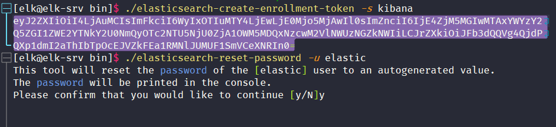
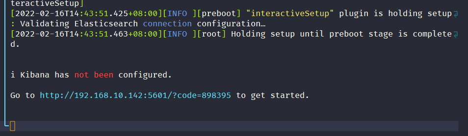
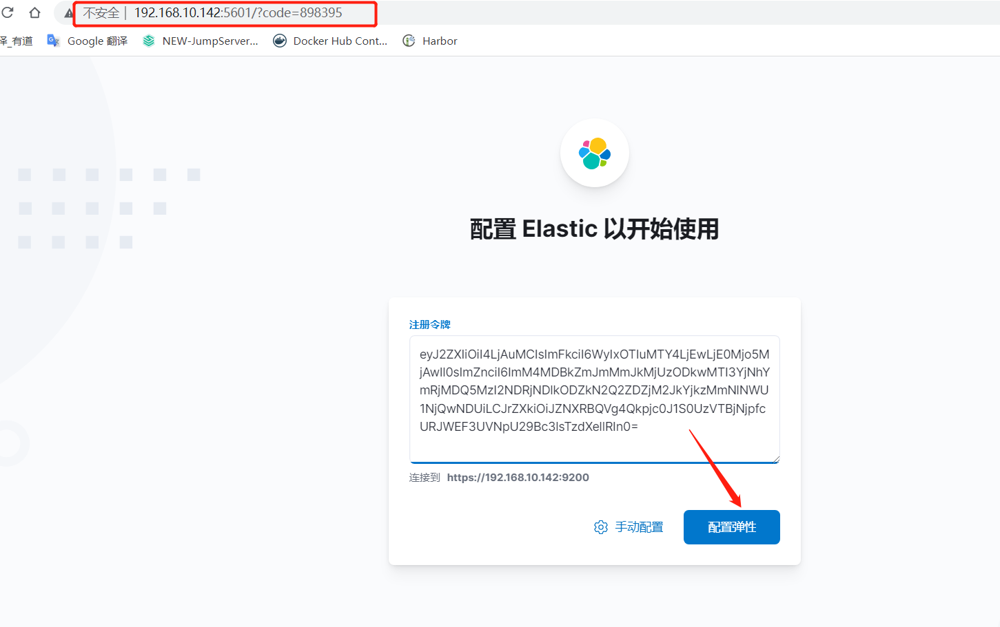
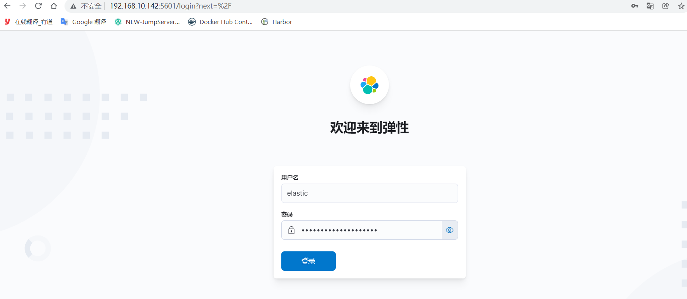
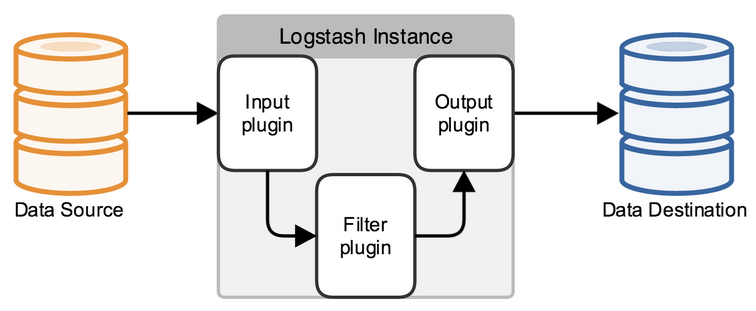

**ELK-8.0.0主要升级内容：**

**安全功能在默认情况下被启用和配置** 从 Elasticsearch 8.0 开始，当第一次启动 Elasticsearch 时，安全功能被默认启用和配置。

在启动时，Elasticsearch 8.0 会生成注册令牌，你可以用它来连接 Kibana 实例或在安全的 Elasticsearch 集群中注册其他节点，而无需生成安全证书或更新 YAML 配置文件。只需在启动新节点或 Kibana 实例时使用生成的注册令牌，Elastic Stack 就会为你处理所有安全配置。

**已知问题：**

- 如果你在 Linux ARM 或 macOS M1 等 arch64 平台上从归档中安装 Elasticsearch，那么在首次启动节点时，不会自动生成 `elastic` 用户密码和 Kibana 注册令牌。节点启动后，需要用 `bin/elasticsearch-reset-password` 工具生成 `elastic` 密码：

  `bin/elasticsearch-reset-password -u elastic`
- 然后，用 bin/elasticsearch-create-enrollment-token 工具为 Kibana 创建一个注册令牌：

  `bin/elasticsearch-create-enrollment-token -s kibana`

## 0.环境准备

```Bash
Centos：7.8
ELK   ：8.0.0
Redis ：5.0.10

```

- 下载并安装软件包

  [https://www.elastic.co/cn/downloads/](https://www.elastic.co/cn/downloads/)
- 新建普通用户elk：elasticsearch只能用普通用户启动

  `useradd elk;echo Ninestar123|passwd --stdin elk`
- elk用户拥有的可创建文件描述符数量

  `vim /etc/security/limits.conf`

  ```bash
  elk hard nofile 65536
  elk soft nofile 65536
  ```
- 限制一个进程可以拥有的VMA(虚拟内存区域)的数量

  `vim /etc/sysctl.conf # 在最后面追加下面内容`

  ```bash
  vm.max_map_count=655360
  ```

  `执行: sysctl -p`
- 解压到/data目录,授权给elk用户

  ```Bash
  mkdir -p /data/{logs,script}
  tar -zxf elasticsearch-8.0.0-linux-x86_64.tar.gz -C /data/
  tar -zxf kibana-8.0.0-linux-x86_64.tar.gz -C /data/
  tar -zxf logstash-8.0.0-linux-x86_64.tar.gz -C /data/
  cd /data
  mv elasticsearch-8.0.0-linux-x86_6 elasticsearch
  mv kibana-8.0.0-linux-x86_64 kibana
  mv logstash-8.0.0-linux-x86_64 logstash
  chown -R elk:elk /data/*
  ```

## 1.安装redis

```Bash
tar -zxf redis-5.0.10.tar.gz -C /data/
cd /data/redis
make && make install
cp redis.conf{,.bak}
sed -i "s/^bind 127.0.0.1/bind 0.0.0.0/g" redis.conf
sed -i "s/^# requirepass foobared/ requirepass Ninestar123/g" redis.conf

# 启动redis
nohup redis-server /data/redis/redis.conf >> /data/logs/redis.log 2>&1 &
```

## 2.配置elasticsearch

`cd /data/elasticsearch/`

`vim config/elasticsearch.yml`

```Bash
# 配置es的集群名称(单机模式，不要开启注释)
cluster.name: my-application
# 设置node名字(单机模式，不要开启注释)
node.name: node-1
# 索引数据存储位置(保持默认,不要开启注释)
path.logs: /data/logs/elasticsearch
# 日志路径（保持默认,不要开启注释）
path.data: /path/to/data
# 是否锁住内存，避免（交换）带来的性能损失，默认值是：false
bootstrap.memory_lock: false
# 当前es节点绑定的ip地址
**network.host: **192.168.10.142
# 启动的es对外访问的http端口，默认9200
**http.port: **9200
# 此设置通常应包含群集中所有节点的地址(保持默认,不要开启注释)
discovery.seed_hosts: ["host1", "host2"]
# 集群初始主节点(保持默认,不要开启注释)
cluster.initial_master_nodes: ["node-1"]
# 禁止使用通配符或_all删除索引，必须使用名称或别名才能删除该索引。
action.destructive_requires_name: true
```

`vim config/jvm.options`

```Bash
-Xms4g #设置最小堆的值为2g
-Xmx4g #设置组大堆的值为2g
```

启动

```Bash
/data/elasticsearch/bin/elasticearch -d
```

生成elasticsearch用户和密码，用于其他与其连接

```Bash
cd /data/elasticsearch/bin
./elasticsearch-reset-password -u elastic

```

创建kibana注册令牌，用于kibana连接

```Bash
cd /data/elasticsearch/bin
./elasticsearch-create-enrollment-token -s kibana

```



## 3.配置kibana

`cd /data/kibana/`

`vim config/kibana.yml`

```
# 修改服务端口
**server.port**: 5601
# 网卡
**server.host**: "192.168.10.142"
# 指定 Kibana 可供最终用户使用的公共 URL。
**server.publicBaseUrl**: "http://192.168.10.142:5601"
# Kibana 服务器的名称。 这用于显示目的。
server.name: "elk-srv"
# 用于所有查询的 Elasticsearch 实例的 URL。
# elasticsearch.hosts: ["http://localhost:9200"]
# 使用用户名密码 向 Elasticsearch 进行身份验证
#elasticsearch.username: ""
#elasticsearch.password: ""
# 使用令牌 向 Elasticsearch 进行身份验证
# elasticsearch.serviceAccountToken: ""
```

启动kibana

```
nohup /data/kibana/bin/kibana >> /data/logs/kibana.log 2>&1 & ; 
tail -f /data/logs/kibana.log

# 查看日志，会生成一个连接，通过该链接输入上面生成的 kibana 注册令牌，完成kibanan与elasticsearch连接

```




再输入上面生成的kibana_system用户和密码


## 4.配置logstash



Logstash管道有两个必需的元素，**输入**和**输出**，以及一个**可选元素过滤器**。输入插件从数据源那里消费数据，过滤器插件根据你的期望修改数据，输出插件将数据写入目的地。

从 Elasticsearch目录复制[自签名 CA 证书。](https://www.elastic.co/guide/en/elasticsearch/reference/8.0/configuring-stack-security.html#stack-security-certificates)​`config/certs`

```Bash
cp -r /data/elasticsearch/config/certs/ /data/logstash/config/
```

创建logstash管道配置文件

`vim /data/logstash/config/logstash.conf`

```
input {
  redis {
    host => "192.168.10.142"
    port => "6379"
    password => "Ninestar123"
    db => "0"
* ***  ** key => "xylc"  # 很关键，要与filebeat中配置的key一样
    data_type => "list"
    type => "xylc"   # 用于区分多个logstash-input-redis
  }
}

#filter {
#  mutate {
#    convert => ["upstream_time","float"]
#    convert => ["request_time","float"]
#  }
#}

# 1.将采集数据标准输出到控制台
#output {
#    stdout {
#        codec => rubydebug
#    }
#}
# 2.将采集数据保存到file文件中
#output {
#    file {
#        path => "/data/logs/client/%{+YYYY-MM-dd}-%{host}.txt"
#        codec => line {
#            format => "%{message}"
#        }
#        gzip => true
#    }
#}

# 3.将采集数据保存到elasticsearch
output {
  if [type] == "xylc" {
    if "client" in [tags] {
      elasticsearch {
        hosts => ["https://192.168.10.142:9200"]
        user => "elastic"
        password => "KrFanFdf=6+pnEkLznMg"
        cacert => "/data/logstash/config/certs/http_ca.crt"
        index => "%{[type]}-%{[tags]}-%{+YYYY-MM-dd}.out"
        manage_template => false
      }
    }
    if "bank" in [tags] {
      elasticsearch {
        hosts => ["https://192.168.10.142:9200"]
        user => "logstash_system"
        password => "KrFanFdf=6+pnEkLznMg"
        cacert => "/data/logstash/config/certs/http_ca.crt"
        index => "%{[type]}-%{[tags]}-%{+YYYY-MM-dd}.out"
        manage_template => false
      }
    }
    if "bps" in [tags] {
      elasticsearch {
        hosts => ["https://192.168.10.142:9200"]
        user => "logstash_system"
        password => "KrFanFdf=6+pnEkLznMg"
        cacert => "/data/logstash/config/certs/http_ca.crt"
        index => "%{[type]}-%{[tags]}-%{+YYYY-MM-dd}.out"
        manage_template => false
      }
    }
  }
}
```

启动logstash

```Bash
nohup /data/logstash/bin/logstash -f /data/logstash/config/logstash.conf >> /data/logs/logstash/logstash.log 2>&1 &
```

## 5.客户端上配置filebeat

`cd /data/filebeat; vim filebeat.yml`

```
filebeat.inputs:
- type:         # 可随意写，用于在output下使用if判断 
  enabled:      # 是否启用
  paths:        # 文件路径
    - 
  tags:         # 标签可随意写，方便在logstash中使用if判断

====================================================
filebeat.inputs:
- type: log
  enabled: true
  paths:
    - /data/microService/data/logs/client/client.*.out
  tags: ["client"]

- type: log
  enabled: true
  paths:
    - /data/microService/data/logs/gateway/gateway.*.out
  tags: ["gateway"]

- type: log
  enabled: true
  paths:
    - /data/bps/tomcat/logs/catalina.*.out
  tags: ["bps"]
  
output.redis:
  hosts: ["192.168.10.142:6379"]
  password: "Ninestar123"
  key: "xylc"   # 很关键，logstash中配置监听该键值
  db: 0
  timeout: 20
  
  
```

启动filebeat

```
nohup /data/filebeat/filebeat -e -c /data/filebeat/filebeat.yml >> /data/filebeat/filebeat.log 2>&1 &
```

## 持续优化

### 1.elasticsearch 数据存储方案

略

### 2.elasticsearch 用户权限管理

略

### 3.安全功能在默认情况下被启用和配置

在没有安全保障的情况下运行 Elasticsearch 会让你的集群暴露在任何可以向 Elasticsearch 发送请求的用户面前。在以前的版本中，你必须明确地启用 Elasticsearch 的安全功能，如认证、授权和网络加密（TLS）。从 Elasticsearch 8.0 开始，当第一次启动 Elasticsearch 时，安全功能被默认启用和配置。

在启动时，Elasticsearch 8.0 会生成注册令牌，你可以用它来连接 Kibana 实例或在安全的 Elasticsearch 集群中注册其他节点，而无需生成安全证书或更新 YAML 配置文件。只需在启动新节点或 Kibana 实例时使用生成的注册令牌，Elastic Stack 就会为你处理所有安全配置。

**已知问题：**

- 如果你在 Linux ARM 或 macOS M1 等 arch64 平台上从归档中安装 Elasticsearch，那么在首次启动节点时，不会自动生成 `elastic` 用户密码和 Kibana 注册令牌。节点启动后，需要用 `bin/elasticsearch-reset-password` 工具生成 `elastic` 密码：

  `bin/elasticsearch-reset-password -u elastic
- 然后，用 bin/elasticsearch-create-enrollment-token 工具为 Kibana 创建一个注册令牌： 

  `bin/elasticsearch-create-enrollment-token -s kibana
