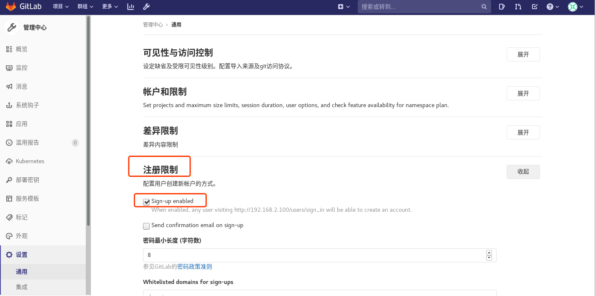
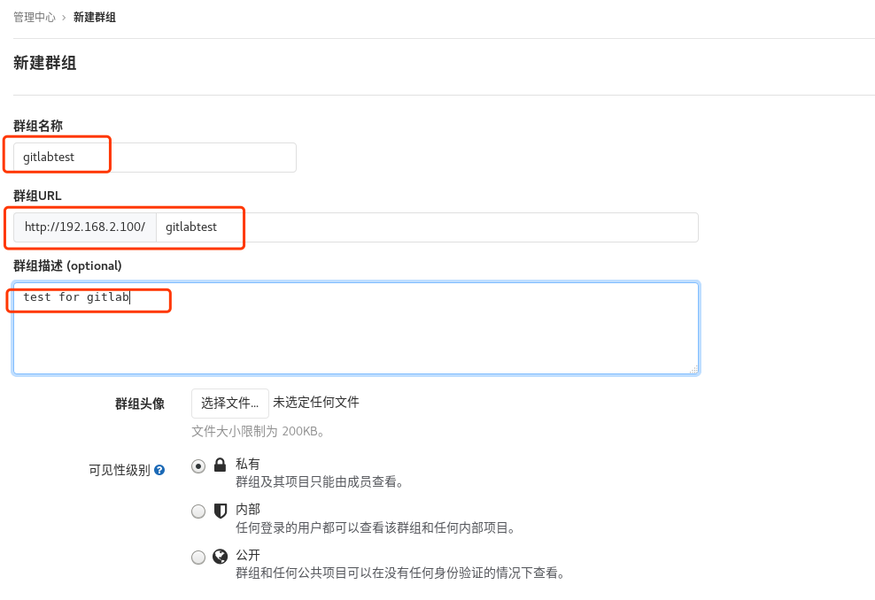
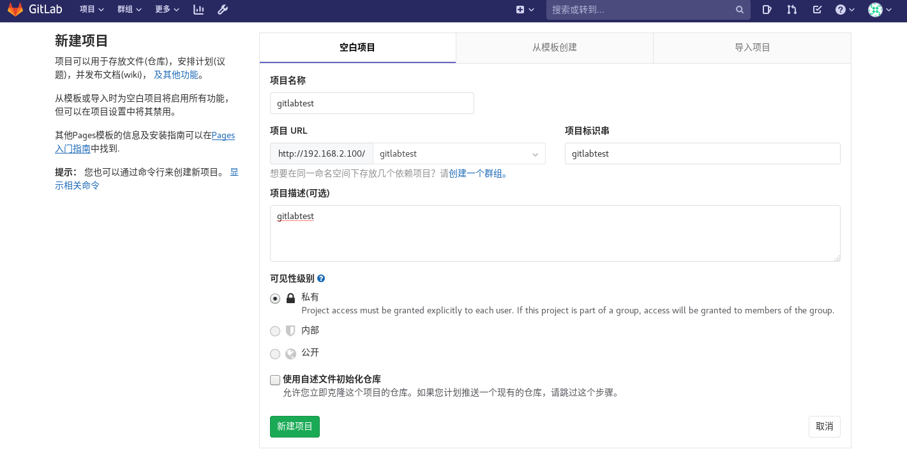
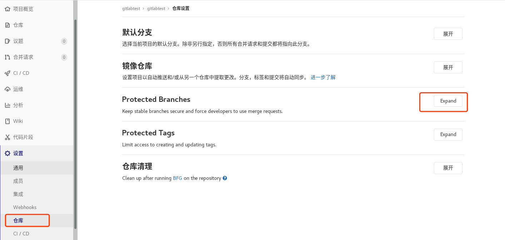
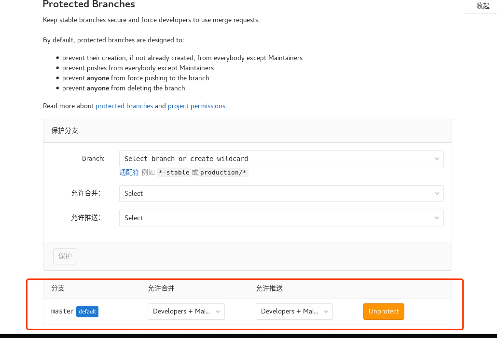

#gitlab

在浏览器中访问本机，就可以打开登录界面，初次登录必须修改密码（不能少于8位），更改完成后可以使用管理员账号登录，用户名为root

访问gitlab:http://192.168.10.150:8001

默认用户名：root  密码：`cat /etc/gitlab/initial_root_password`​

### 1. 登录和基本语言配置

  
首次登录使用用户名root，密码为首次访问GitLab时设置的新密码。  
​  
​  
设置环境为简体中文  
​​

### 2. 自动注册

​

​

### 3. 组&用户&项目

**创建组**

​

**设置组名称、描述等创建群组**

​

**创建用户**

​

​

**设置密码**

​

​

**把用户添加到组里面**

​

​

```
Guest：可以创建issue、发表评论，不能读写版本库
Reporter：可以克隆代码，不能提交，QA、PM可以赋予这个权限
Developer：可以克隆代码、开发、提交、push，RD可以赋予这个权限
Maintainer：可以创建项目、添加tag、保护分支、添加项目成员、编辑项目，核心RD负责人可以赋予这个权限
Owner：可以设置项目访问权限 - Visibility Level、删除项目、迁移项目、管理组成员，开发组leader可以赋予这个权限
Gitlab中的组和项目有三种访问权限：Private、Internal、Public

Private：只有组成员才能看到
Internal：只要登录的用户就能看到
Public：所有人都能看到
```

**创建仓库**

管理区域-创建仓库

​

​

也可以导入项目

​

创建仓库以后，网页下面有操作步骤的提醒

​

### 4. 登陆用户测试

是否能看到空的gitlabtest仓库，修改完密码后再次登录

​

### 5. 添加ssh‐keys

注 ：一个服务器的key只能添加到一个gitlab服务器上 ，一个用户可以添加多个key，切换到管理员用户

ssh‐keygen ‐t rsa

​

​

### 6. 添加、推送到远程仓库

默认master是不允许developer权限的成员执行推送操作的

```
[root@zutuanxue git_data]# git remote rm origin
或者
[root@zutuanxue git_data]# git remote rename origin old‐origin  也可以重命名
[root@zutuanxue git_data]# git remote add origin git@192.168.2.100:gitlabtest/gitlabtest.git
[root@zutuanxue git_data]# git push -u origin --all
```

### 7. 克隆

切换到另外一台主机

```
[root@zutuanxue ~]# dnf install git -y
[root@zutuanxue work]# ssh-keygen -t rsa
[root@zutuanxue work]# cat /root/.ssh/id_rsa.pub
```

使用test用户登录gitlab并添加ssh秘钥

```
[root@zutuanxue work]# git clone git@192.168.2.100:gitlabtest/gitlabtest.git
正克隆到 'gitlabtest'...
The authenticity of host '192.168.2.100 (192.168.2.100)' can't be established.
ECDSA key fingerprint is SHA256:CDlvaoOre2O1oLbKC4umHcPZ/AfHk37sEZGZakepDd0.
Are you sure you want to continue connecting (yes/no)? yes
Warning: Permanently added '192.168.2.100' (ECDSA) to the list of known hosts.
remote: Enumerating objects: 3, done.
remote: Counting objects: 100% (3/3), done.
remote: Compressing objects: 100% (2/2), done.
remote: Total 3 (delta 0), reused 0 (delta 0), pack-reused 0
接收对象中: 100% (3/3), 完成.
[root@zutuanxue ~]# cd gitlabtest/
[root@zutuanxue gitlabtest]# ls
a  b  c
[root@zutuanxue gitlabtest]# git config --global user.name test
[root@zutuanxue gitlabtest]# git config --global user.email "test@aa.com"
[root@zutuanxue gitlabtest]# git branch usertest
[root@zutuanxue gitlabtest]# git checkout usertest
切换到分支 'usertest'
[root@zutuanxue gitlabtest]# touch file4test
[root@zutuanxue gitlabtest]# ls
a  b  c  file4test
[root@zutuanxue gitlabtest]# git add .
[root@zutuanxue gitlabtest]# git commit -m "touch file4test"
[root@zutuanxue gitlabtest]# git push -u origin usertest
```

创建合并请求

​

​

‍

切换到管理员账号，处理请求

​

​

切换到test用户或者直接使用管理员查看，内容已合并，之前的usertest分支已经被删除

​

**设置保护主分支**

​

​

​

默认情况下为了保证master分支的稳定是被保护的，只有维护者可以执行push的操作，所以，当一个开发者身份的用户在针对master分支进行操作的时候会出现被拒绝的提示

```
[root@zutuanxue gitlabtest]# git push -u origin master
To 192.168.2.100:gitlabtest/gitlabtest.git
 ! [rejected]        master -> master (fetch first)
error: 无法推送一些引用到 'git@192.168.2.100:gitlabtest/gitlabtest.git'
提示：更新被拒绝，因为远程仓库包含您本地尚不存在的提交。这通常是因为另外
提示：一个仓库已向该引用进行了推送。再次推送前，您可能需要先整合远程变更
提示：（如 'git pull ...'）。
提示：详见 'git push --help' 中的 'Note about fast-forwards' 小节。
```

同样我们也可以利用上述功能去保护某些不想被修改的分支。

**解决内容不一致**

除了分支被保护会出现上述提示之外，有些时候在你返回master端测试推送 ，由于其他分支进行推送 ，和master端内容不一致 ，所以无法进行推送 ，这个时候可以使用git pull把代码拉取到本地 ，或者git fetch 把代码拉取到本地仓库后进行合并 （注意 ：git pull = git

fetch+git merge ）

```
[root@zutuanxue git_data]# git fetch 
[root@zutuanxue git_data]# ls
a  b  c  README.md
[root@zutuanxue git_data]# git merge origin/master
[root@zutuanxue git_data]# ls
a  b  c  file4test  README.md
[root@zutuanxue git_data]# git push -u origin
```

### 8. 提交程序到GIT

```bash
cd 待提交的文件
git init
git add .
git commit -m "test" -a
git remote add origin http://192.168.2.244:9080/gitlabtest/test.git
git branch -M main
git push -uf origin main
```
