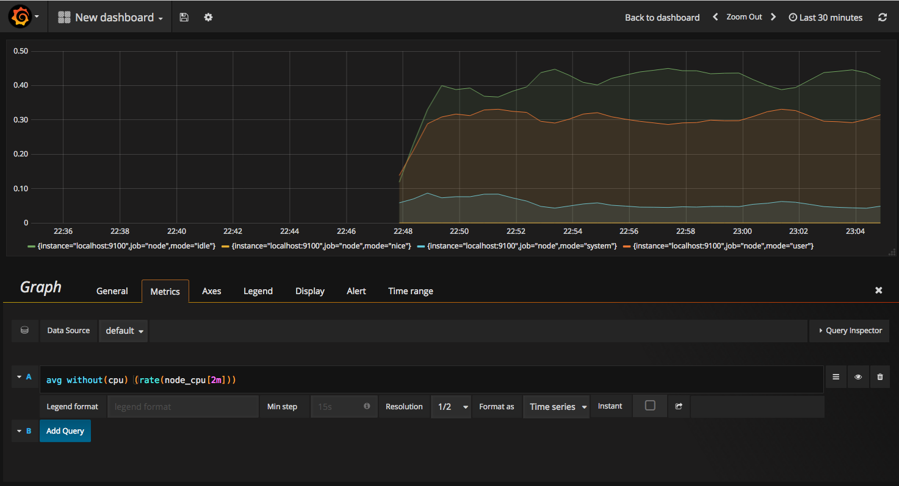
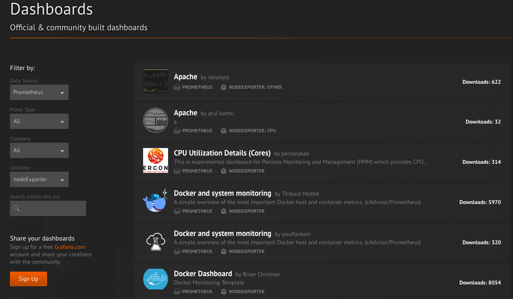
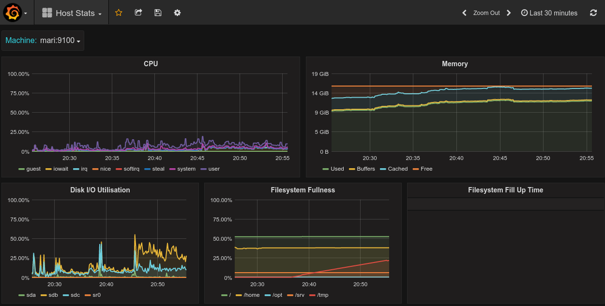

Prometheus UI提供了快速验证PromQL以及临时可视化支持的能力，而在大多数场景下引入监控系统通常还需要构建可以长期使用的监控数据可视化面板（Dashboard）。这时用户可以考虑使用第三方的可视化工具如Grafana，Grafana是一个开源的可视化平台，并且提供了对Prometheus的完整支持。

# **部署Grafana**

```bash
wget https://dl.grafana.com/oss/release/grafana-10.0.3.linux-amd64.tar.gz
tar xf grafana-10.0.3.linux-amd64.tar.gz
cd grafana-10.0.3/bin
nohup /opt/grafana-10.0.3/bin/grafana-server web >>/opt/grafana-10.0.3/grafina.log 2>&1 &

#创建 grafana 启动脚本
cat <<EOF >> /usr/lib/systemd/system/grafana.service 
[Unit]
Description=grafana
Documentation=https://dl.grafana.com/
After=network.target
 
[Service]
Type=simple
User=prometheus
ExecStart=/data/grafana/bin/grafana-server web
Restart=on-failure
[Install]
WantedBy=multi-user.target
EOF
```

通过`http://localhost:3000`​​就可以进入到Grafana的界面中，默认情况下使用账户admin/admin进行登录。在Grafana首页中显示默认的使用向导，包括：安装、添加数据源、创建Dashboard、邀请成员、以及安装应用和插件等主要流程:

这里将添加Prometheus作为默认的数据源，如下图所示，指定数据源类型为Prometheus并且设置Prometheus的访问地址即可，在配置正确的情况下点击“Add”按钮，会提示连接成功的信息：

  
  

在完成数据源的添加之后就可以在Grafana中创建我们可视化Dashboard了。Grafana提供了对PromQL的完整支持，如下所示，通过Grafana添加Dashboard并且为该Dashboard添加一个类型为“Graph”的面板。  并在该面板的“Metrics”选项下通过PromQL查询需要可视化的数据：

  

点击界面中的保存选项，就创建了我们的第一个可视化Dashboard了。 当然作为开源软件，Grafana社区鼓励用户分享Dashboard通过[https://grafana.com/dashboards](https://grafana.com/dashboards)网站，可以找到大量可直接使用的Dashboard：

  

Grafana中所有的Dashboard通过JSON进行共享，下载并且导入这些JSON文件，就可以直接使用这些已经定义好的Dashboard：

​

node_eporter：[8919_rev25.json](assets/8919_rev25-20230802111035-elccf0h.json)

‍

‍
