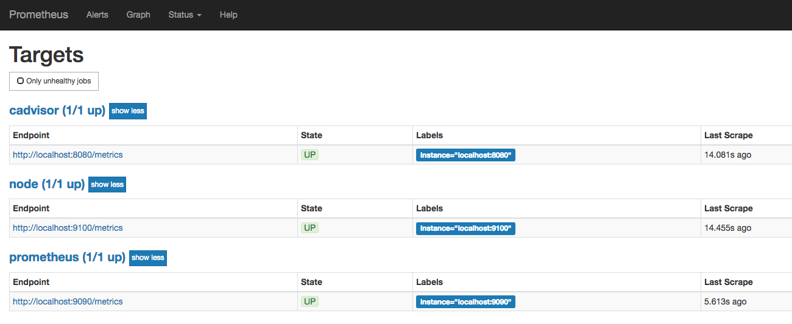

Docker是一个开源的应用容器引擎，让开发者可以打包他们的应用以及依赖包到一个可移植的容器中，然后发布到任何流行的Linux/Windows/Mac机器上。容器镜像正成为一个新的标准化软件交付方式。

例如，可以通过以下命令快速在本地启动一个Nginx服务：

```
docker run -itd nginx
```

为了能够获取到Docker容器的运行状态，用户可以通过Docker的stats命令获取到当前主机上运行容器的统计信息，可以查看容器的CPU利用率、内存使用量、网络IO总量以及磁盘IO总量等信息。

```
$ docker stats
CONTAINER           CPU %               MEM USAGE / LIMIT     MEM %               NET I/O             BLOCK I/O           PIDS
9a1648bec3b2        0.30%               196KiB / 3.855GiB     0.00%               828B / 0B           827kB / 0B          1
```

除了使用命令以外，用户还可以通过Docker提供的HTTP API查看容器详细的监控统计信息。

## 使用CAdvisor

CAdvisor是Google开源的一款用于展示和分析容器运行状态的可视化工具。通过在主机上运行CAdvisor用户可以轻松的获取到当前主机上容器的运行统计信息，并以图表的形式向用户展示。

在本地运行CAdvisor也非常简单，直接运行一下命令即可：

```
docker run \
  --volume=/:/rootfs:ro \
  --volume=/var/run:/var/run:rw \
  --volume=/sys:/sys:ro \
  --volume=/var/lib/docker/:/var/lib/docker:ro \
  --publish=8080:8080 \
  --detach=true \
  --name=cadvisor \
  google/cadvisor:latest
```

通过访问[http://localhost:8080](http://localhost:8080/)可以查看，当前主机上容器的运行状态，如下所示：

​​​​

CAdvisor是一个简单易用的工具，相比于使用Docker命令行工具，用户不用再登录到服务器中即可以可视化图表的形式查看主机上所有容器的运行状态。

而在多主机的情况下，在所有节点上运行一个CAdvisor再通过各自的UI查看监控信息显然不太方便，同时CAdvisor默认只保存2分钟的监控数据。好消息是CAdvisor已经内置了对Prometheus的支持。访问[http://localhost:8080/metrics](http://localhost:8080/metrics)即可获取到标准的Prometheus监控样本输出:

```
# HELP cadvisor_version_info A metric with a constant '1' value labeled by kernel version, OS version, docker version, cadvisor version & cadvisor revision.
# TYPE cadvisor_version_info gauge
cadvisor_version_info{cadvisorRevision="1e567c2",cadvisorVersion="v0.28.3",dockerVersion="17.09.1-ce",kernelVersion="4.9.49-moby",osVersion="Alpine Linux v3.4"} 1
# HELP container_cpu_load_average_10s Value of container cpu load average over the last 10 seconds.
# TYPE container_cpu_load_average_10s gauge
container_cpu_load_average_10s{container_label_maintainer="",id="/",image="",name=""} 0
container_cpu_load_average_10s{container_label_maintainer="",id="/docker",image="",name=""} 0
container_cpu_load_average_10s{container_label_maintainer="",id="/docker/15535a1e09b3a307b46d90400423d5b262ec84dc55b91ca9e7dd886f4f764ab3",image="busybox",name="lucid_shaw"} 0
container_cpu_load_average_10s{container_label_maintainer="",id="/docker/46750749b97bae47921d49dccdf9011b503e954312b8cffdec6268c249afa2dd",image="google/cadvisor:latest",name="cadvisor"} 0
container_cpu_load_average_10s{container_label_maintainer="NGINX Docker Maintainers <docker-maint@nginx.com>",id="/docker/f51fd4d4f410965d3a0fd7e9f3250218911c1505e12960fb6dd7b889e75fc114",image="nginx",name="confident_brattain"} 0
```

下面表格中列举了一些CAdvisor中获取到的典型监控指标：

|指标名称|类型|含义|
| ----------------------------------------| ---------| ----------------------------------------------|
|container_cpu_load_average_10s|gauge|过去10秒容器CPU的平均负载|
|container_cpu_usage_seconds_total|counter|容器在每个CPU内核上的累积占用时间 (单位：秒)|
|container_cpu_system_seconds_total|counter|System CPU累积占用时间（单位：秒）|
|container_cpu_user_seconds_total|counter|User CPU累积占用时间（单位：秒）|
|container_fs_usage_bytes|gauge|容器中文件系统的使用量(单位：字节)|
|container_fs_limit_bytes|gauge|容器可以使用的文件系统总量(单位：字节)|
|container_fs_reads_bytes_total|counter|容器累积读取数据的总量(单位：字节)|
|container_fs_writes_bytes_total|counter|容器累积写入数据的总量(单位：字节)|
|container_memory_max_usage_bytes|gauge|容器的最大内存使用量（单位：字节）|
|container_memory_usage_bytes|gauge|容器当前的内存使用量（单位：字节|
|container_spec_memory_limit_bytes|gauge|容器的内存使用量限制|
|machine_memory_bytes|gauge|当前主机的内存总量|
|container_network_receive_bytes_total|counter|容器网络累积接收数据总量（单位：字节）|
|container_network_transmit_bytes_total|counter|容器网络累积传输数据总量（单位：字节）|

## 与Prometheus集成

修改/etc/prometheus/prometheus.yml，将cAdvisor添加监控数据采集任务目标当中：

```
- job_name: cadvisor
  static_configs:
  - targets:
    - localhost:8080
```

启动Prometheus服务:

```
prometheus --config.file=/etc/prometheus/prometheus.yml --storage.tsdb.path=/data/prometheus
```

启动完成后，可以在Prometheus UI中查看到当前所有的Target状态：

​​​​

当能够正常采集到cAdvisor的样本数据后，可以通过以下表达式计算容器的CPU使用率：

```
sum(irate(container_cpu_usage_seconds_total{image!=""}[1m])) without (cpu)
```

​​​​

查询容器内存使用量（单位：字节）:

```
container_memory_usage_bytes{image!=""}
```

查询容器网络接收量速率（单位：字节/秒）：

```
sum(rate(container_network_receive_bytes_total{image!=""}[1m])) without (interface)
```

​​​​

查询容器网络传输量速率（单位：字节/秒）：

```
sum(rate(container_network_transmit_bytes_total{image!=""}[1m])) without (interface)
```

​​​​

查询容器文件系统读取速率（单位：字节/秒）：

```
sum(rate(container_fs_reads_bytes_total{image!=""}[1m])) without (device)
```

​​​​

查询容器文件系统写入速率（单位：字节/秒）：

```
sum(rate(container_fs_writes_bytes_total{image!=""}[1m])) without (device)
```

​​​​

‍
