# 一、邮件告警

1.创建告警媒介，和告警内容

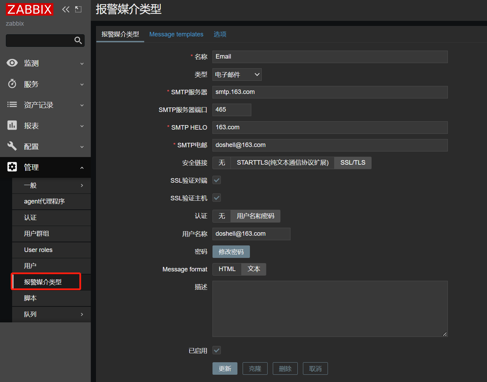​​

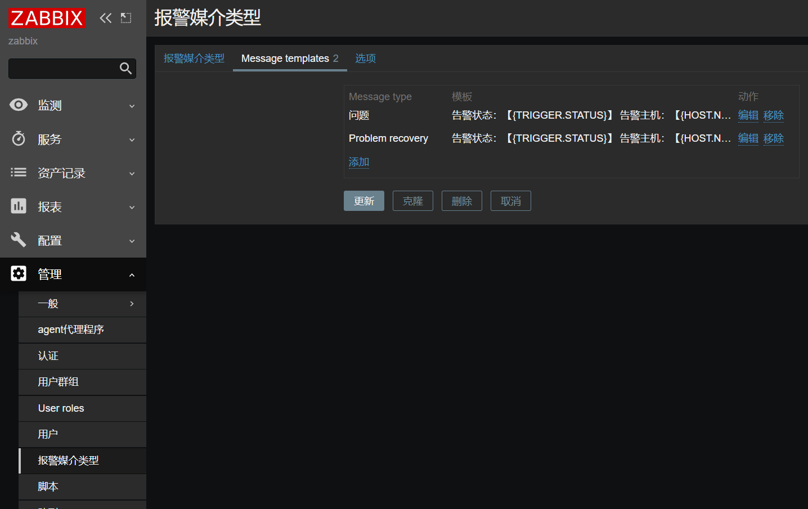


```text
主题: 
ZABBIX告警通知

主题：
告警状态：【{TRIGGER.STATUS}】
告警主机：【{HOST.NAME}】
主机地址：【{HOST.IP}】
告警时间：【{EVENT.DATE} {EVENT.TIME}】
告警等级：【{TRIGGER.SEVERITY}】
告警名称：【{TRIGGER.NAME}】
当前状态：【{ITEM.NAME}：{ITEM.KEY}={ITEM.VALUE}】
事件代码：【{EVENT.ID}】


```

2.用户添加告警媒介

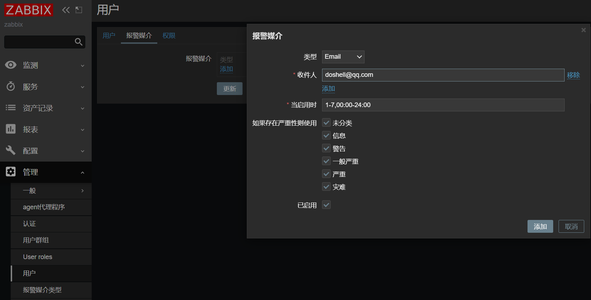​

3.创建告警触发器

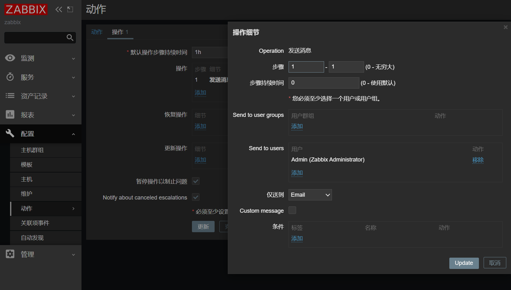​

‍

# 二、微信告警

## 注册企业微信

1.注册企业微信

2.登录企业微信后台管理，创建一个zabbix告警机器人

3.查看应用相关信息

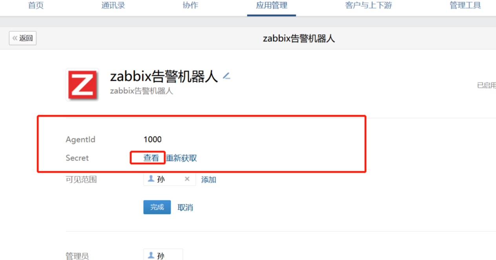​

4.添加成员

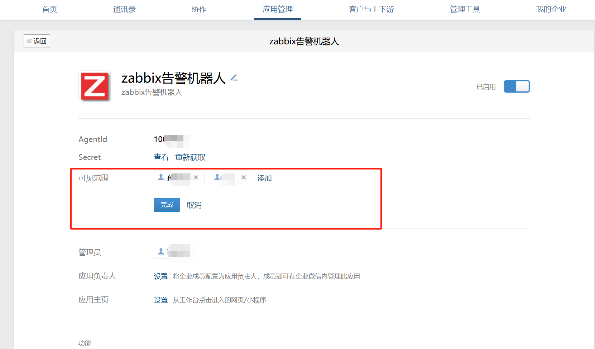​

## 在zabbix server服务器端配置weixin.py脚本

1.安装python依赖模块

```bash
yum install python-pip -y
pip install requests
```

2.在zabbix server服务器端配置weixin.py脚本

`vim /data/zabbix/share/zabbix/alertscripts/weixin.py`

```python
#!/usr/bin/python
#coding:utf-8
 
import requests
import sys
import os
import json
import logging
 
logging.basicConfig(level = logging.DEBUG, format = '%(asctime)s, %(filename)s, %(levelname)s, %(message)s',
datefmt = '%a, %d %b %Y %H:%M:%S',
filename = os.path.join('/tmp','weixin.log'), 
filemode = 'a')
 
corpid='xxxxxxxxx'           # 需要修改企业ID
appsecret="xxxxxxxxxxxxxxx"  # 企业的secret秘钥
agentid="xxxxxx"             # 修改agentid
token_url='https://qyapi.weixin.qq.com/cgi-bin/gettoken?corpid=' + corpid + '&corpsecret=' + appsecret
req=requests.get(token_url)
accesstoken=req.json()['access_token']
 
 
msgsend_url='https://qyapi.weixin.qq.com/cgi-bin/message/send?access_token=' + accesstoken
touser=sys.argv[1]
subject=sys.argv[2]
message=sys.argv[2] + "\n\n" +sys.argv[3]
 
 
params={
"touser": touser,
"msgtype": "text",
"agentid": agentid,
"text": {
"content": message
},
"safe":0
}
 
req=requests.post(msgsend_url, data=json.dumps(params))
logging.info('sendto:' + touser + ';;subject:' + subject + ';;message:' + message)
```

`chown zabbix. weixin.py ; chmod 744 weixin.py ; chown zabbix. /tmp/weixin.log`

3.测试脚本是否可用

```bash
# 格式： python weixin.py 企业微信号 "主题" "发送内容"
python weixin.py sundongsheng "zabbix告警" "tomcat_jenkins:8080异常"

```

## Zabbix 配置告警媒介

1.创建告警媒体，和告警内容

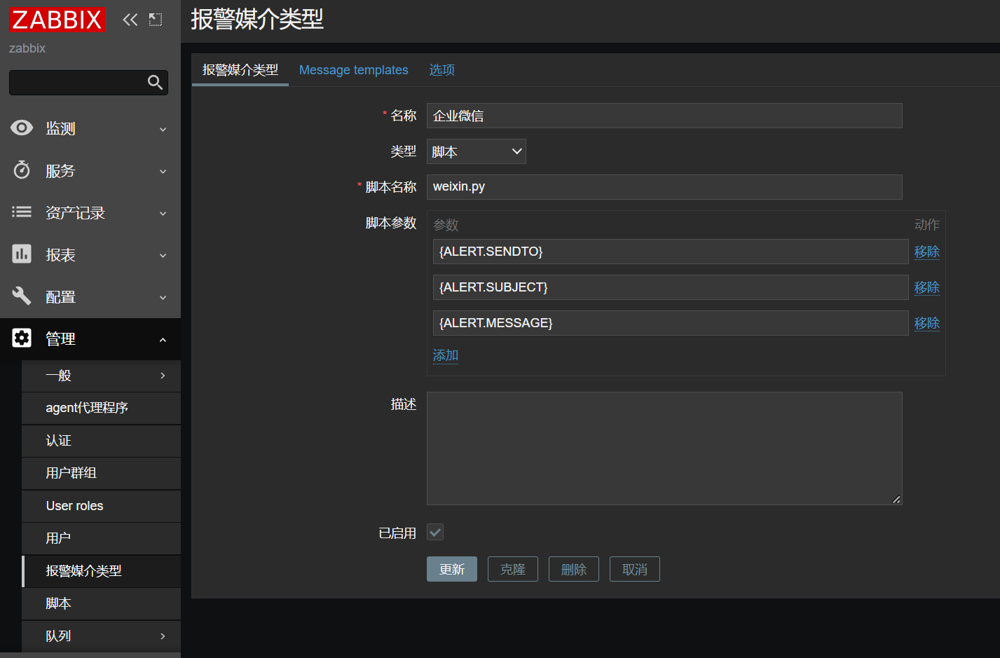

​​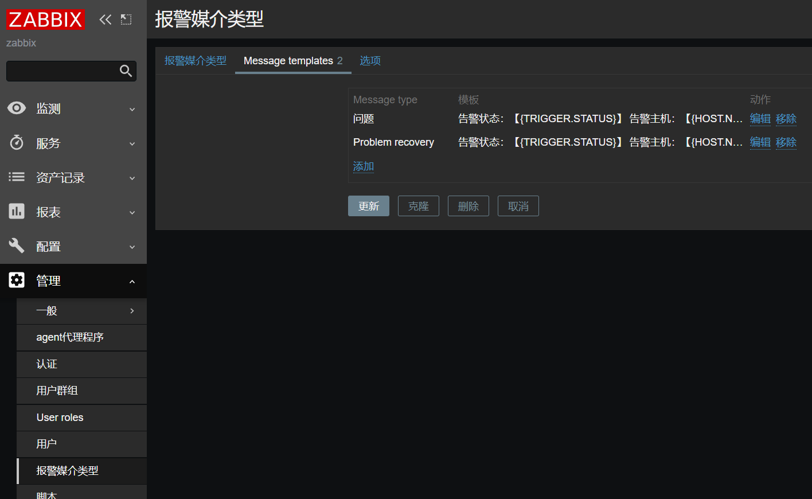​

```zabbix
主题: 
ZABBIX告警通知

主题：
告警状态：【{TRIGGER.STATUS}】
告警主机：【{HOST.NAME}】
主机地址：【{HOST.IP}】
告警时间：【{EVENT.DATE} {EVENT.TIME}】
告警等级：【{TRIGGER.SEVERITY}】
告警名称：【{TRIGGER.NAME}】
当前状态：【{ITEM.NAME}：{ITEM.KEY}={ITEM.VALUE}】
事件代码：【{EVENT.ID}】

```

2.用户添加告警媒介

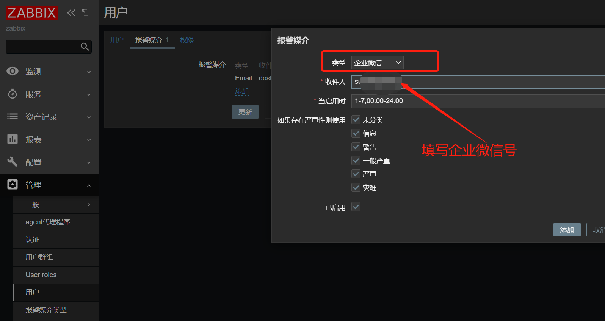​

3.创建告警触发器

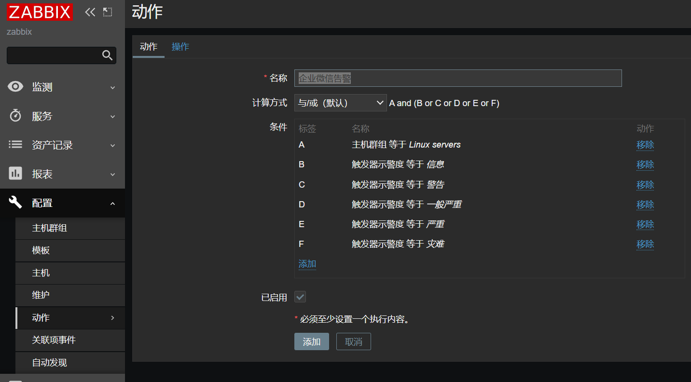

​

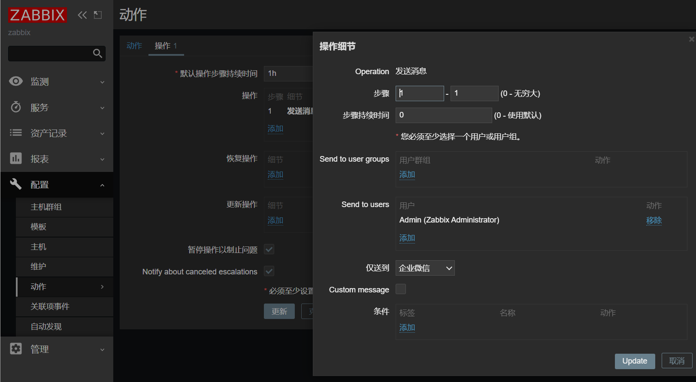​

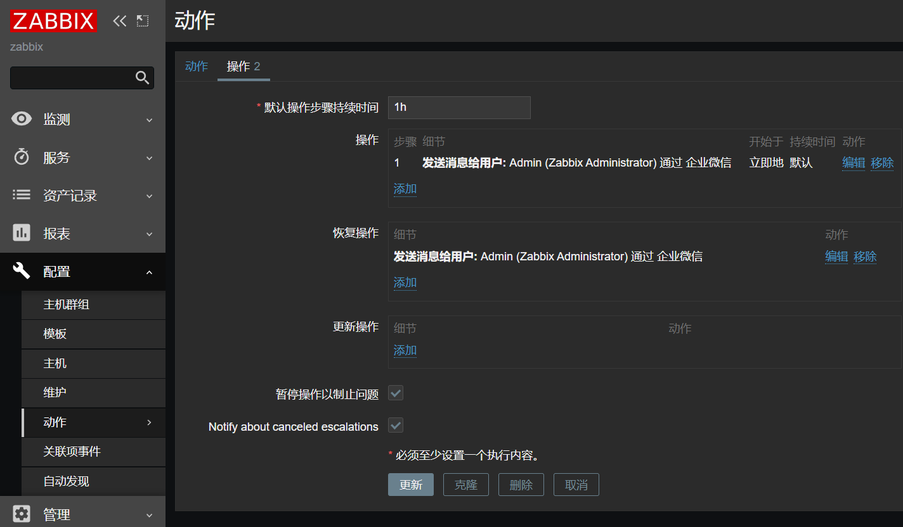​

4.测试
