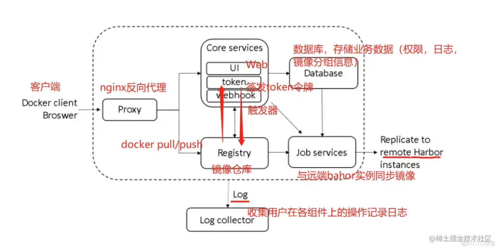

# docker harbor

- Harbor 是 VMware 公司开源的企业级 Docker Registry 项目，其目标是帮助用户迅速搭建一个企业级的 Docker Registry （私有仓库）服务。
- Harbor以 Docker 公司开源的 Registry 为基础，提供了图形管理 UI 、基于角色的访问控制(Role Based AccessControl) 、AD/LDAP 集成、以及审计日志(Auditlogging) 等企业用户需求的功能，同时还原生支持中文。
- Harbor 的每个组件都是以 Docker 容器的形式构建的，使用 docker-compose 来对它进行部署。用于部署 Harbor 的 docker-compose 模板位于 harbor/docker-compose.yml。

# harbor特性

1. 基于角色控制：用户和仓库都是基于项目进行组织的，而用户在项目中可以拥有不同的权限。
2. 基于镜像的复制策略：镜像可以在多个Harbor实例之间进行复制（同步）。
3. 支持 LDAP/AD：Harbor 可以集成企业内部已有的 AD/LDAP（类似数据库的一张表），用于对已经存在的用户认证和管理。
4. 镜像删除和垃圾回收：镜像可以被删除，也可以回收镜像占用的空间。
5. 图形化用户界面：用户可以通过浏览器来浏览，搜索镜像仓库以及对项目进行管理。
6. 审计管理：所有针对镜像仓库的操作都可以被记录追溯，用于审计管理。
7. 支持 RESTful API：RESTful API 提供给管理员对于 Harbor 更多的操控, 使得与其它管理软件集成变得更容易。
8. Harbor和docker registry的关系：Harbor实质上是对docker registry做了封装，扩展了自己的业务模板。

# harbor组件



|Harbor组件|说明|
| ---------------------------| ----------------------------------------------------------------------------------------------------------------------------------------------------------------------------------------------------------------------------------------------------------------------------------------------------------------------------------------------------------------------------------------------------------------------------------------------------------------------|
|Proxy|Harbor 的 Registry、UI、Token 服务等组件，都处在 nginx 反向代理后边。<br>该代理将来自浏览器、docker clients 的请求转发到后端不同的服务上。|
|Registry|负责储存 Docker 镜像，并处理 Docker push/pull 命令。<br>由于要对用户进行访问控制，即不同用户对 Docker镜像有不同的读写权限，<br>Registry 会指向一个 Token 服务，强制用户的每次 Docker pull/push 请求都要携带一个合法的 Token， Registry 会通过公钥对 Token 进行解密验证。|
|Core services|Harbor的核心功能，主要提供以下3个服务:<br> 1）UI（harbor-ui）: 提供图形化界面，帮助用户管理 Registry 上的镜像（image）, 并对用户进行授权。<br>2）WebHook：为了及时获取Registry 上image 状态变化的情况，在Registry 上配置 Webhook，把状态变化传递给 UI 模块。 <br>3）Token 服务：负责根据用户权限给每个 Docker push/pull 命令签发 Token。Docker 客户端向 Registry 服务发起的请求， 如果不包含 Token，会被重定向到 Token 服务，获得 Token 后再重新向 Registry 进行请求。|
|Database（harbor-db）|为core services提供数据库服务，负责储存用户权限、审计日志、Docker 镜像分组信息等数据。|
|Job services|主要用于镜像复制，本地镜像可以被同步到远程 Harbor 实例上。|
|Log collector（harbor-log）|负责收集其他组件的日志到一个地方|
|||

# docker-harbor 部署

1.在服务端安装docker和docker-compose 客户端上安装docker 关闭防火墙 修改主机名

`yum -y install docker-ce docker-compose`

2.下载docker-harbor离线安装包

```bash
# docker-harbor 下载地址
https://github.com/goharbor/harbor/releases

# 解压harbor离线安装包
tar -zxvf harbor-offline-installer-v2.7.1.tgz -C /data/
```

3.修改配置文件

```bash
hostname: 192.168.10.31                  # 设置为Harbor服务器的IP地址或者域名
harbor_admin_password: Ninestar123       # 指定管理员的初始密码，默认的用户名/密码是admin/Harbor12345
data_volume: /data/images                # 数据持久化目录
certificate: /data/docker/ssl/server.crt
private_key: /data/docker/ssl/server.key
```

4.开始安装

```bash
#在配置好了 harbor.cfg 之后，执行 ./prepare 命令，为 harbor 启动的容器生成一些必要的文件（环境） 
cd /data/harbor/
./prepare

sh install.sh

# 启动
cd /data/harbor
docker-compose up -d  #停止：docker-compose stop
```

*5.配置https证书

```bash
# 生成 CA 证书私钥
openssl genrsa -out ca.key 4096
# 生成 CA 证书
openssl req -x509 -new -nodes -sha512 -days 3650 \
 -subj "/C=CN/ST=Beijing/L=Beijing/O=example/OU=Personal/CN=yourdomain.com" \
 -key ca.key \
 -out ca.crt
 

# 生成私钥
openssl genrsa -out server.key 4096
# 生成证书签名请求 (CSR)
openssl req -sha512 -new \
    -subj "/C=CN/ST=Beijing/L=Beijing/O=example/OU=Personal/CN=yourdomain.com" \
    -key server.key \
    -out server.csr
# 生成 x509 v3 扩展文件
cat > v3.ext <<-EOF
authorityKeyIdentifier=keyid,issuer
basicConstraints=CA:FALSE
keyUsage = digitalSignature, nonRepudiation, keyEncipherment, dataEncipherment
extendedKeyUsage = serverAuth
subjectAltName = IP:192.168.10.31
EOF
# 使用该v3.ext文件为您的 Harbor 主机生成证书
openssl x509 -req -sha512 -days 3650 \
    -extfile v3.ext \
    -CA ca.crt -CAkey ca.key -CAcreateserial \
    -in server.csr \
    -out server.crt
```

*6.Harbor.cfg 配置文件详解

```bash
# 所需参数：这些参数需要在配置文件 Harbor.cfg 中设置。如果用户更新它们并运行 install.sh 脚本重新安装 Harbor， 参数将生效。具体参数如下：
hostname          # 用于访问用户界面和 register 服务。它应该是目标机器的 IP 地址或完全限定的域名（FQDN）
ui_url_protocol   # （http 或 https，默认为 http）用于访问 UI 和令牌/通知服务的协议。如果公正处于启用状态，则此参数必须为 https。
max_job_workers   # 镜像复制作业线程数
db_password       # 用于db_auth 的MySQL数据库root 用户的密码。
customize_crt     # 默认打开。打开此属性时，准备脚本创建私钥和根证书，用于生成/验证注册表令牌。当由外部来源提供密钥和根证书时，将此属性设置为 off。
ssl_cert          # SSL 证书的路径，仅当协议设置为 https 时才应用。
secretkey_path    # 用于在复制策略中加密或解密远程 register 密码的密钥路径。

#可选参数：这些参数对于更新是可选的，即用户可以将其保留为默认值，并在启动 Harbor 后在 Web UI 上进行更新。如果进入 Harbor.cfg，只会在第一次启动 Harbor 时生效，随后对这些参数的更新，Harbor.cfg 将被忽略。

# 注意：如果选择通过 UI 设置这些参数，请确保在启动 Harbor 后立即执行此操作。具体来说，必须在注册或在 Harbor 中创建任何新用户之前设置所需的 auth_mode。当系统中有用户时（除了默认的 admin 用户）， auth_mode 不能被修改。 具体参数如下：
Email             # Harbor 需要该参数才能向用户发送“密码重置”电子邮件，并且只有在需要该功能时才启用。请注意，在默认情况下 SSL 连接时没有启用。如果 SMTP 服务器需要 SSL，但不支持 STARTTLS，那么应该通过设置启用 SSL email_ssl = TRUE。

harbor_admin_password # 管理员的初始密码，只在 Harbor 第一次启动时生效。之后， 此设置将被忽略，并且应在 UI 中设置管理员的密码。请注意，默认的用户名/密码是admin/Harbor12345。

auth_mode         # 使用的认证类型，默认情况下，它是 db_auth，即凭据存储在数据库中。对于LDAP身份验证，请将其设置为 ldap_auth。

self_registration # 禁用时，新用户只能由 Admin 用户创建，只有管理员用户可以在 Harbor 中创建新用户。注意：当 auth_mode 设置为 ldap_auth 时，自注册功能将始终处于禁用状态，并且该标志被忽略。

Token_expiration  # 由令牌服务创建的令牌的到期时间（分钟），默认为 30 分钟。

project_creation_restriction # 默认情况下，每个人都可以创建一个项目。 如果将其值设置为“adminonly”，那么只有 admin 可以创建项目。

verify_remote_cert # 默认打开。此标志决定了当Harbor与远程 register 实例通信时是否验证 SSL/TLS 证书。 将此属性设置为 off 将绕过 SSL/TLS 验证，这在远程实例具有自签名或不可信证书时经常使用。

# 另外，默认情况下，Harbor 将镜像存储在本地文件系统上。在生产环境中，可以考虑 使用其他存储后端而不是本地文件系统，如 S3、Openstack Swif、Ceph 等对象存储。但需要更新 common/templates/registry/config.yml 文件。
#Harbor的默认镜像存储路径在 /data/registry 目录下，映射到docker容器里面的 /storage 目录下。
#这个参数是在 docker-compose.yml 中指定的，在 docker-compose up -d 运行之前修改。

#如果希望将 Docker 镜像存储到其他的磁盘路径，可以修改这个参数。
```

# docker-harbor 使用

1.登录控制台

直接访问：http://ip
默认用户名密码：admin/Harbar123456

2.docker 登录docker-harbor

```bash
docker login 192.168.10.31 -u admin -p Ninestar123

# 若出现一下报错：
# Error response from daemon: Get "https://192.168.10.31/v2/": x509: certificate relies on legacy Common Name field, use SANs instead

# 修改docker客户端文件 /etc/docker/daemon.json 添加以下配置：

{ 
    "insecure-registries": ["0.0.0.0/0"]
}

# 重启docker服务
systemctl restart docker
```

## 上传镜像步骤

- 设置docker仓库为registry本地仓库
- 给需要存储的镜像打tag
- 上传镜像到registry仓库

**查看当前本地镜像**

```
[root@zutuanxue_manage01 ~]# docker images
REPOSITORY                     TAG                 IMAGE ID            CREATED             SIZE
baishuming2020/centos_nginx    latest              bcd9f28f6126        33 minutes ago      447MB
baishuming2020/centos_8_base   latest              3e9f682f8459        47 minutes ago      200MB
centos                         latest              0f3e07c0138f        6 weeks ago         220MB
registry                       latest              f32a97de94e1        8 months ago        25.8MB
```

a、设置docker仓库为registry本地仓库

```
#1、修改docker进程启动文件，修改其启动方式，目的是为了让通过docker配置文件启动
[root@zutuanxue_manage01 ~]# sed -i.bak '/^ExecStart=/c\ExecStart=\/usr\/bin\/dockerd' /usr/lib/systemd/system/docker.service

#2、设置docker 守护进程的配置文件 /etc/docker/daemon.json,默认没有该文件
[root@zutuanxue_manage01 ~]# cat /etc/docker/daemon.json 
{
 "insecure-registries": ["http://192.168.1.150:5000"]
}

insecure-registries 指定非安全的仓库地址，多个用逗号隔开

#3、重启docker生效配置文件
[root@zutuanxue_manage01 ~]# systemctl daemon-reload
[root@zutuanxue_manage01 ~]# systemctl restart docker
```

b、给需要存储的镜像打tag

```
[root@zutuanxue_manage01 ~]# docker tag baishuming2020/centos_nginx:latest 192.168.1.150:5000/centos_nginx:v1

[root@zutuanxue_manage01 ~]# docker images
REPOSITORY                         TAG                 IMAGE ID            CREATED             SIZE
192.168.98.240:5000/centos_nginx   v1                  bcd9f28f6126        45 minutes ago      447MB
baishuming2020/centos_nginx        latest              bcd9f28f6126        45 minutes ago      447MB
baishuming2020/centos_8_base       latest              3e9f682f8459        59 minutes ago      200MB
centos                             latest              0f3e07c0138f        6 weeks ago         220MB
registry                           latest              f32a97de94e1        8 months ago        25.8MB
```

c、上传镜像到registry仓库

```
#1、上传镜像
[root@zutuanxue_manage01 ~]# docker push 192.168.98.240:5000/centos_nginx:v1
The push refers to repository [192.168.98.240:5000/centos_nginx]
1da799aaf1ec: Pushed 
f598357997c6: Pushed 
630012d2d35b: Pushed 
4dcde7ab808a: Pushed 
64dc1b92ebb6: Pushed 
7db2133dafb9: Pushed 
fd05189e6e81: Pushed 
ee645629aa71: Pushed 
v1: digest: sha256:507a5ad9dd5771cdf461a6fa24c3fff6ea9eabd6945abf03e9264d3130fe816b size: 1996

#2、查看上传
[root@zutuanxue_manage01 ~]# curl http://192.168.98.240:5000/v2/_catalog
{"repositories":["centos_nginx"]}

#查看存储文件夹
[root@zutuanxue_manage01 ~]# ls /opt/docker_repos/docker/registry/v2/repositories/centos_nginx/
_layers  _manifests  _uploads
```

## 拉取镜像镜像步骤

- 设置客户端docker仓库为registry仓库
- 拉取镜像到本地

a、设置192.168.1.151[hostname:zutuanxue_node1]机器的docker仓库为registry仓库

```
#1、设置docker启动文件
[root@zutuanxue_node1 ~]# sed -i.bak '/^ExecStart=/c\ExecStart=\/usr\/bin\/dockerd' /usr/lib/systemd/system/docker.service

#2、设置docker配置文件
[root@zutuanxue_node1 ~]# cat  /etc/docker/daemon.json 
{
 "insecure-registries": ["http://192.168.1.150:5000"]
}
```

b、下载镜像
192.168.1.151[hostname:zutuanxue_node1]机器上的docker可以拉取registry仓库中的192.168.1.150:5000/centos_nginx:v1容器镜像

```
[root@zutuanxue_node1 ~]# docker pull 192.168.1.150:5000/centos_nginx:v1
v1: Pulling from centos_nginx
dcd04d454f16: Pull complete 
5cb2e05aa6e1: Pull complete 
870634eb98b4: Pull complete 
0fae9697ee4b: Pull complete 
18ad57cfcecb: Pull complete 
64dd6f0d85c1: Pull complete 
7178b0b4388e: Pull complete 
34de8795cd41: Pull complete 
Digest: sha256:507a5ad9dd5771cdf461a6fa24c3fff6ea9eabd6945abf03e9264d3130fe816b
Status: Downloaded newer image for 192.168.98.240:5000/centos_nginx:v1
192.168.98.240:5000/centos_nginx:v1

#验证下载
[root@zutuanxue_node1 ~]# docker images
REPOSITORY                         TAG                 IMAGE ID            CREATED             SIZE
192.168.1.150:5000/centos_nginx   v1                  bcd9f28f6126        4 hours ago         447MB
```

## registry带basic认证的仓库

**实现步骤**

- 安装需要认证的包
- 创建存放认证信息的文件
- 创建认证信息
- 创建带认证的registry容器
- 指定仓库地址
- 登录认证

**实现过程**
a、安装需要认证的包

```
yum -y install httpd-tools
```

b、创建存放认证信息的文件

```
mkdir -p /opt/registry-var/auth
```

c、创建认证信息

```
htpasswd -Bbn zutuanxue 123456 >> /opt/registry-var/auth/htpasswd
```

d、创建带认证的registry容器

```
docker run -d -p 10000:5000 --restart=always --name registry \
-v  /opt/registry-var/auth:/auth \
-v /opt/myregistry:/var/lib/registry \
-e "REGISTRY_AUTH=htpasswd" \
-e "REGISTRY_AUTH_HTPASSWD_REALM=Registry Realm" \
-e REGISTRY_AUTH_HTPASSWD_PATH=/auth/htpasswd \
registry:latest
```

e、指定仓库地址

```
cat /etc/docker/daemon.json 
{
 "insecure-registries": ["http://192.168.1.150:5000","http://192.168.1.150:10000"]
}
```

f、登录认证

```
docker login 192.168.1.150:10000
Username：zutuanxue
Password：123456
```

# docker-compose.yml

```yml
version: '2.3'
services:
  log:
    image: goharbor/harbor-log:v2.7.1
    container_name: harbor-log
    restart: always
    cap_drop:
      - ALL
    cap_add:
      - CHOWN
      - DAC_OVERRIDE
      - SETGID
      - SETUID
    volumes:
      - /data/harbor/log/:/var/log/docker/:z
      - type: bind
        source: ./common/config/log/logrotate.conf
        target: /etc/logrotate.d/logrotate.conf
      - type: bind
        source: ./common/config/log/rsyslog_docker.conf
        target: /etc/rsyslog.d/rsyslog_docker.conf
    ports:
      - 127.0.0.1:1514:10514
    networks:
      - harbor
  registry:
    image: goharbor/registry-photon:v2.7.1
    container_name: registry
    restart: always
    cap_drop:
      - ALL
    cap_add:
      - CHOWN
      - SETGID
      - SETUID
    volumes:
      - /data/harbor/data/registry:/storage:z
      - ./common/config/registry/:/etc/registry/:z
      - type: bind
        source: /data/harbor/data/secret/registry/root.crt
        target: /etc/registry/root.crt
      - type: bind
        source: ./common/config/shared/trust-certificates
        target: /harbor_cust_cert
    networks:
      - harbor
    depends_on:
      - log
    logging:
      driver: "syslog"
      options:
        syslog-address: "tcp://localhost:1514"
        tag: "registry"
  registryctl:
    image: goharbor/harbor-registryctl:v2.7.1
    container_name: registryctl
    env_file:
      - ./common/config/registryctl/env
    restart: always
    cap_drop:
      - ALL
    cap_add:
      - CHOWN
      - SETGID
      - SETUID
    volumes:
      - /data/harbor/data/registry:/storage:z
      - ./common/config/registry/:/etc/registry/:z
      - type: bind
        source: ./common/config/registryctl/config.yml
        target: /etc/registryctl/config.yml
      - type: bind
        source: ./common/config/shared/trust-certificates
        target: /harbor_cust_cert
    networks:
      - harbor
    depends_on:
      - log
    logging:
      driver: "syslog"
      options:
        syslog-address: "tcp://localhost:1514"
        tag: "registryctl"
  postgresql:
    image: goharbor/harbor-db:v2.7.1
    container_name: harbor-db
    restart: always
    cap_drop:
      - ALL
    cap_add:
      - CHOWN
      - DAC_OVERRIDE
      - SETGID
      - SETUID
    volumes:
      - /data/harbor/data/database:/var/lib/postgresql/data:z
    networks:
      harbor:
    env_file:
      - ./common/config/db/env
    depends_on:
      - log
    logging:
      driver: "syslog"
      options:
        syslog-address: "tcp://localhost:1514"
        tag: "postgresql"
    shm_size: '1gb'
  core:
    image: goharbor/harbor-core:v2.7.1
    container_name: harbor-core
    env_file:
      - ./common/config/core/env
    restart: always
    cap_drop:
      - ALL
    cap_add:
      - SETGID
      - SETUID
    volumes:
      - /data/harbor/data/ca_download/:/etc/core/ca/:z
      - /data/harbor/data/:/data/:z
      - ./common/config/core/certificates/:/etc/core/certificates/:z
      - type: bind
        source: ./common/config/core/app.conf
        target: /etc/core/app.conf
      - type: bind
        source: /data/harbor/data/secret/core/private_key.pem
        target: /etc/core/private_key.pem
      - type: bind
        source: /data/harbor/data/secret/keys/secretkey
        target: /etc/core/key
      - type: bind
        source: ./common/config/shared/trust-certificates
        target: /harbor_cust_cert
    networks:
      harbor:
    depends_on:
      - log
      - registry
      - redis
      - postgresql
    logging:
      driver: "syslog"
      options:
        syslog-address: "tcp://localhost:1514"
        tag: "core"
  portal:
    image: goharbor/harbor-portal:v2.7.1
    container_name: harbor-portal
    restart: always
    cap_drop:
      - ALL
    cap_add:
      - CHOWN
      - SETGID
      - SETUID
      - NET_BIND_SERVICE
    volumes:
      - type: bind
        source: ./common/config/portal/nginx.conf
        target: /etc/nginx/nginx.conf
    networks:
      - harbor
    depends_on:
      - log
    logging:
      driver: "syslog"
      options:
        syslog-address: "tcp://localhost:1514"
        tag: "portal"

  jobservice:
    image: goharbor/harbor-jobservice:v2.7.1
    container_name: harbor-jobservice
    env_file:
      - ./common/config/jobservice/env
    restart: always
    cap_drop:
      - ALL
    cap_add:
      - CHOWN
      - SETGID
      - SETUID
    volumes:
      - /data/harbor/data/job_logs:/var/log/jobs:z
      - type: bind
        source: ./common/config/jobservice/config.yml
        target: /etc/jobservice/config.yml
      - type: bind
        source: ./common/config/shared/trust-certificates
        target: /harbor_cust_cert
    networks:
      - harbor
    depends_on:
      - core
    logging:
      driver: "syslog"
      options:
        syslog-address: "tcp://localhost:1514"
        tag: "jobservice"
  redis:
    image: goharbor/redis-photon:v2.7.1
    container_name: redis
    restart: always
    cap_drop:
      - ALL
    cap_add:
      - CHOWN
      - SETGID
      - SETUID
    volumes:
      - /data/harbor/data/redis:/var/lib/redis
    networks:
      harbor:
    depends_on:
      - log
    logging:
      driver: "syslog"
      options:
        syslog-address: "tcp://localhost:1514"
        tag: "redis"
  proxy:
    image: goharbor/nginx-photon:v2.7.1
    container_name: nginx
    restart: always
    cap_drop:
      - ALL
    cap_add:
      - CHOWN
      - SETGID
      - SETUID
      - NET_BIND_SERVICE
    volumes:
      - ./common/config/nginx:/etc/nginx:z
      - type: bind
        source: ./common/config/shared/trust-certificates
        target: /harbor_cust_cert
    networks:
      - harbor
    ports:
      - 8081:8080
    depends_on:
      - registry
      - core
      - portal
      - log
    logging:
      driver: "syslog"
      options:
        syslog-address: "tcp://localhost:1514"
        tag: "proxy"
networks:
  harbor:
    external: false

```
