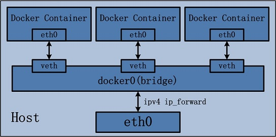
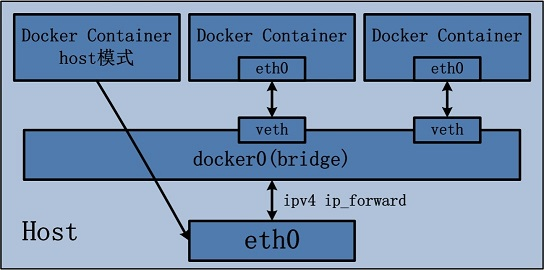
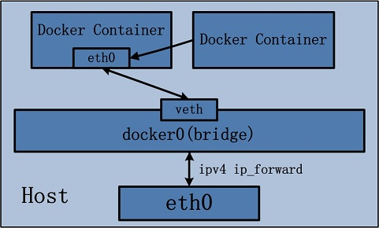
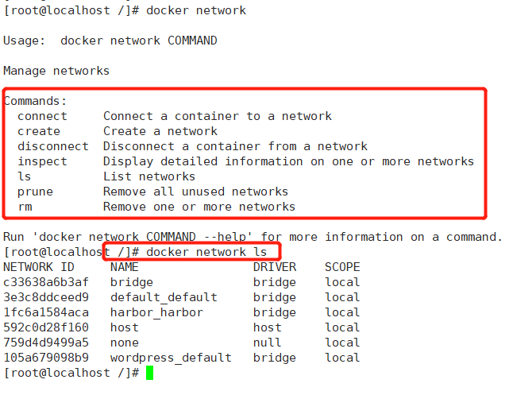

# docker 网络

# network namespace

network namespace是实现网络虚拟化的重要功能，它能创建多个隔离的网络空间，它们有独自的网络栈信息。不管是虚拟机还是容器，运行的时候仿佛自己就在独立的网络中。

# Docker四种网络模式

```bash
# 基于Docker run创建docker容器时，可以使用--net选项指定容器的网络模式
docker run --net bridge ....

#docker network 网络管理
# docker network COMMAND
#Commands:
  connect     #Connect a container to a network
  create      #Create a network
  disconnect  #Disconnect a container from a network
  inspect     #Display detailed information on one or more networks
  ls          #List networks
  prune       #Remove all unused networks
  rm          #Remove one or more networks
```

## Bridge

这是dokcer网络的默认设置，为容器创建独立的network namespace，容器具有独立的网卡等所有单独的网络栈，是最常用的使用方式。

在docker run启动容器的时候，如果不加--net参数，就默认采用这种网络模式。安装完docker，系统会自动添加一个供docker使用的网桥docker0，我们创建一个新的容器时，容器通过DHCP获取一个与docker0同网段的IP地址，并默认连接到docker0网桥，以此实现容器与宿主机的网络互通。



bridge模式的容器与外界通信时，必定会占用宿主机上的端口，从而与宿主机竞争端口资源，对宿主机端口的管理会是一个比较大的问题。同时，由于容器与外界通信是基于三层上iptables NAT，性能和效率上的损耗是可以预见的。

## host

这个模式下创建出来的容器，直接使用容器宿主机的网络命名空间。将不拥有自己独立的Network Namespace，即没有独立的网络环境。它使用宿主机的ip和端口。



1）最明显的就是容器不再拥有隔离、独立的网络栈。容器会与宿主机竞争网络栈的使用，并且容器的崩溃就可能导致宿主机崩溃，在生产环境中，这种问题可能是不被允许的。

2）容器内部将不再拥有所有的端口资源，因为一些端口已经被宿主机服务、bridge模式的容器端口绑定等其他服务占用掉了。

## container

与host模式类似，只是容器将与指定的容器共享network namespace。这个模式就是指定一个已有的容器，共享该容器的IP和端口。除了网络方面两个容器共享，其他的如文件系统，进程等还是隔离开的。



在这种模式下的容器可以通过localhost来同一网络命名空间下的其他容器，传输效率较高。而且这种模式还节约了一定数量的网络资源，但它并没有改变容器与外界通信的方式。在一些特殊的场景中非常有用，例如，kubernetes的pod，kubernetes为pod创建一个基础设施容器，同一pod下的其他容器都以其他容器模式共享这个基础设施容器的网络命名空间，相互之间以localhost访问，构成一个统一的整体。

## None

为容器创建独立network namespace，但不为它做任何网络配置，容器中只有lo，用户可以在此基础上，对容器网络做任意定制。这个模式下，dokcer不为容器进行任何网络配置。需要我们自己为容器添加网卡，配置IP。因此，若想使用pipework配置docker容器的ip地址，必须要在none模式下才可以。

# Docker网络互连

安装Docker时，它会自动创建三个网络，bridge（创建容器默认连接到此网络）、 none 、host



docker run创建Docker容器时，可以用 `--net` 选项指定容器的网络模式 ：

host模式：使用 --net=host 指定。
none模式：使用 --net=none 指定。
bridge模式：使用 --net=bridge 指定，默认设置。
container模式：使用 --net=container:NAME_or_ID 指定
